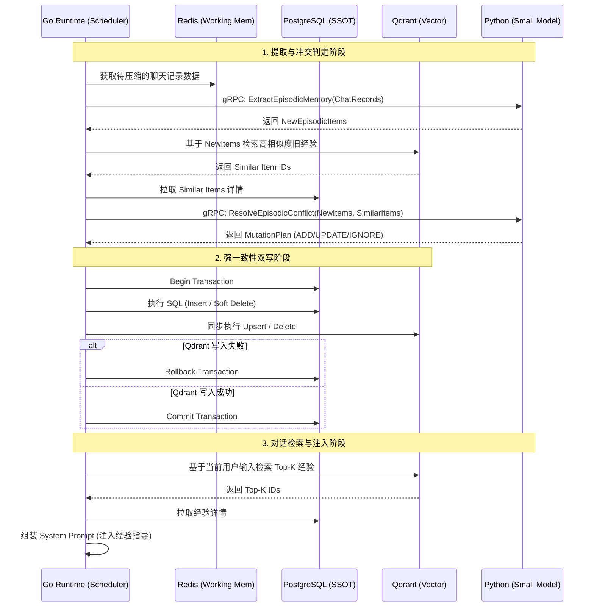

# 经验教训（Episodic Memory）模块 - 后端架构设计与实施方案

## 1. 系统整体上下文与设计目标描述

### 1.1 业务上下文
在 Luna 桌面 AI 助理的关系域（Relationship Domain）中，经验教训（Episodic Memory）模块扮演着“情商进化”的关键角色。它专门用于反思和记录用户情绪变化的经验，例如：分析用户在何种特定情况下更容易感到焦虑、愤怒或沮丧，以及 AI 采用何种语言表达方式、安抚策略能够更有效地促使对话顺畅进行。

### 1.2 设计目标
*   **专项情绪反思**：聚焦于用户情绪触发点与 AI 应对策略的有效性分析。
*   **混合双库存储**：经验教训数据需分别存入关系型数据库（PostgreSQL）以保持结构化记录与版本控制，并同步存入向量数据库（Qdrant）以支持基于当前对话语境的语义检索。
*   **无缝触发与提取**：在系统执行短期记忆或长期记忆压缩时，复用待压缩的聊天记录数据，唤醒 Small Model 进行专项的经验提取。
*   **智能去重与冲突处理**：在经验入库前，必须进行严格的冲突判定，避免相似经验冗余，并支持经验的迭代更新（如发现之前的安抚策略不再有效）。
*   **动态上下文注入**：在对话时，通过向量检索获取 Top-K 相关经验，动态注入 Prompt，指导 AI 的回复策略。

## 2. 核心工作流设计

### 2.1 触发与信息提取工作流
1.  **触发时机**：依附于短期记忆压缩（Token 阈值触发）或长期记忆压缩（自然日流转触发）流程。
2.  **上下文准备**：Go Runtime 提取**当日 Redis 中需要生成短期记忆、长期记忆摘要的聊天记录数据**作为分析来源。
3.  **AI 专项反思**：Go 通过 gRPC 调用 Python 侧的 `ExtractEpisodicMemory` 接口。Python 侧唤醒 Small Model，专项分析这些聊天记录，寻找以下模式：
    *   **情绪触发点 (Trigger)**：导致用户情绪波动的特定话题、情境或 AI 的某句回复。
    *   **有效策略 (Effective Strategy)**：成功平复用户情绪或推进对话的表达方式、语气或行动。
    *   **无效策略 (Failed Strategy)**：导致用户情绪恶化或对话陷入僵局的应对方式。
4.  **结构化输出**：Small Model 输出提取到的经验教训条目列表。

### 2.2 冲突判定与入库逻辑 (Conflict Resolution & Commit)
1.  **预检与比对**：Go Runtime 接收到提取的经验条目后，基于新经验的文本内容生成 Embedding，向 Qdrant 检索相似度极高（如 > 0.9）的现有经验 ID，并从 PostgreSQL 中拉取这些记录。
2.  **AI 冲突分析**：Go 将新提取的经验与检索到的相似经验发送给 Python 侧的 `ResolveEpisodicConflict` 接口。Small Model 进行逻辑比对，输出处理策略：
    *   **IGNORE (忽略/去重)**：新经验与已有经验高度重复，无需记录。
    *   **ADD (新增)**：新经验是全新的情境或策略。
    *   **UPDATE (更新/修正)**：新经验证明了某条旧经验已经失效或需要修正（例如：“以前用户焦虑时喜欢听笑话，现在发现听笑话会让他更烦躁，需要安静倾听”），需废弃旧数据，插入新数据。
3.  **事务落盘 (双写)**：
    *   Go Runtime 开启 PG 事务。
    *   根据策略执行 SQL（Insert / Soft Delete）。
    *   同步在 Qdrant 中执行向量的 Upsert / Delete。
    *   若 Qdrant 失败则回滚 PG 事务，确保双库一致性。

### 2.3 动态检索与注入工作流 (Context Injection)
1.  **意图与情绪识别**：用户发起新对话时，系统初步识别当前的话题意图与用户情绪状态。
2.  **向量检索**：Go Runtime 调用 Qdrant，基于当前用户的输入（或结合识别出的情绪标签）生成 Embedding，检索 Top-K（如 Top 3）最相关的经验教训 ID。
3.  **事实补全**：Go 根据检索到的 ID，从 PostgreSQL 中拉取完整的经验教训内容。
4.  **Prompt 注入**：将提取到的 Top-K 经验教训格式化后，动态注入到当前对话的 System Prompt 中（如 `<episodic_guidance>...</episodic_guidance>`），指导大模型生成更具同理心和针对性的回复。

## 3. 混合存储结构规划

### 3.1 关系型存储 (PostgreSQL) - 结构化经验记录
负责存储经验教训的完整文本、分类标签与审计信息。

**表结构设计 (`episodic_memory`)**：
*   `id` (VARCHAR(64), Primary Key): 雪花算法生成的唯一 ID。
*   `user_id` (VARCHAR(64)): 用户标识。
*   `trigger_context` (TEXT): 触发该经验的情境描述（如“当讨论到工作进度且用户表现出焦虑时”）。
*   `strategy` (TEXT): 总结出的应对策略（如“应采用温和、倾听的语气，避免直接给出说教式建议”）。
*   `strategy_type` (VARCHAR(20)): 策略类型，枚举值 `EFFECTIVE` (有效), `FAILED` (无效/避坑)。
*   `source_context` (TEXT): 提取该经验的原始对话片段（用于审计）。
*   `status` (VARCHAR(20)): 状态，枚举值 `ACTIVE` (生效中), `DELETED` (软删除/被修正)。
*   `created_at` (TIMESTAMP): 创建时间。
*   `updated_at` (TIMESTAMP): 更新时间。

### 3.2 向量存储 (Qdrant) - 语义检索
用于在对话时，根据当前语境快速匹配相关的历史经验。

**Collection 设计 (`luna_episodic_memories`)**：
*   **Point ID**: 对应 PostgreSQL 中的 `id`。
*   **Vector**: 结合 `trigger_context` 和 `strategy` 生成的综合 Embedding 向量。
*   **Payload**:
    *   `user_id`: 用于租户/用户隔离。
    *   `strategy_type`: 用于检索时的前置过滤。
    *   `status`: 仅检索 `ACTIVE` 状态的经验。

## 4. 交互链路与数据流转



## 5. 核心 API 接口规范

### 5.1 gRPC 接口 (Go -> Python)
定义在 `backend/shared/proto/communication.proto` 中。

```protobuf
// 1. 提取经验教训请求
message ExtractEpisodicMemoryRequest {
  string chat_records = 1; // 待压缩的聊天记录数据
}

message EpisodicItem {
  string id = 1;
  string trigger_context = 2;
  string strategy = 3;
  string strategy_type = 4; // EFFECTIVE, FAILED
}

message ExtractEpisodicMemoryResponse {
  repeated EpisodicItem items = 1;
}

// 2. 冲突判定请求
message ResolveEpisodicConflictRequest {
  repeated EpisodicItem new_items = 1;
  repeated EpisodicItem similar_existing_items = 2;
}

message EpisodicMutation {
  string action = 1; // ADD, UPDATE, IGNORE
  string target_id = 2; // UPDATE 时指向被修正的旧记录 ID
  EpisodicItem item = 3; // 新的或修正后的经验内容
}

message ResolveEpisodicConflictResponse {
  repeated EpisodicMutation mutations = 1;
}
```

## 6. 异常处理与兜底机制

*   **冲突判定降级**：若 `ResolveEpisodicConflict` 接口调用失败，为防止丢失宝贵经验，Go Runtime 可默认将所有新提取的经验作为 `ADD` 动作入库，后续可通过离线批处理任务进行二次去重。
*   **检索超时降级**：在对话生成阶段，若 Qdrant 检索经验教训超时（如 > 200ms），Go Runtime 应立即放弃经验注入，仅携带基础 Prompt 和用户画像继续请求大模型，确保对话的流畅性不受影响。