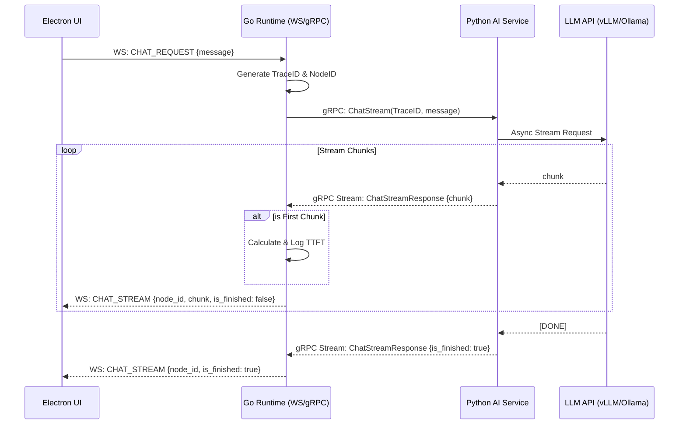

# Phase 2: 基础流式问答能力 实施方案

## 1. 架构依赖评估与现状分析

**当前现状：**
* 已完成 Phase 1，打通了 Electron -> Go -> Python 的基础 WebSocket 和 gRPC 通信链路（目前仅实现了 Ping/Pong）。
* 缺乏实际的业务数据流转协议。
* Python 端尚未接入任何 LLM 库。

**新增依赖：**
* **Python 侧**: 
  * `openai`: 用于标准化调用兼容 OpenAI 格式的 API (如 vLLM, Ollama, 硅基流动等)。
  * `tenacity`: 用于实现优雅的重试机制（处理网络抖动或 API 限流）。
  * `pydantic`: 用于结构化输出校验（本阶段主要用于内部数据结构校验，为后续复杂 Agent 铺垫）。
* **Go 侧**: 无新增核心依赖，复用现有 `grpc` 和 `websocket` 库。
* **前端**: 无新增核心依赖。

## 2. 协议与接口定义 (Protocol & Interface)

### 2.1 gRPC 协议扩展 (`backend/shared/proto/communication.proto`)
新增流式对话 RPC 接口：

```protobuf
// ... 现有代码 ...

message ChatRequest {
  string trace_id = 1;
  string message = 2;
  // 预留字段：后续可增加 history, model_config 等
}

message ChatStreamResponse {
  string trace_id = 1;
  string chunk = 2;
  bool is_finished = 3;
  string finish_reason = 4;
  string error = 5;
}

service CommunicationService {
  rpc Ping(PingRequest) returns (PongResponse);
  // 新增：流式对话接口
  rpc ChatStream(ChatRequest) returns (stream ChatStreamResponse);
}
```

### 2.2 WebSocket 消息规范 (`frontend/src/shared/types.ts` & `backend/runtime/internal/api/ws_server.go`)
新增消息类型：
* `CHAT_REQUEST` (Client -> Server)
* `CHAT_STREAM` (Server -> Client)

```typescript
// 前端发送的请求 Payload
export interface ChatRequestPayload {
  message: string;
}

// 后端推送的流式 Payload
export interface ChatStreamPayload {
  chunk: string;
  is_finished: boolean;
  node_id: string; // 满足规范：Go 下发的 CurrentNodeId
  error?: string;
}
```

## 3. 核心代码重构与实施步骤

### 步骤 1: 协议更新与代码生成
1. 修改 `backend/shared/proto/communication.proto`，添加上述定义。
2. 运行 `protoc` 重新生成 Go 和 Python 的 gRPC 代码。

### 步骤 2: Python AI 服务改造 (LLM 接入)
1. **依赖安装**: `pip install openai tenacity pydantic`
2. **配置管理**: 在 `app/config.py` 中增加 LLM 相关配置 (API_KEY, BASE_URL, MODEL_NAME)。
3. **LLM 客户端封装 (`app/llm/client.py`)**:
   * 封装 `AsyncOpenAI` 客户端。
   * 实现 `stream_chat` 异步生成器函数。
   * 使用 `@retry` (tenacity) 装饰器实现网络错误/限流时的指数退避重试。
4. **gRPC 服务实现 (`app/api/grpc_service.py`)**:
   * 实现 `ChatStream` 方法。
   * 接收请求，调用 `llm.client.stream_chat`。
   * 将生成的文本块封装为 `ChatStreamResponse` 并 `yield` 返回。
   * 增加异常捕获，若 LLM 调用失败，返回带有 `error` 字段的响应。

### 步骤 3: Go 控制面改造 (流式代理与 TTFT)
1. **gRPC 客户端扩展 (`internal/api/grpc_client.go`)**:
   * 增加 `ChatStream(ctx, req) (pb.CommunicationService_ChatStreamClient, error)` 方法。
2. **WebSocket 处理器扩展 (`internal/api/ws_server.go`)**:
   * 在 `handleMessage` 中增加对 `CHAT_REQUEST` 的路由。
   * 实现 `handleChatRequest` 方法：
     * 生成或提取 `TraceID` 和 `NodeID` (当前阶段可生成一个临时的 NodeID)。
     * 调用 gRPC `ChatStream`。
     * **TTFT 计算**: 记录调用开始时间，在收到第一个非空 chunk 时计算耗时，并通过 `logger` 打印审计日志。
     * 循环读取 gRPC stream，将每个 chunk 封装为 `WSMessage` (Type: `CHAT_STREAM`) 推送给前端。
     * 处理 gRPC stream 结束 (`io.EOF`) 或错误，向前端发送 `is_finished: true` 的消息。
     * **并发安全**: 确保 WebSocket 的 `WriteJSON` 操作是并发安全的（可引入互斥锁）。

### 步骤 4: 前端交互改造 (气泡流式渲染)
1. **类型更新**: 更新 `src/shared/types.ts`。
2. **UI 组件 (`src/renderer/index.tsx` 或新建 Chat 组件)**:
   * 增加输入框和发送按钮。
   * 维护一个消息列表状态 (Zustand 或 React State)。
   * 发送消息时，通过 WS 发送 `CHAT_REQUEST`。
   * 监听 WS 的 `CHAT_STREAM` 消息：
     * 根据 `node_id` 查找当前正在渲染的消息气泡。
     * 将 `chunk` 追加到气泡内容中。
     * 如果 `is_finished` 为 true，标记该消息接收完成。

## 4. 异常处理与边界容错策略

1. **网络超时与中断**:
   * **Go -> Python**: gRPC 调用需设置合理的 Context Timeout (例如整体对话 2 分钟，单次 chunk 接收 30 秒)。如果超时，Go 需主动 cancel context，并向前端发送包含错误信息的 `CHAT_STREAM` (is_finished: true)。
   * **Frontend -> Go**: 如果 WebSocket 断开，Go 侧的 `conn.ReadMessage` 会报错，此时 Go 必须 `cancel` 传递给 gRPC 的 Context，从而中断 Python 侧的 LLM 推理，避免算力浪费。
2. **LLM API 故障**:
   * Python 侧通过 `tenacity` 进行重试。如果重试耗尽仍失败，捕获异常并通过 gRPC 返回明确的错误信息 (而非直接崩溃)。Go 收到错误后，透传给前端展示。
3. **并发控制**:
   * 当前阶段暂不限制全局并发，但需确保每个 WS 连接的读写是线程安全的 (Gorilla WebSocket 不允许并发写，需在 Go 侧使用 mutex 保护 `conn.WriteJSON`)。
4. **安全脱敏**:
   * Python 侧在打印 LLM 请求/响应日志时，需注意不要打印完整的 API Key。

## 5. 交互时序图



## 6. 验收标准对齐检查

* [x] **可以稳定进行普通 LLM 对话**: 通过 OpenAI 兼容接口实现。
* [x] **支持流式输出**: gRPC stream + WebSocket 实时转发。
* [x] **不接工具、不接记忆、不接 RAG**: 本方案仅涉及纯文本对话。
* [x] **Go 负责流式代理、消息转发及 TTFT 核心指标记录**: 在 `ws_server.go` 中实现 TTFT 记录。
* [x] **Electron 依据 Go 下发的 CurrentNodeId 负责气泡流式渲染**: WS Payload 中包含 `node_id`。
* [x] **统一流式消息结构与结束标记**: 定义了 `is_finished` 和统一的 Payload 结构。
