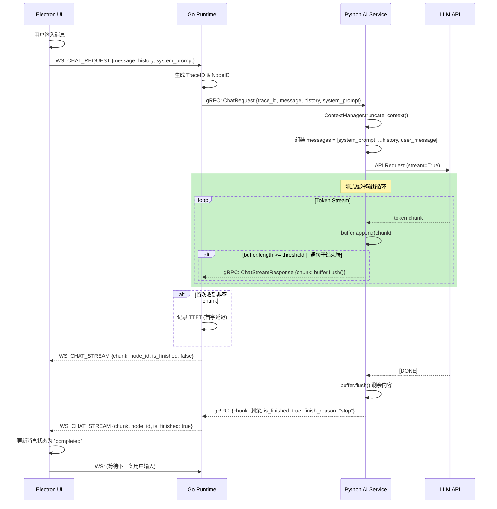

# Phase 2: 基础流式问答能力 全面重构实施方案

## 1. 架构依赖评估与现状分析

**当前现状：**
* 已完成 Phase 1，打通了 Electron -> Go -> Python 的基础 WebSocket 和 gRPC 通信链路。
* Python 端已接入 OpenAI 兼容 LLM 客户端 (基于 `openai` + `tenacity` + `pydantic`)。
* 实现了基础的流式代理通道，Go Runtime 负责 gRPC stream -> WebSocket 转发。
* 前端已具备基础的流式气泡渲染能力。

**现有不足与重构目标：**
1. **缺乏结构化系统提示词**：无明确的角色定位、行为边界和回复风格约束，依赖模型默认行为。
2. **无上下文历史管理**：每次请求仅发送单条用户消息，模型无法感知多轮对话上下文。
3. **无 Token 边界截断策略**：长对话场景下 Prompt 可能超出模型上下文窗口，导致截断异常。
4. **流式输出机制简陋**：每个 Chunk 逐字节转发，前端渲染频率过高；缺乏平滑输出缓冲。
5. **异常容错不完善**：网络中断场景下缺乏明确的恢复信号和用户可见的降级提示。
6. **数据结构定义不完整**：ChatRequest 缺少 history、system_prompt 等关键字段。

**新增依赖：**
* **Python 侧**: `tiktoken` (Token 精确计数与截断)

## 2. 协议与接口定义 (Protocol & Interface)

### 2.1 gRPC 协议 (`backend/shared/proto/communication.proto`)

```protobuf
// ChatMessage 定义单条对话消息
message ChatMessage {
  // 角色：system / user / assistant
  string role = 1;
  // 消息文本内容
  string content = 2;
}

// ChatRequest 聊天请求
message ChatRequest {
  // 全链路追踪 ID
  string trace_id = 1;
  // 用户输入的消息内容
  string message = 2;
  // 多轮对话历史记录（不含当前 message）
  repeated ChatMessage history = 3;
  // 系统提示词（为空时使用默认值）
  string system_prompt = 4;
}

// ChatStreamResponse 流式响应块
message ChatStreamResponse {
  string trace_id = 1;
  // 文本块内容
  string chunk = 2;
  // 是否结束
  bool is_finished = 3;
  // 结束原因 (stop / length / error)
  string finish_reason = 4;
  // 错误信息（仅当 finish_reason=error 时非空）
  string error = 5;
}
```

### 2.2 WebSocket 消息规范

```typescript
// 前端发送的 ChatRequest Payload
export interface ChatRequestPayload {
  message: string;
  // 多轮对话历史，由前端维护并发送
  history?: ChatMessage[];
  // 可选的自定义系统提示词
  system_prompt?: string;
}

// 对话消息结构（前端状态管理和历史发送共用）
export interface ChatMessage {
  role: 'user' | 'assistant' | 'system';
  content: string;
}

// 后端推送的 ChatStream Payload
export interface ChatStreamPayload {
  chunk: string;
  is_finished: boolean;
  node_id: string;
  error?: string;
}
```

## 3. 核心模块设计

### 3.1 核心系统提示词设计 (`app/agent/prompts.py`)

系统提示词采用结构化分层设计，包含以下几个部分：

| 层级 | 内容 | 说明 |
|:----|:-----|:-----|
| **角色定位** | Luna 的身份定义 | 明确是桌面 AI 助理，非通用 ChatBot |
| **核心能力** | 功能范围 | 对话、任务执行、信息检索、自主行动 |
| **行为约束** | 规则限制 | 本地优先、权限治理、安全边界 |
| **回复风格** | 语气与格式 | 自然流畅、简明友好、中文为主 |
| **特殊指令** | 边界行为 | 未知问题、敏感话题、工具调用的处理 |

### 3.2 上下文历史管理与截断策略 (`app/llm/context_manager.py`)

**策略描述：**
1. **固定保留 System Prompt**：无论上下文如何剪裁，System Prompt 始终在第一位。
2. **滑动窗口截断**：从最旧的对话历史开始裁剪，保留最近的 N 条消息。
3. **Token 精确计数**：使用 `tiktoken` 统计总 Token 数，超过 `MAX_CONTEXT_TOKENS` 时触发截断。
4. **预留输出窗口**：保留 `MAX_COMPLETION_TOKENS` (如 2048) 给模型输出，实际输入窗口为 `MAX_CONTEXT_TOKENS - MAX_COMPLETION_TOKENS`。

**截断流程：**
```
输入: system_prompt + history + current_message
  → 计算总 Token 数
  → 若超过阈值，从 history 中最旧的消息开始裁剪
  → 每次至少保留最近 2 轮对话
  → 输出裁剪后的 messages 列表
```

### 3.3 流式输出平滑机制

**缓冲刷新策略：**
1. 内部维护一个 `buffer` 累积字符。
2. 当满足以下条件之一时刷新 buffer（yield 给上层）：
   - buffer 长度达到 `FLUSH_CHAR_THRESHOLD`（如 5 个字符）。
   - 遇到句子结束符（句号、问号、感叹号、换行符）。
   - 收到 finish 信号（强制刷新剩余内容）。
3. 避免逐 Token 高频推送，减少前端渲染压力。

**时序交互：**
```
LLM Stream Chunks:
  chunk1: "你好" → buffer="你好" (长度=2 < 5, 不刷新)
  chunk2: "，今" → buffer="你好，今" (长度=4 < 5, 不刷新)
  chunk3: "天"   → buffer="你好，今天" (长度=5, 刷新 yield)
  chunk4: "天气" → buffer="天气"
  chunk5: "真不错。" → buffer="天气真不错。" (遇句号, 刷新 yield)
  ...
```

### 3.4 异常容错层次

| 异常场景 | 捕获层级 | 处理策略 |
|:---------|:---------|:---------|
| 网络超时 (Timeout) | Python LLM Client | Tenacity 指数退避重试 (最多 3 次) |
| API 限流 (429) | Python LLM Client | 解析 Retry-After 头部，等待后重试 |
| 连接断开 (Connection Error) | Python LLM Client | 捕获后返回结构化错误，Go 端取消 Context |
| gRPC 流中断 | Go Runtime | 向前端推送 is_finished=true + error 消息 |
| WebSocket 断开 | 前端 WSManager | 触发指数退避重连，UI 显示"已断开"提示 |
| 模型异常输出 (格式错误) | Python LLM Client | Pydantic 校验失败 → 降级返回友好提示 |

## 4. 核心代码重构与实施步骤

### 步骤 1: 更新 Proto 协议定义
修改 `backend/shared/proto/communication.proto`，新增 `ChatMessage` 类型，增强 `ChatRequest` 字段。

### 步骤 2: 设计并实现核心系统提示词
新建 `backend/ai-service/app/agent/prompts.py`，定义结构化的 `SYSTEM_PROMPT` 常量。

### 步骤 3: 实现上下文历史管理与截断策略
新建 `backend/ai-service/app/llm/context_manager.py`:
- `truncate_context()`: 核心截断函数
- `count_tokens()`: Token 计数工具函数
- `DEFAULT_SYSTEM_PROMPT`: 默认系统提示词常亮

### 步骤 4: 重构 LLM 客户端
重写 `backend/ai-service/app/llm/client.py`:
- 集成 `context_manager` 进行上下文组装和截断
- 实现 buffer 刷新机制实现平滑流式输出
- 细化异常分类处理

### 步骤 5: 重构 gRPC 服务
重写 `backend/ai-service/app/api/grpc_service.py`:
- 解析 `history` 和 `system_prompt` 字段
- 追踪 TTFT (首字延迟)
- 完善日志审计

### 步骤 6: 更新 Go Runtime
- 更新 `types/constants.go`：新增 WebSocket 消息类型
- 更新 `api/ws_server.go`：增强 `ChatRequestPayload`，支持 history 传递
- 更新 `api/grpc_client.go`：透传 history 和 system_prompt

### 步骤 7: 更新前端
- 更新 `shared/types.ts`：增强接口定义
- 更新 `stores/sessionStore.ts`：支持消息角色映射到历史记录
- 更新 `services/wsManager.ts`：发送消息时携带历史上下文

### 步骤 8: 更新配置
更新 `backend/ai-service/app/config.py`：新增 `max_context_tokens` 等配置项

## 5. 交互时序图



## 6. 核心数据流

```
用户输入
  ↓
[前端] 组装 ChatRequestPayload {message, history, system_prompt}
  ↓ WS.send()
[Go]  生成 TraceID, 构造 gRPC ChatRequest, 调用 ChatStream
  ↓ gRPC
[Python] 解析请求参数
  ↓
[Python] ContextManager.truncate_context()
  ├─ 保留 system_prompt (不可裁剪)
  ├─ 计算 history token 总数
  ├─ 若超过阈值，从最旧的 history 开始移除
  └─ 返回最终 messages[]
  ↓
[Python] LLMClient.stream_chat(messages)
  ├─ tenacity 重试装饰器 (429 / ConnectionError)
  ├─ 逐 token 读取 LLM stream
  ├─ buffer 累积 + 阈值刷新
  └─ yield Pydantic 校验后的 chunk dict
  ↓
[Python] gRPC Service: 封装为 ChatStreamResponse, yield
  ↓ gRPC stream
[Go]    接收每个响应
  ├─ 计算 TTFT (首次非空 chunk)
  ├─ 封装为 WSMessage {type: CHAT_STREAM}
  └─ conn.WriteJSON 推送前端
  ↓ WebSocket
[前端]  接收 CHAT_STREAM 消息
  ├─ sessionStore.updateMessageChunk (追加内容)
  ├─ is_finished → updateMessageStatus(completed/error)
  └─ 更新 UI 气泡
```

## 7. 异常处理与边界容错策略

### 7.1 网络超时 (Go -> Python)
- gRPC Context 总超时 120s，单次 chunk 等待 30s。
- 超时 → Go cancel context → Python 中断 LLM 调用 → 前端收到 error message。

### 7.2 LLM API 故障
- Python Tenacity 最多重试 3 次 (指数退避: 2s, 4s, 8s)。
- 重试耗尽 → 返回结构化 error → Go 透传 → 前端显示"AI 服务暂时不可用"。

### 7.3 上下文超长
- Token 计数超标 → 滑动窗口裁剪 (优先移除老消息)。
- 极端情况：若单条消息超长 → 触发截断到 MAX_CONTEXT_TOKENS - 预留输出窗口。

### 7.4 WebSocket 连接中断
- 前端 WSManager 指数退避重连 (1s, 2s, 4s... 最大 10s)。
- 重连成功后自动请求状态同步。

### 7.5 用户中途取消
- 预留 `CMD_CANCEL_TASK` 消息类型 → Go cancel gRPC Context → Python 终止流。

## 8. 验收标准

- [x] **结构化系统提示词**：Luna 有明确的角色定位和行为约束，对话行为可控。
- [x] **多轮对话上下文**：模型能感知并正确引用前文对话内容。
- [x] **Token 边界截断**：长对话场景下自动裁剪历史，确保输入不超出模型窗口。
- [x] **平滑流式输出**：前端接收到的是语义完整的短句或短语，而非单字符逐字输出。
- [x] **异常容错**：网络中断后用户能看到友好提示，而非崩溃或白屏。
- [x] **TTFT 监控**：Go 日志记录每次对话的首字延迟指标。
- [x] **完整审计链路**：TraceID 贯穿全链路，任何请求可在日志中追溯。
