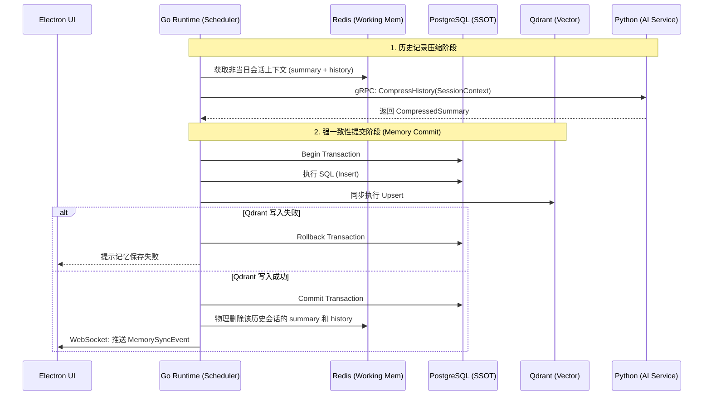

# Phase 6：长期记忆写入与恢复 - 后端架构设计与实施方案

## 1. 系统整体上下文与设计目标描述

### 1.1 业务上下文
在 Luna 桌面 AI 助理的演进路线中，Phase 6 旨在赋予系统“长期记忆”能力，解决传统大模型对话中“上下文污染”与“历史遗忘”的核心痛点。在本阶段，**长期记忆被严格定义为“历史聊天记录的压缩与归档”**。
（注：用户画像与偏好、系统经验教训将作为独立的模块在后续阶段分离设计，不在本文档讨论范围内。）

### 1.2 设计目标
*   **可靠的记忆持久化**：实现关系型数据库（PostgreSQL）与向量数据库（Qdrant）的混合存储，确保压缩记录的结构化属性与语义检索能力并存。
*   **强一致性的提交流程**：严格遵循“Go Runtime 为唯一调度权威”的原则。Python AI 服务仅负责无状态的历史记录压缩，最终的 Memory Write Commit 必须由 Go 引擎通过事务控制落盘。
*   **防脑裂与容灾**：在双库（PG + Qdrant）写入场景下，提供完善的事务回滚、降级重试机制，防止数据不一致。
*   **自动清理机制**：长期记忆入库后，必须物理删除 Redis 中对应的历史会话数据，确保 Redis 仅作为当日工作记忆的缓存。

## 2. 核心工作流设计

### 2.1 会话定义与记忆提取触发机制 (Daily Session & Rollover)
系统采用**“全天候单会话（Daily Session）”**模式，即用户一整天的交互共享同一个会话上下文。
1.  **自然日流转触发**：当系统时间跨过午夜（00:00）时，Go Runtime 自动将当前活跃会话切换为第二天的会话。前一天的会话在逻辑上正式结束，触发该会话的长期记忆全量压缩入库流程。
2.  **启动时兜底检测触发 (Crash Recovery / Offline Catch-up)**：由于桌面程序可能随时被关闭，Go Runtime 在每次启动初始化时，必须扫描 Redis 中的会话记录。
    *   **检测逻辑**：寻找 Redis 中是否存在**非当日**（今日以前）的 `history` 和 `summary` 数据。
    *   **循环清理**：如果存在，则逐个提取这些历史会话数据，触发压缩入库流程。入库成功后，**必须从 Redis 中彻底删除该历史会话的 `history` 和 `summary`**。此检测过程必须循环执行，直到确认 Redis 中**仅保留当日**的会话数据为止。

### 2.2 历史记录压缩工作流
1.  **上下文准备**：Go Runtime 从 Redis 提取目标历史会话的完整上下文（结合该会话的 `summary` 和 `history` 列表）。
2.  **AI 压缩**：Go 通过 gRPC 调用 Python 侧的 `CompressHistory` 接口，传入合并后的完整上下文。
3.  **摘要生成**：Python 侧利用 LLM 对该日会话进行深度压缩与摘要提取，生成结构化的长期记忆记录。由于结合了 Redis 现有的 summary，可有效避免单次压缩的 Token 爆炸问题。

### 2.3 记忆写入与提交流程 (Memory Write Commit)
1.  **开启事务**：Go Runtime 开启 PostgreSQL 数据库事务。
2.  **执行写入**：
    *   在 PG 中插入新的压缩记忆记录。
    *   在 Qdrant 中同步 Upsert 对应的语义向量。
3.  **事务提交与 Redis 清理**：双库操作成功后，Go 提交 PG 事务。**关键步骤：事务提交成功后，Go 必须将该历史会话的 `history` 和 `summary` 从 Redis 中物理删除**。若 Qdrant 操作失败，则回滚 PG 事务，保留 Redis 数据等待下次重试。
4.  **状态同步**：通过 Event Bus 广播记忆更新事件，前端接收后刷新记忆面板。

### 2.4 记忆检索与恢复工作流
1.  **意图识别**：用户发起新对话或任务时，Go Runtime 提取核心意图。
2.  **向量检索**：Go 调用 Qdrant，基于意图的 Embedding 检索 Top-K 相关的长期记忆 ID。
3.  **事实补全**：Go 根据检索到的 ID，从 PostgreSQL 中拉取完整的记忆内容与元数据。
4.  **上下文注入**：将提取到的长期记忆与 Redis 中**当日**的短期工作记忆（`summary` + `history`）组装成完整的 Payload，下发给 Python AI 服务进行推理。

## 3. 混合存储结构规划

系统采用 PostgreSQL + Qdrant 的双库混合存储架构。

### 3.1 关系型存储 (PostgreSQL) - 压缩历史记录
作为长期记忆的 Single Source of Truth (SSOT)，负责存储每日会话的压缩摘要与元数据。

**表结构设计 (`long_term_memory`)**：
*   `id` (VARCHAR(64), Primary Key): 雪花算法生成的唯一 ID。
*   `session_id` (VARCHAR(64)): 关联的原始自然日会话 ID。
*   `summary` (TEXT): 深度压缩后的会话摘要内容。
*   `status` (VARCHAR(20)): 状态，枚举值 `ACTIVE` (生效中), `DELETED` (软删除)。
*   `created_at` (TIMESTAMP): 创建时间。
*   `updated_at` (TIMESTAMP): 更新时间。

### 3.2 向量存储 (Qdrant) - 语义检索
用于高维向量的相似度检索，快速定位相关的历史会话摘要。

**Collection 设计 (`luna_long_term_memories`)**：
*   **Point ID**: 对应 PostgreSQL 中的 `id` (需转换为 Qdrant 支持的 UUID 或整数，建议通过雪花 ID 映射)。
*   **Vector**: 记忆 `summary` 的 Embedding 向量。
*   **Payload**:
    *   `session_id`: 关联的会话 ID。
    *   `status`: 仅检索 `ACTIVE` 状态的记忆。

## 4. 交互链路与数据流转



## 5. 核心 API 接口规范

### 5.1 gRPC 接口 (Go -> Python)
定义在 `backend/shared/proto/communication.proto` 中。

```protobuf
// 历史记录压缩请求
message CompressHistoryRequest {
  string session_id = 1;
  string session_context = 2; // 结合了 summary 和 history 的完整上下文
}

// 历史记录压缩响应
message CompressHistoryResponse {
  string summary = 1; // 深度压缩后的会话摘要
}
```

### 5.2 WebSocket 事件 (Go -> Electron)
*   **`EVT_MEMORY_SYNC`**: 通知前端长期记忆已更新，触发 UI 刷新。

## 6. 异常处理与恢复机制

### 6.1 双写一致性与防脑裂
*   **事务主导**：PostgreSQL 作为 SSOT，所有变更必须在 PG 事务中进行。
*   **写入顺序**：先执行 PG 的 DML 操作（不提交），再执行 Qdrant 的 API 调用。若 Qdrant 成功，则 PG Commit；若 Qdrant 失败或超时，则 PG Rollback。
*   **补偿机制**：若出现极端情况（如 PG Commit 成功但 Qdrant 随后崩溃导致数据丢失），系统提供一个后台对账 Worker，定期扫描 PG 中 `updated_at` 较新且状态为 `ACTIVE` 的记录，与 Qdrant 进行比对，缺失则触发重算 Embedding 并 Upsert。

### 6.2 容灾与降级策略
*   **Python 服务不可用**：若 `CompressHistory` RPC 调用超时或失败，Go Runtime 将取消当前压缩任务。历史会话数据保留在 Redis 中。待 Python 服务恢复后，由 Go 的定时任务（Cron Worker）或下次启动时的兜底检测重新发起压缩。
*   **Qdrant 检索超时**：在对话或任务执行前，若 Qdrant 检索超时，系统采取降级策略，跳过长期记忆检索，仅依赖 Redis 中的当日工作记忆继续执行，并在 UI 提示“记忆检索延迟”。
