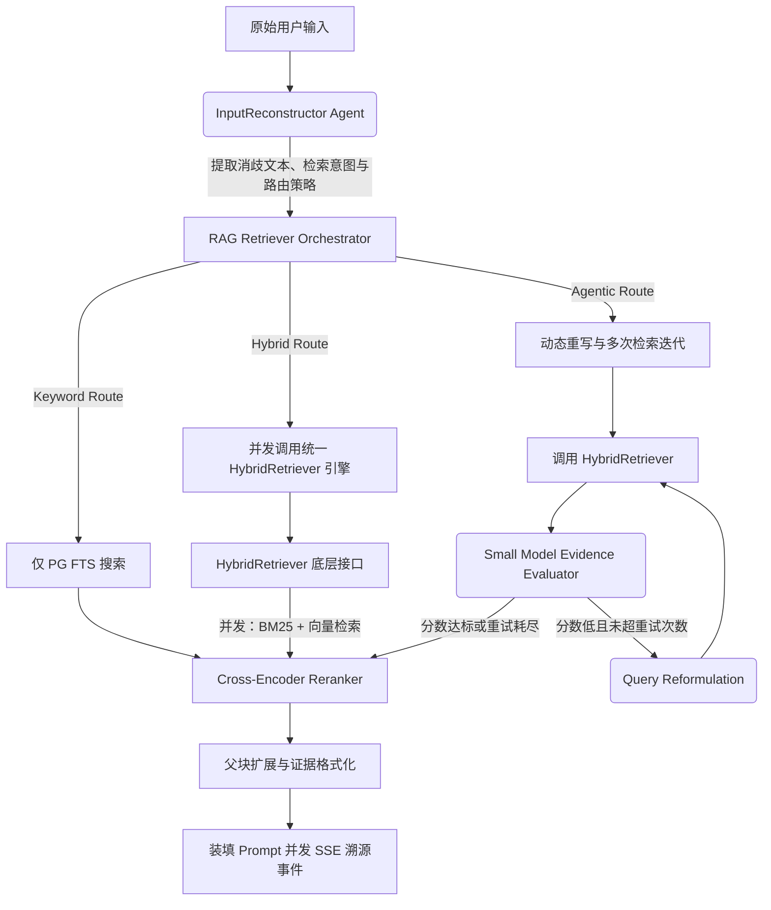

# Phase 7: RAG 知识检索增强 - 后端系统架构设计与核心实施计划

## 1. 架构定位与系统边界 (Context & Boundaries)

遵循 `agent.md` 的强制规范，Luna 的 RAG 系统作为认知推理体系的核心环节，必须**在 Python 后端被彻底地抽象化、调度与监控**。

在架构设计上，严禁使用如 `Langchain.chains` 中难以追踪和控制内部逻辑的黑盒高度封装方法。我们必须基于低层 API 构建自主可控的生命周期，尤其需要应对以下挑战：
1.  **噪音抗性 (Noise Immunity)**：不同来源（杂乱的 PDF 排版、包含大量广告的 URL）导致的文本污染极其严重。
2.  **切分颗粒度的权衡**：切得太大（Token 溢出或重点稀释），切得太小（丧失上下文连贯性），因此必须构建支持父子级联的多维切分引擎。
3.  **单次检索的脆弱性**：当用户提出的问题逻辑跳跃较大时，基于余弦相似度的单点查找命中率极低。必须引入基于 LangGraph 的自我反思 (Self-Reflection) 和智能路由 (Query Routing)。
4.  **强一致的标识符体系**：整个 RAG 生命周期产生的所有业务与物理实体（知识库文档、Chunk 切片、调度任务），全部采用统一提供的 Snowflake 算法生成器保障唯一性与跨表追踪关联。

---

## 2. 知识数据摄入与降噪清洗管道 (Data Ingestion & Loaders)

这是 RAG 的入水口，糟糕的数据源会引发灾难性的 Garbage-In-Garbage-Out 效应。系统通过构建异步队列执行一系列文件/URL解析器。

### 2.1 针对本地异构文件的特征提取
*   **PDF (`pdfplumber` 或 `PyMuPDF`)**：
    不仅仅是读取纯文本。必须配置解析器去除页面边界外的页眉页脚噪音，并尽可能维持原始段落换行的物理结构，方便后续按语义切断。
*   **Docx / Word (`python-docx`)**：
    这是实现“结构化切分”的关键数据源。利用其读取底层的 XML 样式定义。例如，若识别到段落的 Style 为 `Heading 1` 或 `Heading 2`，提取程序需主动在内容前拼接 Markdown 规范符 `# ` 或 `## `，完成文档的格式转换抹平。
*   **纯文本与 Markdown (`.txt`, `.md`)**：
    集成 `chardet` 探测编码以防止 GBK 读取为乱码，确保所有入库文本经过严密的 UTF-8 校验转化。

### 2.2 URL 网页动态抓取与去噪清洗
面对用户输入的外部网址，绝不允许简单使用 `requests` + `BeautifulSoup(body.text)` 摄入。这种做法会将网站的 Sidebar 导航、Footer 版权页和评论区通通吸入，产生致命的检索污染。

*   **核心库选型**：引入 `trafilatura`，这是一款使用文本/HTML标签密度比算法来判定并提取网页“纯正文区块 (Main Content)”的利器。
*   **处理伪代码架构**：
    ```python
    import trafilatura
    
    async def extract_clean_content_from_url(url: str) -> str:
        downloaded = trafilatura.fetch_url(url)
        if not downloaded:
            raise ExternalFetchError("URL无法访问或被反爬拦截")
            
        # 提取核心正文，屏蔽评论区，输出为包含基础结构的 Markdown
        clean_text = trafilatura.extract(
            downloaded, 
            include_comments=False, 
            include_tables=True,
            output_format="markdown"
        )
        if not clean_text or len(clean_text) < 50:
            raise ContentExtractionError("未能从该网页提取到有效正文")
            
        return clean_text
    ```

---

## 3. 四维 Chunk 切分引擎核心算法 (Chunking Engine)

这是该计划的技术重地。系统定义一个基类 `BaseChunker`，强制派生类输出包含完善元数据的单元。

**底层模型定义 (Pydantic)：**
```python
from pydantic import BaseModel
from typing import Optional, Dict, Any

class ChunkUnit(BaseModel):
    chunk_id: str             # Snowflake 字符串
    document_id: str          # 归属文档 ID
    parent_id: Optional[str]  # 级联切分时的父块引用
    text: str                 # 纯文本片段
    estimated_tokens: int     # 基于 tiktoken 预估的大小
    metadata: Dict[str, Any]  # 存储诸如: { "title_level": "H2", "source_url": "..." }
```

### 3.1 滑动窗口策略 (Sliding Window Chunker)
最为通用和容错的策略。通过 Tokenizer 或字符游标步进，并且必须设定向后重叠的 `overlap` 区域（如 50 tokens），以此防止关键术语或跨段长句在切割点被物理“腰斩”，进而导致向量语义断裂。

### 3.2 结构化 AST 策略 (Structured AST Chunker)
专供 Markdown 与经过格式还原的文档使用。
利用正则表达式探测层级如 `^## (.+)$`。将某一标题及其下方所有的下级子块划定为一个逻辑集合。为解决子块脱离标题后大模型不知所云的问题，在真正落盘的子 Chunk `text` 开头，主动垫入追踪回溯到的全层级前缀：
`(例如在子 Chunk 文本前追加：[来源: 系统架构] > [H1: 部署说明] > [H2: 数据库初始化] \n\n 实际的命令如下...)`

### 3.3 语义分割与父子级联优化 (Semantic & Small-to-Big Retrieval)
面对精度极高的提问场景（如具体的一串代码报错）。
*   **拆分算法**：不限字数，而是在自然标点 (`\n\n`, `.`, `?`, `!`) 处进行切分，保持人类书面语义的完整句法。
*   **小发大收 (Small-to-Big/Parent-Child)** 优化技术：
    1.  切割为一个大段落（Parent Chunk），分配 `Parent_ID`。
    2.  大段落进一步细分为多个小句子（Child Chunks）。
    3.  入库操作时：只对短小精悍的 Child Chunks 进行 Embedding 向量化。
    4.  召回操作时：一旦命中 Child，拦截器根据 `Parent_ID` 反向查出全景的 Parent 大段落并喂给 LLM。这种架构完美融合了向量匹配的高召回精度与 LLM 推理需要大范围上下文的矛盾。

### 3.4 正则匹配引擎与灾难兜底 (Regex Chunker & Fallback Threshold)
将文本的控制权交给用户。但这是最易引发系统崩溃的环节。
*   **安全截断边界 (Max Token Limit)**：由于无法预测用户书写如 `(.*)*` 或跨越多章节未闭合的正则，生成的单一 Chunk 可能高达数万 Token。
*   Python 内部必须在每一次正则执行获取到 group 时，执行 Token 探量计算。若 `estimated_tokens > max_fallback_threshold`（例如 1200 Token），系统抛弃正则剩余界限，强制在其中心点或最靠近阈值的换行符处将其斩断。并向返回的实体追加警告标识，绝不允许超长污点数据注入后续的 Embedding 模型或令应用发生 OOM。

---

## 4. 基于 LangGraph 的多路路由与检索编排 (Retrieval DAG)

我们彻底废弃简单的线性流程，引入具备条件循环能力的 `LangGraph` 来调度多路路由，这也是 Luna 智能水平的体现。



### 4.1 核心机制优化
1.  **路由决策前置化 (Query Reformulation & Routing)**：
    废弃早期的正则关键字暴力判定。目前统一由 **InputReconstructor Agent** 对用户原始 Query 进行指代消歧（消除代词歧义），并在其结构化输出 JSON 中直接指明本次检索应使用哪种策略（Keyword / Hybrid / Agentic），实现检索意图与检索执行在物理架构上的解耦。
2.  **统一底层检索接口 (Unified Retrieval Engine)**：
    彻底废除检索编排器中的重复逻辑。不论是关键词还是多路召回，全部收拢为对 `app/rag/hybrid_retriever.py` 的透明调用。
3.  **动态证据充分性评估 (Agentic RAG Evaluator)**：
    废弃原来简单的 `len(candidates) >= 3` 硬编码逻辑。重构为引入 Small Model 对当前轮次检索证据进行动态打分（Score > Threshold）。若评估不及格，自动进入 Query Rewrite 循环重试。
4.  **去 RRF (Reciprocal Rank Fusion) 化**：
    早期架构中的 RRF 计算存在性能开销且与 Cross-Encoder Rerank 存在功能重叠。新架构删除 RRF，改由底层的多路召回粗排后，直接交付给深度 Reranker 模型执行交叉注意力打分。

---

## 5. 存储落盘结构设计 (Database DDL & Qdrant Strategy)

### 5.1 关系型数据核心表 (PostgreSQL)
用于支持高频的状态追踪以及后续可能的离线计算重建。
```sql
-- 文档注册与状态轮询追踪表
CREATE TABLE rag_documents (
    id VARCHAR(64) PRIMARY KEY,      -- Snowflake
    filename VARCHAR(255) NOT NULL,
    source_type VARCHAR(20) NOT NULL,-- 'local_file' 或 'url'
    status VARCHAR(20) NOT NULL,     -- 'parsing', 'embedding', 'completed', 'failed'
    estimated_tokens INTEGER DEFAULT 0,
    error_log TEXT,                  -- 记录异常宕机堆栈信息
    created_at TIMESTAMP DEFAULT CURRENT_TIMESTAMP
);

-- 切片内容存放主表 (防止庞大的原文塞入向量库拖慢检索与膨胀内存)
CREATE TABLE rag_chunks (
    chunk_id VARCHAR(64) PRIMARY KEY,-- Snowflake
    doc_id VARCHAR(64) NOT NULL REFERENCES rag_documents(id) ON DELETE CASCADE,
    parent_id VARCHAR(64),           -- 可选级联 ID
    content_text TEXT NOT NULL,      -- 原文
    meta_payload JSONB,              -- 各类关联的结构数据
    created_at TIMESTAMP DEFAULT CURRENT_TIMESTAMP
);
CREATE INDEX idx_doc_id ON rag_chunks(doc_id);
```

### 5.2 向量库存储范式 (Qdrant)
*   **集合名称**：`luna_rag_index`
*   **Payload (元数据) 设计**：绝对禁止将大段的源文本 (`content_text`) 放入 Qdrant 的 Payload。其内部仅存储两个关键映射主键：`{"chunk_id": "...", "doc_id": "..."}`。
*   **检索联合映射**：Qdrant 仅执行数学最近邻检索并返回 ID 数组，紧接着交由 ORM 通过 `SELECT * FROM rag_chunks WHERE chunk_id IN (...)` 取得明文内容，实现计算面与存储面的物理解耦。

---

## 6. API 契约与异步通信层 (FastAPI Endpoints)

使用 Pydantic BaseModel 强约束输入输出并定义路由：

### 6.1 异步摄入提交接口
`POST /api/v1/rag/knowledge/upload` 与 `POST /api/v1/rag/knowledge/url`
接受多段数据或链接。该端点不能等待耗时极长的模型调用，而是将封装好的上下文投递入 Redis 队列或本地 asyncio 后台任务池，随即迅速返回 `task_id` 供前端轮询。
```json
{
  "code": 0,
  "data": { "task_id": "893817...", "document_id": "893817..." }
}
```

### 6.2 测试沙盒与策略预览同步接口
`POST /api/v1/rag/chunk/preview`
专为前端策略微调提供。实例化对应的 `Chunker` 类并在内存中试跑。必须设置物理的运行时间看门狗 (Watchdog Timeout)，防范正则计算炸弹。返回切断截取的前 5 个预览片段。

### 6.3 SSE 事件流装填协议 (Event Bus Broadcaster)
当 LangGraph 在进行多跳分析（评估、重搜）以及最后整理资料生成时，后端需向现有的对话 SSE 通道中夹带私货标识结构：
*   **思考链事件 (`EVT_RAG_THOUGHT`)**：供前端渲染动画。
    `{"event": "EVT_RAG_THOUGHT", "data": {"stage": "evaluating", "msg": "正在审查检索回的 5 份资料相关性..."}}`
*   **溯源事件 (`EVT_RAG_CITATION`)**：将引用的底层明细包裹回传，支撑前端构建可点击的 Hover 查看面板。
    `{"event": "EVT_RAG_CITATION", "data": [{"id": 1, "doc": "xx.md", "chunk": "100234"}]}`

---

## 7. 实施 Roadmap 与研发里程碑 (Development Checklists)

此模块由于复杂度高，需遵循以下的梯次研发规划：

*   [ ] **Phase 7.1: Snowflake 实体桥接与算法基座**
    - 在工具集中验证 Snowflake 算法跨域可用性。
    - 编写并用单元测试覆盖四类 `Chunker`，重点验证正则超限 Token 的防灾强截断逻辑，以及 AST 的前后缀补齐功能。
*   [ ] **Phase 7.2: API 对接与同步预览端点**
    - 实现 FastAPI `/preview` 沙盒接口，建立对 Pydantic 的入参严格校验过滤。
*   [ ] **Phase 7.3: 提取管道与去噪中间件整合**
    - 集成 `pdfplumber` 与 `python-docx`。
    - 针对 `trafilatura` 封装异常拦截，提供优雅的 403 爬取阻断报错。
*   [ ] **Phase 7.4: 关系映射建表与混合检索对接**
    - 在 Postgres 完成 `rag_documents` 和 `rag_chunks` 的建表与外键映射关系设定。
    - 利用 Qdrant 打通 Sparse-Dense 双通道查询能力，预留 Alpha 系数融合通道，加载交叉重排模型。
*   [ ] **Phase 7.5: 图检索编排构建与测试 (攻坚点)**
    - 搭建 LangGraph，编写 `Router` 和 `Evaluator` 涉及的核心结构化指令词 Prompt。
    - 组装带有限次重试循环 (Max Retry) 的自评估搜索回路。
*   [ ] **Phase 7.6: 推流注入与全链路压测验证**
    - 利用 Redis EventBus 截获图结构内部事件变迁，编码封装 `EVT_RAG_THOUGHT` 下发给底层通道。
    - 执行注入极端长文、无闭合正则表达式的边界压测，确保服务进程不死锁不断联。