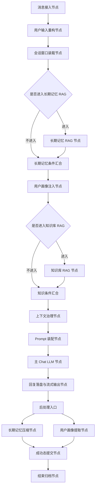

# Phase 8.5：Chat 主链路节点化与 LangGraph 过渡方案（后端）

## 1. 文档定位

本文档定义 Luna 从 Phase 8「上下文治理与摘要压缩」过渡到 Phase 9「DAG 工作流内核」之间的后端实施方案。Phase 8.5 的目标不是直接实现完整的复杂任务拆解能力，而是先将当前日常闲聊 chat 主链路中已经存在的单点能力抽象为稳定节点，并用 LangGraph 编排为一个可落地的 chat plan 预设。

Phase 8.5 的核心交付是：

1. 统一后端 chat 主链路的节点定义、节点状态、条件路由与事件协议。
2. 用 LangGraph 承载日常闲聊模式下的固定预设图。
3. 建立对象化、强类型、可校验、可审计的上下文传播模型。
4. 将现有长期记忆、用户画像、知识库 RAG、上下文压缩、主 Chat LLM 等能力从散落调用收拢为节点适配层。
5. 为 Phase 9 的 Plan、Phase、Node 三层执行容器提供可复用的节点库、状态模型与事件基础。

## 2. 阶段边界

### 2.1 本阶段必须完成

Phase 8.5 只服务于日常闲聊 mode，聚焦 chat 主链路本身：

- 用户消息进入后，生成本轮交互运行上下文。
- 对用户输入进行重构、消歧、检索意图识别和条件路由准备。
- 基于 LangGraph 条件边判断是否进入长期记忆检索节点与知识库 RAG 节点。
- 用户画像注入节点作为主链路必须节点固定执行，无论输入类型、意图分类或画像命中结果如何，都必须进入该节点并产出显式画像状态。
- 将会话短期上下文、长期记忆、用户画像、知识证据、系统 Prompt、模型配置组装为主模型输入。
- 执行主 Chat LLM 流式生成。
- 将回复结果写回会话短期上下文，并触发后处理节点。
- 后处理节点负责长期记忆压缩、用户画像提取、压缩审计、遥测记录等副作用。

### 2.2 本阶段明确不做

以下能力属于 Phase 9 或更后续阶段，不作为 Phase 8.5 实施内容：

- 不实现通用 plan 自动生成。
- 不实现复杂任务拆解 mode。
- 不实现多工具执行链与工具审批。
- 不实现完整 DAG 可视化产品形态。
- 不实现多 Agent 协作调度。
- 不实现局部重规划、失败子图修剪、DFS 影响范围计算。
- 不让前端参与调度、记忆提交、RAG 执行或状态裁决。

### 2.3 与 Phase 9 的衔接

Phase 8.5 的 chat plan 是后续 Phase 9 的基础子图，而不是临时方案。后续进入 Phase 9 后：

- 当前 `daily_chat` 预设图升级为通用 Plan 体系中的一个内置 Plan 模板。
- 当前节点定义迁移为正式 Node Registry 的第一批节点。
- 当前运行态上下文扩展为 PlanRuntimeContext。
- 当前节点事件扩展为计划执行事件协议。
- 当前 LangGraph Checkpoint 基础继续用于中断恢复和调试回放。

## 3. 当前项目真实能力盘点

当前项目已经具备多项可节点化能力，但它们主要以服务、管理器或编排器形式存在，还没有统一纳入 chat 工作流图。

| 能力 | 当前承载模块 | Phase 8.5 节点化方向 |
|:---|:---|:---|
| FastAPI 服务装配与基础设施初始化 | `backend/ai-service/app/main.py` | 作为 ChatWorkflowService 的依赖注入来源 |
| Redis 会话短期上下文 | `ChatHistoryRedisRepo` | 封装为会话窗口装载节点与回复回写节点 |
| PostgreSQL 会话历史 | `ChatHistoryPGRepo` | 封装为持久化回写和恢复节点依赖 |
| 长期记忆压缩与提交 | `app.memory.manager.Manager` | 封装为长期记忆压缩节点与成功态提交节点 |
| 长期记忆检索 | `app.memory.manager.Manager` 与 `HybridRetriever` | 封装为长期记忆 RAG 条件节点 |
| 用户画像存储与缓存 | `UserProfilePGRepository`、用户画像 API 与缓存模块 | 封装为用户画像注入必须节点与用户画像提取后处理节点 |
| 知识库检索 | `app.rag.retrieval.RagRetrievalOrchestrator` | 封装为知识库 RAG 条件节点 |
| 证据评估与引用事件 | `RagEventPublisher`、RAG SSE 事件 | 封装为节点调试事件与引用结果输出 |
| Prompt 模板与动态配置 | `PromptManager` | 封装为 Prompt 装配节点 |
| 统一模型调用与流式输出 | `InferenceService`、LLM Client、SSE 通道 | 封装为主 Chat LLM 节点 |
| 压缩审计 | `app.context.compression_audit` | 封装为上下文治理审计与后处理审计 |
| Trace 与错误日志 | telemetry、error_log、logger | 封装为节点观测记录与执行事件 |

Phase 8.5 不重写这些能力，而是先建立节点适配层。节点适配层负责统一输入输出、异常处理、观测字段和上下文读写。

## 4. 为什么采用 LangGraph

### 4.1 采用原因

本阶段必须采用 LangGraph，而不是手写 DAG 框架，原因如下：

1. 当前系统目标已经明确要求 AI 编排基于 LangGraph。
2. LangGraph 原生支持 StateGraph、条件边、流式事件、Checkpoint 和中断恢复。
3. Phase 8.5 虽然只做 chat plan，但长期记忆与知识库 RAG 都需要条件路由，而用户画像注入需要作为固定节点稳定参与每一轮 Prompt 装配。
4. 现有 RAG 已经存在多路路由和 Agentic 检索思路，继续手写流程会扩大不可观测链路。
5. 直接使用 LangGraph 能让 Phase 9 复用本阶段的节点和状态，而不是二次迁移。

### 4.2 LangGraph 的职责边界

LangGraph 在 Phase 8.5 中负责：

- 注册 chat 主链路节点。
- 执行固定 chat plan 预设图。
- 基于强类型状态执行条件路由。
- 承载节点级状态更新。
- 通过 Checkpoint 保存图执行快照。
- 对外暴露节点开始、结束、失败、降级等执行事件。

LangGraph 在 Phase 8.5 中不负责：

- 自动生成复杂任务计划。
- 替代 MemoryManager 的记忆提交规则。
- 替代 UserProfile 模块的画像冲突合并规则。
- 替代 RagRetrievalOrchestrator 的底层检索策略。
- 替代 PromptManager 的模板版本管理。
- 替代前端展示状态。

### 4.3 与现有服务的关系

Phase 8.5 的 LangGraph 图只做编排，不吞并现有服务。现有服务通过节点适配器接入：

- MemoryNodeAdapter 调用长期记忆相关能力。
- UserProfileNodeAdapter 调用画像缓存、画像查询和画像提取能力。
- KnowledgeRagNodeAdapter 调用 RagRetrievalOrchestrator。
- PromptAssemblyNodeAdapter 调用 PromptManager。
- ChatLlmNodeAdapter 调用统一模型客户端和流式输出缓冲。
- PersistenceNodeAdapter 调用 Redis、PostgreSQL 与 telemetry。

## 5. 常量、枚举与命名约定

所有关键名称必须进入统一常量模块，禁止在节点函数、API 路由、前端事件处理器中直接书写魔法字符串。

### 5.1 推荐后端目录

```text
backend/ai-service/app/workflow/
├── __init__.py
├── constants.py
├── graph_factory.py
├── service.py
├── context.py
├── events.py
├── registry.py
├── routers.py
└── nodes/
    ├── __init__.py
    ├── base.py
    ├── input_reconstruction.py
    ├── session_context.py
    ├── long_term_memory.py
    ├── user_profile.py
    ├── knowledge_rag.py
    ├── context_governance.py
    ├── prompt_assembly.py
    ├── chat_llm.py
    ├── persistence.py
    └── postprocess.py
```

### 5.2 推荐枚举

```python
from enum import StrEnum

class ChatWorkflowSchemaVersion(StrEnum):
    CHAT_WORKFLOW_V1 = "chat.workflow.v1"

class ChatMode(StrEnum):
    DAILY_CHAT = "daily_chat"

class ChatPlanPreset(StrEnum):
    DAILY_CHAT_DEFAULT = "daily_chat.default.v1"

class ChatWorkflowNodeType(StrEnum):
    MESSAGE_INGRESS = "message_ingress"
    INPUT_RECONSTRUCTION = "input_reconstruction"
    SESSION_CONTEXT_LOAD = "session_context_load"
    LONG_TERM_MEMORY_RAG = "long_term_memory_rag"
    USER_PROFILE_INJECTION = "user_profile_injection"
    KNOWLEDGE_RAG = "knowledge_rag"
    CONTEXT_GOVERNANCE = "context_governance"
    PROMPT_ASSEMBLY = "prompt_assembly"
    MAIN_CHAT_LLM = "main_chat_llm"
    RESPONSE_PERSISTENCE = "response_persistence"
    LONG_TERM_MEMORY_COMPRESSION = "long_term_memory_compression"
    USER_PROFILE_EXTRACTION = "user_profile_extraction"
    POSTPROCESS_COMMIT = "postprocess_commit"
    ERROR_RECOVERY = "error_recovery"
    FINALIZE = "finalize"

class ChatNodeStatus(StrEnum):
    PENDING = "pending"
    RUNNING = "running"
    SUCCEEDED = "succeeded"
    FAILED = "failed"
    DEGRADED = "degraded"
    NOT_ENTERED_BY_CONDITION = "not_entered_by_condition"

class ChatConditionalRoute(StrEnum):
    ENTER_LONG_TERM_MEMORY_RAG = "enter_long_term_memory_rag"
    BYPASS_LONG_TERM_MEMORY_RAG = "bypass_long_term_memory_rag"
    ENTER_KNOWLEDGE_RAG = "enter_knowledge_rag"
    BYPASS_KNOWLEDGE_RAG = "bypass_knowledge_rag"
    ENTER_POSTPROCESS = "enter_postprocess"
    ENTER_ERROR_RECOVERY = "enter_error_recovery"

class ChatWorkflowEventType(StrEnum):
    EVT_CHAT_PLAN_STARTED = "EVT_CHAT_PLAN_STARTED"
    EVT_CHAT_NODE_STARTED = "EVT_CHAT_NODE_STARTED"
    EVT_CHAT_NODE_COMPLETED = "EVT_CHAT_NODE_COMPLETED"
    EVT_CHAT_NODE_FAILED = "EVT_CHAT_NODE_FAILED"
    EVT_CHAT_NODE_DEGRADED = "EVT_CHAT_NODE_DEGRADED"
    EVT_CHAT_CONDITION_EVALUATED = "EVT_CHAT_CONDITION_EVALUATED"
    EVT_CHAT_STREAM_CHUNK = "EVT_CHAT_STREAM_CHUNK"
    EVT_CHAT_POSTPROCESS_STARTED = "EVT_CHAT_POSTPROCESS_STARTED"
    EVT_CHAT_POSTPROCESS_COMPLETED = "EVT_CHAT_POSTPROCESS_COMPLETED"
    EVT_CHAT_PLAN_COMPLETED = "EVT_CHAT_PLAN_COMPLETED"
```

说明：知识库 RAG 与长期记忆检索不是“可随意跳过”的节点，而是受条件边控制的条件节点。如果条件判断不进入，应记录 `NOT_ENTERED_BY_CONDITION`，并记录条件判断依据。用户画像注入不是条件节点，而是每轮 chat 主链路都必须进入的固定节点；即使画像库为空或画像检索降级，也必须产出显式空画像状态或降级状态。

## 6. 对象化上下文传播模型

### 6.1 设计原则

节点之间禁止使用松散字典、字符串键拼装、`Record<string, any>` 等方式传递核心上下文。LangGraph 的状态对象必须是稳定结构，节点只能通过类型化字段更新上下文。

核心原则：

1. 根状态只有一个：ChatWorkflowState。
2. 根状态内部按领域拆分对象，不允许节点随意新增顶层字段。
3. 每个节点只读写自己声明的上下文片段。
4. 每个节点输出必须是类型化 NodeResult 或特定状态片段。
5. 所有跨层事件从 ChatWorkflowState 中提取，不从临时 dict 中拼装。

### 6.2 根状态结构

```python
from pydantic import BaseModel, Field
from typing import Optional

class ChatWorkflowState(BaseModel):
    schema_version: ChatWorkflowSchemaVersion
    runtime: "ChatRuntimeContext"
    input_payload: "ChatInputPayload"
    session_state: "ChatSessionState"
    route_state: "ChatRouteState"
    memory_state: "ChatMemoryState"
    profile_state: "ChatUserProfileState"
    knowledge_state: "ChatKnowledgeRagState"
    prompt_state: "ChatPromptState"
    generation_state: "ChatGenerationState"
    postprocess_state: "ChatPostprocessState"
    observability: "ChatObservabilityState"
    error_state: Optional["ChatErrorState"] = None
```

### 6.3 运行态上下文

```python
class ChatRuntimeContext(BaseModel):
    trace_id: str
    interaction_id: str
    session_id: str
    user_id: str
    chat_mode: ChatMode
    plan_preset_id: ChatPlanPreset
    current_node_type: Optional[ChatWorkflowNodeType] = None
    started_at_ms: int
    deadline_at_ms: Optional[int] = None
    retry_count: int = 0
```

用途：贯穿所有节点，用于日志、审计、SSE 事件、Checkpoint thread_id 和前端调试。

### 6.4 输入载荷

```python
class ChatInputPayload(BaseModel):
    raw_user_message: str
    frontend_message_id: str
    client_timestamp_ms: int
    locale: str
    timezone: str
```

用途：只承载本轮请求的原始输入和客户端元信息。输入重构结果不得覆盖原始输入。

### 6.5 路由状态

```python
class ChatRouteState(BaseModel):
    reconstructed_text: str = ""
    disambiguated_text: str = ""
    user_intent_summary: str = ""
    search_queries: list[str] = Field(default_factory=list)
    entity_mentions: list[str] = Field(default_factory=list)
    temporal_focus: dict[str, str] = Field(default_factory=dict)
    should_enter_long_term_memory_rag: bool = False
    should_enter_knowledge_rag: bool = False
    route_reasons: list[str] = Field(default_factory=list)
```

用途：由用户输入重构节点产出，用于 LangGraph 条件边判断。该对象是长期记忆 RAG 与知识库 RAG 条件路由的唯一输入来源；用户画像注入不读取 `should_enter_*` 路由开关决定是否执行，而是固定进入。

### 6.6 会话态

```python
class ChatSessionState(BaseModel):
    recent_messages: list["ChatHistoryMessage"] = Field(default_factory=list)
    short_summary: str = ""
    key_facts: list[str] = Field(default_factory=list)
    token_budget_total: int
    token_budget_used: int = 0
    context_window_status: str
```

用途：承载 Redis 短期窗口和上下文预算，供上下文治理与 Prompt 装配使用。

### 6.7 长期记忆状态

```python
class ChatMemoryState(BaseModel):
    entered_by_condition: bool = False
    condition_reason: str = ""
    retrieved_memories: list["MemoryHit"] = Field(default_factory=list)
    prompt_memory_text: str = ""
    degraded: bool = False
    degraded_reason: str = ""
```

用途：长期记忆 RAG 条件节点的完整输入输出状态。若条件边未进入该节点，必须保留默认空状态，并由观测记录说明未进入原因。

### 6.8 用户画像状态

```python
class ChatUserProfileState(BaseModel):
    injection_executed: bool = False
    profile_facts: list["UserProfileFactView"] = Field(default_factory=list)
    prompt_profile_text: str = ""
    extraction_candidates: list["UserProfileExtractionCandidate"] = Field(default_factory=list)
    degraded: bool = False
    degraded_reason: str = ""
```

用途：用户画像注入必须节点和画像提取后处理节点共用，但读写字段分离。画像注入每轮固定执行，只写 `injection_executed`、`profile_facts` 与 `prompt_profile_text`；画像提取只写 `extraction_candidates`。

### 6.9 知识库 RAG 状态

```python
class ChatKnowledgeRagState(BaseModel):
    entered_by_condition: bool = False
    condition_reason: str = ""
    retrieval_route: str = ""
    evidences: list["KnowledgeEvidence"] = Field(default_factory=list)
    citations: list["KnowledgeCitation"] = Field(default_factory=list)
    prompt_knowledge_text: str = ""
    degraded: bool = False
    degraded_reason: str = ""
```

用途：知识库 RAG 条件节点的完整状态。该节点只能由条件边进入，不允许在主链路中硬编码调用。

### 6.10 Prompt 与生成状态

```python
class ChatPromptState(BaseModel):
    prompt_template_id: str
    prompt_version_id: str
    system_prompt_text: str
    memory_slot_text: str
    profile_slot_text: str
    knowledge_slot_text: str
    final_messages: list["ModelMessage"] = Field(default_factory=list)
    final_prompt_tokens: int = 0

class ChatGenerationState(BaseModel):
    assistant_message_id: str
    model_name: str
    provider_name: str
    stream_started_at_ms: Optional[int] = None
    ttft_ms: Optional[int] = None
    full_text: str = ""
    finish_reason: str = ""
    citations: list["KnowledgeCitation"] = Field(default_factory=list)
```

### 6.11 后处理状态

```python
class ChatPostprocessState(BaseModel):
    should_run_memory_compression: bool = False
    should_run_profile_extraction: bool = False
    memory_mutation_staging: list["MemoryMutationCandidate"] = Field(default_factory=list)
    profile_mutation_staging: list["UserProfileMutationCandidate"] = Field(default_factory=list)
    committed: bool = False
    postprocess_errors: list["PostprocessError"] = Field(default_factory=list)
```

后处理节点不得阻塞主回复完成。后处理失败时必须写入错误记录和审计事件，但不得把已完成的主回复改为失败。

### 6.12 可观测状态

```python
class ChatNodeObservation(BaseModel):
    node_type: ChatWorkflowNodeType
    status: ChatNodeStatus
    started_at_ms: int
    ended_at_ms: Optional[int] = None
    latency_ms: Optional[int] = None
    retry_count: int = 0
    condition_entered: Optional[bool] = None
    condition_reason: str = ""
    degraded_reason: str = ""
    error_code: str = ""

class ChatObservabilityState(BaseModel):
    node_observations: list[ChatNodeObservation] = Field(default_factory=list)
    emitted_event_ids: list[str] = Field(default_factory=list)
```

## 7. 节点设计

### 7.1 消息接入节点

| 项目 | 说明 |
|:---|:---|
| 节点类型 | `MESSAGE_INGRESS` |
| 职责 | 校验用户输入，创建 trace_id、interaction_id、assistant_message_id，初始化根状态 |
| 输入 | HTTP/SSE chat 请求、前端消息 ID、session_id |
| 输出 | ChatWorkflowState 初始对象 |
| 依赖上下文 | Snowflake ID 生成器、配置管理、当前会话信息 |
| 执行时机 | 图入口 |
| 失败处理 | 入参不合法直接返回结构化错误，不进入后续图 |
| 可观测字段 | trace_id、interaction_id、session_id、latency_ms、error_code |

### 7.2 用户输入重构节点

| 项目 | 说明 |
|:---|:---|
| 节点类型 | `INPUT_RECONSTRUCTION` |
| 职责 | 对原始输入进行指代消歧、意图摘要、检索查询词构造、实体提取、时间焦点提取，并产生长期记忆 RAG 与知识库 RAG 的条件路由布尔值 |
| 输入 | raw_user_message、recent_messages、short_summary |
| 输出 | ChatRouteState |
| 依赖上下文 | PromptManager、轻量 LLM 或现有输入重构 Agent |
| 执行时机 | 消息接入后 |
| 失败处理 | 降级为 raw_user_message；长期记忆 RAG 与知识库 RAG 的条件路由值根据保守策略由规则判断生成；记录 DEGRADED |
| 可观测字段 | reconstructed_text_length、route_reasons、degraded_reason、latency_ms |

输入重构节点必须输出两个条件判断：

1. `should_enter_long_term_memory_rag`
2. `should_enter_knowledge_rag`

这两个值是后续 LangGraph 条件边的唯一依据。用户画像注入不由输入重构节点决定是否进入，而是在长期记忆条件分支汇合后固定执行。

### 7.3 会话窗口装载节点

| 项目 | 说明 |
|:---|:---|
| 节点类型 | `SESSION_CONTEXT_LOAD` |
| 职责 | 从 Redis 装载短期会话窗口、摘要与关键事实，计算上下文预算 |
| 输入 | session_id |
| 输出 | ChatSessionState |
| 依赖上下文 | ChatHistoryRedisRepo、ChatHistoryPGRepo |
| 执行时机 | 输入重构后 |
| 失败处理 | Redis 不可用时从 PostgreSQL 加载最近会话；仍失败则使用空窗口并记录降级 |
| 可观测字段 | recent_message_count、token_budget_used、degraded_reason |

### 7.4 长期记忆 RAG 条件节点

| 项目 | 说明 |
|:---|:---|
| 节点类型 | `LONG_TERM_MEMORY_RAG` |
| 职责 | 检索与当前输入相关的长期记忆，格式化为 Prompt 可注入内容 |
| 输入 | ChatRouteState、ChatSessionState |
| 输出 | ChatMemoryState |
| 条件进入 | `route_state.should_enter_long_term_memory_rag == True` |
| 依赖上下文 | MemoryManager、HybridRetriever、Qdrant、PostgreSQL |
| 执行时机 | 会话窗口装载后，经条件边进入 |
| 失败处理 | 不阻断主链路；设置 memory_state.degraded 并继续汇合到上下文治理节点 |
| 可观测字段 | condition_entered、condition_reason、hit_count、latency_ms、degraded_reason |

如果条件不成立，图应通过条件边进入汇合节点，并记录 `NOT_ENTERED_BY_CONDITION`。这不是“跳过”，而是 DAG 条件路由的正常结果。

### 7.5 用户画像注入必须节点

| 项目 | 说明 |
|:---|:---|
| 节点类型 | `USER_PROFILE_INJECTION` |
| 职责 | 每轮固定读取、检索或构建用户画像事实，并格式化为 Prompt 用户画像槽位 |
| 输入 | ChatRouteState、session_id、user_id |
| 输出 | ChatUserProfileState |
| 执行性质 | 必须进入，不受条件边控制 |
| 依赖上下文 | UserProfilePGRepository、画像缓存、PromptManager |
| 执行时机 | 长期记忆条件分支汇合后固定执行 |
| 失败处理 | 不阻断主回复；设置 profile_state.degraded，并产出显式空画像槽位 |
| 可观测字段 | injection_executed、profile_fact_count、category_count、degraded_reason |

画像注入不等同于画像提取。画像注入发生在主模型生成前，且每一轮必须执行；画像提取是回复完成后的后处理节点。

### 7.6 知识库 RAG 条件节点

| 项目 | 说明 |
|:---|:---|
| 节点类型 | `KNOWLEDGE_RAG` |
| 职责 | 根据输入重构节点给出的检索意图进入知识库检索，返回证据、引用和 Prompt 注入文本 |
| 输入 | ChatRouteState、ChatSessionState |
| 输出 | ChatKnowledgeRagState |
| 条件进入 | `route_state.should_enter_knowledge_rag == True` |
| 依赖上下文 | RagRetrievalOrchestrator、KnowledgeRetriever、RagEventPublisher |
| 执行时机 | 用户画像注入必须节点完成后，经条件边进入 |
| 失败处理 | 不编造证据；设置 knowledge_state.degraded；主链路继续以无外部证据模式生成 |
| 可观测字段 | condition_entered、retrieval_route、evidence_count、citation_count、degraded_reason |

知识库 RAG 进入与否由 DAG 条件边决定。即使条件不进入，也必须向前端和审计系统记录条件评估结果，方便调试为什么本轮没有检索知识库。

### 7.7 上下文治理节点

| 项目 | 说明 |
|:---|:---|
| 节点类型 | `CONTEXT_GOVERNANCE` |
| 职责 | 合并短期会话、长期记忆、画像事实、知识证据，执行预算裁剪、摘要压缩和污染治理 |
| 输入 | ChatSessionState、ChatMemoryState、ChatUserProfileState、ChatKnowledgeRagState |
| 输出 | 治理后的上下文槽位状态 |
| 依赖上下文 | count_tokens、compression_audit、上下文压缩策略 |
| 执行时机 | 长期记忆条件分支、用户画像注入必须节点、知识库 RAG 条件分支均完成后 |
| 失败处理 | 启用最小可用裁剪策略；保留最近用户输入和核心系统 Prompt |
| 可观测字段 | raw_tokens、final_tokens、compression_ratio、degraded_reason |

### 7.8 Prompt 装配节点

| 项目 | 说明 |
|:---|:---|
| 节点类型 | `PROMPT_ASSEMBLY` |
| 职责 | 按 Prompt 版本、模型配置、上下文槽位装配最终模型消息 |
| 输入 | 治理后的上下文、Prompt 模板变量、模型配置 |
| 输出 | ChatPromptState |
| 依赖上下文 | PromptManager、配置管理、模型预设 |
| 执行时机 | 上下文治理后 |
| 失败处理 | PromptManager 不可用时返回可解释错误，进入 ERROR_RECOVERY |
| 可观测字段 | prompt_template_id、prompt_version_id、final_prompt_tokens |

### 7.9 主 Chat LLM 节点

| 项目 | 说明 |
|:---|:---|
| 节点类型 | `MAIN_CHAT_LLM` |
| 职责 | 调用统一模型层执行流式回复，记录 TTFT、流式块、完整回复和引用信息 |
| 输入 | ChatPromptState |
| 输出 | ChatGenerationState |
| 依赖上下文 | LLM Client、流式缓冲器、SSE 管理器、错误脱敏器 |
| 执行时机 | Prompt 装配后 |
| 失败处理 | 模型异常进入 ERROR_RECOVERY；网络中断返回友好降级错误 |
| 可观测字段 | model_name、provider_name、ttft_ms、latency_ms、output_tokens |

### 7.10 回复落盘与流式输出节点

| 项目 | 说明 |
|:---|:---|
| 节点类型 | `RESPONSE_PERSISTENCE` |
| 职责 | 将本轮用户输入与 AI 回复写入 Redis 短期窗口和 PostgreSQL 会话历史，并补齐前端消息终态 |
| 输入 | ChatInputPayload、ChatGenerationState |
| 输出 | 更新后的 ChatSessionState 与持久化结果 |
| 依赖上下文 | ChatHistoryRedisRepo、ChatHistoryPGRepo、SSE 管理器 |
| 执行时机 | 主模型完成后 |
| 失败处理 | Redis 失败不影响 PG；PG 失败必须记录错误并允许后续补偿 |
| 可观测字段 | redis_write_status、pg_write_status、latency_ms |

### 7.11 长期记忆压缩后处理节点

| 项目 | 说明 |
|:---|:---|
| 节点类型 | `LONG_TERM_MEMORY_COMPRESSION` |
| 职责 | 根据短期窗口状态和触发条件执行长期摘要压缩与 Staging 写入 |
| 输入 | ChatSessionState、ChatGenerationState |
| 输出 | memory_mutation_staging |
| 依赖上下文 | MemoryManager、PromptManager、compression_audit |
| 执行时机 | 回复完成后，通过后处理入口异步执行 |
| 失败处理 | 写入 postprocess_errors，不影响主回复成功态 |
| 可观测字段 | compression_trigger_reason、raw_tokens、final_tokens、failure_reason |

### 7.12 用户画像提取后处理节点

| 项目 | 说明 |
|:---|:---|
| 节点类型 | `USER_PROFILE_EXTRACTION` |
| 职责 | 从本轮对话增量中提取可能的用户画像事实，生成画像变更候选 |
| 输入 | raw_user_message、assistant_response、现有画像摘要 |
| 输出 | profile_mutation_staging |
| 依赖上下文 | UserProfile summarizer、PromptManager、UserProfilePGRepository |
| 执行时机 | 回复完成后，通过后处理入口异步执行 |
| 失败处理 | 记录 postprocess_errors，不污染已有画像 |
| 可观测字段 | candidate_count、confidence_range、failure_reason |

### 7.13 成功态提交节点

| 项目 | 说明 |
|:---|:---|
| 节点类型 | `POSTPROCESS_COMMIT` |
| 职责 | 在主链路成功结束后，将合规的记忆变更和画像变更提交到数据库 |
| 输入 | memory_mutation_staging、profile_mutation_staging |
| 输出 | committed 状态与同步事件 |
| 依赖上下文 | PostgreSQL 事务、Qdrant、Redis 缓存失效、EventBus |
| 执行时机 | 后处理节点完成后 |
| 失败处理 | 保留 staging，记录补偿任务，不伪造成功 |
| 可观测字段 | committed_count、rejected_count、retry_count、failure_reason |

## 8. Chat Plan 预设图

### 8.1 预设标识

| 字段 | 值 |
|:---|:---|
| schema_version | `chat.workflow.v1` |
| chat_mode | `daily_chat` |
| plan_preset_id | `daily_chat.default.v1` |
| 适用范围 | 日常闲聊、普通问答、带条件记忆/画像/知识注入的对话 |
| 不适用范围 | 复杂任务拆解、工具调用、主动行为、多 Agent 协作 |

### 8.2 主图结构



### 8.3 条件节点与必须节点语义

长期记忆 RAG 与知识库 RAG 是条件节点，不是可选插件，也不是任意跳过的步骤。它们由输入重构节点产出的 ChatRouteState 通过 LangGraph 条件边决定是否进入。

用户画像注入是必须节点。该节点无论本轮输入是否显式涉及用户偏好、习惯、称呼、沟通风格或个人设定，都必须进入并产出 ChatUserProfileState。画像库为空时产出空画像槽位；画像服务异常时产出降级画像槽位；不得因为条件判断而不进入。

条件节点未进入时：

1. 条件边进入对应汇合节点。
2. 对应领域状态保持空对象。
3. 观测记录写入 `NOT_ENTERED_BY_CONDITION`。
4. SSE 发送 `EVT_CHAT_CONDITION_EVALUATED`，说明未进入原因。
5. Prompt 装配节点不得假设长期记忆或知识库上下文一定存在，只能读取对象字段中的显式空值。

用户画像注入节点进入后：

1. 正常命中画像时写入 `profile_facts` 与 `prompt_profile_text`。
2. 画像库为空时写入 `injection_executed=True` 与空 `prompt_profile_text`。
3. 画像依赖异常时写入 `degraded=True` 与 `degraded_reason`，并继续主链路。

### 8.4 同步主链路与异步后处理

同步主链路包括：

- 消息接入节点
- 用户输入重构节点
- 会话窗口装载节点
- 长期记忆 RAG 条件节点及其汇合
- 用户画像注入必须节点
- 知识库 RAG 条件节点及其汇合
- 上下文治理节点
- Prompt 装配节点
- 主 Chat LLM 节点
- 回复落盘与流式输出节点

异步后处理包括：

- 长期记忆压缩节点
- 用户画像提取节点
- 成功态提交节点
- 审计与遥测补充记录

同步主链路决定用户是否能收到回答。异步后处理决定系统是否沉淀记忆、画像与审计，不得反向改变本轮主回复成功态。

## 9. 条件路由规则

### 9.1 长期记忆 RAG 条件

建议进入条件：

- 用户输入包含对过去偏好、经历、约定、长期事实的引用。
- 输入重构节点识别到需要关系域长期事实。
- 当前会话短期窗口不足以回答。
- 用户明确询问“你还记得”“我之前说过”“上次”等历史指代。

建议不进入条件：

- 本轮是纯寒暄且不涉及历史。
- 用户输入极短且无可判定实体。
- 当前短期窗口已经包含足够上下文。

### 9.2 用户画像注入必须执行规则

用户画像注入节点不参与条件路由，不存在“建议进入条件”或“建议不进入条件”。该节点每轮固定执行，原因如下：

- Luna 的陪伴式人格需要稳定读取用户画像，确保称呼、表达方式、边界感和长期偏好在日常闲聊中持续生效。
- 用户画像不只是事实问答增强材料，也是 Luna 回复风格、亲密度、禁忌偏好和个人化表达的重要上下文。
- 即使画像库为空，也必须显式产出空画像状态，保证 Prompt 装配节点不依赖隐式缺省。
- 即使画像检索或缓存服务异常，也必须显式产出降级状态，保证可观测链路能解释本轮为何没有画像内容。

用户画像注入节点的固定执行策略：

1. 优先读取画像缓存。
2. 缓存缺失或脏数据时读取 PostgreSQL 活跃画像。
3. 画像为空时输出空画像槽位。
4. 画像依赖异常时输出降级画像槽位。
5. 无论输出是否为空，都必须设置 `profile_state.injection_executed=True`。

### 9.3 知识库 RAG 条件

建议进入条件：

- 用户询问导入文档、资料、项目文档、知识库内容。
- 输入重构节点产生明确 search_queries 或 entity_mentions。
- 用户要求引用、出处、资料依据。
- 用户问题是外部事实性问题，而不是纯陪伴聊天。

建议不进入条件：

- 用户只是表达情绪或闲聊。
- 问题不需要外部证据。
- RAG 知识库当前为空且没有可检索集合。

## 10. 状态落盘与恢复策略

### 10.1 Redis

Redis 继续承担：

- 当前会话短期窗口。
- 最近问答缓存。
- 后处理轻量队列状态。
- EventBus 临时状态。

Redis 不承担正式长期记忆事实的最终提交。

### 10.2 PostgreSQL

PostgreSQL 继续承担：

- 会话历史。
- 长期记忆主记录。
- 用户画像记录。
- Prompt 版本。
- 审计日志。
- LangGraph Checkpoint 表。

LangGraph Checkpoint 必须与业务表物理隔离，使用独立表前缀或独立 schema，避免与长期记忆、画像、会话历史表混用。

### 10.3 Qdrant

Qdrant 继续承担：

- 长期记忆向量检索。
- 知识库切片向量检索。

Qdrant 写入必须由成功态提交节点或已有仓库事务控制触发，不允许模型节点直接写入。

### 10.4 Checkpoint thread_id

Phase 8.5 建议使用以下规则：

- `thread_id = session_id`
- `checkpoint_ns = chat_mode + plan_preset_id`
- `checkpoint_id` 由 LangGraph 或后端封装生成

trace_id、interaction_id、node_type 必须写入 Checkpoint 可审计元数据，方便后续按 TraceID 回放。

## 11. 事件协议

### 11.1 基础事件信封

```python
class ChatWorkflowEvent(BaseModel):
    schema_version: ChatWorkflowSchemaVersion
    event_type: ChatWorkflowEventType
    trace_id: str
    interaction_id: str
    session_id: str
    plan_preset_id: ChatPlanPreset
    node_type: Optional[ChatWorkflowNodeType] = None
    timestamp_ms: int
    payload: BaseModel
```

### 11.2 条件评估事件

```python
class ChatConditionEvaluatedPayload(BaseModel):
    source_node_type: ChatWorkflowNodeType
    target_node_type: ChatWorkflowNodeType
    condition_entered: bool
    route_name: ChatConditionalRoute
    reason: str
```

该事件用于前端调试视图展示：某个条件节点为什么进入或未进入。

### 11.3 节点状态事件

```python
class ChatNodeStatusPayload(BaseModel):
    node_type: ChatWorkflowNodeType
    status: ChatNodeStatus
    started_at_ms: Optional[int] = None
    ended_at_ms: Optional[int] = None
    latency_ms: Optional[int] = None
    degraded_reason: str = ""
    error_code: str = ""
```

### 11.4 流式回复事件

现有 chat 流式事件可以保留，但应补充以下字段：

- schema_version
- interaction_id
- assistant_message_id
- plan_preset_id
- current_node_type
- citations
- is_final_chunk

## 12. 异常与降级策略

| 节点 | 异常类型 | 处理策略 | 是否阻断主回复 |
|:---|:---|:---|:---|
| 消息接入 | 入参非法 | 返回结构化错误 | 是 |
| 输入重构 | LLM 解析失败 | 使用原始输入和规则路由降级 | 否 |
| 会话窗口装载 | Redis 不可用 | 尝试 PG 恢复，失败则空窗口 | 否 |
| 长期记忆 RAG | Qdrant 或 PG 检索失败 | 记录 degraded，汇合继续 | 否 |
| 用户画像注入 | 缓存或 DB 失败 | 记录 degraded，汇合继续 | 否 |
| 知识库 RAG | 检索失败 | 不编造证据，汇合继续 | 否 |
| 上下文治理 | 压缩失败 | 启用最小上下文裁剪 | 否 |
| Prompt 装配 | Prompt 不可用 | 进入错误恢复 | 是 |
| 主 Chat LLM | 模型失败 | 返回可解释错误 | 是 |
| 回复落盘 | Redis/PG 局部失败 | 标记补偿任务 | 否，除非完全无法保存且策略要求强一致 |
| 后处理 | 压缩或画像提取失败 | 记录 postprocess_errors | 否 |

## 13. 可观测性与调试

所有节点日志必须包含：

- trace_id
- interaction_id
- session_id
- node_type
- status
- latency_ms
- retry_count
- degraded_reason
- error_code

所有条件边必须记录：

- source_node_type
- target_node_type
- condition_entered
- route_name
- reason

所有模型调用必须记录：

- prompt_template_id
- prompt_version_id
- model_name
- provider_name
- ttft_ms
- total_latency_ms
- prompt_tokens
- completion_tokens

所有检索节点必须记录：

- query_text_hash
- route
- hit_count
- top_score
- citation_count
- degraded_reason

## 14. API 与服务分层

建议新增 ChatWorkflowService 作为内部应用服务，不直接暴露复杂 LangGraph 细节给 API 层。

```text
HTTP/SSE Router
    ↓
ChatWorkflowService
    ↓
ChatGraphFactory / CompiledGraph
    ↓
Node Adapter Layer
    ↓
MemoryManager / UserProfile / RagRetrievalOrchestrator / PromptManager / LLM Client / Repository
```

API 层只负责：

- 校验请求。
- 调用 ChatWorkflowService。
- 建立流式响应或 SSE 推送。
- 返回统一错误结构。

ChatWorkflowService 负责：

- 创建初始状态。
- 调用 LangGraph。
- 过滤和转发事件。
- 控制后处理生命周期。
- 将异常归一化为业务错误。

## 15. 分阶段实施建议

### 15.1 第一阶段：类型与常量先行

交付内容：

- `workflow/constants.py`
- `workflow/context.py`
- `workflow/events.py`
- 单元测试覆盖枚举值、schema_version、基础 Pydantic 校验。

退出标准：

- 所有节点类型、状态、事件类型均有常量定义。
- ChatWorkflowState 可以构造、序列化、反序列化。
- 不存在散落字符串事件名。

### 15.2 第二阶段：节点适配层

交付内容：

- 输入重构节点。
- 会话窗口装载节点。
- 长期记忆 RAG 条件节点。
- 用户画像注入必须节点。
- 知识库 RAG 条件节点。
- Prompt 装配节点。
- 主 Chat LLM 节点。

退出标准：

- 每个节点可独立单测。
- 每个节点输入输出均为类型化对象。
- 长期记忆 RAG 与知识库 RAG 条件节点可记录条件进入与未进入两种事件。
- 用户画像注入必须节点可记录正常注入、空画像注入与降级注入三种结果。

### 15.3 第三阶段：LangGraph chat plan 预设

交付内容：

- `graph_factory.py`
- `registry.py`
- `daily_chat.default.v1` 图定义。
- 条件边与汇合节点。

退出标准：

- 日常闲聊可通过 LangGraph 主图完成。
- 长期记忆 RAG 与知识库 RAG 由条件边决定是否进入。
- 用户画像注入节点每轮固定执行。
- 主回复可以流式返回。

### 15.4 第四阶段：后处理与落盘

交付内容：

- 长期记忆压缩后处理节点。
- 用户画像提取后处理节点。
- 成功态提交节点。
- postprocess_errors 与补偿记录。

退出标准：

- 主回复完成后可异步触发后处理。
- 后处理失败不影响主回复终态。
- 记忆与画像写入仍由后端事务控制。

### 15.5 第五阶段：可观测与前端事件联调

交付内容：

- 节点事件推送。
- 条件评估事件推送。
- TraceID 维度节点时间线。
- 调试接口或审计查询接口。

退出标准：

- 前端可以展示当前节点状态。
- 前端可以解释条件节点为什么进入或未进入。
- 任意一次 chat 可按 trace_id 查到完整节点时间线。

## 16. 验收标准

Phase 8.5 后端验收必须满足：

1. 日常闲聊请求由 LangGraph chat plan 执行。
2. 当前 chat 主链路能力已节点化，且节点具备明确输入、输出、失败处理和观测字段。
3. 长期记忆 RAG 与知识库 RAG 通过 LangGraph 条件边决定是否进入。
4. 用户画像注入节点必须每轮固定执行，并在画像为空或依赖异常时产出显式空状态或降级状态。
5. 条件节点未进入时必须记录条件评估事件和节点观测状态。
6. 上下文传播使用对象化强类型模型，不依赖松散字典和字符串键拼装。
7. 主 Chat LLM 支持流式输出，且前端仍可消费现有消息流。
8. 后处理节点失败不影响主回复成功态。
9. 记忆与画像变更仍采用后端统一提交，不允许模型直接写库。
10. 所有关键链路具备 trace_id、interaction_id、session_id、node_type、latency_ms。
11. Phase 9 可直接复用本阶段节点、上下文模型和事件协议。
