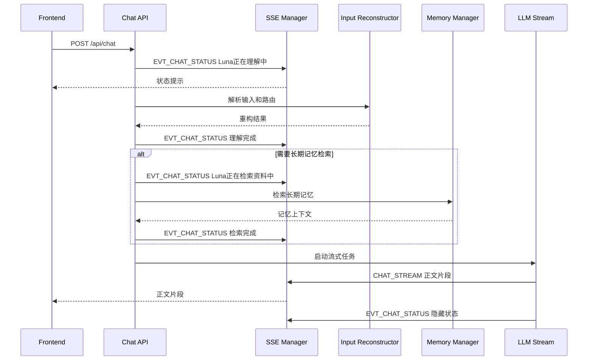

# Chat 主链路 SSE 状态通知后端方案

## 1. 现状分析

### 1.1 服务入口与 SSE 通道

当前后端服务入口在 [`backend/ai-service/app/main.py`](backend/ai-service/app/main.py)，其中 [`app.include_router()`](backend/ai-service/app/main.py:557) 已注册 [`sse_router`](backend/ai-service/app/main.py:43)，实际 SSE 端点由 [`notifications()`](backend/ai-service/app/api/sse.py:164) 暴露为 [`/sse/notifications`](backend/ai-service/app/api/sse.py:164)。

现有 SSE 管理器为 [`SSEManager`](backend/ai-service/app/api/sse.py:39)：

- [`register()`](backend/ai-service/app/api/sse.py:53) 为每个客户端创建独立队列。
- [`publish()`](backend/ai-service/app/api/sse.py:73) 将事件广播到所有客户端队列。
- [`event_generator()`](backend/ai-service/app/api/sse.py:106) 负责输出 SSE 协议数据，并每 5 秒发送 [`HEARTBEAT`](backend/ai-service/app/api/sse.py:149)。
- 当前输出格式为 [`event: <event_type>`](backend/ai-service/app/api/sse.py:142) 与 [`data: <json>`](backend/ai-service/app/api/sse.py:142)。

现有能力已经足够承载 chat 状态提示，但存在三个后端缺口：

1. [`SSEManager.publish()`](backend/ai-service/app/api/sse.py:73) 当前是全局广播，没有按 [`session_id`](backend/ai-service/app/api/http_api.py:93) 或 [`trace_id`](backend/ai-service/app/api/http_api.py:104) 定向。
2. 现有消息常量在 [`backend/ai-service/app/types/constants.py`](backend/ai-service/app/types/constants.py) 中没有 chat 状态事件类型。
3. 现有 chat 状态没有结构化 Pydantic 契约，只有 [`ChatStreamPayload`](backend/ai-service/app/api/http_api.py:69) 用于流式正文。

### 1.2 Chat 主链路

当前 chat 请求入口是 [`chat_request()`](backend/ai-service/app/api/http_api.py:298)，路径为 [`POST /api/chat`](backend/ai-service/app/api/http_api.py:298)。核心流程如下：

1. 校验 [`ChatRequestPayload`](backend/ai-service/app/api/http_api.py:91)。
2. 从 [`ChatHistoryRedisRepo.get_context()`](backend/ai-service/app/api/http_api.py:333) 加载短期上下文。
3. 组装 [`PromptCategory.INPUT_RECONSTRUCTION`](backend/ai-service/app/api/http_api.py:372) 相关 Prompt。
4. 调用 [`InputReconstructorAgent.process()`](backend/ai-service/app/agent/input_reconstructor.py:39) 做输入重构、理解、意图识别与检索路由。
5. 在 [`memory_manager.retrieve_and_format_memories()`](backend/ai-service/app/api/http_api.py:453) 处执行长期记忆 RAG 检索。
6. 组装 [`PromptCategory.CHAT`](backend/ai-service/app/api/http_api.py:477) 的最终 Chat Prompt。
7. 通过 [`asyncio.create_task()`](backend/ai-service/app/api/http_api.py:486) 启动 [`_execute_llm_stream()`](backend/ai-service/app/api/http_api.py:508)。
8. [`_execute_llm_stream()`](backend/ai-service/app/api/http_api.py:508) 使用 [`llm_client.stream_chat_with_context()`](backend/ai-service/app/api/http_api.py:548) 获取流式输出，并通过 [`_publish_sse_event()`](backend/ai-service/app/api/http_api.py:137) 发布 [`CHAT_STREAM`](backend/ai-service/app/types/constants.py:17)。

关键结论：输入重构和长期记忆 RAG 检索都发生在 [`chat_request()`](backend/ai-service/app/api/http_api.py:298) 内部，并且发生在 [`_execute_llm_stream()`](backend/ai-service/app/api/http_api.py:508) 启动之前。因此状态提示必须在 [`chat_request()`](backend/ai-service/app/api/http_api.py:298) 中发布，而不是只放在流式输出任务中。

### 1.3 RAG 检索现状

当前项目存在两套与 RAG 相关的检索路径：

1. Chat 主链路长期记忆检索：[`Manager.retrieve_and_format_memories()`](backend/ai-service/app/memory/manager.py:357) 委托 [`HybridRetriever.retrieve_and_format()`](backend/ai-service/app/rag/hybrid_retriever.py:466)，内部由 [`HybridRetriever.retrieve()`](backend/ai-service/app/rag/hybrid_retriever.py:396) 并行执行向量检索与 PG FTS 检索。
2. Phase 7 知识库检索 API：[`search_knowledge()`](backend/ai-service/app/api/routers/rag.py:135) 调用 [`RagRetrievalOrchestrator.search()`](backend/ai-service/app/rag/retrieval.py:91)，其中 [`RagEventPublisher`](backend/ai-service/app/rag/retrieval.py:50) 已能发布 [`EVT_RAG_THOUGHT`](backend/ai-service/app/types/constants.py:61) 和 [`EVT_RAG_CITATION`](backend/ai-service/app/types/constants.py:62)。

本方案以当前 chat 主链路为落地点，优先覆盖 [`chat_request()`](backend/ai-service/app/api/http_api.py:298) 到 [`Manager.retrieve_and_format_memories()`](backend/ai-service/app/memory/manager.py:357) 的长期记忆 RAG 状态提示；知识库检索已有 [`RagEventPublisher.publish_thought()`](backend/ai-service/app/rag/retrieval.py:58)，后续可复用同一状态事件模型做统一展示。

## 2. 目标设计

### 2.1 用户可见目标

当用户发送消息后，前端应在真实后端阶段变化时收到状态提示：

- 进入输入重构、理解、意图识别阶段时发送：`Luna正在理解中……`
- 进入长期记忆或知识检索阶段时发送：`Luna正在检索资料中……`
- LLM 流式正文开始后清理阶段状态，避免状态提示和正文气泡长期并存。

### 2.2 后端技术目标

1. 复用现有 [`/sse/notifications`](backend/ai-service/app/api/sse.py:164) 通道，不新增第二条 SSE 连接。
2. 新增独立事件类型，不混入 [`CHAT_STREAM`](backend/ai-service/app/types/constants.py:17)，避免破坏现有流式正文解析。
3. 所有事件包含 [`schema_version`](backend/ai-service/app/rag/types.py:38)、[`trace_id`](backend/ai-service/app/api/http_api.py:104)、[`session_id`](backend/ai-service/app/api/http_api.py:93)、[`message_id`](backend/ai-service/app/api/http_api.py:95) 与阶段枚举。
4. 阶段状态只反映后端真实执行阶段，不由前端猜测。
5. 状态事件失败不阻断 chat 主链路，保持提示能力可降级。

## 3. 接口设计

### 3.1 新增事件常量

建议在 [`backend/ai-service/app/types/constants.py`](backend/ai-service/app/types/constants.py) 新增：

```python
WS_MSG_TYPE_EVT_CHAT_STATUS = "EVT_CHAT_STATUS"
CHAT_STATUS_SCHEMA_VERSION = "chat_status.v1"
```

建议新增阶段枚举：

```python
class ChatStatusStage(str, Enum):
    INPUT_RECONSTRUCTION = "input_reconstruction"
    RAG_RETRIEVAL = "rag_retrieval"
    CHAT_PROMPT_ASSEMBLY = "chat_prompt_assembly"
    LLM_STREAMING = "llm_streaming"
```

建议新增状态枚举：

```python
class ChatStatusState(str, Enum):
    STARTED = "started"
    RUNNING = "running"
    COMPLETED = "completed"
    SKIPPED = "skipped"
    ERROR = "error"
    CANCELLED = "cancelled"
```

### 3.2 新增事件载荷契约

建议新增文件 [`backend/ai-service/app/api/chat_status.py`](backend/ai-service/app/api/chat_status.py)，集中放置 chat 状态事件契约与发布器。

```python
class ChatStatusEventPayload(BaseModel):
    schema_version: str = CHAT_STATUS_SCHEMA_VERSION
    session_id: str
    message_id: str
    stage: ChatStatusStage
    state: ChatStatusState
    display_text: str
    is_visible: bool = True
    is_terminal: bool = False
    sequence: int
    timestamp_ms: int
    error: str = ""
```

说明：

- [`session_id`](backend/ai-service/app/api/http_api.py:93) 用于前端多会话过滤。
- [`message_id`](backend/ai-service/app/api/http_api.py:95) 使用当前 assistant 占位消息 ID，也就是 [`user_msg_id`](backend/ai-service/app/api/http_api.py:327) 的实际值。
- [`trace_id`](backend/ai-service/app/api/http_api.py:301) 仍保持在 SSE 外层统一结构中，不重复放入 payload。
- [`sequence`](backend/ai-service/app/api/chat_status.py) 用于同一消息内状态去重和乱序保护。
- [`is_terminal`](backend/ai-service/app/api/chat_status.py) 表示该阶段状态可清理。

### 3.3 SSE 外层格式

仍沿用 [`_publish_sse_event()`](backend/ai-service/app/api/http_api.py:137) 与 [`SSEManager.publish()`](backend/ai-service/app/api/sse.py:73) 的结构：

```json
{
  "type": "EVT_CHAT_STATUS",
  "trace_id": "web-...",
  "payload": {
    "schema_version": "chat_status.v1",
    "session_id": "default-session",
    "message_id": "123456789",
    "stage": "input_reconstruction",
    "state": "running",
    "display_text": "Luna正在理解中……",
    "is_visible": true,
    "is_terminal": false,
    "sequence": 1,
    "timestamp_ms": 1760000000000,
    "error": ""
  }
}
```

对应 SSE 帧：

```text
event: EVT_CHAT_STATUS
data: {json}

```

## 4. 后端触发点设计

### 4.1 输入重构与理解阶段

触发位置：[`chat_request()`](backend/ai-service/app/api/http_api.py:298) 中调用 [`InputReconstructorAgent.process()`](backend/ai-service/app/agent/input_reconstructor.py:39) 之前，也就是当前源码 [`recon_result = await agent.process()`](backend/ai-service/app/api/http_api.py:415) 前。

推荐事件：

```python
await chat_status_publisher.publish(
    trace_id=trace_id,
    session_id=payload.sessionId,
    message_id=user_msg_id,
    stage=ChatStatusStage.INPUT_RECONSTRUCTION,
    state=ChatStatusState.RUNNING,
    display_text="Luna正在理解中……",
)
```

完成事件：在 [`InputReconstructorAgent.process()`](backend/ai-service/app/agent/input_reconstructor.py:39) 返回后，即 [`recon_data = recon_result.model_dump()`](backend/ai-service/app/api/http_api.py:422) 后发布 [`COMPLETED`](backend/ai-service/app/types/constants.py) 状态。若 [`except Exception`](backend/ai-service/app/api/http_api.py:441) 触发，则发布 [`ERROR`](backend/ai-service/app/types/constants.py) 或 [`SKIPPED`](backend/ai-service/app/types/constants.py)，但保持现有降级继续执行策略。

### 4.2 RAG 检索阶段

触发位置：[`chat_request()`](backend/ai-service/app/api/http_api.py:298) 中当前长期记忆检索分支 [`if memory_manager and long_term_memory_trigger:`](backend/ai-service/app/api/http_api.py:450) 内，在 [`memory_manager.retrieve_and_format_memories()`](backend/ai-service/app/api/http_api.py:453) 前发布。

推荐事件：

```python
await chat_status_publisher.publish(
    trace_id=trace_id,
    session_id=payload.sessionId,
    message_id=user_msg_id,
    stage=ChatStatusStage.RAG_RETRIEVAL,
    state=ChatStatusState.RUNNING,
    display_text="Luna正在检索资料中……",
)
```

完成事件：

- [`long_term_memory_text`](backend/ai-service/app/api/http_api.py:453) 成功返回后发布 [`COMPLETED`](backend/ai-service/app/types/constants.py)。
- [`long_term_memory_trigger`](backend/ai-service/app/api/http_api.py:429) 为 false 时可以不发布任何 RAG 状态；如果需要调试可发布 [`SKIPPED`](backend/ai-service/app/types/constants.py) 且 [`is_visible`](backend/ai-service/app/api/chat_status.py) 为 false。
- [`except Exception`](backend/ai-service/app/api/http_api.py:463) 捕获检索失败时发布 [`ERROR`](backend/ai-service/app/types/constants.py)，随后保持当前降级行为，将 [`LONG_TERM_MEMORY`](backend/ai-service/app/api/http_api.py:461) 置为空字符串。

### 4.3 流式输出阶段

触发位置：[`_execute_llm_stream()`](backend/ai-service/app/api/http_api.py:508) 内首次收到正文 chunk 时，即 [`if is_first_chunk and chunk_data.get("chunk"):`](backend/ai-service/app/api/http_api.py:559) 分支。

建议发送一个终止可见状态事件：

```python
await chat_status_publisher.publish(
    trace_id=trace_id,
    session_id=session_id,
    message_id=user_msg_id,
    stage=ChatStatusStage.LLM_STREAMING,
    state=ChatStatusState.RUNNING,
    display_text="",
    is_visible=False,
    is_terminal=True,
)
```

这样前端在正文开始后清理 `Luna正在理解中……` 或 `Luna正在检索资料中……`。

### 4.4 错误结束阶段

触发位置：[`_execute_llm_stream()`](backend/ai-service/app/api/http_api.py:508) 的 [`except Exception`](backend/ai-service/app/api/http_api.py:617) 与流式错误分支 [`if chunk_data.get("error"):`](backend/ai-service/app/api/http_api.py:555)。

建议发送：

```python
await chat_status_publisher.publish(
    trace_id=trace_id,
    session_id=session_id,
    message_id=user_msg_id,
    stage=ChatStatusStage.LLM_STREAMING,
    state=ChatStatusState.ERROR,
    display_text="Luna生成回复时遇到了问题",
    is_visible=False,
    is_terminal=True,
    error=str(e),
)
```

## 5. 推荐新增模块

### 5.1 [`backend/ai-service/app/api/chat_status.py`](backend/ai-service/app/api/chat_status.py)

职责：

- 定义 [`ChatStatusEventPayload`](backend/ai-service/app/api/chat_status.py)。
- 定义 [`ChatStatusPublisher`](backend/ai-service/app/api/chat_status.py)。
- 封装递增 [`sequence`](backend/ai-service/app/api/chat_status.py) 与 [`timestamp_ms`](backend/ai-service/app/api/chat_status.py)。
- 内部调用 [`sse_manager.publish()`](backend/ai-service/app/api/sse.py:73)。

推荐接口：

```python
class ChatStatusPublisher:
    async def publish(
        self,
        trace_id: str,
        session_id: str,
        message_id: str,
        stage: ChatStatusStage,
        state: ChatStatusState,
        display_text: str,
        is_visible: bool = True,
        is_terminal: bool = False,
        error: str = "",
    ) -> None:
        ...
```

### 5.2 是否改造 [`SSEManager`](backend/ai-service/app/api/sse.py:39)

MVP 阶段不强制改造 [`SSEManager`](backend/ai-service/app/api/sse.py:39) 的广播模型，只要求前端基于 [`trace_id`](backend/ai-service/app/api/http_api.py:104)、[`session_id`](backend/ai-service/app/api/http_api.py:93)、[`message_id`](backend/ai-service/app/api/http_api.py:95) 过滤。后续如出现多窗口或多客户端需求，再为 [`SSEManager.register()`](backend/ai-service/app/api/sse.py:53) 增加客户端标识和订阅过滤。

## 6. 关键流程



## 7. 与现有流式输出协同

1. 状态事件使用 [`EVT_CHAT_STATUS`](backend/ai-service/app/types/constants.py)，正文事件继续使用 [`CHAT_STREAM`](backend/ai-service/app/types/constants.py:17)。
2. [`_execute_llm_stream()`](backend/ai-service/app/api/http_api.py:508) 中现有 [`ChatStreamPayload`](backend/ai-service/app/api/http_api.py:69) 不必为状态提示扩字段。
3. 前端可以在收到首个 [`reply_chunk`](backend/ai-service/app/api/http_api.py:569) 或 [`is_finished`](backend/ai-service/app/api/http_api.py:589) 后清理状态。
4. 由于状态事件与正文事件共用 [`/sse/notifications`](backend/ai-service/app/api/sse.py:164)，同一连接内按队列投递顺序基本有序；前端仍应使用 [`sequence`](backend/ai-service/app/api/chat_status.py) 防乱序。

## 8. 异常处理

### 8.1 状态发布失败

[`ChatStatusPublisher`](backend/ai-service/app/api/chat_status.py) 捕获内部异常并记录中文日志，不向上抛出，不影响 [`chat_request()`](backend/ai-service/app/api/http_api.py:298)。这与当前 [`_publish_sse_event()`](backend/ai-service/app/api/http_api.py:137) 的降级策略一致。

### 8.2 输入重构失败

[`InputReconstructorAgent.process()`](backend/ai-service/app/agent/input_reconstructor.py:39) 内部已有重试与兜底返回 [`_build_fallback_response()`](backend/ai-service/app/agent/input_reconstructor.py:92)。状态策略为：

- 开始时发布可见 [`RUNNING`](backend/ai-service/app/types/constants.py)。
- 若彻底异常被 [`chat_request()`](backend/ai-service/app/api/http_api.py:441) 捕获，发布不可见或短暂可见 [`ERROR`](backend/ai-service/app/types/constants.py)，随后进入降级 chat。

### 8.3 RAG 检索失败

当前 [`memory_manager.retrieve_and_format_memories()`](backend/ai-service/app/api/http_api.py:453) 失败会被 [`except Exception`](backend/ai-service/app/api/http_api.py:463) 捕获并降级为空记忆。状态策略为：发布 [`ERROR`](backend/ai-service/app/types/constants.py) 且 [`is_terminal`](backend/ai-service/app/api/chat_status.py) 为 true，前端短暂展示后清理。

### 8.4 SSE 断线

现有 [`EventSource`](frontend/src/renderer/services/sseManager.ts:115) 会自动重连，后端 [`event_generator()`](backend/ai-service/app/api/sse.py:106) 无事件回放。MVP 不做历史状态补发，因为 chat 状态是瞬态提示。若用户断线期间错过状态，后续 [`CHAT_STREAM`](backend/ai-service/app/types/constants.py:17) 正文仍可继续推送给已重连客户端，但断线期间的正文也不会回放，这是现有 SSE 架构限制。

推荐后续增强：在 [`SSEManager`](backend/ai-service/app/api/sse.py:39) 中维护最近 N 条事件缓存，并使用 SSE [`id`](backend/ai-service/app/api/sse.py) 与 [`Last-Event-ID`](backend/ai-service/app/api/sse.py) 做轻量回放。

## 9. 请求取消与状态生命周期

当前后端没有真正的 chat 取消 HTTP 接口。前端枚举存在 [`CMD_CANCEL_TASK`](frontend/src/shared/enum.ts:46)，但 [`http_api.py`](backend/ai-service/app/api/http_api.py) 未实现对应路由。

建议新增 [`POST /api/chat/cancel`](backend/ai-service/app/api/http_api.py)，并新增 [`ChatTaskRegistry`](backend/ai-service/app/api/chat_tasks.py)：

- [`chat_request()`](backend/ai-service/app/api/http_api.py:298) 在创建 [`asyncio.create_task()`](backend/ai-service/app/api/http_api.py:486) 后登记 [`trace_id`](backend/ai-service/app/api/http_api.py:301)、[`session_id`](backend/ai-service/app/api/http_api.py:300)、[`message_id`](backend/ai-service/app/api/http_api.py:327) 与 task。
- 取消接口查找 task 并调用 [`task.cancel()`](backend/ai-service/app/api/chat_tasks.py)。
- 取消成功后发布 [`EVT_CHAT_STATUS`](backend/ai-service/app/types/constants.py) 且 [`state`](backend/ai-service/app/api/chat_status.py) 为 [`CANCELLED`](backend/ai-service/app/types/constants.py)。
- [`_execute_llm_stream()`](backend/ai-service/app/api/http_api.py:508) 捕获 [`asyncio.CancelledError`](backend/ai-service/app/api/http_api.py)，发送最终 [`CHAT_STREAM`](backend/ai-service/app/types/constants.py:17) 的 [`is_finished`](backend/ai-service/app/api/http_api.py:73) 和取消状态。

状态生命周期：

1. [`RUNNING`](backend/ai-service/app/types/constants.py)：阶段正在执行，前端展示。
2. [`COMPLETED`](backend/ai-service/app/types/constants.py)：阶段完成，前端可继续展示下一阶段或等待正文。
3. [`SKIPPED`](backend/ai-service/app/types/constants.py)：阶段未触发，默认不展示。
4. [`ERROR`](backend/ai-service/app/types/constants.py)：阶段失败，短暂展示或写入日志。
5. [`CANCELLED`](backend/ai-service/app/types/constants.py)：请求取消，立即清理状态并释放前端等待。
6. [`is_terminal`](backend/ai-service/app/api/chat_status.py) 为 true：前端清除该 [`message_id`](backend/ai-service/app/api/http_api.py:95) 的状态。

## 10. 多会话并发

当前 [`SSEManager.publish()`](backend/ai-service/app/api/sse.py:73) 广播给所有连接，且现有 [`CHAT_STREAM`](backend/ai-service/app/types/constants.py:17) payload 没有 [`session_id`](backend/ai-service/app/api/http_api.py:93)。对本状态方案建议：

1. [`EVT_CHAT_STATUS`](backend/ai-service/app/types/constants.py) 必须携带 [`session_id`](backend/ai-service/app/api/http_api.py:93) 与 [`message_id`](backend/ai-service/app/api/http_api.py:95)。
2. 前端只展示当前 [`currentSessionId`](frontend/src/renderer/stores/sessionStore.ts:66) 匹配的状态。
3. 前端按 [`message_id`](backend/ai-service/app/api/http_api.py:95) 维护状态表，避免不同消息互相覆盖。
4. 后续建议为 [`ChatStreamPayload`](backend/ai-service/app/api/http_api.py:69) 增补 [`session_id`](backend/ai-service/app/api/http_api.py:93)，否则多会话切换期间正文仍存在写入当前会话的风险。

## 11. 兼容性考虑

1. 新事件不改变 [`CHAT_STREAM`](backend/ai-service/app/types/constants.py:17) 结构，旧前端忽略未知事件即可继续运行。
2. 新事件通过 [`event: EVT_CHAT_STATUS`](backend/ai-service/app/api/sse.py:142) 发送；未实现监听的前端不会收到默认 [`onmessage`](frontend/src/renderer/services/sseManager.ts:200) 处理，因此不会误报未知类型。
3. 后端状态发布失败不影响 [`chat_request()`](backend/ai-service/app/api/http_api.py:298) 的主流程。
4. 如果 [`long_term_memory_trigger`](backend/ai-service/app/api/http_api.py:429) 为 false，不展示检索状态，避免用户感知到无意义阶段。

## 12. 实施步骤

1. 在 [`backend/ai-service/app/types/constants.py`](backend/ai-service/app/types/constants.py) 增加 [`WS_MSG_TYPE_EVT_CHAT_STATUS`](backend/ai-service/app/types/constants.py)、[`CHAT_STATUS_SCHEMA_VERSION`](backend/ai-service/app/types/constants.py)、[`ChatStatusStage`](backend/ai-service/app/types/constants.py) 与 [`ChatStatusState`](backend/ai-service/app/types/constants.py)。
2. 新增 [`backend/ai-service/app/api/chat_status.py`](backend/ai-service/app/api/chat_status.py)，实现 [`ChatStatusEventPayload`](backend/ai-service/app/api/chat_status.py) 与 [`ChatStatusPublisher`](backend/ai-service/app/api/chat_status.py)。
3. 在 [`chat_request()`](backend/ai-service/app/api/http_api.py:298) 调用 [`InputReconstructorAgent.process()`](backend/ai-service/app/agent/input_reconstructor.py:39) 前后发布理解阶段状态。
4. 在 [`chat_request()`](backend/ai-service/app/api/http_api.py:298) 调用 [`memory_manager.retrieve_and_format_memories()`](backend/ai-service/app/api/http_api.py:453) 前后发布检索阶段状态。
5. 在 [`_execute_llm_stream()`](backend/ai-service/app/api/http_api.py:508) 首个正文 chunk 与异常结束处发布状态清理事件。
6. 可选新增 [`backend/ai-service/app/api/chat_tasks.py`](backend/ai-service/app/api/chat_tasks.py) 与 [`POST /api/chat/cancel`](backend/ai-service/app/api/http_api.py)，处理请求取消。
7. 为状态发布增加单元测试与集成测试。

## 13. 测试方案

### 13.1 单元测试

新增或扩展 [`tests/backend/ai-service/tests`](tests/backend/ai-service/tests)：

- 测试 [`ChatStatusEventPayload`](backend/ai-service/app/api/chat_status.py) 校验必填字段、枚举字段与默认 [`schema_version`](backend/ai-service/app/api/chat_status.py)。
- 测试 [`ChatStatusPublisher.publish()`](backend/ai-service/app/api/chat_status.py) 生成递增 [`sequence`](backend/ai-service/app/api/chat_status.py)。
- Mock [`sse_manager.publish()`](backend/ai-service/app/api/sse.py:73)，验证事件外层 [`type`](backend/ai-service/app/types/constants.py) 为 [`EVT_CHAT_STATUS`](backend/ai-service/app/types/constants.py)。

### 13.2 Chat 主链路测试

在 [`tests/backend/ai-service/tests/test_layer6_main.py`](tests/backend/ai-service/tests/test_layer6_main.py) 或新增测试文件中覆盖：

1. 调用 [`POST /api/chat`](backend/ai-service/app/api/http_api.py:298) 后，先收到理解状态，再收到流式正文。
2. 当 [`long_term_memory_trigger`](backend/ai-service/app/api/http_api.py:429) 为 true 时，收到检索状态。
3. 当 [`memory_manager.retrieve_and_format_memories()`](backend/ai-service/app/memory/manager.py:357) 抛错时，收到检索错误状态且 chat 继续降级。
4. 当 [`InputReconstructorAgent.process()`](backend/ai-service/app/agent/input_reconstructor.py:39) 失败并兜底时，状态事件不会阻断请求。

### 13.3 SSE 集成测试

扩展 [`tests/backend/test_communication.py`](tests/backend/test_communication.py)：

- 建立 [`/sse/notifications`](backend/ai-service/app/api/sse.py:164) 连接。
- 调用 [`sse_manager.publish()`](backend/ai-service/app/api/sse.py:73) 发布 [`EVT_CHAT_STATUS`](backend/ai-service/app/types/constants.py)。
- 验证 SSE 帧包含 [`event: EVT_CHAT_STATUS`](backend/ai-service/app/api/sse.py:142) 与合法 JSON。

## 14. 推荐落地边界

MVP 只做 chat 状态提示，不改造完整调度状态机，不引入 Redis 持久化，不做 SSE 回放。这样能最小化影响现有 [`CHAT_STREAM`](backend/ai-service/app/types/constants.py:17) 与 [`_persist_interaction()`](backend/ai-service/app/api/http_api.py:649) 链路，同时为后续 DAG 状态事件统一化保留清晰入口。
