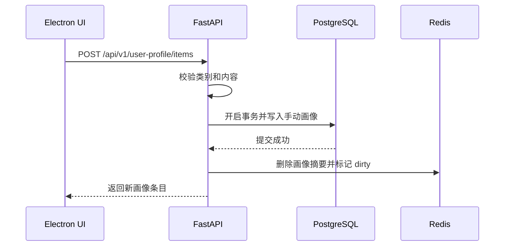
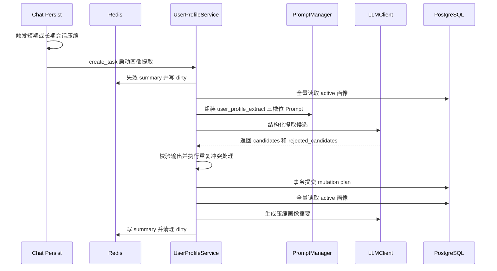

# 用户画像提取与注入功能 - 后端实施文档

## 1. 背景与目标

用户画像是 Luna 关系域记忆的一类稳定事实，用于描述用户本人长期相对稳定的特征、偏好与边界。它与长期记忆 RAG 的定位不同：长期记忆 RAG 面向历史会话摘要和语义召回，用户画像面向少量结构化事实的全量治理与压缩注入。

本功能需要在现有 Python 统一控制面内落地，严格遵守 [`agent.md`](../../../agent.md) 的边界要求：前端只做展示与用户输入，Python 后端负责画像提取、冲突处理、数据库提交、Redis 缓存生成和 Prompt 注入。

### 1.1 设计目标

1. 用户画像按类别结构化入库，支持外貌、性格、喜欢的东西、厌恶的东西、害怕的东西、期待的东西、癖好，并预留自定义类别。
2. 画像不进入 Qdrant，不走长期记忆 RAG 检索；需要处理画像时从 PostgreSQL 全量读取。
3. 聊天 Prompt 不每轮全量读取数据库，而是从 Redis 读取压缩后的画像摘要，并注入 [`backend/ai-service/app/prompt/simple/chat/memory.j2`](../../ai-service/app/prompt/simple/chat/memory.j2)。
4. 当长期会话压缩或短期会话压缩触发画像并行提取时，先失效 Redis 用户画像压缩缓存，确保后续重新生成。
5. 提取必须保守，禁止将假设、玩笑、反讽、敷衍、引用他人观点、角色扮演、临时情绪、虚构设定误提取为稳定画像。
6. 重复与冲突处理必须可审计，最终注入 Redis 的压缩画像只体现当前最新可信版本。

### 1.2 明确不做

1. 不把用户画像写入 Qdrant。
2. 不在聊天链路中每轮扫描数据库全量画像。
3. 不允许模型直接写数据库；模型只能输出候选与建议，提交由后端事务控制。
4. 不在前端保存画像真源；前端只通过 API 获取 Python 后端返回的视图数据。

## 2. 与现有模块的关系

| 模块 | 现状 | 本功能处理方式 |
| --- | --- | --- |
| 长期记忆 | [`backend/ai-service/app/memory/manager.py`](../../ai-service/app/memory/manager.py) 已负责会话压缩、长期记忆提交和 RAG 检索入口 | 复用其压缩触发时机，但新增画像并行任务，不复用 Qdrant 检索 |
| 短期会话压缩 | [`backend/ai-service/app/api/http_api.py`](../../ai-service/app/api/http_api.py) 中 `_trigger_compression` 负责窗口超限摘要 | 在同一触发点复制待压缩聊天片段，异步启动画像提取 |
| 长期会话压缩 | [`backend/ai-service/app/memory/manager.py`](../../ai-service/app/memory/manager.py) 中 `_compress_and_commit` 负责自然日/启动兜底压缩 | 在长期压缩上下文准备完成后异步启动画像提取 |
| Prompt 管理 | [`backend/ai-service/app/prompt/types.py`](../../ai-service/app/prompt/types.py) 目前包含 chat、short_summary、long_summary、input_reconstruction | 新增 user_profile_extract 与 user_profile_summarize 两类 Prompt |
| Chat Prompt 注入 | [`backend/ai-service/app/prompt/simple/chat/memory.j2`](../../ai-service/app/prompt/simple/chat/memory.j2) 已有 `{{USER_PROFILE}}` 插槽 | 聊天请求组装阶段从 Redis 读取压缩画像填入 `USER_PROFILE` |
| RAG | [`backend/ai-service/app/rag`](../../ai-service/app/rag) 管理知识库和长期记忆混合检索 | 不参与画像检索；可复用 embedding 服务做相似度判定，但不持久化向量 |
| API 风格 | [`backend/ai-service/app/api/routers/rag.py`](../../ai-service/app/api/routers/rag.py) 使用 `/api/v1`、TraceID、标准响应 | 新增 `/api/v1/user-profile` 路由，保持统一响应结构 |

## 3. 数据结构设计

### 3.1 枚举与常量

建议在 [`backend/ai-service/app/types/constants.py`](../../ai-service/app/types/constants.py) 中集中增加以下枚举，避免魔法字符串散落。

```python
class UserProfileCategory(str, Enum):
    APPEARANCE = "appearance"
    PERSONALITY = "personality"
    LIKES = "likes"
    DISLIKES = "dislikes"
    FEARS = "fears"
    EXPECTATIONS = "expectations"
    HABITS = "habits"
    CUSTOM = "custom"

class UserProfileSourceType(str, Enum):
    MANUAL = "manual"
    MODEL_EXTRACTED = "model_extracted"

class UserProfileStatus(str, Enum):
    ACTIVE = "active"
    SUPERSEDED = "superseded"
    DELETED = "deleted"
    REJECTED = "rejected"

class UserProfileCacheStatus(str, Enum):
    VALID = "valid"
    DIRTY = "dirty"
    MISSING = "missing"
    REBUILDING = "rebuilding"
    FAILED = "failed"
```

类别中文展示名由前端维护展示映射，但后端也应在响应中返回 `category_label`，便于错误提示和调试：

| category | 中文名 | 说明 |
| --- | --- | --- |
| appearance | 外貌 | 用户本人明确描述的外貌特征 |
| personality | 性格 | 稳定的性格、沟通偏好、行为倾向 |
| likes | 喜欢的东西 | 食物、风格、活动、作品等长期偏好 |
| dislikes | 厌恶的东西 | 不喜欢、忌口、反感的稳定对象 |
| fears | 害怕的东西 | 恐惧、回避对象 |
| expectations | 期待的东西 | 长期愿望、目标、期待被如何对待 |
| habits | 癖好 | 特殊习惯、偏执偏好、重复行为 |
| custom | 自定义 | 用户手动或后续扩展的类别 |

### 3.2 PostgreSQL 表设计

不建议复用 `long_term_memories` 表。原因：长期记忆记录以 `session_id + summary` 为核心，面向 RAG；用户画像需要类别、置信度、确认时间、来源、冲突链和软删除。复用会导致字段语义混乱。

#### 3.2.1 主表 `user_profile_items`

```sql
CREATE TABLE IF NOT EXISTS user_profile_items (
    id VARCHAR(64) PRIMARY KEY,
    user_id VARCHAR(64) NOT NULL DEFAULT 'local_default_user',
    category VARCHAR(32) NOT NULL,
    custom_category_name VARCHAR(64),
    content TEXT NOT NULL,
    normalized_content TEXT NOT NULL,
    source_type VARCHAR(32) NOT NULL,
    source_ref_type VARCHAR(32) NOT NULL,
    source_ref_id VARCHAR(64),
    source_excerpt TEXT,
    confidence NUMERIC(4, 3) NOT NULL DEFAULT 0.800,
    status VARCHAR(32) NOT NULL DEFAULT 'active',
    last_confirmed_at TIMESTAMPTZ,
    superseded_by_id VARCHAR(64),
    conflict_group_id VARCHAR(64),
    metadata JSONB NOT NULL DEFAULT '{}',
    created_at TIMESTAMPTZ NOT NULL DEFAULT NOW(),
    updated_at TIMESTAMPTZ NOT NULL DEFAULT NOW(),
    deleted_at TIMESTAMPTZ,
    CONSTRAINT chk_user_profile_confidence CHECK (confidence >= 0 AND confidence <= 1),
    CONSTRAINT chk_user_profile_custom_category CHECK (
        category <> 'custom' OR custom_category_name IS NOT NULL
    )
);
```

字段说明：

| 字段 | 必填 | 说明 |
| --- | --- | --- |
| id | 是 | 雪花 ID，使用 [`backend/ai-service/app/utils/snowflake.py`](../../ai-service/app/utils/snowflake.py) 生成 |
| user_id | 是 | 当前本地用户 ID；MVP 可固定为 `local_default_user`，后续接用户表 |
| category | 是 | 标准类别枚举或 `custom` |
| custom_category_name | 否 | 自定义类别名称，只有 `category=custom` 时必填 |
| content | 是 | 画像正文，必须是关于用户本人的稳定事实 |
| normalized_content | 是 | 归一化文本，用于重复检测 |
| source_type | 是 | `manual` 或 `model_extracted` |
| source_ref_type | 是 | `manual_input`、`interaction`、`session_compression`、`long_summary` |
| source_ref_id | 否 | 来源交互 ID、会话 ID 或压缩任务 ID |
| source_excerpt | 否 | 原文证据片段，模型提取时必须写入，手动录入可为空 |
| confidence | 是 | 置信度，手动录入默认 1.0，模型提取按规则赋值 |
| status | 是 | `active`、`superseded`、`deleted`、`rejected` |
| last_confirmed_at | 否 | 最近一次被重复确认或手动确认的时间 |
| superseded_by_id | 否 | 被新条目覆盖时指向新条目 |
| conflict_group_id | 否 | 同一冲突组的雪花 ID |
| metadata | 是 | 存储提取原因、模型名、相似度分数、拒绝原因等 |
| deleted_at | 否 | 软删除时间 |

#### 3.2.2 版本表 `user_profile_item_versions`

编辑、合并、冲突覆盖时需要保留历史版本，避免静默丢失。

```sql
CREATE TABLE IF NOT EXISTS user_profile_item_versions (
    id VARCHAR(64) PRIMARY KEY,
    profile_item_id VARCHAR(64) NOT NULL,
    user_id VARCHAR(64) NOT NULL DEFAULT 'local_default_user',
    version_num INTEGER NOT NULL,
    snapshot JSONB NOT NULL,
    change_reason TEXT NOT NULL,
    operator_type VARCHAR(32) NOT NULL,
    trace_id VARCHAR(64),
    created_at TIMESTAMPTZ NOT NULL DEFAULT NOW()
);
```

#### 3.2.3 冲突表 `user_profile_conflicts`

冲突不应只靠覆盖字段表达，建议记录显式冲突关系。

```sql
CREATE TABLE IF NOT EXISTS user_profile_conflicts (
    id VARCHAR(64) PRIMARY KEY,
    user_id VARCHAR(64) NOT NULL DEFAULT 'local_default_user',
    old_item_id VARCHAR(64) NOT NULL,
    new_item_id VARCHAR(64) NOT NULL,
    conflict_type VARCHAR(32) NOT NULL,
    resolution VARCHAR(32) NOT NULL,
    reason TEXT NOT NULL,
    trace_id VARCHAR(64),
    created_at TIMESTAMPTZ NOT NULL DEFAULT NOW()
);
```

#### 3.2.4 索引

```sql
CREATE INDEX IF NOT EXISTS idx_user_profile_user_category_status
ON user_profile_items(user_id, category, status);

CREATE INDEX IF NOT EXISTS idx_user_profile_user_updated
ON user_profile_items(user_id, updated_at DESC);

CREATE INDEX IF NOT EXISTS idx_user_profile_normalized
ON user_profile_items(user_id, category, normalized_content);

CREATE INDEX IF NOT EXISTS idx_user_profile_conflict_group
ON user_profile_items(user_id, conflict_group_id);

CREATE INDEX IF NOT EXISTS idx_user_profile_versions_item
ON user_profile_item_versions(profile_item_id, version_num DESC);
```

### 3.3 SQLAlchemy 模型

在 [`backend/ai-service/app/repository/models.py`](../../ai-service/app/repository/models.py) 新增 `UserProfileItem`、`UserProfileItemVersion`、`UserProfileConflict`。注意：所有类和关键字段注释必须使用中文，说明边界条件与异常行为。

### 3.4 仓库层

新增 [`backend/ai-service/app/repository/user_profile_pg.py`](../../ai-service/app/repository/user_profile_pg.py)，提供：

| 方法 | 说明 |
| --- | --- |
| `list_active_by_user(user_id)` | 全量读取该用户所有 active 画像 |
| `list_by_category(user_id, category)` | 按类别读取 active 画像 |
| `get_by_id(user_id, item_id)` | 按 ID 读取并做用户隔离 |
| `create_manual(item)` | 手动创建画像并写版本 |
| `update_manual(item_id, patch)` | 手动编辑画像并写版本 |
| `soft_delete(user_id, item_id)` | 标记 deleted 并写版本 |
| `apply_mutation_plan(plan)` | 在单个事务中应用模型提取后的新增、确认、覆盖、拒绝 |
| `record_conflict(conflict)` | 写冲突关系 |

仓库层必须保证所有变更在 PostgreSQL 事务中执行；任何写入成功后必须通知缓存层失效。

## 4. Redis Key 与缓存策略

### 4.1 Key 设计

| Key | 类型 | 说明 |
| --- | --- | --- |
| `luna:user_profile:{user_id}:summary:v1` | String | 压缩后的用户画像注入文本 |
| `luna:user_profile:{user_id}:summary_meta:v1` | Hash | `status`、`version`、`updated_at`、`source_item_count`、`last_error` |
| `luna:user_profile:{user_id}:dirty:v1` | String | 脏标记，值为 trace_id 或 reason |
| `luna:user_profile:{user_id}:lock:v1` | String | 画像提取、提交、摘要重建锁 |
| `luna:user_profile:{user_id}:task:{task_id}:v1` | Hash | 后台提取或摘要任务状态 |

### 4.2 缓存生成策略

1. 手动新增、编辑、删除画像后：提交数据库事务成功，再删除 `summary` 并写入 `dirty`。
2. 模型提取任务启动前：立即删除 `summary` 并写入 `dirty`，避免聊天期间继续使用旧画像。
3. 模型提取任务成功且有实质变更：重新全量读取 active 画像，调用画像摘要 Agent，写入 `summary` 与 `summary_meta`。
4. 模型提取任务成功但无变更：如果原 summary 存在且未脏，可保留；如果已经在任务开始时标脏，则需要重建或清理 dirty。
5. 聊天请求读取画像：只读 Redis `summary`；如果 miss 或 dirty，不阻塞聊天主链路，使用空画像或最近可用快照，并后台触发重建。

### 4.3 TTL

`summary` 默认不设置短 TTL，由数据库变更主动失效。`task` 可设置 24 小时 TTL，`lock` 设置 60 到 180 秒并在 finally 中释放。

### 4.4 降级规则

1. Redis 不可用：聊天跳过 `USER_PROFILE` 注入，记录中文 warning，不读 PG 阻塞聊天。
2. 摘要 Agent 失败：保留 `dirty`，写 `summary_meta.status=failed`，下次后台任务或手动刷新重试。
3. 数据库不可用：API 返回明确错误，提取任务失败并保留原 Redis 状态。

## 5. 后端服务分层

建议新增模块：

```text
backend/ai-service/app/user_profile/
├── __init__.py
├── schemas.py
├── service.py
├── extractor.py
├── summarizer.py
├── conflict_resolver.py
└── cache.py
```

| 文件 | 职责 |
| --- | --- |
| `schemas.py` | Pydantic 请求、响应、模型输出结构 |
| `service.py` | 画像 CRUD、提取任务编排、缓存重建入口 |
| `extractor.py` | 组装提取 Prompt 并调用 LLM 结构化输出 |
| `summarizer.py` | 读取 active 条目并生成 Redis 注入摘要 |
| `conflict_resolver.py` | 重复检测、冲突检测、生成变更计划 |
| `cache.py` | Redis key 读写、失效、锁、任务状态 |

## 6. Prompt 文件设计

### 6.1 PromptCategory 扩展

在 [`backend/ai-service/app/prompt/types.py`](../../ai-service/app/prompt/types.py) 中新增：

```python
USER_PROFILE_EXTRACT = "user_profile_extract"
USER_PROFILE_SUMMARIZE = "user_profile_summarize"
```

### 6.2 三槽位提取提示词

新增目录：[`backend/ai-service/app/prompt/simple/user_profile_extract`](../../ai-service/app/prompt/simple/user_profile_extract)。

#### `system.j2`

核心职责：定义 Luna 的画像提取边界和拒绝原则。

必须包含：

1. 你只提取用户本人的稳定画像事实。
2. 不确定时宁可不提取。
3. 禁止提取假设、玩笑、反讽、敷衍、引用他人观点、角色扮演、虚构设定、临时情绪。
4. 只输出 JSON，不输出解释性自然语言。
5. 所有候选必须带证据片段、置信度、拒绝风险说明。

#### `memory.j2`

核心职责：注入当前数据库已有画像，供提取模型做去重和冲突参考。

变量建议：

| 变量 | 说明 |
| --- | --- |
| `EXISTING_USER_PROFILES` | 当前用户全部 active 画像，按类别分组 |
| `CATEGORY_DEFINITIONS` | 类别定义和可选值 |
| `EXTRACTION_REJECTION_RULES` | 拒绝提取规则摘要 |

注意：这里的 existing profiles 来自 PostgreSQL 全量读取，不来自 RAG。

#### `runtime.j2`

核心职责：注入本次压缩批次的聊天记录和输出 Schema。

变量建议：

| 变量 | 说明 |
| --- | --- |
| `SESSION_ID` | 来源会话 ID |
| `MESSAGES_TEXT` | 待分析聊天记录 |
| `CURRENT_TIME` | 当前时间 |
| `OUTPUT_SCHEMA` | JSON 输出结构 |

### 6.3 摘要提示词

新增目录：[`backend/ai-service/app/prompt/simple/user_profile_summarize`](../../ai-service/app/prompt/simple/user_profile_summarize)。

摘要目标：将全量 active 画像按类别压缩成适合注入 [`backend/ai-service/app/prompt/simple/chat/memory.j2`](../../ai-service/app/prompt/simple/chat/memory.j2) 的短文本。

摘要原则：

1. 只包含 active 且置信度不低于阈值的当前版本。
2. 按类别输出，避免散文式过度发挥。
3. 不暴露来源原文，不输出数据库 ID。
4. 不使用绝对化语气描述低置信内容。
5. 总长度建议限制在 800 到 1200 中文字符内。

推荐输出格式：

```text
【外貌】...
【性格】...
【喜欢的东西】...
【厌恶的东西】...
【害怕的东西】...
【期待的东西】...
【癖好】...
```

## 7. 模型输出结构与校验

### 7.1 提取输出 Schema

```json
{
  "schema_version": "user_profile.extract.v1",
  "session_id": "20260607",
  "candidates": [
    {
      "category": "likes",
      "custom_category_name": null,
      "content": "用户喜欢无糖咖啡",
      "evidence": "我平时只喝无糖咖啡",
      "confidence": 0.92,
      "source_risk_flags": [],
      "reasoning": "用户以第一人称直接陈述长期偏好"
    }
  ],
  "rejected_candidates": [
    {
      "raw_claim": "用户超喜欢吃辣",
      "evidence": "对对对，我超喜欢吃辣，行了吧",
      "reject_reason": "语气可能为无奈敷衍或反讽，不满足稳定事实要求"
    }
  ]
}
```

### 7.2 校验规则

后端 Pydantic 校验必须执行：

1. `schema_version` 必须等于 `user_profile.extract.v1`。
2. `category` 必须为枚举；`custom` 必须提供 `custom_category_name`。
3. `content` 长度建议 4 到 200 字，不能为空，不能包含“可能”“也许”“似乎”等不确定表达作为事实主体。
4. `evidence` 必须来自输入聊天记录，长度建议 4 到 300 字。
5. `confidence` 必须在 0 到 1。
6. `source_risk_flags` 包含高风险标记时，置信度必须低于 0.6，默认不入库。
7. 候选数量过多时截断并记录异常，防止模型发散。

### 7.3 置信度规则

| 置信度区间 | 来源特征 | 处理 |
| --- | --- | --- |
| 0.90 到 1.00 | 用户第一人称明确、非玩笑、非角色扮演、稳定偏好或事实 | 可自动进入冲突检测 |
| 0.75 到 0.89 | 明确但缺少稳定性上下文，或只出现一次但语气可靠 | 可进入冲突检测，必要时降低权重 |
| 0.60 到 0.74 | 有一定依据但存在歧义 | 默认不自动入库，可进入 rejected 或待确认 |
| 小于 0.60 | 假设、玩笑、反讽、临时情绪、转述、角色扮演等风险 | 禁止入库 |

手动录入默认 `confidence=1.0`，`source_type=manual`，`last_confirmed_at=now`。

### 7.4 拒绝提取规则

必须拒绝或标低置信的情况：

1. 假设：例如“如果我是猫，我会喜欢晒太阳”。
2. 玩笑：例如“我可能是宇宙第一懒人”。
3. 反讽或敷衍：例如“对对对，我超喜欢吃辣，行了吧”。
4. 引用他人：例如“我朋友说他喜欢恐怖片”。
5. 角色扮演：例如“设定里我是吸血鬼”。
6. 临时情绪：例如“我今天烦死咖啡了”。
7. 非用户本人：例如描述 Luna、朋友、影视角色。
8. 虚构设定：例如小说创作、游戏角色卡中的信息。
9. 缺少证据：模型无法定位到原始聊天片段。

## 8. 重复检测与冲突处理

### 8.1 每次提取前全量查询

每次模型提取新候选前，必须从 PostgreSQL 全量读取该用户 active 画像，按类别注入提取 Prompt，并在后端冲突处理阶段再次使用这些记录进行比对。

### 8.2 推荐重复检测方案

采用三层组合，不引入复杂新架构：

1. 字符串规则层：统一去标点、空格、大小写、同义轻量归一，计算完全相等和包含关系。
2. 文本相似层：使用 Python 标准库 `difflib.SequenceMatcher` 或已有 embedding 服务计算语义相似度。
3. Agent 判定层：只对 0.82 到 0.95 的灰区或跨表述冲突调用模型判定。

推荐阈值：

| 情况 | 阈值 | 动作 |
| --- | --- | --- |
| 同类别 normalized 完全一致 | 1.00 | 不新增，更新 `last_confirmed_at` 和来源 metadata |
| 同类别相似度 >= 0.95 | 高度重复 | 不新增，可合并来源 |
| 同类别相似度 0.82 到 0.95 | 疑似重复 | 调用 Agent 判定 `skip`、`confirm`、`merge`、`add` |
| 相似度 < 0.82 | 新信息 | 继续冲突检测后可新增 |

### 8.3 冲突处理策略

冲突示例：旧画像“用户喜欢吃辣”，新画像“用户现在不吃辣”。

处理规则：

1. 优先采用最新、明确、置信度更高的信息。
2. 不物理删除旧数据。
3. 旧 active 条目标记为 `superseded`，`superseded_by_id` 指向新条目。
4. 新条目插入为 active，并与旧条目共享 `conflict_group_id`。
5. 写入 `user_profile_conflicts`，记录原因、trace_id、处理策略。
6. Redis 摘要只包含新 active 条目，不包含 superseded 旧条目。

### 8.4 MutationPlan

冲突处理器输出内部变更计划：

```json
{
  "schema_version": "user_profile.mutation.v1",
  "mutations": [
    {
      "action": "add",
      "candidate": {},
      "target_item_id": null,
      "reason": "新画像"
    },
    {
      "action": "confirm_existing",
      "candidate": {},
      "target_item_id": "123",
      "reason": "重复确认"
    },
    {
      "action": "supersede",
      "candidate": {},
      "target_item_id": "456",
      "reason": "用户给出更新偏好"
    },
    {
      "action": "reject",
      "candidate": {},
      "target_item_id": null,
      "reason": "疑似反讽"
    }
  ]
}
```

## 9. 任务流程

### 9.1 手动录入流程



### 9.2 压缩触发并行提取流程



### 9.3 聊天注入流程

在 [`backend/ai-service/app/api/http_api.py`](../../ai-service/app/api/http_api.py) 组装 Chat Prompt 变量时新增：

1. 读取当前 `user_id`。
2. 调用 `UserProfileCache.get_summary(user_id)`。
3. 命中且非 dirty：写入 `prompt_variables["USER_PROFILE"]`。
4. miss 或 dirty：写入空字符串，同时后台触发 `rebuild_summary_if_needed`。
5. 不因画像缓存失败阻塞聊天流式响应。

## 10. API 设计

统一前缀：`/api/v1/user-profile`。所有接口必须支持 `X-Trace-ID`，响应结构遵循项目标准 `code/msg/data/trace_id`。

### 10.1 获取全部画像

`GET /api/v1/user-profile/items`

Query：

| 参数 | 说明 |
| --- | --- |
| category | 可选，按类别过滤 |
| include_inactive | 可选，默认 false |

Response data：

```json
{
  "schema_version": "user_profile.v1",
  "items": [],
  "grouped": {
    "likes": []
  },
  "total": 0,
  "cache_status": "valid"
}
```

### 10.2 按类别获取画像

`GET /api/v1/user-profile/categories/{category}/items`

用于前端局部刷新类别分区。`category=custom` 时可额外传 `custom_category_name`。

### 10.3 新增手动画像

`POST /api/v1/user-profile/items`

Request：

```json
{
  "schema_version": "user_profile.v1",
  "category": "likes",
  "custom_category_name": null,
  "content": "用户喜欢无糖咖啡",
  "idempotency_key": "web-123"
}
```

规则：

1. `content` 必须去空格后非空，长度限制 4 到 200 字。
2. 手动录入默认为 active、confidence 1.0。
3. 后端仍需做重复检测，避免用户连续点击造成重复。
4. 支持 `Idempotency-Key` Header 或 body 字段，防止重复提交。

### 10.4 编辑画像

`PUT /api/v1/user-profile/items/{item_id}`

Request：

```json
{
  "schema_version": "user_profile.v1",
  "category": "dislikes",
  "custom_category_name": null,
  "content": "用户不喜欢香菜"
}
```

规则：

1. 只能编辑当前用户的 active 条目。
2. 编辑必须写入版本表。
3. 提交成功后失效 Redis 摘要。

### 10.5 删除画像

`DELETE /api/v1/user-profile/items/{item_id}`

规则：软删除，写版本记录，失效缓存。重复删除必须幂等：如果已删除则返回成功但标记 `already_deleted=true`。

### 10.6 查询缓存状态

`GET /api/v1/user-profile/cache/status`

Response：

```json
{
  "schema_version": "user_profile.cache.v1",
  "status": "valid",
  "updated_at": "2026-06-07T23:00:00+08:00",
  "source_item_count": 12,
  "summary_length": 320,
  "last_error": ""
}
```

### 10.7 触发缓存重建

`POST /api/v1/user-profile/cache/rebuild`

用途：前端手动刷新压缩画像。后端应立即返回任务 ID，不阻塞 UI。

### 10.8 触发提取任务

`POST /api/v1/user-profile/extraction/tasks`

MVP 可仅用于调试面板或手动补偿，生产主要由压缩流程触发。

## 11. 权限、用户隔离与错误码

### 11.1 用户隔离

MVP 本地个人使用可使用固定 `local_default_user`。后续如果接入用户系统，必须由后端认证上下文解析 `user_id`，禁止前端在请求体中指定任意 `user_id`。

### 11.2 权限

1. 本地用户可读写自己的画像。
2. 模型提取任务只能写入当前用户画像。
3. 删除和编辑必须经过 API 层用户隔离校验。
4. 不新增企业级 RBAC。

### 11.3 错误码建议

| code | msg | 场景 |
| --- | --- | --- |
| 0 | success | 成功 |
| 2400 | 用户画像参数无效 | 类别、内容、schema_version 非法 |
| 2401 | 用户画像不存在 | item_id 不存在或不属于当前用户 |
| 2402 | 用户画像重复 | 手动新增命中重复且无法合并 |
| 2403 | 用户画像缓存重建中 | 已有同用户重建任务 |
| 2404 | 用户画像提取失败 | LLM 或校验失败 |
| 2405 | 用户画像冲突处理失败 | mutation plan 无法提交 |

## 12. 幂等性与事务处理

1. 手动新增：使用 `Idempotency-Key` 加 `user_id` 做短期 Redis 幂等记录，或在数据库 metadata 中记录最近提交键。
2. 编辑：同一内容重复提交返回当前条目，不重复写版本。
3. 删除：重复删除返回成功。
4. 提取任务：同一 `session_id + source_hash` 已成功处理则跳过。
5. 事务边界：重复检测结果到 mutation plan 提交必须在同一用户锁下执行，提交时重新读取目标记录状态，避免竞态。

## 13. 异步任务、重试与日志

### 13.1 启动方式

短期压缩 `_trigger_compression` 与长期压缩 `_compress_and_commit` 中，在构造 `messages_text` 后调用：

```python
asyncio.create_task(user_profile_service.extract_from_messages(...))
```

任务必须捕获所有异常，不能影响压缩和聊天主流程。

### 13.2 生命周期

| 项 | 策略 |
| --- | --- |
| 创建者 | 压缩流程或 API 手动触发 |
| 取消 | 应用关闭时由事件循环统一取消，任务内部捕获取消并记录 |
| 超时 | 单次 LLM 提取 30 秒，摘要 30 秒，总任务 90 秒 |
| 重试 | LLM 调用最多重试 2 次，结构校验失败最多重试 1 次 |
| 回收 | task key TTL 24 小时 |
| 降级 | 失败只影响画像更新，不阻塞聊天与长期记忆 |

### 13.3 日志字段

所有日志必须中文，并至少包含：`trace_id`、`task_id`、`session_id`、`user_id`、`latency_ms`、`retry_count`、`mutation_count`。敏感证据片段不得完整写入普通日志，可写长度和哈希。

## 14. 迁移步骤

1. 新增 ORM 模型与仓库。
2. 新增迁移脚本，创建三张表和索引。
3. 新增常量枚举和错误码。
4. 新增 PromptCategory 与 simple prompt 文件。
5. 新增用户画像服务模块和 Redis 缓存模块。
6. 在 FastAPI app 初始化时挂载 `user_profile_repo`、`user_profile_service`。
7. 新增 `/api/v1/user-profile` 路由。
8. 在短期压缩与长期压缩触发点接入异步提取。
9. 在 Chat Prompt 组装阶段填充 `USER_PROFILE`。
10. 补充测试并执行回归。

## 15. 测试方案

### 15.1 单元测试

| 测试项 | 重点 |
| --- | --- |
| Pydantic Schema | 类别、置信度、长度、schema_version 校验 |
| 归一化函数 | 标点、空格、同义轻量归一 |
| 重复检测 | 完全重复、高相似、低相似 |
| 冲突处理 | supersede 旧条目、写 conflict、只保留新 active |
| 缓存模块 | miss、dirty、valid、failed、lock 释放 |
| Prompt 渲染 | 三槽位变量完整替换，无残留占位符 |

### 15.2 集成测试

1. 手动新增画像后 PostgreSQL 有记录，Redis summary 被失效。
2. 手动编辑画像后版本表新增快照。
3. 删除画像后 status 为 deleted，前端列表不显示。
4. 压缩触发画像提取，提取失败不影响短期摘要更新。
5. 提取重复画像只更新 `last_confirmed_at`，不新增重复行。
6. 提取冲突画像后旧条目 superseded，新条目 active。
7. 缓存重建后 Chat Prompt 中 `USER_PROFILE` 被正确注入。

### 15.3 提示词安全测试

必须构造以下输入并验证不入库：

1. “对对对，我超喜欢吃辣，行了吧”。
2. “如果我是猫，我一定喜欢晒太阳”。
3. “我朋友特别害怕蜘蛛”。
4. “角色设定里我讨厌阳光”。
5. “今天气死了，我再也不喝咖啡”。
6. “哈哈我就是世界第一懒狗”。

必须构造以下输入并验证可入库：

1. “我一直不吃香菜，点外卖也会备注不要香菜”。
2. “我平时只喝无糖咖啡”。
3. “我比较怕很密集的小孔图案”。
4. “我希望你以后提醒我时直接一点”。

### 15.4 端到端测试

1. 前端侧栏新增画像，刷新后仍展示。
2. 新增画像后触发缓存重建，下一轮聊天 Prompt 包含压缩画像。
3. 删除画像后缓存失效，下一轮聊天不再体现该画像。
4. 触发长期会话压缩后，画像后台提取任务不阻塞聊天。

## 16. 复用与新建清单

### 16.1 复用

1. 复用 [`backend/ai-service/app/prompt/manager.py`](../../ai-service/app/prompt/manager.py) 的三槽位 Prompt 组装。
2. 复用 [`backend/ai-service/app/utils/snowflake.py`](../../ai-service/app/utils/snowflake.py) 生成 ID。
3. 复用 [`backend/ai-service/app/infrastructure/postgres.py`](../../ai-service/app/infrastructure/postgres.py) 与 [`backend/ai-service/app/infrastructure/redis.py`](../../ai-service/app/infrastructure/redis.py)。
4. 复用现有短期和长期压缩触发点。
5. 可复用现有 LLM client 的结构化输出能力。

### 16.2 新建

1. `user_profile_items`、`user_profile_item_versions`、`user_profile_conflicts`。
2. `user_profile_pg.py` 仓库。
3. `app/user_profile` 服务目录。
4. `api/routers/user_profile.py` 路由。
5. `simple/user_profile_extract` 与 `simple/user_profile_summarize` Prompt。
6. 用户画像 Redis cache 封装。

## 17. 落地 Todo

- [ ] 新增用户画像常量、错误码与 Pydantic Schema。
- [ ] 新增 PostgreSQL 表、ORM 模型、迁移脚本与索引。
- [ ] 新增仓库层并覆盖 CRUD、版本、冲突记录。
- [ ] 新增 Redis cache 模块，支持读取、失效、重建状态、锁。
- [ ] 新增提取 Agent 和摘要 Agent 的三槽位 Prompt 文件。
- [ ] 新增重复检测与冲突处理器。
- [ ] 新增用户画像服务层，串联提取、提交、缓存重建。
- [ ] 新增 FastAPI 路由和标准响应。
- [ ] 在短期压缩与长期压缩流程中接入异步提取。
- [ ] 在聊天 Prompt 组装流程中读取 Redis 压缩画像并注入 `USER_PROFILE`。
- [ ] 完成单元、集成、端到端和提示词安全测试。
