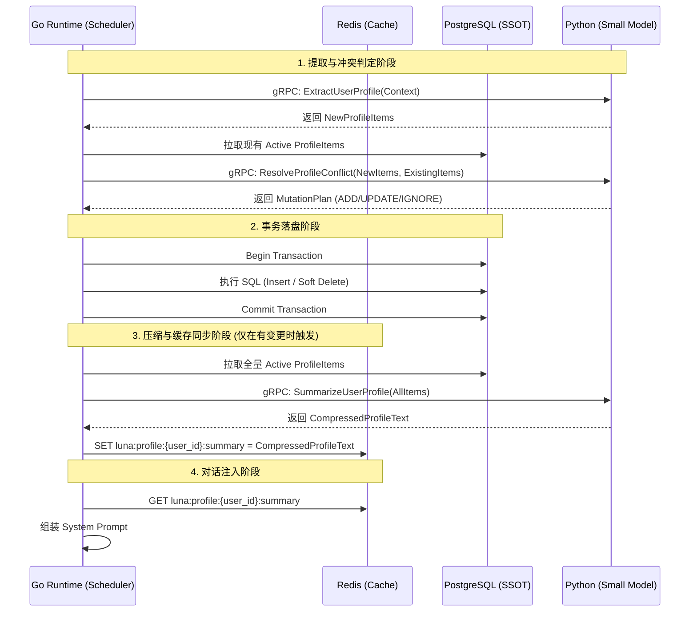

# 用户画像（User Profile）模块 - 后端架构设计与实施方案

## 1. 系统整体上下文与设计目标描述

### 1.1 业务上下文
在 Luna 桌面 AI 助理的记忆系统中，用户画像（User Profile）是关系域（Relationship Domain）的核心组成部分。它负责从日常对话中提取、沉淀并维护关于用户的结构化事实（如性格、爱好、厌恶等）。与海量的历史聊天记录不同，用户画像数据量小、维度固定，但对 AI 的回复风格和决策逻辑有直接且全局的影响。

### 1.2 设计目标
*   **结构化分类**：将用户画像标准化为固定的分类维度，便于管理和展示。
*   **无感提取与冲突消解**：在记忆压缩的生命周期中，利用 Small Model 自动提取画像信息，并与数据库中已有数据进行比对，智能处理重复与冲突。
*   **去向量化与全量注入**：鉴于画像数据条数少，弃用向量数据库检索。采用“全量压缩 -> Redis 缓存 -> Prompt 直接注入”的高效策略，降低系统复杂度并提升响应速度。
*   **强一致性控制**：Go Runtime 依然作为唯一调度权威，控制数据库事务与 Redis 缓存的同步更新。

## 2. 核心工作流设计

### 2.1 触发与信息提取工作流
1.  **触发时机**：依附于短期记忆压缩（如 Token 达到阈值触发的后台摘要）或长期记忆压缩（自然日流转触发的会话压缩）流程。
2.  **上下文准备**：Go Runtime 提取**当日 Redis 中需要生成短期记忆、长期记忆摘要的聊天记录数据**作为分析来源。
3.  **AI 提取**：Go 通过 gRPC 调用 Python 侧的 `ExtractUserProfile` 接口。Python 侧唤醒 Small Model，专项分析这些聊天记录数据中是否包含属于预定义分类（性格、爱好、厌恶、生日、联系方式、外貌等）的用户信息。
4.  **结构化输出**：Small Model 输出提取到的画像条目列表（包含分类、具体内容、提取依据）。

### 2.2 冲突判定与入库逻辑 (Conflict Resolution & Commit)
1.  **预检与比对**：Go Runtime 接收到提取的画像条目后，从 PostgreSQL 中拉取该用户当前所有 `ACTIVE` 状态的画像数据。
2.  **AI 冲突分析**：Go 将新提取的条目与已有数据再次发送给 Python 侧的 `ResolveProfileConflict` 接口。Small Model 进行逻辑比对，输出每个新条目的处理策略：
    *   **IGNORE (忽略)**：新条目与已有数据语义重复。
    *   **ADD (新增)**：新条目是全新的信息。
    *   **UPDATE (更新)**：新条目与已有数据存在冲突（如“以前喜欢吃辣，现在不吃了”），需废弃旧数据，插入新数据。
3.  **事务落盘**：Go Runtime 开启 PG 事务，根据策略执行 SQL（Insert / Soft Delete）。

### 2.3 压缩与状态同步工作流 (Profile Summarization)
1.  **触发时机**：当 PostgreSQL 中的用户画像表发生任何实质性变更（ADD 或 UPDATE 成功提交）后触发。
2.  **全量拉取**：Go Runtime 从 PG 中拉取该用户所有 `ACTIVE` 状态的画像数据。
3.  **AI 综合压缩**：Go 调用 Python 侧的 `SummarizeUserProfile` 接口。Small Model 将这些离散的条目融合成一段连贯、精炼的“压缩版综合用户画像”文本（例如：“用户是一个性格开朗的程序员，喜欢科幻电影，讨厌吃香菜，生日是10月24日...”）。
4.  **Redis 缓存覆盖**：Go Runtime 将生成的压缩版文本覆盖写入 Redis 中指定的 Key。

### 2.4 Prompt 注入工作流
1.  **对话请求到达**：用户发起新对话。
2.  **缓存读取**：Go Runtime 在构建系统 Prompt 时，直接从 Redis 读取“压缩版综合用户画像”。
3.  **全量注入**：将该文本无缝拼接到 System Prompt 的特定插槽中（如 `<user_profile>...</user_profile>`），下发给大模型进行推理。

## 3. 存储与缓存结构规划

### 3.1 关系型存储 (PostgreSQL) - 结构化画像条目
负责存储离散的、结构化的画像事实，支持版本控制与软删除。

**表结构设计 (`user_profile`)**：
*   `id` (VARCHAR(64), Primary Key): 雪花算法生成的唯一 ID。
*   `user_id` (VARCHAR(64)): 用户标识。
*   `category` (VARCHAR(50)): 画像分类，枚举值：
    *   `PERSONALITY` (性格)
    *   `HOBBIES` (爱好)
    *   `DISLIKES` (厌恶)
    *   `BIRTHDAY` (生日)
    *   `CONTACT_INFO` (联系方式)
    *   `APPEARANCE` (外貌)
    *   `OTHER` (其他)
*   `content` (TEXT): 具体的事实描述（如“喜欢喝无糖美式”）。
*   `source_context` (TEXT): 提取该事实的原始对话上下文（用于审计）。
*   `status` (VARCHAR(20)): 状态，枚举值 `ACTIVE` (生效中), `DELETED` (软删除/被覆盖)。
*   `created_at` (TIMESTAMP): 创建时间。
*   `updated_at` (TIMESTAMP): 更新时间。

### 3.2 缓存存储 (Redis) - 压缩版综合画像
用于对话时的高频读取，极速注入 Prompt。

**Redis Key 设计**：
*   **Key**: `luna:profile:{user_id}:summary` (String 类型)
*   **Value**: Small Model 生成的“压缩版综合用户画像”纯文本。
*   **TTL**: 永不过期（或设置极长过期时间，由 PG 变更事件主动覆盖刷新）。

## 4. 交互链路与数据流转



## 5. 核心 API 接口规范

### 5.1 gRPC 接口 (Go -> Python)
定义在 `backend/shared/proto/communication.proto` 中。

```protobuf
// 1. 提取用户画像请求
message ExtractUserProfileRequest {
  string context = 1; // summary + history
}

message ProfileItem {
  string id = 1; // 现有条目有 ID，新提取的为空
  string category = 2;
  string content = 3;
}

message ExtractUserProfileResponse {
  repeated ProfileItem items = 1;
}

// 2. 冲突判定请求
message ResolveProfileConflictRequest {
  repeated ProfileItem new_items = 1;
  repeated ProfileItem existing_items = 2;
}

message ProfileMutation {
  string action = 1; // ADD, UPDATE, IGNORE
  string target_id = 2; // UPDATE 时指向被覆盖的旧记录 ID
  ProfileItem item = 3; // 新的或更新后的条目内容
}

message ResolveProfileConflictResponse {
  repeated ProfileMutation mutations = 1;
}

// 3. 综合压缩请求
message SummarizeUserProfileRequest {
  repeated ProfileItem all_active_items = 1;
}

message SummarizeUserProfileResponse {
  string compressed_summary = 1;
}
```

## 6. 异常处理与兜底机制

*   **Small Model 提取失败/超时**：若 `ExtractUserProfile` 或 `ResolveProfileConflict` 失败，Go Runtime 记录 Error Log 并跳过本次画像更新，不阻塞主记忆压缩流程。
*   **Redis 缓存丢失**：若 Redis 宕机重启导致 `luna:profile:{user_id}:summary` 丢失，Go Runtime 在构建 Prompt 时若发现 Cache Miss，应同步触发一次 `SummarizeUserProfile` 流程，从 PG 拉取全量数据重新生成并回写 Redis。
*   **并发更新冲突**：若多个会话并发触发画像更新，Go Runtime 在执行 PG 事务前需获取基于 `user_id` 的分布式锁（Redis Mutex），确保“拉取现有数据 -> 冲突判定 -> 落盘 -> 重新压缩”的流程是串行执行的，防止数据覆盖与状态不一致。