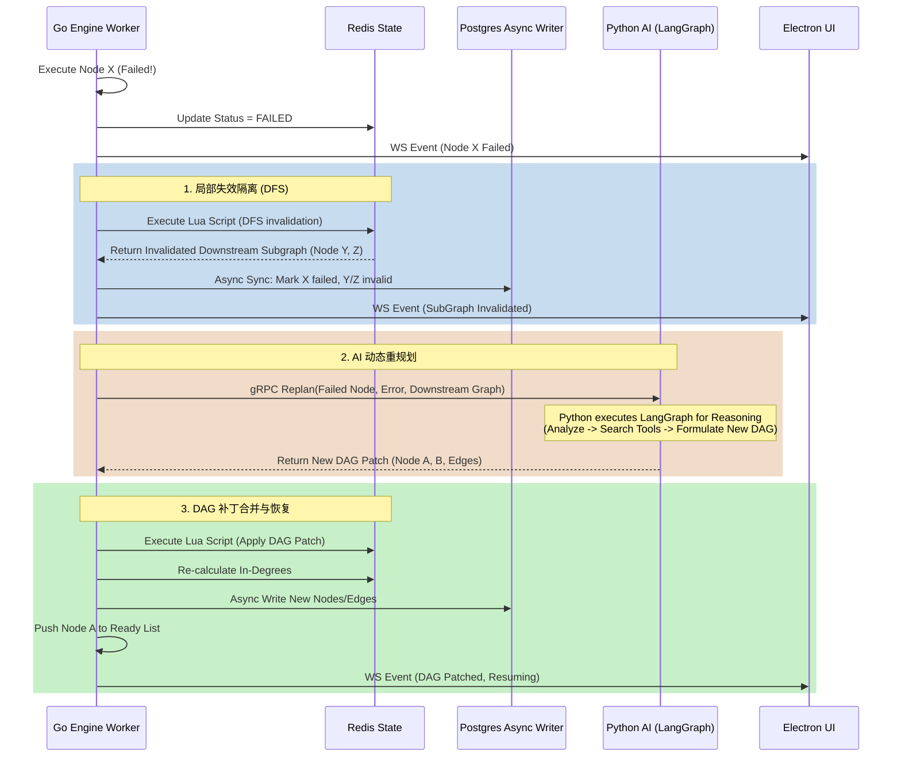

这是一份针对 Luna 项目中【DAG 编排方案】的核心技术设计文档。本文档严格遵循三层解耦架构，由 Go 掌握全局工作流调度，Python 通过 LangGraph 提供局部推理与重规划能力，Electron 负责状态呈现。

---

# DAG 编排与局部重规划引擎设计文档

## 1. 章节目标

本章节旨在定义 Luna 系统的核心控制面——**DAG 工作流引擎**的架构与工程实现。
核心目标包括：

1. 实现“计划 (Plan) - 阶段 (Phase) - 节点 (Node)”三层结构的解析与执行。
2. 基于 Redis 构建高性能的 DAG 运行时拓扑数据结构。
3. 实现面向“局部失败”的**动态子图重规划 (Dynamic Subgraph Replanning)** 机制，避免全量重跑。
4. 明确 Go Runtime 与 Python AI Service 在任务恢复过程中的边界与协作协议。
5. 保证执行期 Redis 与持久化 DB (PostgreSQL) 的状态最终一致性。

## 2. 设计背景与问题定义

在典型的 AI Agent 平台中，处理复杂长周期任务时面临巨大的工程挑战：

- **全量重试成本高**：传统线性工作流（或简单的 LangChain Chain）在第 8 步失败时，往往需要从第 1 步重试。这不仅浪费大量 LLM Token 和计算耗时，还可能导致前序已执行的副作用（如发邮件、写文件）重复发生。
- **静态 DAG 缺乏韧性**：传统的调度引擎（如 Airflow/Temporal）DAG 结构是静态的。但在 AI 场景下，任务失败的原因往往是动态的（如网页结构变化导致抓取失败、API 结构变更），需要“结合上下文动态换用其他工具”，这就要求 DAG 在运行时能够**自我修剪和重塑**。
- **状态不一致风险**：如果在重规划期间，前端仍在读取旧状态，或者长时记忆 (Memory) 已经写入了失败的中间结果，会导致整个系统陷入逻辑死锁或数据污染。

本设计就是要解决上述问题，提供一个**低恢复成本、高并发执行、具备局部自我修复能力**的 DAG 引擎。

## 3. 核心设计思路

1. **三层执行容器**：
   - **Plan (计划)**：顶层意图容器（如：“帮我调研竞品并写一份报告”）。
   - **Phase (阶段)**：逻辑分组，强制串行屏障（如：“数据收集”阶段完成后，才能进入“报告撰写”阶段）。
   - **Node (节点)**：最小执行单元（工具调用、Prompt 推理、子工作流），支持并发，通过边 (Edge) 定义拓扑依赖。
2. **Redis 驱动的运行时**：DAG 的点边关系、节点入度 (In-Degree)、节点状态，全部在 Redis 中维护。Go 引擎的 Worker Pool 监听入度为 0 且状态为 `Pending` 的节点进行调度。
3. **局部重规划 (Local Replanning) 机制**：
   - 节点 $N_k$ 失败。
   - Go 引擎在 Redis 中执行 DFS，找出所有依赖 $N_k$ 的下游子图（受影响节点），并将其状态标记为 `Invalid`。
   - Go 将失败原因、当前上下文、以及失效子图的元数据，通过 gRPC 发送给 Python 层。
   - Python 层利用 **LangGraph** 构建的局部推理图，通过 LLM 反思错误并生成一条新的修复路径（新的子图）。
   - Python 将新子图返回给 Go，Go 验证无环后，将其 Patch 到 Redis 的 DAG 中，更新入度和边。
   - Go 引擎唤醒 Worker 重新调度，从断点无缝恢复。
4. **异步持久化与一致性**：Redis 保证毫秒级的状态机流转；通过 Go 的 Event Bus 和异步持久化队列，将状态变更 Write-Behind 到 PostgreSQL。

## 4. 模块职责与边界

| 模块                        | 职责与禁止行为                                                                                                                                     |
|:------------------------- |:------------------------------------------------------------------------------------------------------------------------------------------- |
| **Go Engine** (调度核心)      | **职责**：持有全量 DAG、解析依赖、维护 Redis 状态、执行 DFS 失效遍历、调度 Worker 执行节点、调用工具、控制超时重试、异步写 DB。请求 Python 进行重规划。<br>**禁止**：执行复杂的 Prompt 组装与模型反思推理。           |
| **Python Service** (智能辅助) | **职责**：接收重规划请求。使用 **LangGraph** 建立一个“重规划推理流”（分析报错 -> 检索可用工具 -> 生成新子图 JSON -> 验证约束）。将结构化子图返回 Go。<br>**禁止**：直接操作 Redis 修改 DAG 状态；持有工作流实例生命周期。 |
| **Electron UI** (交互层)     | **职责**：通过 WebSocket 接收 DAG 状态更新事件，渲染当前计划执行图、重规划高亮提示。<br>**禁止**：保存任何工作流持久状态，直接调 Python 请求修复。                                                 |

*假设：系统采用单节点 Redis 或开启了 Lua 支持的 Redis 主从架构，因为核心图遍历与状态翻转需要依赖 Lua 脚本保证原子性。*

## 5. 核心数据结构

### 5.1 数据库结构 (PostgreSQL DB Schema)

用于持久化和系统冷重启恢复。

```sql
-- 计划表
CREATE TABLE workflow_plans (
    id VARCHAR(64) PRIMARY KEY,
    user_id VARCHAR(64) NOT NULL,
    intent TEXT NOT NULL,
    status VARCHAR(20) NOT NULL, -- PENDING, RUNNING, REPLANNING, SUCCESS, FAILED
    created_at TIMESTAMP DEFAULT CURRENT_TIMESTAMP
);

-- 节点表 (冗余存储，最终一致性)
CREATE TABLE workflow_nodes (
    id VARCHAR(64) PRIMARY KEY,
    plan_id VARCHAR(64) REFERENCES workflow_plans(id),
    phase_id VARCHAR(64) NOT NULL,
    name VARCHAR(128) NOT NULL,
    type VARCHAR(32) NOT NULL, -- TOOL, LLM, SUB_PLAN
    status VARCHAR(20) NOT NULL, -- PENDING, RUNNING, SUCCESS, FAILED, INVALID
    input_data JSONB,
    output_data JSONB,
    error_msg TEXT,
    retry_count INT DEFAULT 0,
    created_at TIMESTAMP DEFAULT CURRENT_TIMESTAMP
);

-- 边表 (依赖关系)
CREATE TABLE workflow_edges (
    id VARCHAR(64) PRIMARY KEY,
    plan_id VARCHAR(64) REFERENCES workflow_plans(id),
    source_node_id VARCHAR(64) NOT NULL,
    target_node_id VARCHAR(64) NOT NULL,
    condition TEXT -- 条件边表达式，空表示无条件依赖
);
```

### 5.2 Redis 运行时存储设计 (Redis Key Design)

为了支持极速的 DFS 遍历和入度计算。

- **节点元数据**: `hash:plan:{plan_id}:node:{node_id}`
  - 字段: `status`, `type`, `retry_count`, `input_data`
- **边关系 (正向/DFS用)**: `set:plan:{plan_id}:node:{node_id}:out_edges` -> 存储 target_node_id 集合。
- **边关系 (反向/入度判定用)**: `set:plan:{plan_id}:node:{node_id}:in_edges` -> 存储 source_node_id 集合。
- **运行队列 (Ready Queue)**: `list:plan:{plan_id}:ready_nodes` -> 存放入度为 0 且状态为 `PENDING` 的节点 ID。

### 5.3 接口对象 (Go Protobuf 定义)

Go 与 Python 之间的 gRPC 协议，用于重规划。

```protobuf
syntax = "proto3";
package workflow;

message NodeDef {
    string id = 1;
    string name = 2;
    string type = 3; // TOOL, LLM
    string tool_name = 4;
    string instruction = 5;
}

message EdgeDef {
    string source = 1;
    string target = 2;
}

message ReplanRequest {
    string plan_id = 1;
    string failed_node_id = 2;
    string error_message = 3;
    string context_summary = 4;
    repeated NodeDef original_invalid_nodes = 5;
    repeated EdgeDef original_invalid_edges = 6;
}

message ReplanResponse {
    bool success = 1;
    repeated NodeDef new_nodes = 2;
    repeated EdgeDef new_edges = 3;
    string fallback_message = 4; // 如果重规划彻底失败，用于通知用户
}
```

## 6. 核心流程 / 时序

### 6.1 正常调度与执行循环

1. 用户输入意图，Go 引擎初始化 Plan 写入 DB，将节点与边展开入 Redis。
2. Go 的 `Scheduler` 扫描 `in_edges` 为空的节点，推入 Ready List。
3. `Worker Pool` 消费 Ready List，更新节点状态为 `RUNNING`。
4. 节点执行成功后，状态变更为 `SUCCESS`。
5. Go 从 Redis 中获取该节点的所有 `out_edges` 指向的 `target_node`，将这些 `target_node` 的入度减 1（即从它们的 `in_edges` 中移除当前成功节点）。
6. 如果某个 `target_node` 的 `in_edges` 变为空，将其推入 Ready List。
7. 通过 WebSocket 通知 Electron UI 状态更新。

### 6.2 局部重规划时序 (核心重点)



## 7. 接口设计

### 7.1 WebSocket (Go -> Electron) 状态同步协议

为了防止前端维护复杂状态机，前端只消费状态快照增量。

**Schema: NodeStatusUpdate**

```json
{
  "type": "WORKFLOW_EVENT",
  "payload": {
    "plan_id": "plan_123",
    "event_type": "NODE_FAILED",
    "timestamp": 1699999999,
    "data": {
      "node_id": "node_4",
      "status": "FAILED",
      "error": "Timeout accessing Wikipedia API",
      "replanning_triggered": true
    }
  }
}
```

### 7.2 Python 侧 LangGraph 重规划实现

Python 端不承接工作流状态机，仅暴露一个无状态推理服务。

**Python LangGraph 工作流约束 (仅限本次推理)**:

1. `Start` -> `AnalyzeErrorNode`
2. `AnalyzeErrorNode` -> `ToolRetrievalNode` (查询替代工具)
3. `ToolRetrievalNode` -> `DAGGenerationNode` (生成新子图 JSON)
4. `DAGGenerationNode` -> `ValidationNode` (确保无环、结构合法)
5. `ValidationNode` -> `End` (若失败可循环重试生成 3 次)

## 8. 状态管理机制

| 状态枚举      | 说明          | 跃迁条件                  |
|:--------- |:----------- |:--------------------- |
| `PENDING` | 等待依赖满足      | 初始状态，或重规划后新生成的节点状态    |
| `READY`   | 依赖已满足，等待调度  | 节点的入度变为 0             |
| `RUNNING` | Worker 正在执行 | 从队列取出并开始分配 goroutine  |
| `SUCCESS` | 执行成功        | 输出结果验证通过，写入 context   |
| `FAILED`  | 执行失败        | 发生无法屏蔽的 error，重试耗尽    |
| `INVALID` | 因上游失败被丢弃    | DFS 遍历过程中被标记，**不再执行** |

**最终一致性保证**：
所有状态变更**以 Redis 为权威准星**。Go 的执行引擎通过 Redis Stream 或 Go Channel 将变更事件投递给后端的 `Persister Worker`，批量执行 SQL `UPDATE workflow_nodes SET status = $1 WHERE id = $2`。

## 9. 异常处理与降级策略

1. **Python 重规划彻底失败 (Fallback)**
   - **场景**：大模型幻觉导致生成的 DAG 存在环，或者连续 3 次无法生成合法替代路径。
   - **策略**：Go 收到失败响应，暂停当前 Plan，冻结状态。通过 WebSocket 下发 `USER_INTERVENTION_REQUIRED`。Electron 弹窗：“当前任务遇到不可恢复错误，需要您的指示”，允许用户手动中止、修改入参或跳过。
2. **Redis 与 DB 数据同步延迟/断裂**
   - **场景**：Redis 状态流转快，宕机重启时 DB 可能丢失最后几毫秒的进度。
   - **策略**：Luna 作为桌面端应用，宕机概率相对可控。重启时以 DB 状态重建 Redis DAG。若有节点在 DB 处于 `RUNNING` 状态，一律回退为 `READY` 重新执行。（前提：工具节点需保证幂等性，见第 13 节）。
3. **长期记忆 (Memory) 的污染问题**
   - **场景**：失效的节点已经在执行期间修改了长时记忆（例如写入了错误的用户画像）。
   - **策略**：**Memory Write Commit Orchestration (记忆提交流程化)**。Go 引擎强制约定：执行期所有对 Memory 的写操作，只记录在 Plan Context 的临时区 (Staging Area)。只有当整个 Phase 或 Plan 达到 `SUCCESS` 时，才执行真实的 DB Commit。

## 10. 与其他模块的协作关系

- **与 MCP Tool Routing 的协作**：节点如果是 TOOL 类型，Go Engine 不会自己实现工具，而是调用 MCP Router。如果 MCP 返回 "Tool Not Found" 或者 "Permission Denied"，立即触发 Node `FAILED`，进而引发重规划。
- **与 Active Behavior (主动行为) 的协作**：主动行为模块只是定期向 DB/Redis 注入一个新的 Plan。DAG 编排引擎对主动任务和被动任务一视同仁，只是 UI 在展示主动任务时可能采用“静默”或“通知框”形式。

## 11. 配置项与可调参数

```yaml
# workflow_engine.yaml (Go Config)
workflow:
  max_concurrent_nodes: 5      # 本地环境限制并发，防止耗尽用户机器资源
  node_default_timeout_sec: 60 # 节点默认超时时间
  max_retry_per_node: 3        # 节点级硬重试次数（超过则判定 FAILED）
  replanning:
    enabled: true
    max_replan_depth: 3        # 防止无限重规划导致死循环（Plan 级别的计数器）
    python_grpc_timeout_sec: 45 # 请求大模型重规划的超时时间
```

## 12. 可观测性与调试建议

1. **执行树可视化溯源**：
   - 因为节点可能被 `INVALID`，DAG 的拓扑是不断扩张的。每次重规划生成的新节点，其 ID 需携带后缀（例如 `node_4_replan_1`）。
   - 调试时，通过查询 DB 中的 `workflow_edges` 表，可以完整复原出一棵“带有修剪分支的执行树”，快速定位 AI 的决策轨迹。
2. **Trace ID 透传**：
   - 每一轮 Plan 分配唯一的 `plan_id`，在 Go 日志、gRPC 请求 Python、模型提供商 API 调用中，全链路注入 `plan_id` 和 `node_id`。

## 13. 安全性与治理建议

1. **工具权限 Gating (用户确认拦截)**
   - 如果重规划后的新 DAG 引入了高风险工具（如 `delete_file`, `send_email`），即使在自动执行期间，Go Engine 调度到该节点时，也必须暂停。
   - 状态变更为 `PENDING_USER_APPROVAL`，通过 WebSocket 通知 Electron 弹窗确认。
2. **沙箱限制**
   - 本地执行的代码生成类节点（如 Python Sandbox），必须控制在独立的 Docker 容器或受限进程组中运行。

## 14. 典型使用场景

**场景：复杂文档调研与总结**

1. 意图：搜索关于“LangGraph 和 Temporal 比较”的文章，读取前 3 篇内容，写摘要。
2. 初始 DAG: `Search_Node` -> `Fetch_Doc_1`, `Fetch_Doc_2`, `Fetch_Doc_3` (并发) -> `Summarize_Node`。
3. 执行：`Fetch_Doc_2` 遇到 403 Anti-bot 阻拦，触发 `FAILED`。
4. 隔离：`Summarize_Node` 依赖 `Fetch_Doc_2`，被标记为 `INVALID`。
5. 重规划：Python LLM 分析 403 报错，决定将子图修改为：不抓取 Doc_2，仅用 1 和 3，修改 `Summarize_Node` 的 Prompt 降低内容要求。或者引入 `Fetch_Doc_4` 作为替代。
6. 恢复：Go 收到新图，Patch 完毕后，继续并行执行剩余逻辑，最后顺滑完成。

## 15. 示例代码或伪代码

### 15.1 Go - 引擎失效传播 Lua 脚本设计

为了保证原子性，失效扩散在 Redis 服务端一次性完成。

```lua
-- Lua Script: DFS Mark Invalid
-- KEYS[1] = plan_id, ARGV[1] = failed_node_id
local plan_id = KEYS[1]
local failed_node_id = ARGV[1]

local queue = {failed_node_id}
local invalid_nodes = {}

-- BFS/DFS 遍历找出受影响的节点
local head = 1
while head <= #queue do
    local curr = queue[head]
    head = head + 1

    -- 获取出边
    local out_edges_key = "set:plan:" .. plan_id .. ":node:" .. curr .. ":out_edges"
    local neighbors = redis.call("SMEMBERS", out_edges_key)

    for i, next_node in ipairs(neighbors) do
        local status_key = "hash:plan:" .. plan_id .. ":node:" .. next_node
        local status = redis.call("HGET", status_key, "status")
        -- 仅标记尚未完成的节点
        if status ~= "SUCCESS" and status ~= "INVALID" then
            redis.call("HSET", status_key, "status", "INVALID")
            table.insert(invalid_nodes, next_node)
            table.insert(queue, next_node)
        end
    end
end

return invalid_nodes -- 返回给 Go 引擎
```

### 15.2 Python FastAPI - LangGraph 重规划接口

遵循规范，Python 使用 LangGraph 组装局部推理，无状态返回。

```python
# python_service/main.py
from fastapi import FastAPI
from pydantic import BaseModel
from langgraph.graph import StateGraph, START, END
from typing import Dict, Any, List

app = FastAPI()

class ReplanRequest(BaseModel):
    plan_id: str
    failed_node_id: str
    error_message: str
    original_invalid_nodes: List[Dict[str, Any]]

# 1. 定义 LangGraph 状态
class ReplanState(Dict):
    error: str
    invalid_nodes: List[Dict]
    new_subgraph: Dict

# 2. 定义节点逻辑
def analyze_error(state: ReplanState):
    # 调用 LLM 分析错误
    return {"analysis": "The target website blocks generic scrapers."}

def generate_new_dag(state: ReplanState):
    # 调用 LLM 返回结构化输出 (JSON)
    # 此处假设模型返回了替代的 Fetch_Doc_4 节点
    new_nodes = [{"id": "node_fetch_4", "type": "TOOL", "tool_name": "search_duckduckgo"}]
    return {"new_subgraph": {"nodes": new_nodes, "edges": [...]}}

# 3. 组装 LangGraph
builder = StateGraph(ReplanState)
builder.add_node("analyze", analyze_error)
builder.add_node("generate", generate_new_dag)
builder.add_edge(START, "analyze")
builder.add_edge("analyze", "generate")
builder.add_edge("generate", END)
replan_graph = builder.compile()

@app.post("/api/v1/replan")
async def replan_endpoint(req: ReplanRequest):
    # 执行 LangGraph 推理，不持有工作流持久状态
    initial_state = {
        "error": req.error_message,
        "invalid_nodes": req.original_invalid_nodes,
        "new_subgraph": {}
    }
    # invoke 同步等待最终推理结果
    final_state = replan_graph.invoke(initial_state)

    return {
        "success": True,
        "new_nodes": final_state["new_subgraph"]["nodes"],
        "new_edges": final_state["new_subgraph"]["edges"]
    }
```

### 15.3 Electron TS - 状态机监听

严禁前端修改图结构，只负责映射展示。

```typescript
// Electron / React Frontend
import { create } from 'zustand'

interface WorkflowState {
    nodes: Record<string, any>;
    edges: Record<string, any>;
    updateNodeStatus: (nodeId: string, status: string) => void;
}

const useWorkflowStore = create<WorkflowState>((set) => ({
    nodes: {},
    edges: {},
    updateNodeStatus: (nodeId, status) => set((state) => ({
        nodes: { ...state.nodes, [nodeId]: { ...state.nodes[nodeId], status } }
    }))
}));

// WebSocket 消息处理
ws.onmessage = (event) => {
    const msg = JSON.parse(event.data);
    if (msg.type === 'WORKFLOW_EVENT') {
        const { node_id, status, replanning_triggered } = msg.payload.data;
        useWorkflowStore.getState().updateNodeStatus(node_id, status);

        if (replanning_triggered) {
            // UI 层面可以高亮显示“AI 正在尝试修复此执行路径...”
            showToast("检测到节点失败，Luna 正在思考补救方案...");
        }
    }
};
```

## 16. 常见坑与规避方式

1. **DAG 补丁导致的环 (Cyclic Dependency)**
   - **坑**：LLM 幻觉生成了 `A->B` 且 `B->A` 的新结构，写入 Redis 后引发死锁。
   - **规避**：Go Engine 在收到 Python 侧新子图后，写入 Redis 前**必须在内存中执行一次拓扑排序检查 (Topological Sort Check)**。如果发现有向图有环，立即拒绝并报错，降级为 `USER_INTERVENTION_REQUIRED`。
2. **孤儿节点 (Orphan Nodes)**
   - **坑**：子图修补后，新生成的节点没有接入原图的主分支，导致最后流程无法完结。
   - **规避**：Go 引擎要求 `ReplanRequest` 中提供断裂处的“上下文接入点”。Python LLM 生成的新图，其最终产出节点的 `out_edge` 必须重新指向原图中未被 `INVALID` 影响的合并节点。
3. **Redis 内存泄漏**
   - **坑**：工作流执行完毕后，Redis 中的几十个 Key 没有清理。
   - **规避**：为 Plan 相关的所有 Key 设置固定的 `TTL`（例如 24 小时）。执行状态长久保存仅依赖 PostgreSQL。

## 17. 落地实施建议

1. **第一阶段 (MVP)**：暂不实现复杂的动态 DAG 重修剪，遇到错误直接返回 `FAILED` 给前端，打通全链路（Go 调度、Redis 状态流转、DB 持久化）。
2. **第二阶段 (核心突破)**：引入 Lua 脚本隔离下游，打通 Go <-> Python 的局部重规划接口。人工 Review 每次 LLM 生成的 JSON 补丁，确保 Prompt 工程稳定可靠。
3. **第三阶段 (韧性增强)**：加入 Memory Write Commit 机制与用户确认机制，确保长时记忆不会被错误路径污染。完善 Electron 侧的可视化 DAG 动画，提升用户体验（这可以成为 Luna 核心的产品亮点——用户能“看到”AI在努力纠错）。
