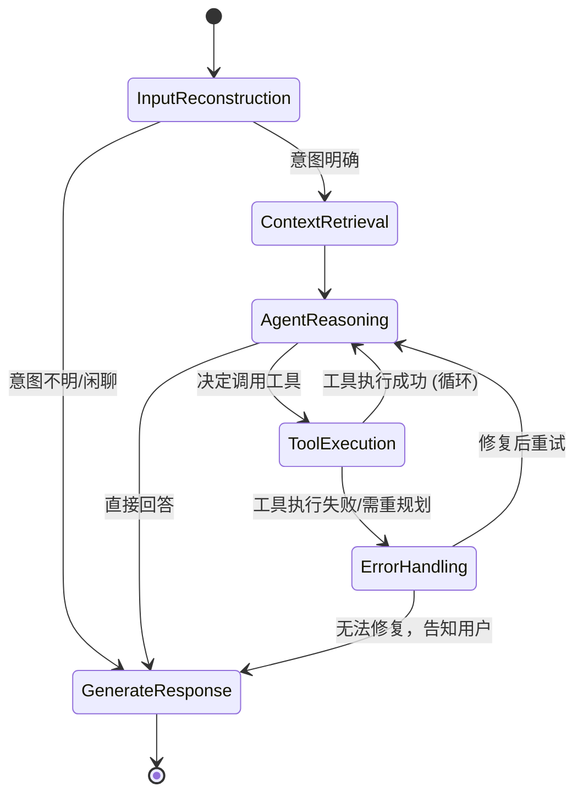

# Luna LangGraph 工作流编排方案

## 1. 章节目标

本文档定义 Luna 系统的核心工作流编排引擎。该引擎基于 **LangGraph** 框架构建，使系统能够将复杂的多步骤任务、多智能体协作、工具调用和状态流转转化为图（Graph）结构，支持循环、条件分支、局部重规划和状态持久化（中断恢复）。

## 2. 核心架构

Python Backend 统一使用 LangGraph 作为执行容器、状态管理和调度控制的核心框架。

### 2.1 LangGraph 核心概念映射

| 概念 | Luna 系统映射 | 说明 |
|:---|:---|:---|
| **State (状态)** | `AgentState` | 贯穿整个图执行生命周期的全局状态字典（TypedDict 或 Pydantic BaseModel），包含对话历史、提取的意图、工具调用结果、当前情绪等。 |
| **Node (节点)** | Agent / Tool / Logic | 图中的执行单元。每个节点是一个 Python 函数，接收 `AgentState`，执行特定逻辑（如调用 LLM、执行 MCP 工具），并返回状态的更新（增量或覆盖）。 |
| **Edge (边)** | 确定性流转 | 连接两个节点的有向边，表示执行顺序（如 `Node A -> Node B`）。 |
| **Conditional Edge (条件边)** | 路由决策 | 基于当前 `AgentState` 动态决定下一个执行节点的路由函数（如判断是否需要调用工具，或是否触发情绪安抚）。 |
| **Checkpointer (检查点)** | 状态持久化 | LangGraph 内置的持久化机制（如 `AsyncPostgresSaver` 或 `AsyncRedisSaver`），用于保存图的执行快照，支持中断恢复（Human-in-the-loop）和时间旅行（Time Travel）。 |

## 3. 状态定义 (AgentState)

`AgentState` 是整个工作流的血液，定义了图中流转的数据结构。

```python
from typing import TypedDict, Annotated, List, Dict, Any, Optional
from langgraph.graph.message import add_messages
from langchain_core.messages import BaseMessage

class AgentState(TypedDict):
    # 对话历史，使用 add_messages 自动追加新消息
    messages: Annotated[List[BaseMessage], add_messages]
    
    # 当前会话 ID
    session_id: str
    
    # 提取的用户意图
    intent: Optional[str]
    
    # 检索到的上下文 (RAG / Memory)
    context: List[str]
    
    # 当前情绪状态 (用于双轨状态机)
    emotion_state: str
    
    # 待执行的工具调用列表
    pending_tool_calls: List[Dict[str, Any]]
    
    # 局部重规划标记
    requires_replan: bool
    
    # 错误信息
    error: Optional[str]
```

## 4. 核心工作流图设计 (Main Graph)

Luna 的主工作流是一个循环图，处理从用户输入到最终响应的完整生命周期。



### 4.1 节点定义示例

```python
from langgraph.graph import StateGraph, END
from langchain_core.messages import HumanMessage, AIMessage

async def input_reconstruction_node(state: AgentState):
    """分析用户输入，提取意图和情绪"""
    # 调用 LLM 提取意图
    intent, emotion = await analyze_input(state["messages"][-1].content)
    return {"intent": intent, "emotion_state": emotion}

async def agent_reasoning_node(state: AgentState):
    """核心推理节点，决定下一步行动"""
    # 组装 Prompt (包含 context, intent 等)
    # 调用 LLM (绑定 Tools)
    response = await llm.ainvoke(messages)
    
    # 如果 LLM 决定调用工具，返回 tool_calls
    if response.tool_calls:
        return {"messages": [response], "pending_tool_calls": response.tool_calls}
    
    return {"messages": [response]}

async def tool_execution_node(state: AgentState):
    """执行 MCP 工具"""
    tool_calls = state["pending_tool_calls"]
    results = []
    for tc in tool_calls:
        # 权限校验与执行网关
        result = await execute_tool(tc)
        results.append(ToolMessage(content=result, tool_call_id=tc["id"]))
    
    return {"messages": results, "pending_tool_calls": []}
```

### 4.2 条件路由示例

```python
def should_continue(state: AgentState):
    """判断是继续调用工具还是生成最终回复"""
    last_message = state["messages"][-1]
    
    # 如果最后一条消息包含工具调用，则路由到工具执行节点
    if hasattr(last_message, "tool_calls") and last_message.tool_calls:
        return "tool_execution"
    
    # 否则，路由到生成回复节点
    return "generate_response"
```

### 4.3 图的构建与编译

```python
from langgraph.checkpoint.postgres.aio import AsyncPostgresSaver

# 初始化图
workflow = StateGraph(AgentState)

# 添加节点
workflow.add_node("input_reconstruction", input_reconstruction_node)
workflow.add_node("context_retrieval", context_retrieval_node)
workflow.add_node("agent_reasoning", agent_reasoning_node)
workflow.add_node("tool_execution", tool_execution_node)
workflow.add_node("generate_response", generate_response_node)

# 添加边
workflow.set_entry_point("input_reconstruction")
workflow.add_edge("input_reconstruction", "context_retrieval")
workflow.add_edge("context_retrieval", "agent_reasoning")

# 添加条件边
workflow.add_conditional_edges(
    "agent_reasoning",
    should_continue,
    {
        "tool_execution": "tool_execution",
        "generate_response": "generate_response"
    }
)

workflow.add_edge("tool_execution", "agent_reasoning") # 循环回推理节点
workflow.add_edge("generate_response", END)

# 编译图，并挂载 Checkpointer 实现持久化
checkpointer = AsyncPostgresSaver(conn)
app = workflow.compile(checkpointer=checkpointer)
```

## 5. 局部重规划与错误处理

在 LangGraph 中，局部重规划通过**循环（Cycles）**和**状态更新**自然实现。

1. **捕获错误**：如果 `tool_execution_node` 失败，它将错误信息写入 `AgentState["error"]`，并将 `requires_replan` 设为 True。
2. **条件路由**：条件边检测到错误状态，将流转路由到 `error_handling_node` 或直接回到 `agent_reasoning_node`。
3. **重新推理**：`agent_reasoning_node` 接收到包含错误信息的最新状态，LLM 会根据错误反馈（Reflection）自动调整策略，生成新的工具调用参数或选择其他工具。

## 6. 中断恢复与 Human-in-the-loop (审批流)

LangGraph 的 Checkpointer 机制完美契合 Luna 的工具审批流（Gating）需求。

1. **设置断点**：在编译图时，可以指定在特定节点前中断执行。
   ```python
   app = workflow.compile(
       checkpointer=checkpointer,
       interrupt_before=["tool_execution"] # 在执行工具前挂起
   )
   ```
2. **挂起与通知**：当图执行到 `tool_execution` 节点前，会自动挂起。Python Backend 此时通过 WebSocket 通知 Electron 前端弹出审批框。
3. **恢复执行**：用户在前端点击"同意"后，Python Backend 携带相同的 `thread_id` 恢复图的执行。
   ```python
   # 恢复执行，传入 None 表示继续当前状态
   await app.ainvoke(None, config={"configurable": {"thread_id": session_id}})
   ```
4. **状态修改（拒绝执行）**：如果用户拒绝，Python Backend 可以直接修改图的状态（如移除 pending_tool_calls，注入拒绝信息），然后再恢复执行，让 LLM 知道操作被拒绝。

## 7. 落地实施建议

1. **Phase 1**：使用 LangGraph 构建基础的 ReAct 循环（Reasoning + Acting），实现基本的工具调用和状态流转，使用内存 Checkpointer。
2. **Phase 2**：接入 `AsyncPostgresSaver`，实现状态的持久化落盘，打通中断恢复和前端审批流。
3. **Phase 3**：将复杂的上下文治理（多智能体协作）拆分为 Sub-Graph（子图），在主图中作为单个节点调用，实现逻辑的模块化和解耦。
