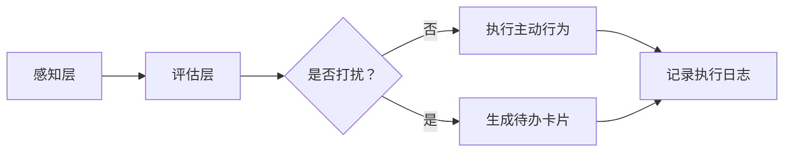

# Luna 主动感知与自主行动机制

## 1. 章节目标

本文档定义 Luna 系统的主动感知与自主行动能力。使系统不再局限于"一问一答"的被动响应模式，而是能够在检测到合适时机时，主动发起提醒、总结、建议等行为。

## 2. 核心架构

Python Backend 统一负责：感知 -> 评估 -> 决策 -> 执行 -> 约束的全链路。



## 3. 感知层

Python 监听以下信号：

| 信号类型     | 检测方式                      | 触发场景                  |
|:-----------|:----------------------------|:------------------------|
| 系统空闲     | 用户无操作超过 N 分钟               | 空闲总结、每日回顾             |
| 剪贴板变化   | 监测系统剪贴板内容变更                | 链接识别、文本总结建议           |
| 时间触发     | crontab 风格的定时任务              | 晨间问候、待办提醒             |
| 文件系统变化 | 监测指定目录的文件变更                 | 自动归档建议                |

## 4. 评估与决策

Python 使用基于 Redis Token Bucket 的速率限制与静默期检测：

```python
class ProactiveEvaluator:
    """主动行为评估器"""

    async def should_proceed(self, action_type: str) -> tuple[bool, str]:
        """判断是否应执行主动行为"""
        # 1. 检查是否在静默期
        if await self._is_silent_period():
            return False, "当前处于用户设定的静默期"

        # 2. 速率限制检查
        if not await self._rate_limiter.check(action_type):
            return False, "操作频率过高"

        # 3. LLM 评估是否打扰
        evaluation = await self._llm_evaluate(action_type)
        if evaluation.should_interrupt:
            return False, evaluation.reason

        return True, "允许执行"
```

## 5. 约束与安全

- 涉及高危工具的主动计划，Python 直接拦截转为前端无声待办卡片，等待用户手动确认。
- 用户可设置"免打扰模式"，在此期间所有主动行为被挂起。

## 6. 落地实施建议

1. **Phase 1**：实现定时任务主动提醒（如每日总结）。
2. **Phase 2**：接入空闲检测和剪贴板感知。
3. **Phase 3**：实现完整的评估-决策-执行闭环和用户静默期配置。
