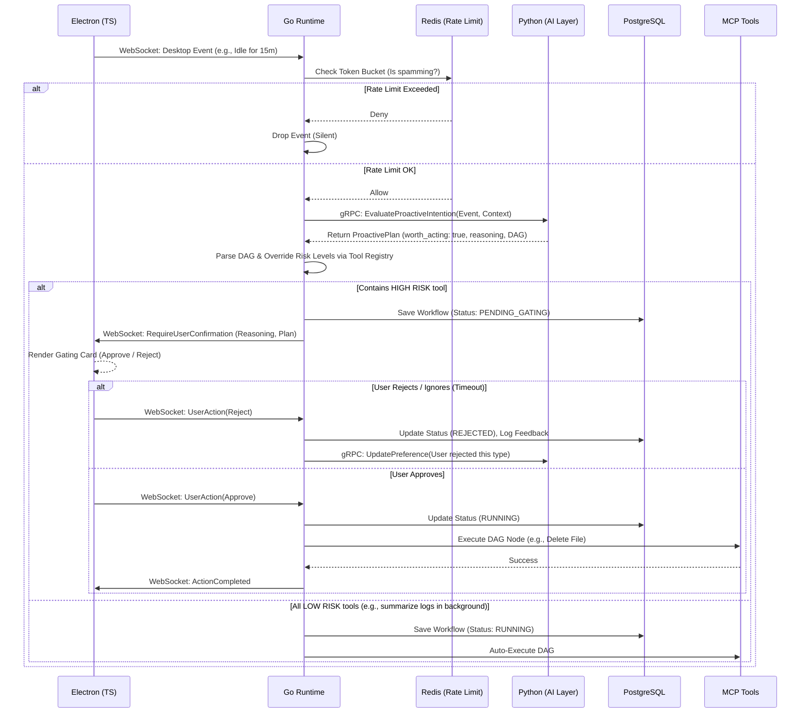

1. 章节目标
   本章节旨在规范并落地 Luna 项目中的“主动感知与自主行动机制”（Proactive Perception & Autonomous Action Mechanism）。通过定义清晰的事件采集、意图评估、频率控制、安全授权（Gating）及用户反馈闭环，确保 Luna 能够在其作为“全栈 AI Agent 平台”的定位下，安全、克制且智能地发起主动行为。目标是让系统具备“眼里有活”的自主性，同时严守“不扰民、不越权、可撤销”的工程红线。

2. 设计背景与问题定义
   传统 AI 助理通常是被动响应式（Reactive），即“指令-执行”模式。Luna 的核心目标是“陪伴式人格 + 主动行为”，这要求系统必须具备主动感知环境并自发规划任务的能力。然而，在桌面端本地化运行主动 Agent 存在以下严峻工程挑战：
- **打扰洪水（Spamming）**：如果触发条件设计不当，AI 可能会频繁弹窗或打断用户正常工作。
- **高危操作失控（Rogue Actions）**：AI 主动删除文件、发送邮件或修改系统配置，若无极严格的权限与状态机拦截，将引发灾难性后果。
- **调度归属混乱**：如果 Python 智能层直接持有主动触发的定时器或轮询逻辑，将导致系统状态分散，无法统一实现诸如“休眠暂停”、“全局静默”等调度控制。
- **上下文幻觉**：AI 在没有足够桌面上下文的情况下“生造”主动意图。

为此，必须在架构上明确：**所有感知事件的汇聚、频率控制的计算、授权拦截（Gating）以及工作流的创建，必须 100% 由 Golang Runtime 掌控。** Python 仅作为一个“意图鉴定器”和“规划生成器”。

3. 核心设计思路
   基于三层解耦架构，主动行为机制的设计遵循以下思路：

4. **事件驱动与统一总线**：Electron 端（桌面感知）和 Go 内部（时间/定时任务）将所有潜在触发事件推送到 Go 的 Event Bus。

5. **多级防打扰漏斗（Anti-Disturbance Funnel）**：
   
   - 第一级（Go）：基于 Redis 的全局/分类速率限制（Token Bucket）。触发太频直接丢弃。
   - 第二级（Go）：静默期检测（如用户正在全屏游戏、开会勿扰模式）。
   - 第三级（Python）：意图价值评估（Value Evaluation）。Go 将事件发给 Python，Python 判断“是否值得主动打扰”。

6. **基于 MCP 的工具风险分级**：所有可执行的工具必须在 Go Runtime 注册，并硬编码标记风险等级（RiskLevel = LOW / HIGH）。

7. **严格的 Gating 机制**：若 Python 规划的 DAG 中包含任何 HIGH 风险节点，Go Runtime 会自动将该工作流置于 `PENDING_USER_APPROVAL` 状态，并通过 WebSocket 推送授权卡片给 Electron，等待用户决策。

8. **行为可解释性与补偿**：Python 返回的规划必须包含 `Reasoning`（为什么要做）。执行后，高危状态变更需支持补偿（Undo）。

9. 模块职责与边界

| 模块名称              | 职责定位                                                                                              | 严禁行为                                       |
|:----------------- |:------------------------------------------------------------------------------------------------- |:------------------------------------------ |
| **Electron (TS)** | 监听 OS 级事件（闲置、剪贴板变化、全屏状态）、渲染主动提议的确认 UI（Gating Card）、提供倒计时拒绝 UI。                                    | 严禁前端判断是否该触发主动行为；严禁前端直接调用 Python。           |
| **Go Runtime**    | Event Bus 维护、Token 消耗与频率控制计算、调用 Python 评估意图、DAG 工作流生成、拦截高危工具并管理 Gating 状态机、持久化执行日志。               | 严禁 Go 包含具体的认知推理或 Prompt 组装逻辑。              |
| **Python AI**     | 提供 `/v1/proactive/evaluate` 和 `/v1/proactive/plan` 接口。基于当前上下文和长期记忆，决定是否行动，并输出结构化 DAG Plan 和可解释理由。 | 严禁 Python 内部启动后台线程轮询系统状态；严禁 Python 直接执行工具。 |

5. 核心数据结构
   以下定义均在 Go 层面作为标准 Schema，持久化至 PostgreSQL。

**5.1 触发事件 (ProactiveEvent)**

```go
type ProactiveEvent struct {
    EventID     string                 `json:"event_id"`
    EventType   EventType              `json:"event_type"` // IDLE, CONTEXT, TIME, DESKTOP, HABIT
    Source      string                 `json:"source"`     // e.g., "electron-monitor", "go-cron"
    Payload     map[string]interface{} `json:"payload"`    // 具体的事件数据
    Priority    EventPriority          `json:"priority"`   // INTERRUPT, SUGGEST, REMIND, OBSERVE
    TriggerTime time.Time              `json:"trigger_time"`
}
```

**5.2 主动规划协议 (ProactivePlan - 从 Python 返回)**

```json
{
  "worth_acting": true,
  "confidence": 0.92,
  "action_type": "SUGGESTION",
  "reasoning": "用户已离开屏幕 30 分钟，且下载文件夹存在 5 个超过 1GB 的临时文件，建议清理释放空间。",
  "proposed_workflow": {
    "nodes": [
      {
        "node_id": "step_1",
        "tool_name": "mcp.fs.list_temp_files",
        "args": {"path": "~/Downloads", "size_gt": "1GB"}
      },
      {
        "node_id": "step_2",
        "tool_name": "mcp.fs.delete_files",
        "args": {"files": "$step_1.output.files"},
        "risk_level": "HIGH" 
      }
    ]
  }
}
```

*注意：`risk_level` 最终由 Go 端 Tool Registry 权威覆写，Python 返回的仅供参考，防止 AI 幻觉篡改风险级别。*

**5.3 主动行为日志 (DB: proactive_logs)**
用于审计和闭环反馈。

- `id` (VARCHAR(64), PK) — 雪花算法 ID

- `event_id` (VARCHAR(64)) — 雪花算法 ID

- `intent_summary` (Text)

- `status` (Enum: EXECUTED, REJECTED_BY_USER, IGNORED, REVOKED, BLOCKED_BY_RATE_LIMIT)

- `user_feedback` (Int: -1, 0, 1)

- `created_at` (Timestamp)
6. 核心流程 / 时序
   以下为典型的主动感知与行动（包含 Gating）时序：



7. 接口设计

**7.1 WebSocket 协议 (Electron <-> Go)**
方向：Electron -> Go (事件上报)

```json
{
  "type": "EVENT_REPORT",
  "payload": {
    "event_type": "IDLE",
    "data": { "idle_minutes": 15, "active_window": "VSCode" }
  }
}
```

方向：Go -> Electron (推送主动建议，要求授权)

```json
{
  "type": "PROACTIVE_PROPOSAL",
  "payload": {
    "workflow_id": "wf-123456",
    "priority": "SUGGEST",
    "title": "清理临时文件",
    "reasoning": "发现下载目录下有 3GB 过期安装包，已闲置 15 分钟，是否清理？",
    "actions": ["mcp.fs.delete"],
    "timeout_seconds": 60 
  }
}
```

方向：Electron -> Go (用户决策反馈)

```json
{
  "type": "USER_GATING_DECISION",
  "payload": {
    "workflow_id": "wf-123456",
    "decision": "APPROVE" // 或 "REJECT", "IGNORE"
  }
}
```

**7.2 gRPC 接口 (Go <-> Python)**

```protobuf
syntax = "proto3";
package proactive;

service ProactiveIntelligence {
  // 意图评估与规划生成
  rpc EvaluateIntention(EvaluateRequest) returns (EvaluateResponse);
  // 用户反馈反思（用于自我优化）
  rpc ReflectOnFeedback(ReflectRequest) returns (ReflectResponse);
}

message EvaluateRequest {
  string event_id = 1;
  string event_type = 2;
  string payload_json = 3;
  string current_desktop_context = 4; // 由 Go 聚合的内存摘要
}

message EvaluateResponse {
  bool worth_acting = 1;
  float confidence = 2;
  string reasoning = 3;
  string dag_plan_json = 4;
}
```

8. 状态管理机制
   由于主动工作流可能随时被中断或由于等待用户确认而挂起，Go Runtime 内部的状态机设计如下：
- `DRAFT`: Go 正在解析 Python 返回的 Plan。
- `PENDING_GATING`: 工作流包含高危节点，已向前端发送 Proposal，挂起等待。
- `RUNNING`: 正在执行工具节点。
- `COMPLETED`: 顺利完成。
- `REJECTED`: 在 `PENDING_GATING` 阶段被用户明确拒绝，或超时未响应（视同拒绝）。
- `REVOKED`: 执行完成后，用户发起撤销，且补偿事务执行成功。
- `FAILED`: 执行中途发生错误。

**状态转换权威限制**：所有状态转换仅能在 Go 的 `WorkflowManager` 中进行，由互斥锁（Mutex）或 DB 事务保障一致性。

9. 异常处理与降级策略
   
   | 异常场景                 | 降级/兜底策略                                                                              |
   |:-------------------- |:------------------------------------------------------------------------------------ |
   | **Python 服务不可用/超时**  | Go 端的 RPC 调用设置严格的 5 秒超时。若超时，直接静默丢弃该次事件，**不打扰用户，不重试**，防止堆积。                           |
   | **用户在 Gating 期间未响应** | Proposal 弹窗带有 `timeout_seconds`。超时后 UI 自动折叠，Go 端状态机自动推进到 `REJECTED (Ignored)`，工作流销毁。 |
   | **大模型返回格式错误**        | Go 层的 JSON Schema 验证器捕获异常。直接丢弃该规划。记录日志 `ErrInvalidPlanLayout`，不阻断主流程。                |
   | **执行期工具异常**          | 工作流进入 `FAILED`，若存在依赖后续节点则阻断。向前端推送错误通知卡片。                                             |

10. 与其他模块的协作关系
- **长期记忆模块 (Memory Consistency)**：
  如果用户多次在 Gating 阶段点击 `REJECT`，Go 会触发 `ReflectOnFeedback`。Python 会更新用户的 Persona/Memory（例如：“用户不喜欢在工作时间被提示清理磁盘”），从而在下一次评估 `EvaluateIntention` 时输出 `worth_acting: false`。
- **MCP Tool Routing**：
  主动行为依赖 MCP 协议获取工具的执行权限和风险元数据。Go 是 MCP Client 的持有者。
11. 配置项与可调参数
    配置项定义在 Go 的 `config.yaml` 中，支持热重载：
    
    ```yaml
    proactive:
    global_rate_limit:
    max_events_per_hour: 5       # 全局防打扰，每小时最多主动发起 5 次
    category_cooldown:
    interrupting_sec: 7200       # 强打断类行为冷却时间 (2小时)
    suggesting_sec: 1800         # 建议类行为冷却 (30分钟)
    ai_evaluation:
    confidence_threshold: 0.85   # Python 返回的置信度低于此值则丢弃
    rpc_timeout_ms: 5000         # Python 意图评估超时限制
    ```

12. 可观测性与调试建议
- **TraceID 透传**：从 Electron 的事件触发开始，生成 `trace_id`。此 ID 贯穿 Go EventBus -> Go RPC -> Python LangGraph -> Go DAG Scheduler。
- **日志审计 (Log Fields)**：
  核心字段需包含：`event_type`, `risk_level_override`, `worth_acting`, `gating_cost_ms`。
- **调试建议**：
  提供开发者模式（Debug Mode）。在此模式下，Electron 端会额外渲染一个 "Proactive DevTools" 面板，实时显示当前被限流丢弃的事件、Python 评估被拒的原因（Confidence 偏低）等，避免“为什么不触发”的黑盒困惑。
13. 安全性与治理建议
    **（绝对红线）**
14. **Tool Risk Level 权威在 Go 端**：
    假设 Python 生成的 DAG 恶意或幻觉地将 `mcp.fs.format_disk` 标记为 `LOW` 风险。Go 在解析时，必须与本地注册的 Tool Meta 表进行校验。如果注册表标记为 `HIGH`，则强制覆写，必须触发 Gating 确认。
15. **凭证隔离**：
    主动行为在执行 RAG 检索或发起外网请求时，Go 会向 Tool 注入带有 `PROACTIVE` 标签的 Context。某些极高敏工具（如直接读取本地保存的明文密码）可以硬编码拒绝任何带有 `PROACTIVE` 标签的调用。
16. **用户授权边界**：
    如果应用被锁定或屏幕进入保护模式，Go 端 EventBus 必须自动暂停所有主动规划工作流。
17. 典型使用场景
    **场景 A：空闲态建议（观察型 / 低打扰）**
- **事件**：Electron 监测到鼠标/键盘空闲超过 15 分钟。
- **推断**：Python 判断当前是下午 6 点，属于用户通常复盘的时间，且今日有 3 篇未读网页记录。
- **规划**：生成“今日阅读总结”。由于工具仅调用 LLM 和 RAG（风险为 LOW），Go 自动执行。
- **结果**：执行完毕后，在侧边栏悄悄生成一条 Timeline 消息，不弹窗，仅供用户返回时查看。

**场景 B：上下文触发（打断型 / 高风险）**

- **事件**：用户复制了一段包含快递单号的文本。

- **推断**：Python 识别出这可能是需要查询物流，规划了“调用物流 API”并“发送飞书消息给家人”。

- **规划**：“发送消息”属于 HIGH 风险。

- **结果**：Go 拦截工作流，前端弹出 Gating Card：“发现快递单号，是否查询并同步给家人？” 用户点击“确认”后方可执行。
15. 示例代码或伪代码

**15.1 Go Runtime: 频率控制与路由逻辑 (核心编排层)**

```go
package proactive

import (
    "context"
    "time"
    "github.com/luna/core/eventbus"
    "github.com/luna/core/rpc/python"
    "github.com/luna/core/workflow"
)

type ProactiveManager struct {
    pyClient python.IntelligenceClient
    rateLimiter *RateLimiter // 基于 Redis 的令牌桶
    wfManager *workflow.Manager
}

func (m *ProactiveManager) HandleEvent(ctx context.Context, ev eventbus.ProactiveEvent) {
    // 1. 全局频率与静默期控制
    if !m.rateLimiter.Allow(ev.EventType) {
        log.Debugf("Event %s dropped due to rate limiting", ev.EventID)
        return
    }

    // 2. 调用 Python 进行意图评估 (严格超时控制)
    evalCtx, cancel := context.WithTimeout(ctx, 5*time.Second)
    defer cancel()

    resp, err := m.pyClient.EvaluateIntention(evalCtx, &python.EvaluateRequest{
        EventId:   ev.EventID,
        EventType: string(ev.EventType),
        Payload:   ev.PayloadJSON,
    })

    if err != nil || !resp.WorthActing || resp.Confidence < 0.85 {
        // AI 认为不值得行动，或发生异常
        return
    }

    // 3. 构建 DAG
    dag, err := workflow.ParseDAG(resp.DagPlanJson)
    if err != nil {
        log.Errorf("Failed to parse DAG: %v", err)
        return
    }

    // 4. 风险覆写与权限校验
    requiresGating := false
    for _, node := range dag.Nodes {
        toolMeta := workflow.GetToolRegistry().Get(node.ToolName)
        if toolMeta.RiskLevel == workflow.RISK_HIGH {
            requiresGating = true
        }
    }

    // 5. 调度工作流
    if requiresGating {
        m.wfManager.CreateAndGate(ctx, dag, resp.Reasoning)
        // 会触发 WebSocket 向 Electron 推送 RequireConfirmation
    } else {
        m.wfManager.CreateAndRun(ctx, dag)
    }
}
```

**15.2 Python AI: 意图评估端点 (无状态能力层)**

```python
from fastapi import APIRouter, Depends
from pydantic import BaseModel
from services.llm import LLMClient
from services.memory import MemoryRetriever

router = APIRouter()

class EvaluateRequest(BaseModel):
    event_id: str
    event_type: str
    payload_json: str
    current_desktop_context: str

class EvaluateResponse(BaseModel):
    worth_acting: bool
    confidence: float
    reasoning: str
    dag_plan_json: str

@router.post("/v1/proactive/evaluate", response_model=EvaluateResponse)
async def evaluate_intention(req: EvaluateRequest):
    # 提取长期记忆，避免违背用户习惯
    user_prefs = await MemoryRetriever.get_proactive_preferences()

    prompt = f"""
    你是一个主动助理。收到事件：{req.event_type}, 内容：{req.payload_json}
    用户上下文: {req.current_desktop_context}
    用户偏好记忆: {user_prefs}

    请判断是否需要发起主动动作。如果打扰成本大于收益，请返回 worth_acting: false。
    如果值得行动，请输出 reasoning 和 DAG JSON。
    """

    # 强制 LLM 使用结构化输出（Structured Output约束）
    structured_response = await LLMClient.generate_structured(
        prompt=prompt,
        schema=EvaluateResponse.schema()
    )

    return structured_response
```

16. 常见坑与规避方式
- **坑 1：自我触发死循环 (Self-Trigger Loop)**
  - *现象*：AI 执行了“整理文件”，导致文件系统变化事件触发，进而再次唤醒主动感知，形成无限循环。
  - *规避*：事件源必须携带 `Actor` 标识。所有由 AI（Go 工作流）自身执行导致的 OS 事件，Go EventBus 必须在入口处根据 `Actor=Luna` 将其过滤（Ignore）。
- **坑 2：多 Agent 抢占执行冲突**
  - *现象*：后台定时总结 Agent 与 主动推荐 Agent 同时操作同一个 SQLite 库，导致锁死。
  - *规避*：Go 层的 Workflow Manager 使用单例队列管理具有资源冲突的高级任务，涉及资源读写时，Go Runtime 采用互斥锁分配执行槽位。
- **坑 3：Electron UI 状态与 Go Runtime 不一致**
  - *现象*：UI 显示“等待授权”，但 Go 端因为 Gating 超时已经销毁工作流。用户点击“同意”报错。
  - *规避*：UI 层在渲染 Gating Card 时必须持有 `timeout` 的内部倒计时器；同时 Go 接收到超时的 `USER_GATING_DECISION` 会返回明确的错误码 `ErrWorkflowExpired`，前端捕获后优雅降级卡片状态为“已失效”。
17. 落地实施建议
    为了保证系统的稳定演进，建议分三个阶段（Phase）落地本模块：
- **Phase 1: 纯定时与弱打扰 (规则主导)**。
  暂时不接入全屏桌面事件和实时上下文，仅基于 Go 端的 Cron 定时器（如每日 18:00）触发。风险完全可控，跑通整体事件流、RPC 与 DAG 引擎。
- **Phase 2: 强上下文感知与 Gating 闭环**。
  引入 Electron 事件监测（闲置、剪贴板）。开启 Tool 的 Risk Level 验证，跑通用户通过 UI 拦截或允许高危操作的闭环。
- **Phase 3: 长期记忆反馈与自我进化 (AI 主导)**。
  实装 `ReflectOnFeedback` 接口，使系统能够通过用户点击“忽略”或“拒绝”的动作，自动修正 Python 层的评估 Prompt 偏好，实现真正的“懂眼色”。
