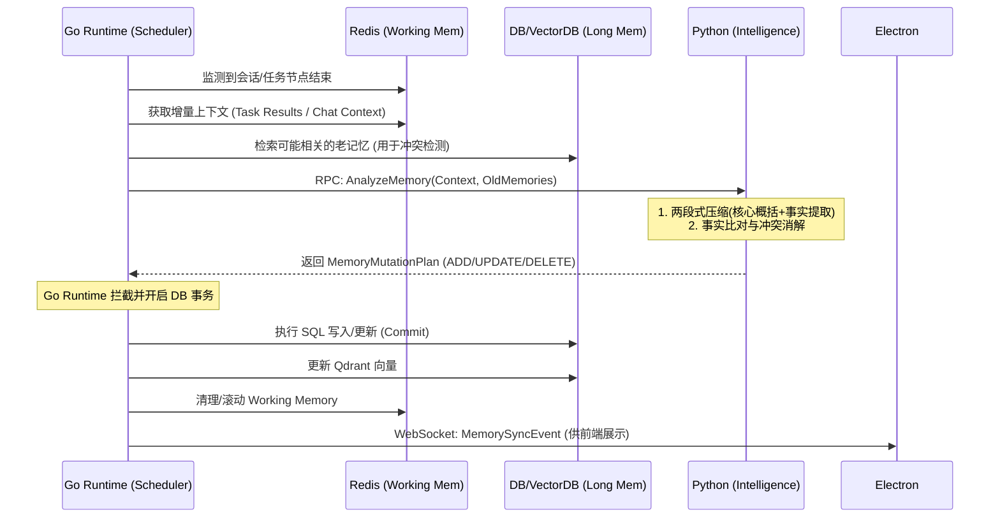

# 1. 章节目标

本文档旨在为 Luna 桌面 AI 助理定义**多层记忆系统（Multi-layer Memory System）**的技术架构与落地规范。文档将详细规定工作域与关系域的记忆隔离机制、短期/中期/长期记忆的流转规则、两段式摘要压缩策略，以及由 Go Runtime 主导、Python AI Service 辅助执行的记忆一致性提交流程，为后端开发、算法开发及数据库设计提供直接依据。

---

# 2. 设计背景与问题定义

在 Luna “陪伴式人格 + 长期记忆 + 主动行为”的目标下，传统的“滑动窗口上下文”面临以下严峻问题：

1. **上下文污染**：任务执行过程中的日志、API 结果与用户的日常闲聊混合，导致模型在决策时抓错重点。
2. **事实冲突与遗忘**：用户偏好发生变化（如：“我以前喜欢吃辣，现在不了”）时，单纯追加历史会导致模型输出随机。
3. **经验无法沉淀**：Agent 在调用工具失败后，下次遇到同类问题依然会重犯，缺乏跨会话的“反思”能力。
4. **状态机与智能解耦困难**：若由 AI 端直接修改数据库，会导致任务引擎（Go）的状态机与底层数据不一致，无法实现可靠的中断恢复。

---

# 3. 核心设计思路

本系统采用**双域四层结构**，并严格遵守 Go 作为唯一任务编排权威的原则。

* **双域隔离**：
  * **任务域（Task Domain）**：关注“这件事怎么做”。
  * **关系域（Relationship Domain）**：关注“用户是谁、如何沟通”。
* **四层记忆**：
  * **工作记忆（Working Memory）**：短期，毫秒级，存 Redis。记录当前执行态和会话上下文。
  * **语义记忆（Semantic Memory）**：长期，存 DB/VectorDB。记录事实、文档、用户画像、长期偏好。
  * **情景记忆（Episodic Memory）**：长期，存 DB/VectorDB。记录经验教训、情绪反思、错误规避策略。
  * **程序记忆（Procedural Memory）**：跨域共享，存 Redis（会话级）或 DB（全局级）。记录系统设定的硬规则、格式约束。
* **两段式压缩策略**：对冗长对话或任务日志进行“核心概括（Summary） + 关键事实提取（Key Facts）”的双轨压缩。
* **写提交编排（Memory Write Commit Orchestration）**：Python 仅负责“识别冲突、提取事实、生成更新指令（ADD/UPDATE/DELETE）”，实际的数据库修改和 Redis 淘汰必须由 Go Runtime 统一 Commit。

---

# 4. 模块职责与边界

* **Workflow Runtime Layer (Golang)**：
  * **职责**：持有所有记忆的读写权限；负责与 Redis、PostgreSQL、Qdrant 的直接交互；负责调度 Python 服务进行记忆提取；在 DAG 节点流转时将相关记忆组装注入 Payload；执行 Python 返回的 CRUD 意图。
  * **限制**：不负责语义理解和冲突推理。
* **AI Intelligence Layer (Python)**：
  * **职责**：提供无状态的 RPC 服务。接收 Go 传来的文本片段与旧记忆，使用 LLM 进行实体抽取、意图识别、事实冲突检测，并返回结构化的记忆更新动作（`MemoryMutationPlan`）。
  * **限制**：绝对禁止直接连接数据库或 Redis 进行数据写入。
* **Desktop Interaction Layer (Electron+TS)**：
  * **职责**：通过 WebSocket 接收 Go 推送的记忆状态更新事件，在 UI（如“助理记忆面板”）中展示。
  * **限制**：前端不持有任何记忆状态机，仅做视图渲染。

---

# 5. 核心数据结构

*(假设：持久化采用 PostgreSQL 存储关系与元数据，Qdrant 存储向量；缓存采用 Redis)*

### 5.1 Redis Key 设计 (短期/工作记忆)

* **任务域工作记忆**: `luna:mem:task:{plan_id}:working` (Hash) -> 存储当前节点的输入、输出、目标。
* **关系域工作记忆**: `luna:mem:chat:{session_id}:history` (List) -> 存储近期会话窗口（如最近 20 轮）。
* **程序记忆**: `luna:mem:proc:{agent_id}` (String/JSON) -> 存储当前活跃的约束规则。

### 5.2 PostgreSQL 数据库 Schema (长期/事实记忆)

```sql
CREATE TABLE long_term_memory (
    id VARCHAR(64) PRIMARY KEY,  -- 雪花算法 ID
    user_id VARCHAR(64) NOT NULL,
    domain VARCHAR(20) NOT NULL, -- 'TASK' 或 'RELATIONSHIP'
    memory_type VARCHAR(20) NOT NULL, -- 'SEMANTIC' (事实/偏好) 或 'EPISODIC' (经验/反思)
    content TEXT NOT NULL,       -- 具体事实或经验描述
    confidence FLOAT DEFAULT 1.0,-- 置信度 (0.0 - 1.0)
    source_context TEXT,         -- 来源上下文摘要 (便于审计)
    created_at TIMESTAMP DEFAULT CURRENT_TIMESTAMP,
    updated_at TIMESTAMP DEFAULT CURRENT_TIMESTAMP
);

CREATE INDEX idx_user_domain_type ON long_term_memory(user_id, domain, memory_type);
```

### 5.3 Python 到 Go 的记忆更新指令 (JSON Schema)

Python 服务通过 gRPC 返回给 Go 的指令结构：

```json
{
  "mutations": [
    {
      "action": "UPDATE",
      "target_id": "snowflake-id-of-existing-memory",
      "domain": "RELATIONSHIP",
      "memory_type": "SEMANTIC",
      "new_content": "用户现在更喜欢无糖咖啡，不再加糖",
      "confidence": 0.95,
      "reasoning": "用户明确表达了口味改变"
    },
    {
      "action": "ADD",
      "domain": "TASK",
      "memory_type": "EPISODIC",
      "new_content": "调用天气 API 时若遇到 504，应直接使用缓存而不是重试",
      "confidence": 0.90,
      "reasoning": "连续两次重试均超时，引发了异常降级"
    }
  ]
}
```

---

# 6. 核心流程 / 时序

### 6.1 记忆检索与上下文组装时序

1. **Go Runtime** 收到用户输入或触发主动 Task。
2. **Go Runtime** 从 Redis 读取 `Working Memory`。
3. **Go Runtime** 根据输入内容生成 Embedding（调用 Python 接口），去 Qdrant 检索相关的 `Semantic` 和 `Episodic` Memory ID。
4. **Go Runtime** 去 PostgreSQL 补全事实详情。
5. **Go Runtime** 将提取到的各层记忆组装进 `Task Payload`。
6. 发送给 Python 执行推理。

### 6.2 记忆写入与冲突解决流程 (Mermaid)



---

# 7. 接口设计

### 7.1 gRPC 接口 (Go -> Python)

```protobuf
syntax = "proto3";
package memory;

service MemoryIntelligence {
  // 分析增量文本，提取并进行冲突消解
  rpc AnalyzeMemory(AnalyzeRequest) returns (AnalyzeResponse);

  // 两段式摘要生成
  rpc SummarizeContext(SummarizeRequest) returns (SummarizeResponse);
}

message AnalyzeRequest {
  string session_context = 1;
  repeated MemoryFact related_old_facts = 2; // Go 预先检索的相关老事实
}

message MemoryFact {
  string id = 1;
  string content = 2;
}

message AnalyzeResponse {
  repeated Mutation mutations = 1;
}

message Mutation {
  string action = 1; // ADD, UPDATE, DELETE, NOOP
  string target_id = 2; 
  string domain = 3; // TASK, RELATIONSHIP
  string memory_type = 4; // SEMANTIC, EPISODIC
  string content = 5;
  float confidence = 6;
}

message SummarizeResponse {
  string core_summary = 1;      // 核心概括 (用于连续对话)
  repeated string key_facts = 2; // 关键事实 (用于转存为长期记忆)
}
```

---

# 8. 状态管理机制

* **Working Memory (短期)**：使用 Redis List / Hash 维护。采用滑动窗口（如保留最近 20 轮或当前 DAG 节点的执行树）。超出窗口的数据，由 Go 异步推入后台队列，触发 Python 的 `SummarizeContext` 接口进行两段式摘要。
* **Memory Commit (写入一致性)**：Go 采用事务机制（PG Tx）。先写 PG，获取 ID，再写 Qdrant。如果 Qdrant 写入失败，PG 事务回滚，确保图文数据库与向量数据库一致。
* **记忆淘汰与清理**：
  * 置信度衰减：长时间未被检索（根据 `last_accessed_at`）且 `confidence < 0.3` 的事实，标记为 `ARCHIVED`，不再参与常规检索，仅存盘。

---

# 9. 异常处理与降级策略

1. **Python 抽取服务超时/宕机**：
   * *降级策略*：Go 取消当前记忆提取任务。新产生的上下文原样保留在 Redis，并标记为 `dirty`。待 Python 恢复后，通过补偿定时任务（Cron Worker）重新提取。不阻塞当前用户交互。
2. **向量数据库检索超时**：
   * *降级策略*：跳过长期记忆检索，仅携带 Redis 中的 Working Memory 和 Procedural Memory 继续执行。
3. **冲突消解失败（AI 幻觉导致了错误的 DELETE）**：
   * *兜底机制*：数据库采用软删除（Soft Delete）。任何 `UPDATE` 实际上是插入新记录并废弃老记录（版本控制）。提供审计链路，允许在 Electron 桌面端提供“记忆管理器”供用户手动纠错恢复。

---

# 10. 与其他模块的协作关系

* **与 DAG 调度引擎**：DAG 的 Node Lifecycle (Init -> Run -> Complete) 中，Complete 阶段会自动触发钩子，将 Node 结果送入 `Task Domain` 记忆总线。
* **与主动行为引擎**：主动任务（如“定时整理文件”）启动前，必须强制读取 `Procedural Memory`，确保不会越权（如“未经询问不可删除文件”规则）。

---

# 11. 配置项与可调参数

* `MEM_WORKING_WINDOW_SIZE` = 20 (Redis 保留的对话轮数)
* `MEM_SUMMARY_THRESHOLD` = 2000 (Token 超过该值触发后台摘要)
* `MEM_SIMILARITY_THRESHOLD` = 0.85 (Qdrant 向量检索的最小相关度得分)
* `MEM_CONFIDENCE_THRESHOLD` = 0.6 (Python 返回的突变置信度低于此值，Go 将拒绝自动 Commit，需用户在桌面端确认)

---

# 12. 可观测性与调试建议

* **Metrics 埋点**：
  * `memory_extraction_latency_ms`：Python 提取记忆的耗时。
  * `memory_conflict_resolution_count`：触发 UPDATE/DELETE 的次数（监控是否频繁误判）。
* **Log Fields**：
  * Go Runtime 在提交记忆时必须打印：`trace_id`, `action`, `domain`, `old_fact_id`, `new_fact_content`。
* **调试建议**：在 Electron 中开发一个隐藏的“DevTools: Memory Inspector”，通过 WebSocket 实时订阅 Go 发送的记忆快照，直观查看当前 Agent 持有的 Semantic/Episodic 记忆树。

---

# 13. 安全性与治理建议

1. **数据隔离**：本地优先。所有 SQLite/PostgreSQL 库必须在本地存储，禁止上传云端。
2. **敏感词与凭证过滤**：在 Go 将文本发往 Python (若配置了云端 OpenAI API) 之前，必须经过本地 Regex 过滤，清洗掉显式的 API Key、密码等信息，防止记忆泄露到云端模型。
3. **用户授权边界（主动行为）**：涉及“程序记忆”修改时，Go Runtime 必须下发请求到 Electron，弹出用户确认框（Gating）。未经用户同意，AI 不能自行修改底线规则。

---

# 14. 典型使用场景

* **场景 A：事实修正（关系域）**
  * 前置：DB中有语义记忆“用户喜欢在周末听摇滚”。
  * 输入：“我最近周末改听轻音乐了，摇滚太吵”。
  * 执行：Python 的 `AnalyzeMemory` 对比发现冲突，返回 `UPDATE` 指令。Go 接收后软删除旧事实，写入新事实“用户周末偏好听轻音乐”。
* **场景 B：错误规避（任务域）**
  * 前置：Agent 尝试用 `FileSearch` 工具检索一个 5GB 的大文件导致超时崩溃。
  * 执行：Go Runtime 捕获错误。向 Python 请求反思。Python 提取出情景记忆：“处理大于 1GB 的文件时，FileSearch 会超时”。
  * Go 将此作为 `EPISODIC` 存入 DB。下次遇到同类任务时，检索到该记忆，Agent 决定直接拒绝或调用其他工具。

---

# 15. 示例代码或伪代码

**Go Runtime: 记忆提交协调器 (Memory Orchestrator)**

```go
// 假设已在 Go Runtime 环境下
func (m *MemoryManager) ProcessMemoryMutations(ctx context.Context, sessionText string) error {
    // 1. 检索相似旧记忆
    oldFacts, err := m.VectorStore.SearchSimilar(ctx, sessionText, 5)
    if err != nil {
        return err // 降级处理略
    }

    // 2. 调用 Python RPC
    req := &pb.AnalyzeRequest{
        SessionContext: sessionText,
        RelatedOldFacts: mapToProto(oldFacts),
    }
    resp, err := m.PyClient.AnalyzeMemory(ctx, req)
    if err != nil {
        return err // 补偿逻辑略
    }

    // 3. 开启 DB 事务，Go 主导写入
    tx, err := m.DB.BeginTx(ctx, nil)
    if err != nil {
        return err
    }
    defer tx.Rollback()

    for _, mut := range resp.Mutations {
        if mut.Confidence < 0.6 {
            // 置信度不足，发给 Electron 需要用户确认 (Gating)
            m.EventBus.Publish("memory_require_confirm", mut)
            continue
        }

        switch mut.Action {
        case "ADD":
            insertFact(tx, mut)
            m.VectorStore.Upsert(ctx, mut.TargetId, mut.Content) // 同步写向量
        case "UPDATE":
            softDeleteFact(tx, mut.TargetId)
            insertFact(tx, mut) // 作为新记录插入
            m.VectorStore.Delete(ctx, mut.TargetId)
            m.VectorStore.Upsert(ctx, generateNewId(), mut.Content)
        case "DELETE":
            softDeleteFact(tx, mut.TargetId)
            m.VectorStore.Delete(ctx, mut.TargetId)
        }
    }

    return tx.Commit()
}
```

---

# 16. 常见坑与规避方式

1. **无限滚雪球效应（Context Bloat）**：
   * *坑*：长期记忆不加选择地提取，导致 Prompt 体积暴增。
   * *规避*：严格执行两段式压缩。长文本必须先转化为 Key Facts 列表，且 VectorDB 检索时限制 `Top_K=5`，按时间戳和置信度做衰减排序。
2. **AI 过度修改记忆（幻觉修改）**：
   * *坑*：模型因为闲聊中一句玩笑话，清空了关键配置。
   * *规避*：区分 `Procedural Memory`（程序约束）与普通事实。程序记忆的修改必须通过特定工具链（Tool Routing）且强制 User Gating（Go 拦截并要求前端确认）。
3. **读写竞态条件**：
   * *坑*：Python 正在生成记忆更新计划时，用户又输入了新对话，导致旧快照覆盖新状态。
   * *规避*：Go 在触发 Memory Commit 时持有该 Session 的分布式锁（基于 Redis），更新完成前，新的输入进入等待队列或不携带争议上下文。

---

# 17. 落地实施建议

1. **一期（MVP）**：仅实现 Redis Working Memory 和基础的两段式摘要（不区分域），优先跑通 Go -> Python -> Redis 的主链路。
2. **二期（核心演进）**：引入 PostgreSQL + Qdrant（或 pgvector），实现 Task/Relationship 双域隔离，上线冲突检测。
3. **三期（完善机制）**：上线 Episodic Memory（经验反思），联动 DAG 节点的错误恢复机制；增加前端记忆管理面板与人工干预工作流。
