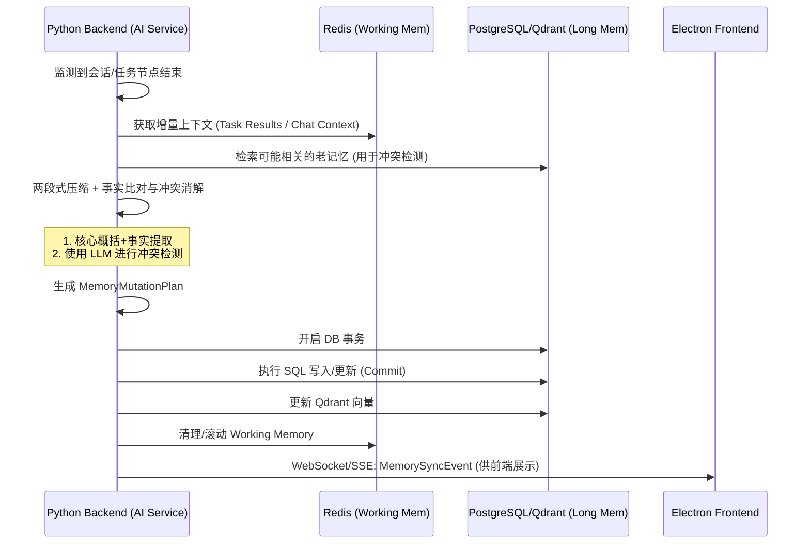

# 1. 章节目标

本文档旨在为 Luna 桌面 AI 助理定义**多层记忆系统（Multi-layer Memory System）**的技术架构与落地规范。文档将详细规定工作域与关系域的记忆隔离机制、短期/中期/长期记忆的流转规则、两段式摘要压缩策略，以及由 Python 统一控制面主导、Python AI Service 辅助执行的记忆一致性提交流程，为后端开发、算法开发及数据库设计提供直接依据。

---

# 2. 设计背景与问题定义

在 Luna "陪伴式人格 + 长期记忆 + 主动行为"的目标下，传统的"滑动窗口上下文"面临以下严峻问题：

1. **上下文污染**：任务执行过程中的日志、API 结果与用户的日常闲聊混合，导致模型在决策时抓错重点。
2. **事实冲突与遗忘**：用户偏好发生变化（如："我以前喜欢吃辣，现在不了"）时，单纯追加历史会导致模型输出随机。
3. **经验无法沉淀**：Agent 在调用工具失败后，下次遇到同类问题依然会重犯，缺乏跨会话的"反思"能力。
4. **状态机与智能解耦困难**：若由 LLM 端直接修改数据库，会导致任务引擎的状态机与底层数据不一致，无法实现可靠的中断恢复。

---

# 3. 核心设计思路

本系统采用**双域四层结构**，并严格遵守 Python 作为唯一任务编排权威的原则。

* **双域隔离**：
  * **任务域（Task Domain）**：关注"这件事怎么做"。
  * **关系域（Relationship Domain）**：关注"用户是谁、如何沟通"。
* **四层记忆**：
  * **工作记忆（Working Memory）**：短期，毫秒级，存 Redis。记录当前执行态和会话上下文。
  * **语义记忆（Semantic Memory）**：长期，存 DB/VectorDB。记录事实、文档、用户画像、长期偏好。
  * **情景记忆（Episodic Memory）**：长期，存 DB/VectorDB。记录经验教训、情绪反思、错误规避策略。
  * **程序记忆（Procedural Memory）**：跨域共享，存 Redis（会话级）或 DB（全局级）。记录系统设定的硬规则、格式约束。
* **两段式压缩策略**：对冗长对话或任务日志进行"核心概括（Summary） + 关键事实提取（Key Facts）"的双轨压缩。
* **写提交编排（Memory Write Commit Orchestration）**：Python 负责完整的"识别冲突、提取事实、生成更新指令、执行数据库操作"全链路，Python 是记忆的 Single Source of Truth。

---

# 4. 模块职责与边界

* **Python Backend (AI Service)**：
  * **职责**：持有所有记忆的读写权限；负责与 Redis、PostgreSQL、Qdrant 的直接交互；负责 LangGraph 图节点流转时记忆的检索、组装与注入 Payload；在 LangGraph Node Complete 阶段触发遗忘曲线管理和记忆写入。
  * **限制**：前端的记忆状态显示必须通过 WebSocket/SSE 推送的镜像，不允许前端直接查询数据库。
* **Electron Frontend (Desktop UI)**：
  * **职责**：通过 WebSocket/SSE 接收 Python 推送的记忆状态更新事件，在 UI（如"助理记忆面板"）中展示。
  * **限制**：前端不持有任何记忆状态机，仅做视图渲染。

---

# 5. 核心数据结构

*(假设：持久化采用 PostgreSQL 存储关系与元数据，Qdrant 存储向量；缓存采用 Redis)*

### 5.1 Redis Key 设计 (短期/工作记忆)

* **任务域工作记忆**: `luna:mem:task:{plan_id}:working` (Hash) -> 存储当前节点的输入、输出、目标。
* **关系域工作记忆**: `luna:mem:chat:{session_id}:history` (List) -> 存储近期会话窗口（如最近 20 轮）。
* **程序记忆**: `luna:mem:proc:{agent_id}` (String/JSON) -> 存储当前活跃的约束规则。

### 5.2 PostgreSQL 数据库 Schema (长期/事实记忆)

```sql
CREATE TABLE long_term_memory (
    id VARCHAR(64) PRIMARY KEY,  -- 雪花算法 ID
    user_id VARCHAR(64) NOT NULL,
    domain VARCHAR(20) NOT NULL, -- 'TASK' 或 'RELATIONSHIP'
    memory_type VARCHAR(20) NOT NULL, -- 'SEMANTIC' (事实/偏好) 或 'EPISODIC' (经验/反思)
    content TEXT NOT NULL,       -- 具体事实或经验描述
    confidence FLOAT DEFAULT 1.0,-- 置信度 (0.0 - 1.0)
    source_context TEXT,         -- 来源上下文摘要 (便于审计)
    created_at TIMESTAMP DEFAULT CURRENT_TIMESTAMP,
    updated_at TIMESTAMP DEFAULT CURRENT_TIMESTAMP
);

CREATE INDEX idx_user_domain_type ON long_term_memory(user_id, domain, memory_type);
```

### 5.3 记忆管理器的内部数据结构 (Python)

```python
from pydantic import BaseModel, Field
from typing import List, Optional, Literal

class MemoryMutation(BaseModel):
    """记忆变更指令"""
    action: Literal["ADD", "UPDATE", "DELETE", "NOOP"] = Field(..., description="变更操作类型")
    target_id: Optional[str] = Field(None, description="需要更新的记忆 ID（ADD 时为 None）")
    domain: Literal["TASK", "RELATIONSHIP"] = Field(..., description="所属域")
    memory_type: Literal["SEMANTIC", "EPISODIC"] = Field(..., description="记忆类型")
    content: str = Field(..., description="记忆内容文本")
    confidence: float = Field(..., ge=0.0, le=1.0, description="置信度")
    reasoning: Optional[str] = Field(None, description="变更原因说明")

class MemoryMutationPlan(BaseModel):
    """记忆变更计划"""
    mutations: List[MemoryMutation] = Field(..., description="变更指令列表")

class MemoryContext(BaseModel):
    """注入到 LLM Prompt 中的记忆上下文"""
    working_summary: Optional[str] = Field(None, description="当前会话摘要")
    relevant_facts: List[str] = Field(default_factory=list, description="关联的长期记忆事实")
    procedural_rules: List[str] = Field(default_factory=list, description="程序规则约束")
```

---

# 6. 核心流程 / 时序

### 6.1 记忆检索与上下文组装时序

1. **Python Backend** 收到用户输入或触发主动 Task。
2. **Python Backend** 从 Redis 读取 `Working Memory`。
3. **Python Backend** 根据输入内容生成 Embedding（调用 LLM 或本地 Embedding 模型），去 Qdrant 检索相关的 `Semantic` 和 `Episodic` Memory ID。
4. **Python Backend** 去 PostgreSQL 补全事实详情。
5. **Python Backend** 将提取到的各层记忆组装进 LLM Prompt Context。
6. **Python Backend** 调用 LLM 执行推理并生成回复。

### 6.2 记忆写入与冲突解决流程 (Mermaid)



---

# 7. 接口设计

### 7.1 Python 内部接口 (Memory Manager)

```python
import abc
from typing import List, Optional

class BaseMemoryManager(abc.ABC):
    @abc.abstractmethod
    async def get_working_memory(self, session_id: str) -> MemoryContext:
        """获取当前工作记忆"""
        pass

    @abc.abstractmethod
    async def retrieve_relevant_memories(self, query: str, top_k: int = 5) -> List[str]:
        """检索相关的长期记忆"""
        pass

    @abc.abstractmethod
    async def analyze_and_commit(self, session_id: str, context: str) -> MemoryMutationPlan:
        """分析上下文并执行记忆变更"""
        pass

    @abc.abstractmethod
    async def apply_mutations(self, plan: MemoryMutationPlan) -> bool:
        """执行记忆变更计划（DB 事务写入）"""
        pass
```

---

# 8. 状态管理机制

* **Working Memory (短期)**：使用 Redis List / Hash 维护。采用滑动窗口（如保留最近 20 轮或当前 LangGraph 节点的执行树）。超出窗口的数据，由 Python 异步推入后台队列，触发 `SummarizeContext` 接口进行两段式摘要。
* **Memory Commit (写入一致性)**：Python 采用事务机制（PG Tx）。先写 PG，获取 ID，再写 Qdrant。如果 Qdrant 写入失败，PG 事务回滚，确保图文数据库与向量数据库一致。
* **记忆淘汰与清理**：
  * 置信度衰减：长时间未被检索（根据 `last_accessed_at`）且 `confidence < 0.3` 的事实，标记为 `ARCHIVED`，不再参与常规检索，仅存盘。

---

# 9. 异常处理与降级策略

1. **LLM 抽取服务超时/宕机**：
   * *降级策略*：Python 取消当前记忆提取任务。新产生的上下文原样保留在 Redis，并标记为 `dirty`。待 LLM 恢复后，通过补偿定时任务（Cron Worker）重新提取。不阻塞当前用户交互。
2. **向量数据库检索超时**：
   * *降级策略*：跳过长期记忆检索，仅携带 Redis 中的 Working Memory 和 Procedural Memory 继续执行。
3. **冲突消解失败（AI 幻觉导致了错误的 DELETE）**：
   * *兜底机制*：数据库采用软删除（Soft Delete）。任何 `UPDATE` 实际上是插入新记录并废弃老记录（版本控制）。提供审计链路，允许在 Electron 桌面端提供"记忆管理器"供用户手动纠错恢复。

---

# 10. 与其他模块的协作关系

* **与 LangGraph 工作流引擎**：LangGraph 的 Node Lifecycle 中，节点执行完成后会自动触发钩子，将 Node 结果送入 `Task Domain` 记忆总线。
* **与主动行为引擎**：主动任务（如"定时整理文件"）启动前，必须强制读取 `Procedural Memory`，确保不会越权（如"未经询问不可删除文件"规则）。

---

# 11. 配置项与可调参数

* `MEM_WORKING_WINDOW_SIZE` = 20 (Redis 保留的对话轮数)
* `MEM_SUMMARY_THRESHOLD` = 2000 (Token 超过该值触发后台摘要)
* `MEM_SIMILARITY_THRESHOLD` = 0.85 (Qdrant 向量检索的最小相关度得分)
* `MEM_CONFIDENCE_THRESHOLD` = 0.6 (Python 记忆模块返回的突变置信度低于此值时，将拒绝自动 Commit，需用户在桌面端确认)

---

# 12. 可观测性与调试建议

* **Metrics 埋点**：
  * `memory_extraction_latency_ms`：Python 提取记忆的耗时。
  * `memory_conflict_resolution_count`：触发 UPDATE/DELETE 的次数（监控是否频繁误判）。
* **Log Fields**：
  * Python Backend 在提交记忆时必须打印：`trace_id`, `action`, `domain`, `old_fact_id`, `new_fact_content`。
* **调试建议**：在 Electron 中开发一个隐藏的"DevTools: Memory Inspector"，通过 WebSocket/SSE 实时订阅 Python 发送的记忆快照，直观查看当前 Agent 持有的 Semantic/Episodic 记忆树。

---

# 13. 安全性与治理建议

1. **数据隔离**：本地优先。所有 PostgreSQL 库必须在本地存储，禁止上传云端。
2. **敏感词与凭证过滤**：在 Python 将文本发往云端大模型 API 之前，必须经过本地 Regex 过滤，清洗掉显式的 API Key、密码等信息，防止记忆泄露到云端模型。
3. **用户授权边界（主动行为）**：涉及"程序记忆"修改时，Python 必须通过 WebSocket/SSE 下发请求到 Electron，弹出用户确认框（Gating）。未经用户同意，AI 不能自行修改底线规则。

---

# 14. 典型使用场景

* **场景 A：事实修正（关系域）**
  * 前置：DB中有语义记忆"用户喜欢在周末听摇滚"。
  * 输入："我最近周末改听轻音乐了，摇滚太吵"。
  * 执行：Python 的 `MemoryManager.analyze_and_commit` 对比发现冲突，执行 `UPDATE` 指令。软删除旧事实，写入新事实"用户周末偏好听轻音乐"。
* **场景 B：错误规避（任务域）**
  * 前置：Agent 尝试用 `FileSearch` 工具检索一个 5GB 的大文件导致超时崩溃。
  * 执行：Python 后端捕获错误，触发记忆反思。LLM 提取出情景记忆："处理大于 1GB 的文件时，FileSearch 会超时"。
  * Python 将此作为 `EPISODIC` 存入 DB。下次遇到同类任务时，检索到该记忆，Agent 决定直接拒绝或调用其他工具。

---

# 15. 示例代码或伪代码

**Python Backend: 记忆管理器 (Memory Manager)**

```python
from typing import List, Optional
import asyncio
from dataclasses import dataclass

class MemoryManager(BaseMemoryManager):
    """Python 端记忆管理器，统一负责记忆的检索、分析与写入"""

    async def get_working_memory(self, session_id: str) -> MemoryContext:
        """从 Redis 获取当前会话的工作记忆"""
        raw = await self.redis.hgetall(f"luna:mem:chat:{session_id}:history")
        # 解析并返回 MemoryContext
        ...

    async def retrieve_relevant_memories(self, query: str, top_k: int = 5) -> List[str]:
        """从 Qdrant 检索相关长期记忆"""
        embedding = await self.embedding_service.embed(query)
        results = await self.qdrant.search(
            collection_name="long_term_memory",
            query_vector=embedding,
            limit=top_k,
            score_threshold=0.85
        )
        return [r.payload["content"] for r in results]

    async def analyze_and_commit(self, session_id: str, context: str) -> MemoryMutationPlan:
        """分析上下文，生成记忆变更计划并执行"""
        # 1. 检索现有记忆用于冲突检测
        old_memories = await self.retrieve_relevant_memories(context)

        # 2. 调用 LLM 进行冲突分析
        plan = await self._llm_analyze(context, old_memories)

        # 3. 执行变更（若置信度足够）
        await self.apply_mutations(plan)

        return plan

    async def apply_mutations(self, plan: MemoryMutationPlan) -> bool:
        """执行记忆变更计划（事务写入）"""
        async with self.db.transaction():
            for mut in plan.mutations:
                if mut.confidence < 0.6:
                    # 置信度不足，发给 Electron 需要用户确认
                    await self._request_user_confirmation(mut)
                    continue

                if mut.action == "ADD":
                    new_id = generate_snowflake_id()
                    await self.db.execute(
                        "INSERT INTO long_term_memory (id, domain, memory_type, content, confidence) VALUES (...)",
                        new_id, mut.domain, mut.memory_type, mut.content, mut.confidence
                    )
                    await self.qdrant.upsert(...)
                elif mut.action == "UPDATE":
                    await self.db.execute("UPDATE long_term_memory SET deleted_at = NOW() WHERE id = ?", mut.target_id)
                    # 插入新记录
                    ...
                elif mut.action == "DELETE":
                    await self.db.execute("UPDATE long_term_memory SET deleted_at = NOW() WHERE id = ?", mut.target_id)
                    await self.qdrant.delete(mut.target_id)
        return True
```

---

# 16. 常见坑与规避方式

1. **无限滚雪球效应（Context Bloat）**：
   * *坑*：长期记忆不加选择地提取，导致 Prompt 体积暴增。
   * *规避*：严格执行两段式压缩。长文本必须先转化为 Key Facts 列表，且 VectorDB 检索时限制 `Top_K=5`，按时间戳和置信度做衰减排序。
2. **AI 过度修改记忆（幻觉修改）**：
   * *坑*：模型因为闲聊中一句玩笑话，清空了关键配置。
   * *规避*：区分 `Procedural Memory`（程序约束）与普通事实。程序记忆的修改必须通过特定工具链（Tool Routing）且强制 User Gating（Python 拦截并要求前端确认）。
3. **读写竞态条件**：
   * *坑*：Python 正在生成记忆更新计划时，用户又输入了新对话，导致旧快照覆盖新状态。
   * *规避*：Python 在触发 Memory Commit 时持有该 Session 的分布式锁（基于 Redis），更新完成前，新的输入进入等待队列或不携带争议上下文。

---

# 17. 落地实施建议

1. **一期（MVP）**：仅实现 Redis Working Memory 和基础的两段式摘要（不区分域），优先跑通 Python -> Redis -> PostgreSQL 的主链路。
2. **二期（核心演进）**：引入 PostgreSQL + Qdrant（或 pgvector），实现 Task/Relationship 双域隔离，上线冲突检测。
3. **三期（完善机制）**：上线 Episodic Memory（经验反思），联动 LangGraph 节点的错误恢复机制；增加前端记忆管理面板与人工干预工作流。
