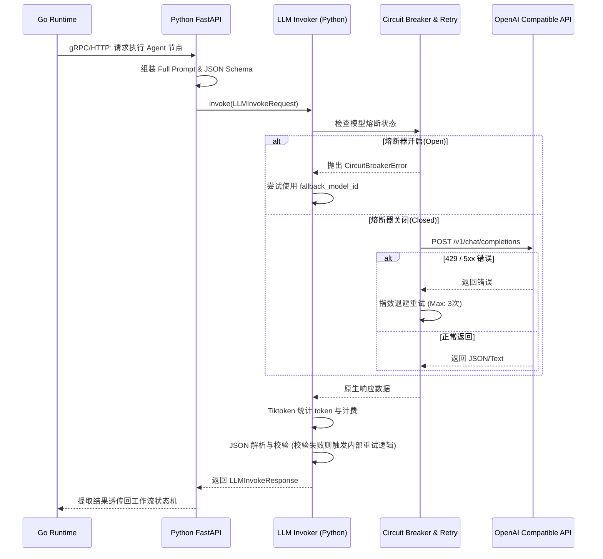

### 1. 章节目标

本文档旨在为 Luna 项目设计并规范 **大模型接入与统一调用层（LLM Access and Unified Invocation Layer）**。该层位于 Python AI Intelligence Layer 的底层基础设施侧，向上为 Python 侧的推理逻辑（或通过 gRPC/HTTP 直接透传给 Go Runtime）提供纯粹的、无状态的模型调用能力。

核心目标包括：

1. **统一接口**：仅支持 OpenAI 兼容的 Completion/Chat API，屏蔽不同厂商（如本地 vLLM、Ollama 或云端 API）的底层 HTTP 差异。
2. **纯粹执行**：实现“Full Prompt In, Result Out”，本层不对提示词进行二次组装，完全忠于上层输入。
3. **高可用性**：内置重试、超时、熔断、降级与限流机制（Resilience），防止底层模型抖动拖垮整个 Agent 系统。
4. **结构化保障**：提供 JSON 结构化输出约束，并在异常时执行解析兜底策略。
5. **成本与性能度量**：集成 Token 精准统计与计费估算。

---

### 2. 设计背景与问题定义

在 Agent 系统中，大模型调用是最核心且最脆弱的环节。

* **网络抖动与限流**：第三方 API 经常抛出 429 (Rate Limit) 或 502 (Bad Gateway)。
* **输出不稳定性**：即使使用强大的模型，也可能出现 JSON 格式破损，导致 Go 端的强类型反序列化崩溃。
* **状态机阻塞**：如果大模型调用卡死且无超时限制，将导致 Go Runtime 中的 Worker 协程长期挂起，耗尽资源。
* **兼容性蔓延**：如果允许直接引入千帆、DashScope 等各家专有 SDK，将导致依赖爆炸。因此，**系统强制要求所有模型服务必须提供 OpenAI 兼容接口**，将复杂性推给模型服务提供商或网关（如 OneAPI），本层只对接 OpenAI API 规范。

---

### 3. 核心设计思路

1. **唯一通道**：基于官方 `openai-python` 库 (v1.x) 构建单例 Client，所有请求必须经过该网关方法。
2. **职责极简**：输入包含 `messages` (全量 Prompt)、`model_id`、`schema` 等控制参数，输出结构化 `data` 或 `stream`，不做业务语义理解。
3. **防御性编程 (Resilience)**：
   * **重试 (Retry)**：针对瞬态错误（如网络超时、50x 错误）采用指数退避重试。
   * **熔断 (Circuit Breaker)**：当某模型 ID 连续失败超过阈值时，直接短路报错，避免雪崩。
   * **降级 (Fallback)**：允许在请求参数中配置 `fallback_model_id`，主模型熔断时自动切换。
4. **结构化强制 (Structured Outputs)**：优先使用 OpenAI 官方的 `response_format: {"type": "json_schema"}` 结合 Pydantic 进行严格约束。
5. **双轨返回**：明确区分“同步结构化调用”（用于规划、决策、Memory 提取）与“流式调用”（用于用户侧聊天打字机效果或 TTS 流式投递）。

---

### 4. 模块职责与边界

| 模块                      | 职责                                      | 边界约束                                                |
|:----------------------- |:--------------------------------------- |:--------------------------------------------------- |
| **Python LLM Invoker**  | 代理请求、处理熔断重试、统计 Token、解析 JSON。           | **禁止**修改 Prompt 业务内容；**禁止**维持任何业务会话上下文（无状态）。        |
| **Python Agent/Tool 层** | 组装 Prompt，定义 JSON Schema 结构，调用 Invoker。 | 依赖 Invoker 提供稳定的底层 LLM 交互。                          |
| **Go Runtime**          | 将状态机流转需求发给 Python 层，接收最终结果。             | **禁止**直接调用第三方大模型接口，必须通过 Python 层流转。控制整体 Context 超时。 |

---

### 5. 核心数据结构

定义 Python 侧统一的模型调用接口数据结构（Pydantic Models）：

```python
from pydantic import BaseModel, Field
from typing import List, Dict, Any, Optional, Union

class Message(BaseModel):
    role: str = Field(..., description="system, user, assistant, tool")
    content: str

class LLMInvokeRequest(BaseModel):
    model_id: str = Field(..., description="主调模型ID，如 gpt-4o")
    fallback_model_id: Optional[str] = Field(None, description="降级模型ID，如 gpt-4o-mini")
    messages: List[Message] = Field(..., description="全量对话上下文")
    temperature: float = Field(0.7, description="采样温度")
    max_tokens: int = Field(2048)
    stream: bool = Field(False, description="是否开启流式返回")
    response_schema: Optional[Dict[str, Any]] = Field(None, description="JSON Schema 定义（若需结构化输出）")

class TokenUsage(BaseModel):
    prompt_tokens: int = 0
    completion_tokens: int = 0
    total_tokens: int = 0
    estimated_cost_usd: float = 0.0

class LLMInvokeResponse(BaseModel):
    content: str = Field(..., description="文本回复或 JSON 序列化字符串")
    parsed_json: Optional[Dict[str, Any]] = Field(None, description="解析成功后的 JSON 对象")
    usage: TokenUsage
    model_used: str = Field(..., description="实际使用的模型（可能是降级模型）")
    is_fallback: bool = Field(False, description="是否触发了降级")
```

---

### 6. 核心流程 / 时序

以下展示结构化同步调用的完整生命周期，包含熔断、重试与结构化解析。



---

### 7. 接口设计

#### Python 内部统一调用接口定义（供上层 AI 逻辑调用）

```python
import abc

class BaseLLMClient(abc.ABC):
    @abc.abstractmethod
    async def invoke(self, req: LLMInvokeRequest) -> LLMInvokeResponse:
        """同步/阻塞结构化调用"""
        pass

    @abc.abstractmethod
    async def stream_invoke(self, req: LLMInvokeRequest):
        """异步流式调用，返回 AsyncGenerator"""
        pass
```

*说明*：此处 `invoke` 虽然是 `async def`，但业务语义上是“等待完整结果返回”；`stream_invoke` 则 `yield` 数据块。

---

### 8. 状态管理机制

本层本身**不维护任何业务状态**（如历史聊天记录），严格遵守无状态原则。唯一维护的是 **Resilience 状态**：

* **熔断器状态机**：维护每个 `model_id` 的状态 `Closed` (正常), `Open` (阻断请求, 直接失败/降级), `Half-Open` (探活)。
* **令牌桶/并发计数**：基于内存（如 `aiolimiter`）或 Redis 实现的并发调用限制，防止瞬间流量打挂本地 VRAM 或触发云端封号。

---

### 9. 异常处理与降级策略

1. **网络级异常 (Timeout / Connection Error)**：
   * 策略：`Tenacity` 库介入，等待 `1s, 2s, 4s` 重试最多 3 次。
2. **限流异常 (HTTP 429 Rate Limit)**：
   * 策略：解析 Header 中的 `Retry-After`，休眠对应时间后重试。若无，走指数退避。
3. **模型故障/熔断触发 (HTTP 500/502/503)**：
   * 策略：触发熔断器。若请求中提供了 `fallback_model_id` (如主模型 `Qwen-Max` 挂了，降级到本地 `Qwen-7B`)，则切换 Model ID 重新发起单次请求。
4. **JSON 结构化解析失败 (Malformed JSON)**：
   * *背景*：即使有 Schema，弱模型仍可能返回带 markdown `` ```json `` 标记或字段缺失的数据。
   * 策略：正则表达式剥离 Markdown block -> JSON `loads` -> 若失败，附带解析错误信息，要求模型“自我修正 (Self-Correction)”重试一次（不计入正常网络重试）。

---

### 10. 与其他模块的协作关系

* **Go Runtime**：通过 Context 传递超时信号。Go 端取消请求（如用户点击“停止生成”），Python 端必须捕获 `asyncio.CancelledError`，并断开与 OpenAI 的 TCP 连接。
* **Agent Cognitive Logic**：提供上层包装，例如 `summarize_memory(text)` 会调用 `invoke` 并传入 `{"summary": "str", "entities": ["str"]}` 的 JSON Schema。

---

### 11. 配置项与可调参数

通过环境变量或统一配置类加载：

```yaml
llm:
  base_url: "https://api.openai.com/v1" # 或 http://localhost:11434/v1
  api_key: "sk-xxxx" # 或本地模型的占位符
  timeout_seconds: 60
  max_retries: 3
  circuit_breaker:
    failure_threshold: 5
    recovery_timeout_sec: 60
  pricing: # 计费表估算 (美元 / 1K Token)
    gpt-4o: { prompt: 0.005, completion: 0.015 }
    gpt-4o-mini: { prompt: 0.00015, completion: 0.0006 }
```

---

### 12. 可观测性与调试建议

1. **日志记录 (Logging)**：
   * `DEBUG` 级别：打印完整 `messages` 载荷及模型的原始返回体。
   * `INFO` 级别：记录 `[LLM Invoke] Model: gpt-4o | TTFT: 1.2s | Total Time: 3.5s | Tokens: 1250 | Cost: $0.003`。
2. **TTFT (首字延迟)**：在流式接口中，必须记录发出请求到 `yield` 第一个 token 的时间差，这是评估本地/云端模型响应最核心的指标。
3. **Trace ID 透传**：Go 端下发的 `TraceID` 必须打入 Python 日志上下文中，确保全链路审计。

---

### 13. 安全性与治理建议

1. **防 Prompt 注入限制**：底层不负责识别提示词攻击，但通过强制启用 `max_tokens` 限制，防止因模型进入循环输出而耗尽计算资源。
2. **API Key 隔离**：如果对接多家供应商，应当使用 OneAPI 或类似代理层统一鉴权，Python 端尽量只维护一把 Key，降低秘钥泄漏风险。

---

### 14. 典型使用场景

* **场景 1：主动行为规划 (Sync + JSON)**
  Go 端唤醒 Python Agent，要求基于当前 Memory 进行今日工作总结。Python 层组装好 Prompt 和 `SummarySchema`，调用 `invoke()` 阻塞获取结构化结果，处理完成后返回 Go。
* **场景 2：语音聊天对话 (Stream + Text)**
  用户对桌面宠物说话，Go 端透传给 Python，Python 层调用 `stream_invoke()`，每次 `yield` 的文本切片通过 gRPC 流或 WS 推回 Go，Go 立刻转发给 TTS 引擎发声。

---

### 15. 示例代码或伪代码

#### 15.1 基础调用与重试装饰器 (Python)

```python
import os
import json
import asyncio
from typing import AsyncGenerator
from pydantic import ValidationError
from openai import AsyncOpenAI
from tenacity import retry, stop_after_attempt, wait_exponential, retry_if_exception_type
import tiktoken

client = AsyncOpenAI(
    base_url=os.getenv("OPENAI_BASE_URL", "https://api.openai.com/v1"),
    api_key=os.getenv("OPENAI_API_KEY", "dummy")
)

# 计算 Token (假设均为 OpenAI 兼容编码)
def count_tokens(text: str, model_name: str = "gpt-4o") -> int:
    try:
        encoding = tiktoken.encoding_for_model(model_name)
    except KeyError:
        encoding = tiktoken.get_encoding("cl100k_base")
    return len(encoding.encode(text))

class LLMService:
    @retry(
        stop=stop_after_attempt(3),
        wait=wait_exponential(multiplier=1, min=2, max=10),
        retry=retry_if_exception_type(Exception), # 生产中应精细化捕获 Timeout/429
        reraise=True
    )
    async def invoke(self, req: LLMInvokeRequest) -> LLMInvokeResponse:
        messages_dict = [m.model_dump() for m in req.messages]

        # 组装请求参数
        kwargs = {
            "model": req.model_id,
            "messages": messages_dict,
            "temperature": req.temperature,
            "max_tokens": req.max_tokens,
        }

        # 处理结构化输出 (使用 OpenAI 2024年最新的 Structured Outputs)
        if req.response_schema:
            kwargs["response_format"] = {
                "type": "json_schema",
                "json_schema": {
                    "name": "structured_response",
                    "strict": True,
                    "schema": req.response_schema
                }
            }

        try:
            response = await client.chat.completions.create(**kwargs)
            choice = response.choices[0]
            content = choice.message.content

            # 尝试解析 JSON
            parsed_json = None
            if req.response_schema:
                try:
                    parsed_json = json.loads(content)
                except json.JSONDecodeError:
                    # TODO: 此处可触发 Self-Correction 重试逻辑
                    raise ValueError(f"Model failed to output valid JSON: {content}")

            # 统计与计费
            usage = TokenUsage(
                prompt_tokens=response.usage.prompt_tokens,
                completion_tokens=response.usage.completion_tokens,
                total_tokens=response.usage.total_tokens,
                estimated_cost_usd=self._estimate_cost(req.model_id, response.usage.prompt_tokens, response.usage.completion_tokens)
            )

            return LLMInvokeResponse(
                content=content,
                parsed_json=parsed_json,
                usage=usage,
                model_used=req.model_id,
                is_fallback=False
            )

        except Exception as e:
            # 简单降级逻辑 (生产环境中应独立为装饰器或断路器层)
            if req.fallback_model_id:
                # 记录告警日志...
                req.model_id = req.fallback_model_id
                req.fallback_model_id = None
                # 注意: 这里实际应该退出当前重试块，进入新的 Fallback 重试逻辑，此处仅为伪代码简化
                return await self.invoke(req)
            raise e

    def _estimate_cost(self, model: str, p_tokens: int, c_tokens: int) -> float:
        # 查表逻辑... (省略)
        return 0.0

    async def stream_invoke(self, req: LLMInvokeRequest) -> AsyncGenerator[str, None]:
        # 类似实现，使用 stream=True
        pass
```

---

### 16. 常见坑与规避方式

1. **`strict: true` 的坑**：OpenAI 最新的 Structured Outputs 开启 `strict=True` 时，Schema 中所有字段必须设为必填（`required`），并且不支持 `default` 值。如果业务模型转换出来的 JSON Schema 不满足规范，API 会直接 400 报错。
   * **规避**：封装一层 Schema Sanitizer，在传入 API 前自动校验并补齐 Schema 字段，剥离 default 属性。
2. **非 OpenAI 模型的 Token 统计偏差**：对于本地部署的 Qwen / GLM，使用 `tiktoken` (基于 OpenAI BPE) 估算 Token 会有 10%-30% 的偏差。
   * **规避**：优先信任接口返回的 `usage` 字段，仅在流式输出（部分兼容接口流式不返回 usage）或事前熔断判断时，使用 `tiktoken` 粗略估算。
3. **流式中断的错误处理**：流式返回中，如果连接中断（如 VPN 切换），可能抛出不完整的迭代。
   * **规避**：外部应用（Go 端）必须依赖完整的结束标识符来确认状态，否则将其标记为中断并进入 Recovery Phase。

---

### 17. 落地实施建议

1. **第一阶段 (MVP)**：优先实现同步的 `invoke` 和基础的 Tenacity 重试，不要急于实现复杂的熔断器。强制所有输出通过 Pydantic 转换为 JSON Schema。
2. **第二阶段 (Streaming & Telemetry)**：实现 `stream_invoke`。增加日志记录 TTFT 和 Token 吞吐率（Tokens/sec），这对于评估本地模型推理体验至关重要。
3. **第三阶段 (Resilience 增强)**：引入成熟的断路器（如 `pybreaker`），配置内存阈值；梳理并硬编码降级模型映射表（如 `gpt-4o` 挂掉，降级至 `gpt-4o-mini`，最后降级至本地 `llama3.1-8b`）。
