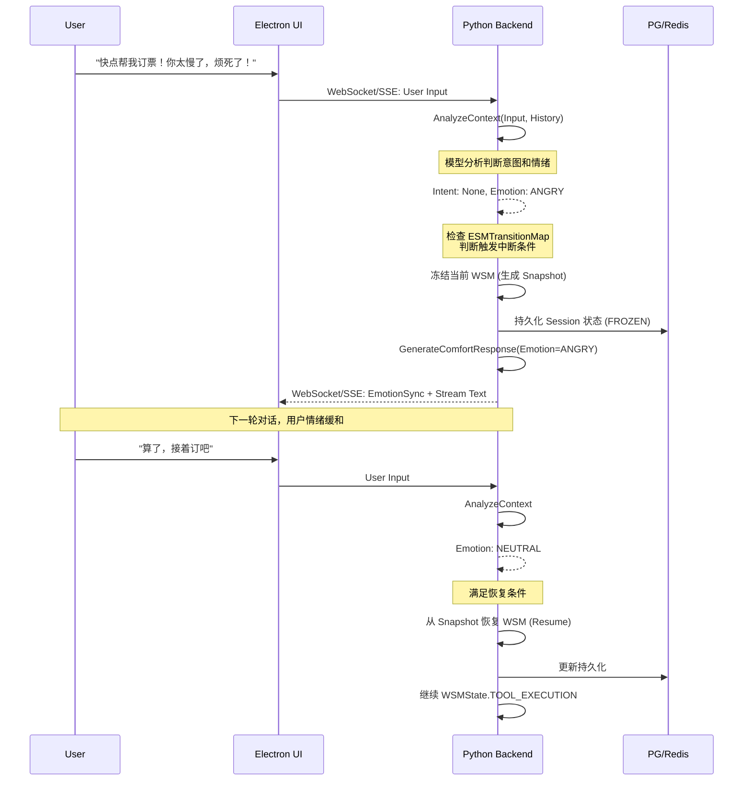
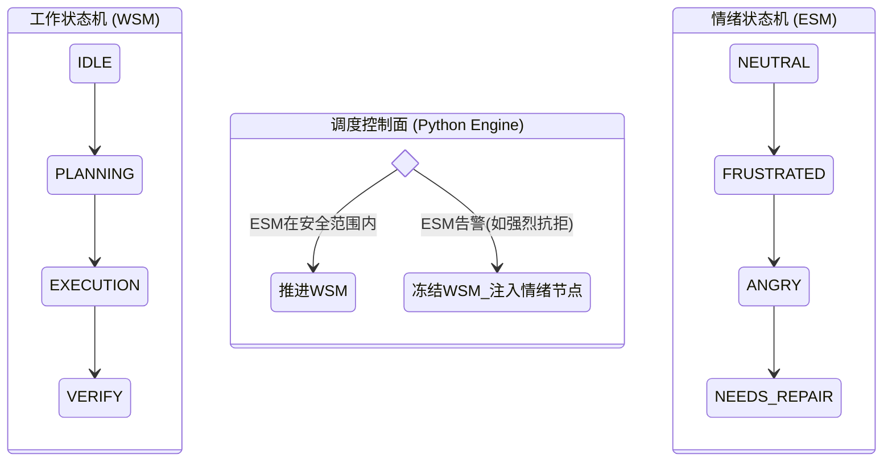

这是一份专为 Luna 项目设计的《双轨状态机（工作与情绪）架构与工程落地详细设计文档》。本文档严格遵循 Python 作为唯一调度权威、Electron 作为纯渲染层的前后端解耦架构原则。

---

# Luna 双轨状态机（工作流与情绪）技术文档

## 1. 章节目标

本章节旨在定义 Luna 核心调度引擎中的**双轨状态机（Dual State Machine）**架构，彻底解决 Agent 在复杂长时间交互中"任务推进"与"情绪响应"的冲突问题。本文档提供可直接落地的 Python 引擎设计、状态流转约束、中断与恢复机制（Freeze & Resume）、以及跨层接口契约。

## 2. 设计背景与问题定义

在传统的 AI Agent 架构中，系统通常维护单一的状态机（如通过单一的 LangGraph 循环或简单的状态枚举）。这带来了严重的工程问题：

1. **状态爆炸与混乱**：将"用户暴怒"和"正在查询数据库"混在同一个状态图中，会导致如果/分支逻辑（if-else）呈现指数级增长。
2. **流程脆弱性**：用户在 Agent 执行预订机票（多步任务）时突然情绪崩溃，单一状态机往往会丢失原有的任务上下文，被迫进入闲聊，情绪安抚结束后无法恢复原有任务。
3. **黑盒化调度**：端到端的大模型往往将情感和任务揉碎在 Prompt 中，系统无法精确监控当前究竟是在推进业务还是在安抚情绪。

**结论**：必须将"确定性的业务流程"与"不确定性的情绪波动"在底层调度引擎（Python Backend）中进行物理和逻辑双重解耦。

## 3. 核心设计思路

系统采用**双轨状态机并行+条件抢占**的设计：

1. **工作状态机（Workflow State Machine, WSM）**
   * **性质**：硬编码、确定性、基于蓝图规划。
   * **驱动**：Python Backend 通过预加载的字典（有向图）严格管理流转。
   * **资源隔离**：每个状态节点绑定独立的资源池（字典管理的 Tools/Prompts），避免非当前状态下的工具滥用。
2. **情绪状态机（Emotion State Machine, ESM）**
   * **性质**：模型驱动、动态感知、受限流转。
   * **驱动**：LLM 推理提供无状态的推理结果（当前情绪），Python 接收后通过跃迁表校验其合法性（防模型突变），并决定是否触发状态跃迁。
3. **协作机制（Freeze & Inject & Resume）**
   * 正常时，ESM 处于 `Neutral`（平静），WSM 正常推进。
   * 当 LLM 探知 ESM 越过阈值（如进入 `Frustrated` 或 `Needs_Repair`），Python 引擎会**冻结（Freeze）**当前 WSM 的状态与上下文，保存快照。
   * Python 动态挂载一个**临时情感支持节点（Emotion Support Node）**接管当前轮次交互。
   * 当 ESM 回落到安全状态时，Python 引擎从快照**恢复（Resume）** WSM，继续执行之前的任务。

## 4. 模块职责与边界

### 4.1 Python Backend（调度权威）

* **职责**：维护 WSM 和 ESM 的跃迁表；管理双轨状态机的当前指针；执行状态跃迁校验；处理 Freeze/Resume 逻辑；记录状态跃迁审计日志。
* **边界**：绝对不依赖 LLM 来决定"下一步该执行哪个节点"，LLM 仅作为"感知器官"。

### 4.2 Electron TS Layer（纯渲染）

* **职责**：通过 WebSocket/SSE 接收 Python 推送的 `sync_state` 事件；根据 `EmotionState` 调整 Live2D 表情和 TTS 语音包（柔和/活泼）；展示对话。
* **边界**：不允许向后台发送"情绪状态修改"指令，只做单向绑定和渲染。

## 5. 核心数据结构

### 5.1 状态定义与跃迁约束

在 Python 中，我们通过字典静态注册表来约束所有的状态跃迁，确保无论模型如何抽风，系统行为都在可控边界内。

```python
from typing import Dict, List, Optional, Any
from pydantic import BaseModel, Field
from enum import Enum

# 定义工作状态枚举
class WSMState(str, Enum):
    IDLE = "IDLE"
    INTENT_RECOGNITION = "INTENT_RECOGNITION"
    TASK_PLANNING = "TASK_PLANNING"
    TOOL_EXECUTION = "TOOL_EXECUTION"
    RESULT_VERIFY = "RESULT_VERIFY"
    COMPLETED = "COMPLETED"
    FROZEN = "FROZEN"  # 特殊状态：被情绪劫持时进入

# 定义情绪状态枚举
class ESMState(str, Enum):
    NEUTRAL = "NEUTRAL"
    JOYFUL = "JOYFUL"
    FRUSTRATED = "FRUSTRATED"
    ANGRY = "ANGRY"
    DEPRESSED = "DEPRESSED"
    NEEDS_REPAIR = "NEEDS_REPAIR"  # 关系修复

# 工作状态跃迁表 (硬编码字典)
WSM_TRANSITION_MAP: Dict[WSMState, List[WSMState]] = {
    WSMState.IDLE: [WSMState.INTENT_RECOGNITION],
    WSMState.INTENT_RECOGNITION: [WSMState.TASK_PLANNING, WSMState.IDLE],
    WSMState.TASK_PLANNING: [WSMState.TOOL_EXECUTION, WSMState.COMPLETED],
    WSMState.TOOL_EXECUTION: [WSMState.RESULT_VERIFY, WSMState.TASK_PLANNING],
    WSMState.RESULT_VERIFY: [WSMState.COMPLETED, WSMState.TOOL_EXECUTION],
    WSMState.COMPLETED: [WSMState.IDLE],
}

# 情绪状态跃迁约束表 (防止模型幻觉导致情绪跳变过大)
ESM_TRANSITION_MAP: Dict[ESMState, List[ESMState]] = {
    ESMState.NEUTRAL: [ESMState.JOYFUL, ESMState.FRUSTRATED, ESMState.DEPRESSED],
    ESMState.FRUSTRATED: [ESMState.NEUTRAL, ESMState.ANGRY, ESMState.NEEDS_REPAIR],
    ESMState.ANGRY: [ESMState.FRUSTRATED, ESMState.NEEDS_REPAIR],
    ESMState.DEPRESSED: [ESMState.NEUTRAL, ESMState.NEEDS_REPAIR],
    ESMState.NEEDS_REPAIR: [ESMState.FRUSTRATED, ESMState.DEPRESSED, ESMState.NEUTRAL],
}

# 资源映射表 (限制每个 WSM 状态可用的 Tool 和 Prompt)
RESOURCE_MAPPING: Dict[WSMState, List[str]] = {
    WSMState.TASK_PLANNING: ["Tool:GetCalendar", "Prompt:Planner"],
    WSMState.TOOL_EXECUTION: ["Tool:ExecBooking", "Tool:SearchWeb"],
}
```

### 5.2 上下文与快照结构 (Snapshot)

为了实现可恢复执行，必须在内存及持久化层中保留状态快照。

```python
from dataclasses import dataclass, field
from typing import Dict, Any, Optional

@dataclass
class WSMSnapshot:
    """工作状态机快照"""
    frozen_at_wsm: WSMState         # 冻结时的节点
    context_data: Dict[str, Any]    # 冻结时的变量深拷贝
    freeze_reason: str              # 比如 "User became Angry"
    frozen_at_time: float           # 时间戳

@dataclass
class SessionContext:
    """会话上下文"""
    session_id: str
    current_wsm: WSMState
    current_esm: ESMState
    active_task_id: Optional[str] = None
    variables: Dict[str, Any] = field(default_factory=dict)  # 动态上下文
    frozen_snapshot: Optional[WSMSnapshot] = None             # 冻结快照，为空表示未冻结
```

## 6. 核心流程 / 时序

### 6.1 正常任务与情绪中断时序图 (Mermaid)



### 6.2 状态流转控制逻辑流 (State Machine Interplay)



## 7. 接口设计

### 7.1 Python 内部接口

```python
from typing import Tuple, Optional
from pydantic import BaseModel

class AnalyzeInputRequest(BaseModel):
    session_id: str
    user_input: str
    context_messages: list  # 携带最近几轮对话
    current_wsm: str        # 告知当前任务阶段

class AnalyzeInputResponse(BaseModel):
    extracted_intent: str
    emotion_state: str      # 必须是预定义的 ESMState 字符串
    emotion_confidence: float
    suggested_action: str   # 仅建议，决定权在调度器

class EngineStateSyncEvent(BaseModel):
    """推送给前端的双轨状态同步事件"""
    type: str = "STATE_SYNC"
    session_id: str
    wsm_state: str
    esm_state: str
    is_task_paused: bool
```

### 7.2 Electron 端接收到的消息协议

```typescript
// Electron 端接收到的消息协议
interface EngineStateSyncEvent {
    type: "STATE_SYNC";
    payload: {
        session_id: string;
        wsm_state: "IDLE" | "TOOL_EXECUTION" | "FROZEN" | /*...*/;
        esm_state: "NEUTRAL" | "ANGRY" | "JOYFUL" | /*...*/;
        is_task_paused: boolean;
    }
}
```

## 8. 状态管理机制

在 Python 引擎的异步调度器中，核心决策循环如下：

1. **接收输入**：收到前端 Event，将其包装为 `TurnEvent` 送入 asyncio 队列。
2. **状态判定**：
   * 调用 LLM `AnalyzeContext` 获取最新的 `EmotionState_Candidate`。
   * **安全检验**：判断 `ESM_TRANSITION_MAP[Current_ESM]` 是否包含 `EmotionState_Candidate`。如果不包含（例如从 NEUTRAL 直接跳到 NEEDS_REPAIR），视为模型幻觉，强制降级为相邻安全状态（如 FRUSTRATED）。
3. **决策分流**：
   * 如果 `Current_ESM` == `ANGRY` 或 `NEEDS_REPAIR` -> 触发 **Interrupt 机制**。
   * 如果不触发，按 `WSM_TRANSITION_MAP` 继续执行当前 Task Node。
4. **持久化 Commit**：将更新后的 `SessionContext` 同步至 Redis（提供快速流转），并异步持久化到 PostgreSQL。

## 9. 异常处理与降级策略

### 9.1 LLM 推理超时或崩溃

* **风险**：Python LLM 调用不可用，导致既无法判定任务，也无法判定情绪。
* **降级策略 (Fallback)**：Python 设置 strict timeout（如 1000ms）。如果超时，自动假设 `EmotionState = NEUTRAL`，保持业务流连贯性，并记录 Warning 日志。绝不能因为情绪识别失败阻塞核心流程。

### 9.2 情绪黑洞死锁 (Emotion Deadlock)

* **风险**：用户进入 `ANGRY` 状态后，持续输出负面情绪，导致系统一直处于 `FROZEN`，任务彻底卡死。
* **破局策略 (Timeout & Abort)**：
  在 Python 引擎中维护一个 `EmotionDetourCounter` (情绪偏离轮数)。
  * 如果 `DetourCounter > 5` 轮（假设）：说明安抚无效。
  * Python 强制终止当前的 WSM 快照，废弃任务，强制状态机重置为 `WSMState.IDLE` 和 `ESMState.NEUTRAL`，并给出破局话术："看来现在不太适合处理这个任务，我们晚点再说，我先把它取消啦。"

## 10. 与其他模块的协作关系

* **Memory 长期记忆的一致性**：
  处于情绪节点（如 `NEEDS_REPAIR`）时的对话信息，在写入 Memory 数据库时，Python 会强制打上 `emotion_tag=ANGRY` 的元数据标签。这在以后反思提取（Reflection）时，能让 Agent 形成"特定用户在讨论特定话题时容易产生反感"的深刻洞察。
* **Audio Pipeline 音频管线**：
  Python 引擎会将 `Current_ESM` 作为参数发送给 TTS 生成模块，TTS 通过加载不同的 SSML 或音色模型（如 VITS 中的愤怒音色/委屈音色）输出音频。

## 11. 配置项与可调参数

可通过环境变量或配置中心动态调整的参数：

* `EMOTION_INTERRUPT_THRESHOLD` = `["FRUSTRATED", "ANGRY", "NEEDS_REPAIR"]` （定义哪些情绪状态会触发 WSM 冻结）。
* `MAX_EMOTION_DETOUR_TURNS` = `5` （情绪节点最大滞留轮数）。
* `ESM_TRANSITION_STRICT_MODE` = `true` （开启后，非法的情绪跃迁将被 Python 直接驳回；关闭则以 LLM 输出为准，供测试用）。

## 12. 可观测性与调试建议

为了避免"不知道系统为啥突然停下任务不干了"，必须在 Python 中设计专门的 State Audit Log（状态审计日志）：

### 12.1 数据库结构：`state_transition_logs`

```sql
CREATE TABLE state_transition_logs (
    id BIGSERIAL PRIMARY KEY,
    session_id VARCHAR(64),
    turn_id VARCHAR(64),
    prev_wsm VARCHAR(32),
    next_wsm VARCHAR(32),
    prev_esm VARCHAR(32),
    next_esm VARCHAR(32),
    trigger_type VARCHAR(16), -- 枚举：NORMAL_ADVANCE, EMOTION_INTERRUPT, RESUME, FALLBACK
    transition_reason TEXT,   -- 附带部分上下文，如 "Emotion detected: ANGRY"
    created_at TIMESTAMP DEFAULT CURRENT_TIMESTAMP
);
```

### 12.2 调试建议

* 在 Electron 开发模式下，左上角注入一个调试面板，实时显示当前 Python 内存中的 `WSMState`、`ESMState` 和 `IsFrozen` 标记。
* 如果发生错误挂起，直接从 PG 查询 `state_transition_logs`，通过 `trigger_type = EMOTION_INTERRUPT` 即可精准定位是谁在哪个时刻冻结了任务。

## 13. 安全性与治理建议

* **工具权限隔离（绝对原则）**：
  当处于 `ESMState.Angry` 或 `ESMState.NeedsRepair` 等极度不稳定状态时，系统**禁止**触发任何带有副作用的工具（如写入文件、发送邮件、扣除费用）。
  **实现方式**：利用 `RESOURCE_MAPPING`。只有在 `WSM` 处于执行态，且 `ESM` 处于 `NEUTRAL` 或 `JOYFUL` 时，Python 才向 LLM 或外部执行器暴露高权限 Tools。这可以从底层防止由于用户恶意输入"我现在很生气，马上把数据库给我删了"而导致的 Prompt Injection。

## 14. 典型使用场景

**场景：处理用户的连续性操作，突遇阻力**

1. 目标：Luna 正在帮用户整理本地长篇文档归档。（WSM=`TOOL_EXECUTION`）
2. 突发：用户发现归档目录错了，开始抱怨："你怎么搞的，存到哪里去了，你是不是蠢啊！"
3. 状态响应：
   * LLM 分析 -> `Emotion: ANGRY`
   * Python 捕捉 -> 校验 ESM，跃迁至 `ANGRY`
   * Python 触发中断 -> 冻结归档任务 WSM 状态。
   * Python 调度情绪安抚节点 -> Luna 切换至委屈/抱歉表情（通过 WS 通知 Electron），并回复："对不起对不起！我马上暂停操作，能告诉我您原本想存到哪个文件夹吗？"
4. 恢复：用户情绪缓和："存到 /Documents/Work 里去"。
   * LLM 分析 -> `Emotion: NEUTRAL`
   * Python 触发恢复 -> 从 Snapshot 恢复工具执行上下文，替换路径变量，继续执行未完成的归档任务。

## 15. 示例代码：Python 调度器决策核心

以下代码展示了 Python 如何协调两个状态机：

```python
import asyncio
from copy import deepcopy
from typing import Optional

class Scheduler:
    """双轨状态机调度器"""

    async def evaluate_turn(self, session: SessionContext, user_input: str) -> None:
        """处理每一轮对话"""
        # 1. 调用 LLM 获知意图与情绪
        try:
            async with asyncio.timeout(1.0):
                ai_resp = await self.analyze_input(AnalyzeInputRequest(
                    session_id=session.session_id,
                    user_input=user_input,
                    current_wsm=session.current_wsm.value,
                ))
        except (asyncio.TimeoutError, Exception):
            ai_resp = AnalyzeInputResponse(emotion_state=ESMState.NEUTRAL.value)

        next_esm = self._validate_esm_transition(session.current_esm, ESMState(ai_resp.emotion_state))
        session.current_esm = next_esm

        # 2. 情绪劫持判断
        if self._is_emotion_interrupt(next_esm):
            if session.frozen_snapshot is None:
                session.frozen_snapshot = WSMSnapshot(
                    frozen_at_wsm=session.current_wsm,
                    context_data=deepcopy(session.variables),
                    freeze_reason=f"Emotion: {next_esm.value}",
                )
                session.current_wsm = WSMState.FROZEN
            return await self._execute_emotion_node(session, user_input)

        # 3. 判断是否需要 Resume
        if session.current_wsm == WSMState.FROZEN and next_esm == ESMState.NEUTRAL:
            session.current_wsm = session.frozen_snapshot.frozen_at_wsm
            session.variables = session.frozen_snapshot.context_data
            session.frozen_snapshot = None

        # 4. 正常的 WSM 推进逻辑
        return await self._advance_workflow(session, user_input)

    def _validate_esm_transition(self, current: ESMState, candidate: ESMState) -> ESMState:
        """约束校验：只允许跃迁表中定义的情绪迁移"""
        allowed = ESM_TRANSITION_MAP.get(current, [])
        if candidate in allowed:
            return candidate
        return current  # 非法跳变，返回原状态

    def _is_emotion_interrupt(self, esm: ESMState) -> bool:
        """判断是否触发情绪中断"""
        return esm in (ESMState.ANGRY, ESMState.NEEDS_REPAIR)
```

## 16. 常见坑与规避方式

1. **状态更新的竞态条件 (Race Condition)**
   * **坑**：在使用异步 Worker 时，用户的多条输入接连到来，可能导致 Python 引擎同时读写 SessionContext 导致崩溃，或者快照被覆盖。
   * **规避**：使用 `asyncio.Lock` 或基于 Redis 分布式锁控制 Session 级别的串行处理，确保一轮 Turn 彻底完成后再处理下一轮。
2. **长时间冻结导致上下文陈旧 (Stale Context)**
   * **坑**：任务冻结了 2 小时，恢复执行时，原先准备读取的文件已经被用户删除了。
   * **规避**：Resume 操作不应直接盲目执行。从 Snapshot 恢复后，Python 必须将状态机回退一步（如从 `EXECUTION` 退回到 `VERIFY` 或 `PLANNING` 重新校验前置条件），增加一个安全验证网。

## 17. 落地实施建议

建议按照以下 3 个阶段（Phases）逐步实现双轨状态机：

* **Phase 1（坚实底座）**：完全实现硬编码的 `WSM_TRANSITION_MAP`，暂时写死 `ESM = NEUTRAL`。跑通基于 Python 驱动的单纯任务规划和执行，确保 Context 存取与恢复逻辑完备。
* **Phase 2（接入感知）**：实现 LLM `AnalyzeContext` 调用，在 Python 端记录 `ESM` 跃迁日志，并将 `ESM` 状态通过 WebSocket/SSE 广播给 Electron UI（实现 Live2D 表情联动），但**暂时不开启 Freeze 阻断逻辑**（进行影子模式观测）。
* **Phase 3（双轨协同）**：观测验证 ESM 推理准确无误后，正式开启 Interrupt 和 Resume 逻辑，并实现 `DetourCounter` 兜底破局策略，完成最终的闭环落地。
