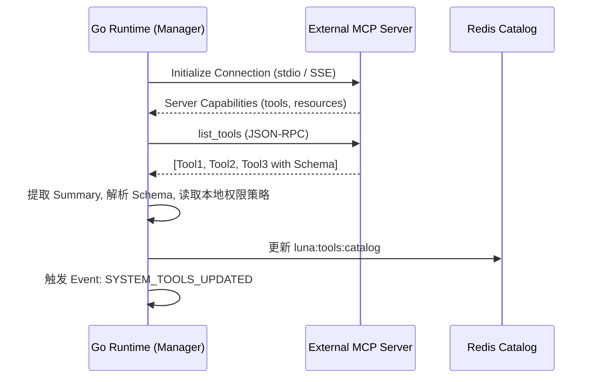
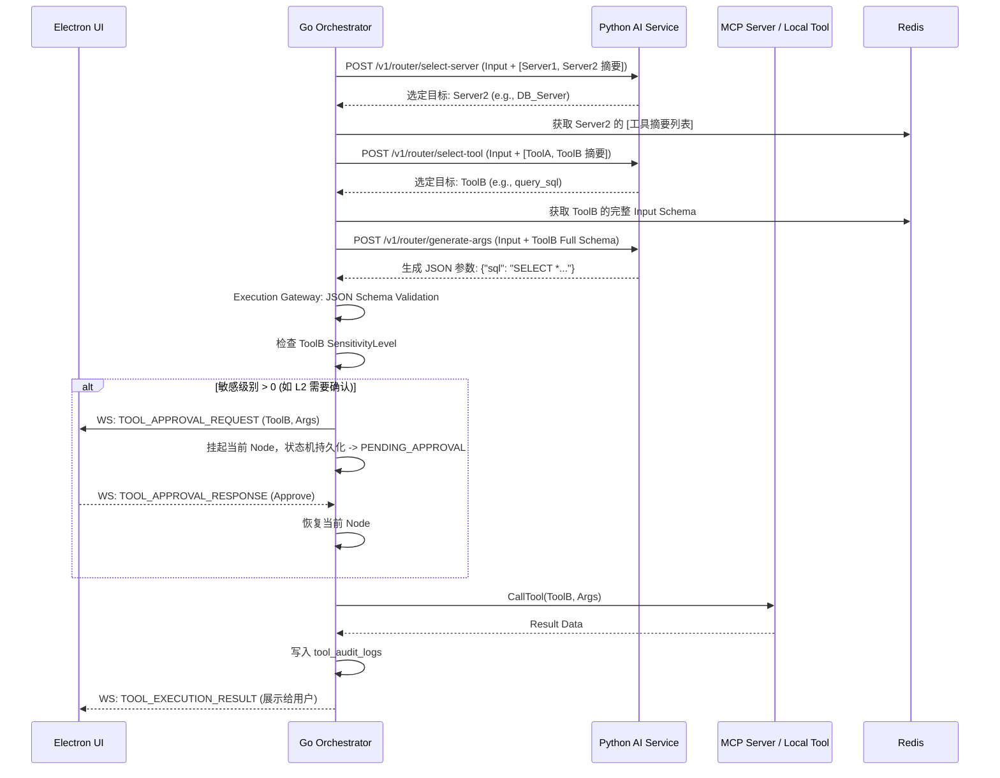

# 工具协议与 MCP 能力接入方案技术实现文档

## 1. 章节目标

本章节旨在定义 Luna 系统中**可扩展工具生态**的底层协议与架构实现。详细说明如何基于 Model Context Protocol (MCP) 思想，设计一套支持动态注册、分层路由、安全审计的工具网关。本设计将指导开发团队实现彻底的“工具发现与工具执行解耦”，解决大语言模型（LLM）工具调用中的 Token 爆炸、硬编码耦合及越权调用等工程痛点。

## 2. 设计背景与问题定义

在传统的 Agent 架构中，工具集通常直接挂载到主 Prompt 的 `tools` 字段中。随着系统能力的演进，这种做法暴露出了极其严重的工程问题：

1. **Token 消耗爆炸与 Context 污染**：将数十个甚至上百个工具的完整 JSON Schema 注入 Prompt，会消耗大量 Token，导致推理成本激增，且过多无关上下文会严重干扰模型的推理注意力（Attention Loss），降低 Tool Selection 的准确率。
2. **能力硬编码与扩展性差**：每新增一个工具，都需要修改核心业务逻辑代码，重新编译部署，无法实现生态化、插件化的热插拔。
3. **缺乏安全治理**：所有工具一视同仁，模型一旦生成恶意或破坏性指令（如 `drop table` 或直接发送邮件），缺乏底层的统一拦截和审批机制。

为解决上述问题，Luna 借鉴 MCP 标准，引入**动态注册机制**与**三阶段动态路由策略**，并在 Golang 调度层设立强管控的**执行网关**。

## 3. 核心设计思路

1. **领域联邦（Server 机制）**：将工具按照领域物理/逻辑隔离到不同的 MCP Server 中（如：`Search_Server`, `DB_Server`, `Office_Server`）。
2. **三阶段渐进式路由（Progressive Routing）**：不在起手注入所有细节，而是：
   - **阶段一（轻量路由）**：只给 Server 列表，轻量模型选定领域 Server。
   - **阶段二（摘要匹配）**：只给目标 Server 的工具摘要，主模型选定具体工具。
   - **阶段三（精确组装）**：注入具体工具的完整 Schema，主模型生成严格参数。
3. **能力目录统一管理**：Go Runtime 在启动及运行时，动态扫描并缓存（基于 Redis/本地内存）所有可用能力，构建全局视图。
4. **统一执行网关（Execution Gateway）**：工具的调用不在 Python 层发生。Python 只负责生成“调用意图”，由 Go Runtime 接管意图，进行 Schema 校验、敏感度审查、用户确认流转（Gating）和实际调用。
5. **协议透明适配**：Go Runtime 对下层封装差异，无论是基于 `stdio`/`sse` 的外部 MCP Server，还是 Go 内部的 Local Plugin（如本地文件系统操作），在上层统一抽象为 `Tool` 接口。

## 4. 模块职责与边界

| 模块层级                          | 职责描述                                                                                                            | 核心约束（禁止事项）                                                               |
|:----------------------------- |:--------------------------------------------------------------------------------------------------------------- |:------------------------------------------------------------------------ |
| **Electron + TS (Desktop)**   | 提供敏感工具调用的确认弹窗（UI Gating）；渲染工具执行的中间态（如：正在搜索...）；提供工具市场/插件管理面板。                                                   | **禁止**本地直接调用任何业务 API 执行工具；**禁止**绕过 Go 向 Python 发起工具推理。                   |
| **Golang (Workflow Runtime)** | **整个工具体系的 Owner**。维护全量工具目录；作为客户端直连各 MCP Server；实现 Schema 校验器；执行多阶段路由编排；触发用户审批暂停/恢复状态机；记录执行审计日志。                 | **禁止**将用户确认等交互性状态阻塞在独立 Goroutine 中，必须通过状态机持久化暂停，避免重启丢失。                  |
| **Python (AI Intelligence)**  | 提供纯无状态的 Router 接口。基于 LangChain/LangGraph 实现轻量级的意图分类 Prompt 组装、基于工具摘要的工具选择、基于完整 Schema 的参数提取（Structured Output）。 | **禁止**在 Python 内部使用 `requests` 或 `subprocess` 偷偷执行任何“工具”逻辑；**禁止**持有工具状态。 |

## 5. 核心数据结构

### 5.1 数据库结构 (PostgreSQL - Go 维护)

```sql
-- 工具注册表 (缓存 MCP Server 同步过来的能力)
CREATE TABLE tool_registry (
    tool_id VARCHAR(64) PRIMARY KEY,
    server_id VARCHAR(64) NOT NULL, -- 归属的 MCP Server
    name VARCHAR(128) NOT NULL,
    description TEXT NOT NULL,      -- 摘要描述
    full_schema JSONB NOT NULL,     -- 完整的 JSON Schema
    sensitivity_level INT NOT NULL, -- 0: 安全, 1: 首次确认, 2: 每次确认, 3: 禁用
    status VARCHAR(32) DEFAULT 'ACTIVE',
    created_at TIMESTAMP DEFAULT CURRENT_TIMESTAMP,
    updated_at TIMESTAMP DEFAULT CURRENT_TIMESTAMP
);

-- 工具执行审计日志
CREATE TABLE tool_audit_logs (
    log_id UUID PRIMARY KEY,
    workflow_id UUID NOT NULL,     -- 关联的工作流
    node_id UUID NOT NULL,         -- 关联的执行节点
    tool_id VARCHAR(64) NOT NULL,
    input_args JSONB NOT NULL,     -- 校验后的参数
    output_result JSONB,           -- 执行结果
    status VARCHAR(32) NOT NULL,   -- SUCCESS, FAILED, REJECTED
    error_msg TEXT,
    execution_ms INT,
    created_at TIMESTAMP DEFAULT CURRENT_TIMESTAMP
);
```

### 5.2 Go 内存数据结构 & Redis 缓存

```go
// 对应 Redis 中的 Hash: "luna:tools:catalog:{server_id}"
type ToolDefinition struct {
    ToolID           string                 `json:"tool_id"`
    ServerID         string                 `json:"server_id"`
    Name             string                 `json:"name"`
    Summary          string                 `json:"summary"` // 摘要，用于阶段二
    InputSchema      map[string]interface{} `json:"input_schema"` // 完整结构，用于阶段三
    SensitivityLevel int                    `json:"sensitivity_level"`
}

type ServerCapability struct {
    ServerID    string `json:"server_id"`
    Domain      string `json:"domain"`
    Description string `json:"description"` // 领域描述，用于阶段一
    Status      string `json:"status"`      // ONLINE, OFFLINE
}
```

## 6. 核心流程 / 时序

### 6.1 工具能力发现与热更新流

启动时，Go Runtime 作为 MCP Client 发现能力：



### 6.2 三阶段动态路由与工具执行流（核心）



## 7. 接口设计

### 7.1 Python AI Service API (被 Go 调用)

**1. 选定目标 Server (Stage 1)**

- `POST /v1/tools/route-server`
- **Request:**
  
  ```json
  {
    "intent": "帮我看看最新邮件里有没有关于发票的内容",
    "servers": [
      {"server_id": "office", "desc": "包含邮件、日历、文档操作"},
      {"server_id": "search", "desc": "互联网搜索与资料查阅"}
    ]
  }
  ```
- **Response:**
  
  ```json
  { "selected_server": "office", "confidence": 0.95 }
  ```

**2. 选定具体工具 (Stage 2)**

- `POST /v1/tools/route-tool`
- **Request:**
  
  ```json
  {
    "intent": "帮我看看最新邮件里有没有关于发票的内容",
    "tools": [
      {"tool_id": "read_emails", "summary": "读取邮箱中的最新邮件"},
      {"tool_id": "send_email", "summary": "发送新邮件"}
    ]
  }
  ```
- **Response:**
  
  ```json
  { "selected_tool": "read_emails" }
  ```

**3. 生成工具参数 (Stage 3)**

- `POST /v1/tools/generate-args`
- **Request:**
  
  ```json
  {
    "intent": "帮我看看最新邮件里有没有关于发票的内容",
    "tool_id": "read_emails",
    "schema": {
      "type": "object",
      "properties": {
        "limit": {"type": "integer", "description": "读取数量"},
        "keyword": {"type": "string", "description": "搜索关键词"}
      },
      "required": ["limit"]
    }
  }
  ```
- **Response:**
  
  ```json
  { "arguments": {"limit": 10, "keyword": "发票"} }
  ```

### 7.2 Electron <-> Go WebSocket 协议

**1. 工具拦截请求 (Go -> UI)**

```json
{
  "type": "TOOL_APPROVAL_REQUEST",
  "payload": {
    "execution_id": "exec-12345",
    "tool_name": "query_sql",
    "risk_level": 2,
    "arguments": {"sql": "DROP TABLE users"},
    "description": "准备执行数据库查询"
  }
}
```

**2. 用户授权响应 (UI -> Go)**

```json
{
  "type": "TOOL_APPROVAL_RESPONSE",
  "payload": {
    "execution_id": "exec-12345",
    "action": "REJECT", // "APPROVE" or "REJECT"
    "user_feedback": "危险操作，禁止执行" 
  }
}
```

## 8. 状态管理机制

工具执行不是即时的原子操作，特别是在带有审批流的情况下。必须融入 Golang 层的 DAG 工作流节点状态机：

- `NODE_STATE_ROUTING`: 正在向 Python 请求三阶段路由。
- `NODE_STATE_VALIDATING`: 正在由网关执行 Schema 与策略校验。
- `NODE_STATE_WAITING_APPROVAL`: 工具触发高敏感度策略，状态机将此节点持久化，工作流挂起（Suspend），释放 Goroutine 资源。
- `NODE_STATE_EXECUTING`: 正在向 MCP Server 发起远端调用。
- `NODE_STATE_COMPENSATING`: 如果执行失败且配置了重试/补偿策略，进入此状态。

**状态恢复（Recovery）：**
如果 Go 进程在 `WAITING_APPROVAL` 或 `EXECUTING` 阶段崩溃。重启后，Scheduler 将从 PostgreSQL 中读取被中断的 Plan 和 Node，发现处于 `WAITING_APPROVAL`，则重新通过 WebSocket 向前端下发通知；若是 `EXECUTING`（且工具非幂等），则抛出异常并通知用户手动干预。

## 9. 异常处理与降级策略

1. **Python 路由失败 / 幻觉返回**
   - **表现**：模型编造了不存在的 ToolID，或生成的 JSON 参数不符合 Schema。
   - **策略**：Go Runtime 的 Execution Gateway 进行强校验。一旦发现不匹配，**立即拦截**。将错误信息（如 "Missing required field: keyword"）包装成 System Message，携带执行上下文，重试一次 Stage 3 调用。最多重试 2 次，失败则中断当前动作并通知用户。
2. **MCP Server 断线 / 超时**
   - **表现**：外部工具服务不可用。
   - **策略**：Go 触发 Circuit Breaker（熔断机制）。对该 Server 的所有能力暂时标记为 `OFFLINE`。主动通知模型：“目标能力暂时不可用，尝试其他方法或提示用户”。
3. **用户拒绝执行**
   - **策略**：Go Runtime 将 UI 返回的 `REJECT` 包装为工具返回结果的特殊格式：`{"status":"rejected", "reason":"user denied"}`。交还给 Python，让模型基于“用户拒绝”这一事实进行 Reflection（如道歉或询问是否需要修改参数）。

## 10. 与其他模块的协作关系

- **与长期记忆系统 (Memory System)**：部分工具操作（如“记录用户偏好”、“读取本地文档”）本质上也是工具。Memory 系统对外暴露 MCP 接口，作为特殊的 Server 存在，保证架构一致性。
- **与主动行为调度器 (Proactive Scheduler)**：后台主动任务尝试调用工具时，默认采用更严格的权限策略。例如：主动任务如果命中 L1 级别工具，不会静默执行，而是向系统的“通知中心”投递一个待办（Pending Action），等用户上线后点击确认。

## 11. 配置项与可调参数

假设系统配置文件 `config.yaml` 中相关定义如下：

```yaml
mcp:
  servers:
    - id: office
      transport: stdio # 使用标准输入输出流的本地进程
      command: "python"
      args: ["-m", "luna_office_server"]
    - id: search
      transport: sse   # 远程/独立部署的服务
      url: "http://localhost:8080/mcp/sse"
  gateway:
    timeout_ms: 30000
    max_retries_on_schema_error: 2
    default_sensitivity: 1 # 未知工具默认需要确认
```

## 12. 可观测性与调试建议

1. **日志字段 (Log Fields)**：
   每一次工具调用必须携带 `trace_id`, `plan_id`, `node_id`, `tool_id`, `mcp_server_id`, `latency_ms`, `token_used`。
2. **调试模式 (Dry Run Mode)**：
   开发测试时，支持在 Go Gateway 开启 `dry_run=true`。网关会执行全套三阶段路由、参数校验和权限审计，但**不会物理调用 MCP Server**，而是返回 Mock 数据。
3. **MCP 探针**：
   提供本地 Admin API `GET /api/system/mcp/status`，实时查看所有 Server 的连接状态和可用工具目录。

## 13. 安全性与治理建议

**权限分级（Gating Policy）：**必须对工具进行严格打标。

- `L0 - 无感级`：读操作，或绝对安全的计算（如查天气、本地时间、文本总结）。直接执行。
- `L1 - 首次确认级`：对外部 API 有频率限制的读取。每个 Session 内首次调用需要弹窗确认，后续自动放行。
- `L2 - 强确认级`：所有写操作、支付操作、发送邮件、修改数据库。**每一次**调用都必须挂起等待用户确权。
- `L3 - 禁用级`：被管理员/系统安全策略临时封禁的工具，模型即便选出也会被强制阻断。

**防止越权（Jailbreak 防御）：**
Python 层无权决定工具是否真的被执行。即使通过恶意的 Prompt 注入骗过大模型生成了 `L2` 级工具的正确参数，最后的防线——Go Runtime Execution Gateway 依然会死死卡住执行逻辑并请求审批。

## 14. 典型使用场景

**场景**：用户让 Luna “查一下本地目录 D:/projects 下最大的三个文件夹，并把结果发给我的上司”。
**工作流解析**：

1. Stage 1 判断需要 `fs_server` (文件系统) 和 `mail_server` (邮件)。
2. 调用 `fs_server` 的 `scan_dir` 工具（L0，静默执行）。返回结果。
3. Python 模型将结果总结。
4. 调用 `mail_server` 的 `send_mail` 工具（L2，写操作）。
5. Go Gateway 拦截，WebSocket 通知前端。
6. 前端弹出：“Luna 准备发送邮件给 XXX，内容：... 是否允许？”
7. 用户点击允许，Go 放行并执行发送，记录审计日志。

## 15. 示例代码

### 15.1 Golang: 执行网关与权限校验 (核心逻辑)

```go
package gateway

import (
    "context"
    "encoding/json"
    "fmt"
    "github.com/santhosh-tekuri/jsonschema/v5"
)

type Gateway struct {
    ToolCatalog  *CatalogManager
    MCPClients   map[string]MCPClient
    EventBus     *EventBus
    WaitList     *SuspendManager
}

// ExecuteTool 处理经过 3阶段路由 拿到最终决定后的执行流程
func (g *Gateway) ExecuteTool(ctx context.Context, execID string, toolID string, argsJSON []byte) (*ExecutionResult, error) {
    // 1. 获取工具定义
    toolDef, err := g.ToolCatalog.GetTool(toolID)
    if err != nil {
        return nil, fmt.Errorf("tool not found: %w", err)
    }

    // 2. Schema 校验
    compiler := jsonschema.NewCompiler()
    if err := compiler.AddResource("schema.json", toolDef.InputSchema); err != nil {
        return nil, err
    }
    schema, _ := compiler.Compile("schema.json")
    var args map[string]interface{}
    json.Unmarshal(argsJSON, &args)
    if err := schema.Validate(args); err != nil {
        return nil, fmt.Errorf("schema validation failed: %w", err)
    }

    // 3. 安全等级审查 (Gating)
    if toolDef.SensitivityLevel >= 2 {
        // 挂起流程，等待用户确认
        return g.requestUserApproval(ctx, execID, toolDef, args)
    }

    // 4. 路由到底层 MCP 执行
    client, ok := g.MCPClients[toolDef.ServerID]
    if !ok {
        return nil, fmt.Errorf("mcp server unavailable: %s", toolDef.ServerID)
    }

    res, err := client.CallTool(ctx, toolDef.Name, args)

    // 5. 写入审计日志 (伪代码)
    g.auditLog(execID, toolID, args, res, err)

    return res, err
}

func (g *Gateway) requestUserApproval(ctx context.Context, execID string, tool *ToolDefinition, args map[string]interface{}) (*ExecutionResult, error) {
    // 持久化挂起状态
    g.WaitList.Suspend(execID)

    // 通过 WS 通知前端
    g.EventBus.Publish(WSMessage{
        Type: "TOOL_APPROVAL_REQUEST",
        Payload: map[string]interface{}{
            "execution_id": execID,
            "tool_name":    tool.Name,
            "risk_level":   tool.SensitivityLevel,
            "arguments":    args,
        },
    })

    // 这里返回特殊的挂起错误，调度器捕获后会结束当前 Goroutine 生命周期
    return nil, ErrExecutionSuspended
}
```

### 15.2 Python: Stage 1 轻量路由 (FastAPI)

```python
from fastapi import APIRouter
from pydantic import BaseModel
from typing import List

router = APIRouter()

class ServerSummary(BaseModel):
    server_id: str
    desc: str

class RouteRequest(BaseModel):
    intent: str
    servers: List[ServerSummary]

@router.post("/v1/tools/route-server")
async def route_server(req: RouteRequest):
    # 构造轻量级 Prompt (假设使用了一个小参数量且速度极快的模型如 Qwen2.5-7B/GLM-4-Flash)
    prompt = f"""
    You are a routing agent.
    User Intent: {req.intent}

    Available Domains:
    {[{s.server_id: s.desc} for s in req.servers]}

    Select the most appropriate server_id to handle the user intent.
    Output ONLY valid JSON: {{"selected_server": "xxx", "confidence": 0.9}}
    """

    # 模拟 LLM 调用获取结构化输出
    response = await llm_client.chat(prompt, response_format="json")
    return response.json()
```

### 15.3 TypeScript (Electron): UI 层审批拦截流

```typescript
import { useWebSocket } from '@/hooks/useWebSocket';
import { useWorkflowStore } from '@/store/workflow';

export const ToolApprovalModal = () => {
  const pendingApproval = useWorkflowStore(state => state.pendingApproval);
  const { sendMessage } = useWebSocket();

  if (!pendingApproval) return null;

  const handleAction = (action: 'APPROVE' | 'REJECT') => {
    sendMessage({
      type: 'TOOL_APPROVAL_RESPONSE',
      payload: {
        execution_id: pendingApproval.execution_id,
        action,
        user_feedback: action === 'REJECT' ? '用户已手动拒绝' : ''
      }
    });
    useWorkflowStore.getState().clearPendingApproval();
  };

  return (
    <div className="modal">
      <h3>⚠️ 敏感操作确认</h3>
      <p>系统准备执行工具: <strong>{pendingApproval.tool_name}</strong></p>
      <p>风险等级: L{pendingApproval.risk_level}</p>
      <pre><code>{JSON.stringify(pendingApproval.arguments, null, 2)}</code></pre>
      <div className="actions">
        <button onClick={() => handleAction('REJECT')}>拒绝执行</button>
        <button onClick={() => handleAction('APPROVE')}>允许执行</button>
      </div>
    </div>
  );
};
```

## 16. 常见坑与规避方式

1. **Schema 校验器不兼容**：
   - **坑**：LLM 生成的 JSON Schema 可能带有虚构的规范外关键字，导致 Go 的 JSON Schema 库解析崩溃。
   - **规避**：在注册阶段过滤掉非标准的 Schema 字段，使用严格且被广泛支持的 Draft-07 规范。
2. **连接泄漏与死锁**：
   - **坑**：外部 MCP Server 基于 `stdio` 运行，由于并发过高，进程没有正常回收，产生僵尸进程。
   - **规避**：Go Runtime 管理 MCP Subprocess 时，必须绑定 Context。当宿主 Context 退出或健康检查失败时，显式发送 `SIGKILL` 终止子进程。
3. **上下文丢失**：
   - **坑**：挂起等待审批期间，如果强杀重启程序，审批状态丢失。
   - **规避**：这就是为什么严禁 Python 持有状态。Go 在触发审批前，必须先开启 DB 事务更新 Workflow Node State = `PENDING_APPROVAL` 并 Commit，随后再发 WebSocket 消息。重启时调度器恢复这批未完结状态。

## 17. 落地实施建议

1. **先核心后外围**：第一阶段，仅实现 Go Runtime 内部的 Local 静态注册能力（将本地方法注册到抽象的 Gateway），把三阶段路由和 Schema 校验跑通。
2. **标准对齐**：第二阶段接入外部 MCP，确保协议层面的兼容性，优先选用现成开源的 MCP Server（如 `sqlite-mcp`）进行跑冒滴漏测试。
3. **性能基准评估**：重点关注三阶段路由的延迟。由于增加了多次 LLM 交互，Stage 1 必须采用极小且高吞吐的模型，Stage 2/3 也需要开启 Prompt Cache，将系统耗时控制在可接受范围（建议内部路由总耗时 < 1.5s）。
