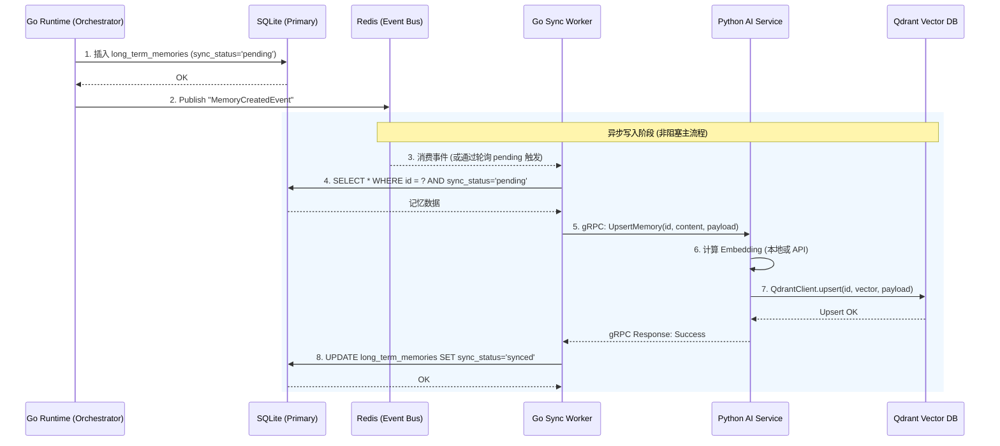
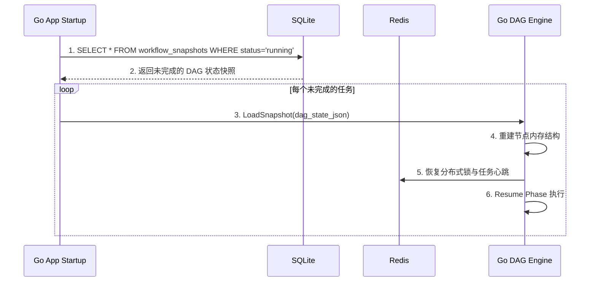

### 1. 章节目标

本文档详细说明 Luna 本地化 AI 桌面助理的**数据存储与同步方案**。核心目标是为系统架构中的持久化层提供可直接落地的工程规范，涵盖多数据源（Redis、SQLite/PostgreSQL、本地文件、Qdrant 向量库）的职责划分、数据一致性保障机制、高吞吐的异步写入流转策略，以及针对本地桌面环境特性的数据备份与故障恢复设计。本文档直接服务于 Go Runtime 层的数据编排与 Python AI 层的无状态检索实现。

### 2. 设计背景与问题定义

在“陪伴式人格 + 长期记忆 + 主动行为”的全栈 Agent 平台中，数据存储面临以下核心挑战：

1. **多模态与多维度的状态存储**：不仅需要存储关系型的高并发工作流执行状态（Plan/Phase/Node），还要存储海量非结构化文本用于长期记忆（Semantic Memory），以及音视频、大文件等实体资产。
2. **跨组件数据一致性**：Go 作为控制面板推进状态并落库，而 Python 作为智能层负责计算 Embedding 并在 Qdrant 中执行向量检索。同一份记忆数据在关系型数据库和向量数据库中极易出现“脑裂”（Desync），例如：Go 记录了记忆，但 Python 写入向量库时 OOM 或超时。
3. **本地优先带来的 IO 瓶颈**：桌面端用户的磁盘读写性能（HDD 或低端 SSD）不可控，主线程阻塞式写入极易导致 Go WebSocket 网关卡顿，进而引发 Electron 前端无响应。
4. **容灾与可恢复性**：由于运行在用户个人终端，系统可能遭遇断电、强制杀进程等非预期中断，必须保证任务状态可断点恢复，且数据库文件本身防损坏（Corruption-proof）。

### 3. 核心设计思路

本方案采用**“Go 单一控制权 + 本地 WAL 关系库 + Outbox 模式向量同步 + 异步批处理”**的设计哲学：

1. **关系型数据绝对权威**：Go Runtime 直接持有的 SQLite/PostgreSQL 是全系统唯一的数据真相源（Source of Truth）。任何长期记忆的生成，必须先在 Go 侧完成 Relational Commit。
2. **发件箱模式（Outbox Pattern）保证最终一致性**：利用本地关系库表结构记录记忆的 `sync_status`（pending/synced/failed）。Go Runtime 的异步 Worker 扫描 pending 数据，通过 gRPC 调度 Python 层将数据向量化并写入 Qdrant。
3. **读写分离与异步缓冲**：工作流高频的状态机切换日志，优先写入 Redis（或 Go 内存 RingBuffer），再由异步批量持久化 Worker 刷入磁盘。
4. **无状态智能层**：Python AI 层绝对禁止持有任何形式的写主导权。Python 只提供 `GenerateEmbeddingAndUpsert` 的 RPC 接口，落库动作完全受 Go 的定时或事件驱动控制。

### 4. 模块职责与边界

| 存储介质 / 组件               | 职责定义                                                                                                  | 严禁行为                                    |
|:----------------------- |:----------------------------------------------------------------------------------------------------- |:--------------------------------------- |
| **Go Runtime**          | **读写协调中枢**。持有所有数据库写连接；维护 Outbox 轮询；执行定期快照备份；调度内存写入。                                                   | 严禁在内存事务未提交时调用外部 API。                    |
| **Python AI Service**   | **向量库操作代理**。接收 Go 的入库指令，计算 Embedding 并推送到 Qdrant；响应 Go 的查询请求执行 RAG。                                   | 严禁主动扫描本地文件系统入库；严禁直接连接 SQLite/PG。        |
| **SQLite / PostgreSQL** | **主存（Source of Truth）**。存储 User Profile, Agent Config, Workflow DAG 结构与状态, Chat History, Memory Meta。 | 严禁存储大体积二进制文件流。                          |
| **Redis**               | **热数据与状态锁**。存储 DAG 分布式锁, Rate Limiting 计数器, Pub/Sub Event Bus, 高频 Task 状态快照缓存。                        | 严禁存储需要持久化的长期记忆，Redis 可随时被清空。            |
| **Qdrant (本地版)**        | **语义检索空间**。基于 Python 计算的 Embedding 存储多维向量与 Payload（Metadata）。                                         | 严禁将 Qdrant 作为唯一数据源，Qdrant 必须随时可从主存全量重建。 |
| **本地文件系统**              | **大对象存储**。TTS/STT 音频缓存, 工具执行产生的图片/文档, DB 的每日 Backup 归档压缩包。                                            | 严禁前端直接读写工作区以外的私有目录。                     |

> **假设**：为兼顾本地极简部署（0 配置）与高级部署，本设计使用 **SQLite (WAL 模式)** 作为主关系数据库，但使用 GORM 等 ORM 使得 Schema 级兼容 PostgreSQL。

### 5. 核心数据结构

#### 5.1 关系库 (SQLite) - 长期记忆表 (`long_term_memories`)

用于存储记忆的原始文本，并承载对 Qdrant 的同步控制。

```sql
CREATE TABLE long_term_memories (
    id VARCHAR(64) PRIMARY KEY,       -- UUID，与 Qdrant Point ID 对应
    agent_id VARCHAR(64) NOT NULL,    -- 所属 Agent
    content TEXT NOT NULL,            -- 记忆原始文本
    importance_score INT NOT NULL,    -- 0-10 重要性评分
    source_plan_id VARCHAR(64),       -- 产生此记忆的工作流 Plan ID
    sync_status VARCHAR(20) DEFAULT 'pending', -- pending, synced, failed
    sync_retry_count INT DEFAULT 0,   -- 重试次数
    created_at TIMESTAMP DEFAULT CURRENT_TIMESTAMP,
    updated_at TIMESTAMP DEFAULT CURRENT_TIMESTAMP
);
CREATE INDEX idx_memory_sync ON long_term_memories(sync_status);
```

#### 5.2 关系库 (SQLite) - 任务执行快照 (`workflow_snapshots`)

用于断点恢复。

```sql
CREATE TABLE workflow_snapshots (
    plan_id VARCHAR(64) PRIMARY KEY,
    current_phase_id VARCHAR(64),
    dag_state_json TEXT,              -- 完整的 DAG 状态机 JSON 序列化
    snapshot_version INT,
    created_at TIMESTAMP DEFAULT CURRENT_TIMESTAMP
);
```

#### 5.3 向量库 (Qdrant) - Payload Schema定义

Python 层写入 Qdrant 时的 Payload 必须与 SQLite 严格对齐。

```json
{
  "id": "UUID (对应 SQLite id)",
  "vector": [0.01, -0.02, ...], // 1536 维 (OpenAI/本地模型)
  "payload": {
    "agent_id": "string",
    "importance_score": "int",
    "created_at": "timestamp",
    "source_plan_id": "string"
  }
}
```

### 6. 核心流程 / 时序

#### 6.1 异步记忆提取与双写同步（Outbox 模式）

Go Runtime 判定当前会话需要提炼记忆后，触发存储与同步流程：



#### 6.2 断点恢复读取流程

当系统异常崩溃重启后，Go Runtime 恢复执行中任务：



### 7. 接口设计

#### 7.1 Go 内部 Repository 接口定义

```go
package repository

import "context"

// IMemoryRepository 定义长期记忆持久化契约
type IMemoryRepository interface {
    // 写入主存，标记为 pending
    CreateMemory(ctx context.Context, mem *MemoryRecord) error

    // 获取需要同步到向量库的批次
    GetPendingMemories(ctx context.Context, limit int) ([]*MemoryRecord, error)

    // 标记同步状态
    UpdateSyncStatus(ctx context.Context, id string, status SyncStatus, retryCount int) error
}

// IWorkflowSnapshot 定义工作流状态持久化
type IWorkflowSnapshot interface {
    SaveSnapshot(ctx context.Context, planID string, stateJSON []byte) error
    GetPendingRecoveries(ctx context.Context) ([]*SnapshotRecord, error)
}
```

#### 7.2 Go 与 Python 的 gRPC 同步接口定义

```protobuf
syntax = "proto3";
package aiprovider;

service VectorMemoryService {
    // 接收来自 Go 的同步指令
    rpc UpsertMemory(UpsertMemoryRequest) returns (UpsertMemoryResponse);
    // 全量重建时清空 Agent 的向量集合
    rpc ClearAgentMemories(ClearAgentRequest) returns (ClearAgentResponse);
}

message UpsertMemoryRequest {
    string memory_id = 1;
    string agent_id = 2;
    string text_content = 3;
    int32 importance_score = 4;
}

message UpsertMemoryResponse {
    bool success = 1;
    string error_message = 2;
}
```

### 8. 状态管理机制

系统的状态管理跨越前端、Go 和底层存储。为了避免前端越权，状态流转控制如下：

1. **Electron 前端 UI 状态**：Zustand 仅维护“乐观更新”的 UI 层级（如：消息发送中的 Loading 态）。
2. **Go 内存 DAG 状态**：Go 运行时在内存中维护完整的强类型 State Machine。每当一个 Node 结束或 Phase 转移时，触发一次对 `workflow_snapshots` 的写操作。
3. **Redis 状态缓冲**：如果每秒都有大量的节点变更（如 Tool 循环调用），Go 将状态通过 JSON 序列化写入 Redis (TTL 2小时)，同时启动一个 Debouncer Worker（防抖机制），每 500ms 将最终的 Redis 状态刷入 SQLite 以降低磁盘 IO。

### 9. 异常处理与降级策略

在实际本地桌面环境中，经常会遇到资源不足或服务不可用的情况：

#### 9.1 Python/Qdrant 崩溃或不可用

- **现象**：Go 发起 `UpsertMemory` gRPC 超时或收到 Connection Refused。
- **降级策略**：
  1. Go 侧捕获 gRPC Error，将 SQLite 中该记忆的 `sync_status` 保持为 `pending`。
  2. 记录错误日志，并增加 `sync_retry_count`。
  3. 此时，不阻塞当前任务节点的流转（Agent 工作流继续往下走），但 Agent 在短时间内可能无法检索到刚刚产生的那条记忆。
  4. Go 定时器（每 5 分钟）会启动重试扫描，一旦 Qdrant 恢复，自动拉平历史差异。

#### 9.2 SQLite Lock 繁忙 (Database is locked)

- **现象**：本地 WAL 并发过高导致写入失败。
- **降级策略**：
  1. Go DB 连接池配置 `_busy_timeout=5000`（5秒阻塞等待）。
  2. 配合 Go 代码层的 Exponential Backoff 进行 3 次重试。
  3. 如仍失败，将待写数据压入本地 File 备份（Write-Ahead Log 文件），并标记报警机制，待下一次启动时回放重入。

#### 9.3 内存 / Redis OOM 风险

- **现象**：工作流生成极其庞大的中间结果（如读取 10MB 代码文件）。
- **降级策略**：
  1. Go 层设定阈值：如果单个 Task Payload > 512KB，不再存入 Redis 与 SQLite 的 state 字段。
  2. 强制将 Payload 写入本地文件系统（`/luna_workspace/blobs/uuid.dat`）。
  3. 数据库和 Redis 中仅存储其引用地址 (`file://blobs/uuid.dat`)。
  4. 下游节点通过引用地址读取文件流，释放内存。

### 10. 与其他模块的协作关系

- **与 Event Bus (Redis PubSub) 协作**：任何一次状态数据库的变更，除了直接通过 WebSocket 推送 Electron 外，还需要发布 Event 到 Redis，通知其他可能正在休眠的 Agent。
- **与 MCP (Model Context Protocol) 协作**：如果外部工具请求读取配置或输出结果，统一由 Go 拦截并代理到存储层，外部 Tool 禁止直连 SQLite。

### 11. 配置项与可调参数

以下配置在 Go 启动时由 YAML / 环境变量加载：

| 参数名                     | 默认值    | 作用说明                               |
|:----------------------- |:------ |:---------------------------------- |
| `DB_WAL_MODE`           | `true` | 是否开启 SQLite WAL 模式（极大幅度提升高并发读写性能）。 |
| `DB_MAX_OPEN_CONNS`     | `10`   | SQLite 最大连接池大小。                    |
| `SYNC_OUTBOX_INTERVAL`  | `5s`   | Go Worker 扫描待同步到 Qdrant 记忆的轮询间隔。   |
| `SYNC_BATCH_SIZE`       | `50`   | 每次请求 Python 处理 Embedding 的最大批量数。   |
| `SNAPSHOT_DEBOUNCE_MS`  | `500`  | DAG 状态写入 DB 的防抖延迟，防止短时间内大量无意义 IO。  |
| `BACKUP_RETENTION_DAYS` | `7`    | 本地备份包保留的天数。                        |

### 12. 可观测性与调试建议

1. **SQLite 管理面辅助**：建议为开发者模式提供一个本地 HTTP 端点，输出 SQLite `long_term_memories` 表内状态统计，如：`GET /debug/db/sync_stats` 返回 `{"pending": 5, "synced": 1024, "failed": 0}`。
2. **Vector Desync 审计工具**：编写一个 Go 脚本，对指定的 Agent，将其 SQLite 中的数据条目和通过 RPC 调用 Qdrant 查询的数量进行 Count 比对，如果偏差 > 0，自动触发“全量重建”。
3. **Trace ID 全链路打标**：Go 生成记忆时附带 `source_plan_id`，同步日志、gRPC 元数据以及 Qdrant Payload 中必须原封不动透传，通过搜索该 ID 可立即定位异常层。

### 13. 安全性与治理建议

1. **防止本地 SQL 注入**：严格使用 GORM / SQLx 的参数化查询，绝不拼接前端或 LLM 生成的字符串。
2. **数据隔离**：如果在桌面上支持多用户 Profile，必须在所有查询上带入 `WHERE user_id = ?` 与 `WHERE agent_id = ?`，包含 Qdrant 侧也必须在 Search 时强加上下文 Filter。
3. **敏感文件存储加密**：针对用户的私人凭证（如第三方 API Key，GitHub Token），不能明文存入 SQLite，应利用操作系统的原生凭证管理器（如 macOS Keychain, Windows Credential Manager）进行存储，数据库中仅保留占位符标示。

### 14. 典型使用场景

**场景：系统突然断电后的状态恢复**

1. 用户正在运行一个需要 10 分钟处理的复杂工作流（如下载代码、分析、总结）。
2. 在第 5 分钟，分析节点运行中，笔记本突然没电关机。
3. 用户重新开机启动 Luna。
4. Go 启动加载 `workflow_snapshots`，发现 Plan X 处于 `running` 状态。
5. Go 加载当时序列化的状态上下文，得知“下载代码”已完成（其结果仍在缓存目录），且“分析阶段”正在处理第三个文件。
6. 系统从断点重新拉起分析节点的执行，并将之前阶段产生的长期记忆从 Outbox 中继续推向向量库。
7. Electron 侧重新收到 WebSocket 同步，进度条从断点恢复显示。

### 15. 示例代码或伪代码

#### 15.1 Go - Outbox 同步 Worker 核心逻辑

```go
package syncworker

import (
    "context"
    "time"
    "log"
)

type MemorySyncWorker struct {
    dbRepo    IMemoryRepository
    pyClient  IVectorMemoryServiceClient
    batchSize int
}

func (w *MemorySyncWorker) Start(ctx context.Context) {
    ticker := time.NewTicker(5 * time.Second)
    defer ticker.Stop()

    for {
        select {
        case <-ctx.Done():
            log.Println("Sync worker shutting down...")
            return
        case <-ticker.C:
            w.processBatch(ctx)
        }
    }
}

func (w *MemorySyncWorker) processBatch(ctx context.Context) {
    // 1. 从 SQLite 提取 PENDING 记忆
    records, err := w.dbRepo.GetPendingMemories(ctx, w.batchSize)
    if err != nil || len(records) == 0 {
        return
    }

    // 2. 遍历同步到 Python 层
    for _, rec := range records {
        req := &UpsertMemoryRequest{
            MemoryId:        rec.ID,
            AgentId:         rec.AgentID,
            TextContent:     rec.Content,
            ImportanceScore: int32(rec.ImportanceScore),
        }

        // 3. gRPC 调用
        resp, err := w.pyClient.UpsertMemory(ctx, req)

        if err != nil || !resp.Success {
            log.Printf("Failed to sync memory %s: %v", rec.ID, err)
            w.dbRepo.UpdateSyncStatus(ctx, rec.ID, "failed", rec.RetryCount+1)
            continue
        }

        // 4. 同步成功，回写状态
        w.dbRepo.UpdateSyncStatus(ctx, rec.ID, "synced", rec.RetryCount)
    }
}
```

#### 15.2 Python - FastAPI / gRPC 对应的同步实现 (简化)

```python
import qdrant_client
from qdrant_client.http.models import PointStruct
from sentence_transformers import SentenceTransformer

# 初始化本地 Qdrant 客户端和向量模型
client = qdrant_client.QdrantClient(path="/local/qdrant/storage")
model = SentenceTransformer('all-MiniLM-L6-v2')

def upsert_memory(memory_id: str, agent_id: str, text: str, score: int):
    try:
        # 1. 计算 Embedding
        vector = model.encode(text).tolist()

        # 2. 组装并写入 Qdrant
        client.upsert(
            collection_name="agent_memories",
            points=[
                PointStruct(
                    id=memory_id,  # UUID
                    vector=vector,
                    payload={
                        "agent_id": agent_id,
                        "importance_score": score,
                        "text": text
                    }
                )
            ]
        )
        return True, ""
    except Exception as e:
        return False, str(e)
```

### 16. 常见坑与规避方式

1. **Qdrant ID 不兼容 UUID 规范坑**
   - *问题*：SQLite 默认生成 32 字符且不带连字符的 Hex 串，而 Qdrant 严格要求标准 UUID(带连字符)格式。如果不符，会抛出 Validation Error。
   - *规避*：Go 生成 ID 时，强制使用标准 UUIDv4 库（如 `google/uuid`）。
2. **SQLite Lock 导致的超时假死坑**
   - *问题*：默认配置下，如果 Reader 没关闭 Transaction，Writer 会永久被锁。
   - *规避*：务必在初始化 DB 连线时加上 DSN 参数 `?_journal_mode=WAL&_busy_timeout=5000&_synchronous=NORMAL`，允许并发读写。
3. **大内存更新全量同步风暴**
   - *问题*：如果手动修改了 Agent 人设，要求历史所有记忆重建 Embedding，全量发送会导致 Python OOM 或阻塞 10 分钟。
   - *规避*：后台提供重建指令，Go 将所有已有数据的 `sync_status` 置为 `pending`，依赖 Worker 每 5 秒 50 条的速度平滑消费。

### 17. 落地实施建议

1. **第一阶段（核心流程打通）**：先跑通 SQLite 纯单点持久化，完全不管向量数据库。完成断点恢复能力测试，验证前端在 Electron 中断重连后能否看到状态机恢复。
2. **第二阶段（双写容错引入）**：建立 Outbox 表结构。启动 Go Worker 和 Python 接收侧端点，手动在 DB 插入几条数据，观察是否顺畅通过 RPC 写入本地 Qdrant。
3. **第三阶段（压力验证与优化）**：模拟产生 1000 条记忆（例如导入一本小说作为 RAG），监控 Go 与 Python 的内存峰值。确立合理的批处理大小和 `SNAPSHOT_DEBOUNCE_MS` 时间。加入定时数据备份脚本（备份 SQLite 到 ZIP 中）。
