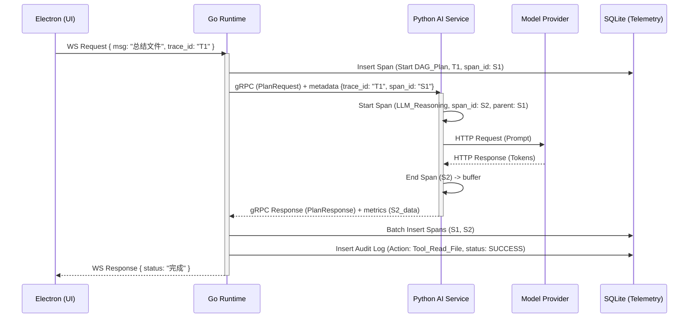

# Luna 日志、监控与审计方案设计文档

## 1. 章节目标

本文档旨在为 Luna 桌面 AI 助理设计一套符合本地化部署要求的全链路日志、监控与审计系统。明确从 Electron 端发起、Go Runtime 调度到 Python 智能服务处理的各环节如何实现请求追溯、任务状态监控、工具调用审计以及异常捕获，确保系统具备“高可观测性”和“问题定位能力”，同时兼顾本地机器的性能开销。

## 2. 设计背景与问题定义

Luna 是一个复杂的本地三层架构（Electron -> Go -> Python）AI 助理。在这样的架构中，一个用户意图（例如“帮我总结一下昨天的会议纪要”）会触发跨语言的协作流程，涉及多 Agent 的路由、RAG 检索、LLM 调用以及本地 MCP 工具执行。

**面临的核心问题：**

1. **链路割裂**：一旦出现执行异常（如意图理解错误或工具执行超时），如果不进行跨层追踪，很难定位问题出在前端、Go 工作流引擎还是 Python 推理侧。
2. **本地环境限制**：传统云原生的 ELK、Prometheus + Grafana 方案过于沉重，无法打包给普通桌面用户。
3. **审计合规与安全**：Agent 具有主动行为能力，执行了哪些高危工具（如删除文件、发送邮件）必须做到 100% 记录和防抵赖，以建立信任。
4. **长周期任务监控**：后台挂起的异步监控任务需要有明确的指标反映系统健康度，避免无声崩溃。

## 3. 核心设计思路

基于项目背景与限制，本方案遵循以下原则：

* **统一 Trace 体系，Go 侧汇聚**：通过生成全局唯一的 `TraceID` 串联三层架构。Go 作为核心控制面，负责所有审计日志和状态指标的汇聚与本地落盘。
* **轻量级本地化存储**：
  * **常规流日志**：采用本地文件系统轮转（File Rotation），记录详细的 Debug/Info 信息。
  * **审计与业务日志**：采用本地 SQLite 的专用 `audit_logs` 和 `trace_spans` 表存储结构化数据，支持前端面板查询。
* **分级降维**：对普通会话日志和底层工具执行日志进行隔离，工具执行必须强制审计并落地。
* **敏感数据脱敏**：AI 请求、用户隐私上下文在落盘时必须执行清洗过滤策略，防止本地权限越界。
* **开发者扩展性**：在调试模式下，支持将数据导出为标准的 OpenTelemetry (OTLP) 格式，供开发者外挂 Jaeger 等追踪工具。

## 4. 模块职责与边界

### 4.1 Electron 层 (UI & State)

* **职责**：拦截用户行为操作，在 WebSocket 请求 Go Runtime 时附带生成的或继承的 `TraceID`；捕获前端渲染报错（Live2D崩溃、TTS播放失败等）并上报给 Go 端；内置“诊断面板”渲染。
* **禁止**：严禁前端直接读写 SQLite 日志库；严禁前端直接连接 Python 打印日志。

### 4.2 Go Runtime 层 (Orchestration & Storage)

* **职责**：生成和传递贯穿全局的 `TraceID`；负责将各 Node/Agent/Workflow 的状态转移记录成结构化事件（Event Bus）；代理并持久化 Python 侧上报的推理日志；核心 MCP Tool 调用的安全审计记录落地；暴露 HTTP/WebSocket 接口供前端“监控面板”查询日志与指标。
* **工具**：采用 Go 标准库 `log/slog` 结合自定义 SQLite Handler 和本地文件轮转组件。

### 4.3 Python 层 (AI Intelligence)

* **职责**：解析 Go 透传的请求上下文（Context），提取 `TraceID`；在调用 LLM 接口前后记录耗时、Token 消耗量、Prompt/Response 片段；将关键异常（如 API Key 失效、限流）结构化抛出或通过拦截器回传给 Go。
* **限制**：Python 不直接写 SQLite，而是通过 gRPC metadata 传递或专门的 Telemetry RPC Endpoint 将重要指标异步打给 Go。

## 5. 核心数据结构

*(假设：所有数据库表都存在于 Luna 本地的 `luna_telemetry.db` SQLite 数据库中，与业务数据库分离，避免锁竞争)*

### 5.1 审计日志表 (`audit_logs`)

记录高优操作（工具调用、文件修改、主动行为触发）。

```sql
CREATE TABLE audit_logs (
    id TEXT PRIMARY KEY,
    trace_id TEXT NOT NULL,
    timestamp DATETIME DEFAULT CURRENT_TIMESTAMP,
    agent_id TEXT,
    action_type TEXT NOT NULL, -- e.g., 'TOOL_CALL', 'MEMORY_COMMIT'
    resource TEXT,             -- e.g., 'local_fs', 'mcp_server'
    operation TEXT,            -- e.g., 'rm -rf', 'write_file'
    payload JSON,              -- 脱敏后的参数
    status TEXT NOT NULL,      -- 'SUCCESS', 'FAILED', 'DENIED'
    error_msg TEXT,
    requires_approval BOOLEAN, -- 是否经历了用户授权 gating
    user_approved BOOLEAN
);
CREATE INDEX idx_audit_trace ON audit_logs(trace_id);
```

### 5.2 链路跨度表 (`trace_spans`)

用于追踪 DAG Node 执行、LLM 推理耗时。

```sql
CREATE TABLE trace_spans (
    span_id TEXT PRIMARY KEY,
    trace_id TEXT NOT NULL,
    parent_span_id TEXT,
    name TEXT NOT NULL,        -- 'DAG_Execute', 'LLM_Completion'
    service TEXT NOT NULL,     -- 'electron', 'go_runtime', 'python_ai'
    start_time DATETIME NOT NULL,
    end_time DATETIME,
    duration_ms INTEGER,
    status TEXT,               -- 'OK', 'ERROR'
    attributes JSON            -- {'tokens_used': 150, 'model': 'gpt-4'}
);
```

### 5.3 监控指标设计 (Metrics Memory Store)

基于本地运行的实际情况，Go Runtime 在内存中维护最近的滑动窗口指标，供面板拉取：

- `system_cpu_usage`
- `go_goroutines_count`
- `python_memory_usage`
- `llm_token_consumption_counter` (按 Provider 分类)
- `tool_call_failure_rate`

## 6. 核心流程 / 时序

### 6.1 全链路 Trace 传递此时序图

以下展示一个普通用户提问如何穿越三层架构，并记录日志的时序流转。



## 7. 接口设计

### 7.1 Go 侧给前端的可观测性查询接口

通过 HTTP 提供，专门供桌面“诊断与监控面板”使用。

**`GET /api/v1/telemetry/traces/:trace_id`**
**响应示例：**

```json
{
  "trace_id": "T-16982400",
  "spans": [
    {
      "span_id": "S-01",
      "name": "User_Intent_Processing",
      "service": "go_runtime",
      "duration_ms": 1250,
      "attributes": {"node_count": 3}
    },
    {
      "span_id": "S-02",
      "parent_span_id": "S-01",
      "name": "Python_Agent_Reasoning",
      "service": "python_ai",
      "duration_ms": 1100,
      "attributes": {"prompt_tokens": 150, "completion_tokens": 80}
    }
  ]
}
```

### 7.2 Python 侧 Telemetry 拦截器

Python 通过 gRPC Interceptor 将日志附加回传。

*(假设 Python 侧提供了一个无状态的服务，通过 `logging` 和 FastAPI/gRPC 拦截器获取 trace_id)*

## 8. 状态管理机制

* **普通文件日志**：
  * 按照 `luna-app.log`、`luna-python.log` 分开存放。
  * **滚动策略**：单个文件最大 10MB，保留最近 5 个备份。
  * **清理机制**：超过 7 天的文件由 Go 的 Cron Worker 自动删除。
* **SQLite 审计表**：
  * 由于本地存储限制，审计日志表不应无限增长。
  * **保留策略**：保留最近 3 个月的操作记录，超过此期限则执行 `DELETE FROM audit_logs WHERE timestamp < datetime('now', '-3 month')`。
* **内存 Metrics**：
  * 使用 Ring Buffer (环形队列) 保留过去 24 小时内每分钟聚合的数据点（共 1440 个点），前端直接拉取全量绘图。

## 9. 异常处理与降级策略

### 9.1 日志写入失败降级

如果在突发情况下 SQLite 被锁定（`database is locked`）或磁盘已满：

1. **降级策略**：不再强行写数据库，而是转写本地应急日志文件 `fallback_audit.log`。
2. **熔断**：关闭详细 Trace span 记录，仅保留核心 Audit 工具调用记录，保证系统不会因写监控数据而崩溃（OOM）。

### 9.2 Python 侧崩溃未上报 Span

如果 Python 进程直接 Segfault 或被 OS Kill，Go Runtime 将在 gRPC 超时处捕获错误。
Go 必须自动为该 `trace_id` 补齐一个 `Status: ERROR` 的 Span 记录，备注 `Python Runtime Unexpected Exit`，保证追踪树完整闭环。

## 10. 与其他模块的协作关系

1. **与 Workflow DAG**：工作流中的每一个 Node 在进入和退出时，必须调用可观测组件的 `StartSpan` 和 `EndSpan` 接口，以便将调度过程具象化为耗时流水线。
2. **与 MCP 工具体系**：所有的 `Tool.Execute()` 必须包一层中间件（Middleware），该中间件强制拦截参数，进行正则脱敏后写入 `audit_logs` 表。
3. **与本地大模型 (Local LLM/Ollama)**：针对本地部署的模型，Go Runtime 通过轮询其 `/api/tags` 或资源接口，周期性拉取显存占用状态并更新 Metrics 缓存。

## 11. 配置项与可调参数

前端 `settings.json` 中暴露出可供用户或开发者调整的参数：

```json
{
  "telemetry": {
    "log_level": "INFO",             // 可选: DEBUG, INFO, WARN, ERROR
    "enable_tracing": true,          // 是否记录链路日志到 SQLite
    "audit_retention_days": 90,      // 审计日志保留天数
    "enable_otlp_export": false,     // （开发者模式）是否通过外网导出
    "otlp_endpoint": "localhost:4317"
  }
}
```

## 12. 可观测性与调试建议

* **本地快速排查**：内置诊断面板，用户可以在 UI 勾选“启用调试模式”。此时 Electron 每秒从 Go 轮询 Metrics，实时渲染 CPU / Token 曲线；并提供一个表格视图查询近期的 Error 级日志。
* **一键打包日志**：在前端设置页提供“导出诊断报告”按钮，Go Runtime 会将最近 3 天的 `.log` 文件、当前的环境信息以及 SQLite 中的近期 Exception Span 打包成一个 `.zip` 文件，方便给开发者提 Issue。

## 13. 安全性与治理建议

* **脱敏策略 (Sanitization)**：任何进入 `audit_logs` 和 `trace_spans` 的数据，凡是匹配如 `sk-[a-zA-Z0-9]+` 的内容（如 API Key）、密码等，必须被替换为 `[REDACTED]`。
* **防篡改**：本地客户端很难绝对防篡改，但 Luna 可确保只要 App 在运行，系统对本地文件系统修改的每一步 MCP 调用必须先写日志再执行。若因为非正常原因终止，下次启动通过 SQLite WAL 校验日志完整性。

## 14. 典型使用场景

**场景：用户投诉“Luna 刚刚突然把我的一个重要文件删了”**
**排查路径：**

1. 打开诊断面板，进入“审计追踪 (Audit Trail)”。
2. 筛选 Action Type 为 `TOOL_CALL` 且资源名为该文件的记录。
3. 查看执行这条操作的 `trace_id`。
4. 跳转到“链路追踪 (Trace Tree)”，利用 `trace_id` 将本次请求的前后逻辑、Python 输出的意图理解结果（为什么它认为要删除）、用户当时的 Prompt 完全还原。
5. 如果 `requires_approval` 字段为 `true` 但 `user_approved` 为 `false` 却执行了，说明是 Go Runtime 的门控鉴权逻辑出现 Bug；否则则是大模型产生了幻觉。

## 15. 示例代码

### 15.1 Go - 核心日志记录器设计

*(基于 `slog` 结合 Context 提取 TraceID)*

```go
package telemetry

import (
    "context"
    "log/slog"
    "os"
)

type contextKey string
const TraceIDKey contextKey = "trace_id"

// ctxHandler 继承并装饰基础 Handler，自动从 ctx 获取 trace_id
type ctxHandler struct {
    slog.Handler
}

func (h *ctxHandler) Handle(ctx context.Context, r slog.Record) error {
    if traceID, ok := ctx.Value(TraceIDKey).(string); ok {
        r.AddAttrs(slog.String("trace_id", traceID))
    }
    return h.Handler.Handle(ctx, r)
}

func InitLogger() {
    // 假设 lumberjackLogger 是支持文件轮转的 io.Writer
    baseHandler := slog.NewJSONHandler(os.Stdout, &slog.HandlerOptions{
        Level: slog.LevelInfo,
    })

    logger := slog.New(&ctxHandler{Handler: baseHandler})
    slog.SetDefault(logger)
}

// 示例：工作流节点调度日志
func ExecuteNode(ctx context.Context, nodeID string) {
    slog.InfoContext(ctx, "Starting workflow node", 
        slog.String("node_id", nodeID),
        slog.String("component", "workflow_engine"),
    )
}
```

### 15.2 Python - 提取 Go 传入的 gRPC Metadata TraceID

```python
import logging
import grpc
from loguru import logger
import contextvars

trace_id_var = contextvars.ContextVar("trace_id", default="UNKNOWN")

class TraceInterceptor(grpc.ServerInterceptor):
    def intercept_service(self, continuation, handler_call_details):
        metadata = dict(handler_call_details.invocation_metadata)
        trace_id = metadata.get("x-trace-id", "UNKNOWN")
        trace_id_var.set(trace_id)

        # 绑定到 loguru 上下文
        with logger.contextualize(trace_id=trace_id):
            logger.info("Received gRPC request")
            response = continuation(handler_call_details)
            return response

# 之后在核心业务中调用，logger 会自动带上 trace_id
def call_llm(prompt: str):
    logger.debug(f"Sending prompt to LLM...")
```

## 16. 常见坑与规避方式

1. **坑：Python 推理耗时极长导致 Go 端协程泄漏**。
   * **规避**：Go 调用 Python 的 gRPC 必须包裹在 `context.WithTimeout` 中。若超时，Go 侧强制写入 Cancelled Span 并回退状态，不允许 Python 在后台成为僵尸进程无限调用资源。
2. **坑：高频日志击穿 SQLite 引起写锁冲突**。
   * **规避**：Go Runtime 写 `trace_spans` 时不要在业务协程同步 `INSERT`。应当在内存中挂载一个大小为 1000 的 `chan SpanEvent`，由独立的单一 worker 协程负责批量插入 (Batch Insert)。
3. **坑：前端状态更新与日志刷新抢占 CPU**。
   * **规避**：WebSocket 向前台推送监控指标不可采取 1:1 事件推送（太密），而应由 Go 控制在每秒 1 帧（1 Hz）的频率批量下发，降低 Electron 渲染层 React 的重新渲染压力。

## 17. 落地实施建议

* **一期落地（第一步）**：仅实现标准的 `slog` 加上 `TraceID` 透传机制，落盘为纯文件。并在 Go 中建立单独的审计日志函数，拦截敏感操作写入纯文本的审计文件。实现报错捕捉。
* **二期落地（进化）**：引入 SQLite 持久化 `trace_spans` 与 `audit_logs` 表，支持结构化查询，通过批量写缓解性能。
* **三期落地（面板呈现）**：开发 Electron 的内嵌 Diagnostic Dashboard，通过 HTTP 轮询 Go 的 `/api/v1/telemetry`，利用 ECharts 或 Recharts 绘制调用拓扑与资源消耗曲线。
