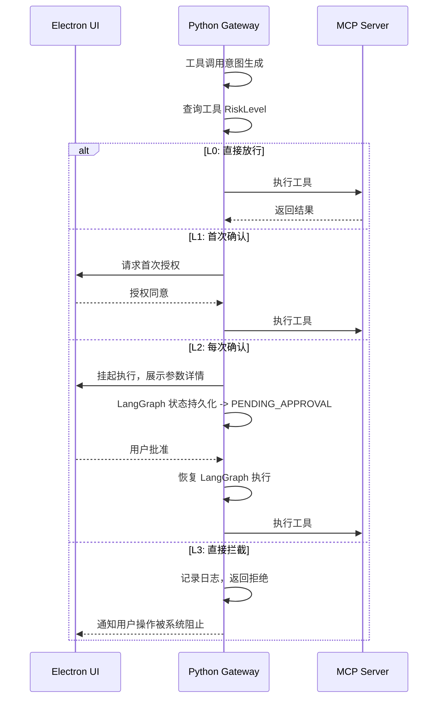

# Luna 平台技术文档：权限与安全方案

## 1. 章节目标

本文档旨在定义 Luna 平台的全局权限治理与安全方案。解决在"本地化 AI 桌面助理 + 工具生态"场景下，如何在不牺牲用户体验的前提下，防止 AI 模型越权操作、保护用户隐私数据，并提供可审计的权限管控体系。

## 2. 设计背景与问题定义

1. **"授权信任"边界模糊**：传统的 Agent 往往在 Prompt 中"要求"模型不要越权，但缺乏底层的技术强制隔离。一旦发生 Prompt Injection（提示词注入），模型可能被操控执行任意危险操作（如删除文件、发送邮件、修改系统配置）。
2. **缺乏分级管控**：所有工具调用无差别对待。既没有"静默执行"的低风险操作概念，也没有需要"每次确认"的高危操作概念。
3. **审计追溯缺失**：当 AI 执行了错误操作后（如错误地删除了一个文件），系统难以回答"哪一个用户、哪一个 Session、哪一个 LLM 调用导致了这次行为"。

## 3. 核心设计思路

本方案采用**三级权限管控 + 动态审批流（Gating）**的设计：

1. **分级权限模型**：对工具进行严格的风险分级 L0-L3，由 Python Execution Gateway 在运行期强制执行。
2. **强制审批流（Gating）**：当工具命中 L2 以上敏感级别时，Python 挂起当前 Task，通过 WebSocket/SSE 发送审批请求到 Electron 前端，等待用户手动确认。
3. **默认拒绝原则**：未明确授权的操作，执行引擎一律拒绝，并记录审计日志。

## 4. 模块职责与边界

| 模块              | 职责                                             | 边界约束                                     |
|:-----------------|:------------------------------------------------|:--------------------------------------------|
| **Electron 前端** | 渲染敏感操作确认弹窗；展示操作审计历史。                       | 禁止在 UI 层绕过 Python 直接执行工具。               |
| **Python Backend** | 维护 RiskLevel 表；执行工具调用的权限校验；触发审批挂起；执行审计日志写入。 | 禁止在未经 L0/L1 确认时执行 L2 以上工具；禁止绕过审批机制。 |

## 5. 核心权限分级

| 级别  | 名称         | 特征                                               | 示例                                 | 执行策略           |
|:----|:-----------|:-------------------------------------------------|:-----------------------------------|:---------------|
| L0  | 无感级        | 纯读取操作，无副作用                                      | 查询天气、读取本地时间、文本总结                     | 直接放行，不通知用户    |
| L1  | 首次确认级      | 有频率限制的读取操作，跨 Session 有影响                          | 读取邮箱邮件、浏览本地文件目录                     | Session 内首次确认  |
| L2  | 强确认级       | 写操作，对用户数据或系统状态产生持久影响                             | 发送邮件、修改配置文件、执行 SQL 写操作               | **每次**都需要用户确认  |
| L3  | 禁用级        | 被管理员或安全策略封禁的操作                                    | 格式化磁盘、删除关键系统文件                      | 直接拦截并记录告警     |

## 6. 权限校验与审批流程 (Mermaid)



## 7. 接口设计

### 7.1 工具权限注册 (Python)

```python
from pydantic import BaseModel
from typing import Literal

RiskLevel = Literal["L0", "L1", "L2", "L3"]

class ToolPermissionPolicy(BaseModel):
    tool_id: str
    risk_level: RiskLevel
    description: str
```

### 7.2 审批交互协议

```json
// Python -> Electron: 审批请求
{
  "type": "TOOL_APPROVAL_REQUEST",
  "payload": {
    "execution_id": "exec-001",
    "tool_name": "send_email",
    "risk_level": "L2",
    "arguments": {"to": "boss@company.com", "subject": "报告", "body": "..."},
    "description": "准备发送邮件给 boss@company.com"
  }
}

// Electron -> Python: 用户响应
{
  "type": "TOOL_APPROVAL_RESPONSE",
  "payload": {
    "execution_id": "exec-001",
    "action": "APPROVE",  // 或 "REJECT"
    "reason": "已确认内容无误"
  }
}
```

## 8. 状态管理机制

Python 在触发 L2 以上审批时，必须将 LangGraph 节点状态持久化为 `PENDING_APPROVAL`，写入 PostgreSQL。即使进程崩溃重启，也能从断点恢复审批流程。

## 9. 审计日志

```sql
CREATE TABLE permission_audit_logs (
    log_id VARCHAR(64) PRIMARY KEY,  -- 雪花算法 ID
    session_id VARCHAR(64),
    tool_id VARCHAR(64),
    risk_level VARCHAR(4),
    trace_id VARCHAR(64),
    action VARCHAR(32),  -- EXECUTED, REJECTED, BLOCKED
    reason TEXT,
    created_at TIMESTAMP DEFAULT CURRENT_TIMESTAMP
);
```

## 10. 落地实施建议

1. **Phase 1**：实现 L0/L1 分级和首次确认机制。
2. **Phase 2**：上线 L2 强确认审批流（Gating），打通 Electron UI。
3. **Phase 3**：实现完整的审计追溯与 L3 禁用级管控。
