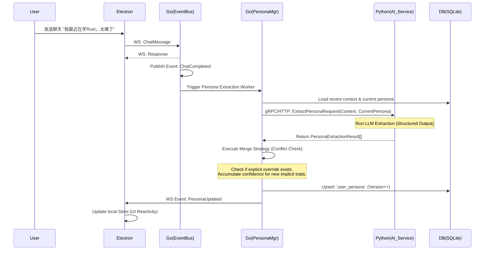

这份技术文档严格按照 Luna 架构规范与要求编写，专门针对“用户画像与偏好建模方案”进行深度工程化设计。

---

# 用户画像与偏好建模方案

## 1. 章节目标

本章节旨在定义 Luna 系统中**用户画像（Persona）与偏好（Preference）**的完整生命周期管理。包括画像的结构化表达、从多模态交互及历史记忆中的隐式提取、显式设置的治理机制、基于置信度的冲突解决策略，以及画像数据在 Prompt 组装、主动行为决策中的工程落地方式。目标是提供一套本地优先、用户可控且具备高一致性的画像引擎实施蓝图。

## 2. 设计背景与问题定义

在 Luna “陪伴式人格 + 长期记忆 + 主动行为”的全栈 Agent 架构中，用户画像是实现“千人千面”与“高度个性化”的核心基石。
**面临的工程挑战：**

1. **来源混杂**：画像既来自用户的显式设置（如：“叫我老板”），也来自日常交互的隐式推断（如频繁询问编程问题 -> 偏好：程序员/技术控）。
2. **冲突与漂移**：大模型推断隐式画像时易产生幻觉，或因语境变化产生冲突（如昨天说想吃素，今天吃炸鸡）。
3. **读写高并发与隔离**：工作流在组装 Prompt 时需要极高频地读取画像，而画像的更新通常是异步和滞后的。
4. **与记忆的边界模糊**：开发者常常混淆“情节记忆”（Episodic Memory，如“昨天去了北京”）与“语义画像”（Semantic Persona，如“常驻地：北京”）。

## 3. 核心设计思路

基于上述挑战，Luna 的画像系统采用以下核心设计：

* **显隐式分离与优先级（Explicit Override Implicit）**：所有画像属性分为显式（Explicit，用户手动设定或确认）和隐式（Implicit，AI 推断）。显式属性具有绝对优先级，禁止 AI 自动覆盖显式属性。
* **基于置信度（Confidence）的渐进式确立**：Python 层从对话中提取隐式画像时，必须输出置信度（0.0~1.0）。Go Runtime 会根据累积逻辑（同类属性多次高置信度命中）进行状态跃迁，低置信度仅作为“候选（Candidate）”。
* **异步事件驱动更新**：画像提取不阻塞主干对话。Go Runtime 在会话归档或特定 Node 结束时，通过 Event Bus 触发异步 Worker 调用 Python 进行画像萃取。
* **版本控制与软删除**：采用 Append-Only 思想或带有 Version 的 Upsert。所有画像变更保留审计追踪记录（Audit Log），便于回退和用户审查。
* **用户绝对控制权**：提供前端 UI，用户可随时查看、编辑、删除（CRUD）任何画像标签，删除操作即时生效。

## 4. 模块职责与边界

### 4.1 Desktop Interaction Layer (Electron + TS)

* **职责**：提供“偏好设置”面板；渲染画像标签；支持用户增删改画像（显式）；接收 Go 推送的画像变更 WebSocket 事件并更新本地 Store。
* **禁止**：不允许前端本地缓存作为“唯一信源”；不允许前端直接解析对话生成画像。

### 4.2 Workflow Runtime Layer (Golang) - 绝对控制面

* **职责**：持久化画像数据（SQLite/PostgreSQL）；管控画像的版本、置信度累积与冲突合并逻辑（Merge Strategy）；处理来自 Python 的提炼结果并持久化；在调度 Agent 时将画像注入 Prompt Context；暴露 CRUD 接口给 Electron。
* **禁止**：不在 Go 内部实现 NLP 抽取逻辑，依赖 Python。

### 4.3 AI Intelligence Layer (Python) - 无状态智能

* **职责**：接收 Go 传入的“近期对话片段/总结”，运行 Persona Extraction Chain（LangGraph 或单次 LLM 结构化输出）；返回带有 `category`, `key`, `value`, `confidence` 的结构化 JSON；处理多源冲突的语义合并建议。
* **禁止**：不直连数据库；不维护画像状态；不决定“最终是否更新”（仅提供建议，Go 决定）。

## 5. 核心数据结构

### 5.1 数据库表设计 (Go 层管理，PostgreSQL/SQLite)

**表名：`user_persona`**
| 字段名 | 类型 | 描述 |
| :--- | :--- | :--- |
| `id` | VARCHAR(64) | 主键（雪花算法 ID） |
| `category` | String | 分类：`basic`(基础), `interest`(兴趣), `style`(语言), `device`(设备), `habit`(习惯) |
| `key` | String | 画像键，如 `dietary_preference` |
| `value` | JSONB/Text | 画像值，如 `"vegetarian"` |
| `source` | String | 来源：`explicit` (用户设定), `implicit` (AI推断) |
| `confidence` | Float | 置信度：0.0 - 1.0 (显式强制为 1.0) |
| `version` | Int | 版本号，用于乐观锁和冲突解决 |
| `status` | String | 状态：`active`, `candidate`, `deleted` |
| `last_inferred_from` | VARCHAR(64) | 关联的 Memory ID 或 Trace ID（用于审计追溯，雪花算法 ID） |
| `updated_at` | Timestamp | 更新时间 |

*(假设：所有对于同一个 `key` 的更新，采用 Upsert 并 Version +1 的方式，保留历史放入 `user_persona_history` 表)*

### 5.2 Python 侧结构化输出定义 (Pydantic)

```python
from pydantic import BaseModel, Field
from typing import List, Literal

class PersonaTrait(BaseModel):
    category: Literal["basic", "interest", "style", "device", "habit"] = Field(..., description="The category of the trait")
    key: str = Field(..., description="Standardized snake_case key, e.g., 'coding_language'")
    value: str = Field(..., description="The value of the trait")
    confidence: float = Field(..., ge=0.0, le=1.0, description="Confidence level of this extraction")
    reasoning: str = Field(..., description="Brief explanation of why this trait was extracted")

class PersonaExtractionResult(BaseModel):
    traits: List[PersonaTrait]
```

## 6. 核心流程 / 时序

### 6.1 隐式画像异步提取与合并流程

此流程通常在一段对话结束后，由 Go 的 Event Bus 触发，确保不影响用户交互延迟。



### 6.2 显式画像更新流程 (UI操作)

1. 用户在前端设置中点击编辑偏好。
2. Electron 通过 WS 发送 `UpdatePersona` 请求给 Go。
3. Go 将该记录置为 `source="explicit"`, `confidence=1.0`, `status="active"`。
4. Go 保存 DB 并广播更新事件。

## 7. 接口设计

### 7.1 Go 提供给 Electron 的接口 (WebSocket Payload Schema)

**获取画像列表 (Request)**

```json
{
  "type": "GetPersonaListReq",
  "payload": {
    "status": ["active", "candidate"]
  }
}
```

**更新/添加显式画像 (Request)**

```json
{
  "type": "UpdatePersonaReq",
  "payload": {
    "category": "style",
    "key": "response_length",
    "value": "concise",
    "source": "explicit"
  }
}
```

### 7.2 Go 调用 Python 的接口 (gRPC proto 示例)

```protobuf
syntax = "proto3";
package luna.ai;

message Trait {
  string category = 1;
  string key = 2;
  string value = 3;
}

message ExtractPersonaRequest {
  string conversation_context = 1;
  repeated Trait existing_traits = 2; // 传入现有画像避免重复提取
}

message ExtractedTrait {
  string category = 1;
  string key = 2;
  string value = 3;
  float confidence = 4;
  string reasoning = 5;
}

message ExtractPersonaResponse {
  repeated ExtractedTrait traits = 1;
}

service PersonaService {
  rpc Extract(ExtractPersonaRequest) returns (ExtractPersonaResponse);
}
```

## 8. 状态管理机制

### 8.1 冲突处理与置信度累积 (Go 端逻辑)

当 Python 返回针对同一 `key` 的不同 `value` 时，Go Runtime 执行以下状态机判定：

1. **若 DB 中现有为 `explicit`**：拒绝 Python 的更新，记录 Audit Log（Reason: Blocked by explicit constraint）。
2. **若 DB 中现有为 `implicit` 且内容相同**：更新 `last_inferred_from`，并根据公式增加置信度（如：`new_conf = old_conf + (1 - old_conf) * 0.2`）。
3. **若 DB 中现有为 `implicit` 且内容不同（冲突）**：
   * 检查 Python 传入的新置信度。若 `< 0.8`，将新记录暂存为 `candidate` 状态。
   * 若新置信度 `>= 0.8`（强反转，比如用户明确纠正了 AI），则发生**版本更迭**。将老记录标为 `deleted`，新记录标为 `active`。
   * *高级机制*：若多次冲突波动，Go 可调度一个**主动行为**：“用户，我注意到你最近提到了喜欢喝咖啡，但我记得你之前说喜欢茶，请问你的偏好有变化吗？”，进而转化为 `explicit`。

### 8.2 画像与记忆 (Memory) 的关系

* **Memory (情节)**：“用户在周二下午3点说去出差。”（存入向量库/时序图数据库）
* **Persona (语义)**：“用户的职业可能是销售/高管，经常出差。”（存入关系型画像表）
* **协同机制**：Python 定期对长期记忆 (Memory) 运行 Summarization 任务，其输出物不仅包含 Memory 聚类，也会生成提取 Persona 的请求，发送回 Go 引擎进行合并。

## 9. 异常处理与降级策略

* **LLM 提取格式错误 / 幻觉**：Python 层通过 Pydantic 强制校验，若 JSON 损坏则重试 1 次。若依然失败，返回空列表。Go 收到空列表不做任何操作（**降级为不更新**）。
* **数据库事务冲突 (Lock)**：Go 更新画像使用乐观锁（`WHERE id=? AND version=?`）。如遇并发覆盖，采用重试机制（Max Retry: 3）。
* **置信度阈值调优保守化**：为了避免“过度拟合”，隐式提取的生效阈值（`active`）设定较高（默认 0.8），防止一次随意的对话彻底改变角色设定。

## 10. 与其他模块的协作关系

### 10.1 在提示词拼装 (Prompt Assembly) 中的使用方式

Go Runtime 在每次调度 Python LLM 节点前，负责组装 System Prompt。
将 `active` 状态的画像提取组装：

```go
// Go 伪代码，组装 Prompt
func buildSystemPrompt(personaList []Persona) string {
    var promptBuilder strings.Builder
    promptBuilder.WriteString("You are Luna. Here is what you know about the user:\n")
    for _, p := range personaList {
        promptBuilder.WriteString(fmt.Sprintf("- [%s] %s: %s\n", p.Category, p.Key, p.Value))
    }
    // 注入其他指令...
    return promptBuilder.String()
}
```

**注意**：Go 是最终的 Prompt 拼接者。Python 端接收到的是组装完毕的 `messages` 数组。

### 10.2 对主动行为 (Proactive Action) 与推荐的影响

* **主动行为**：Go 的 Persistent Scheduler 若检测到存在 `category="habit", key="sleep_time", value="23:30"` 的画像，可在 23:00 主动发起“提醒休息”的工作流。
* **情绪响应**：若存在 `category="style", key="communication_style", value="cynical/humorous"`，Go 会在触发 Python 对话节点时，增加 `<rule>Use sarcastic humor</rule>` 的上下文控制。

## 11. 配置项与可调参数

以下参数应在 Go 的 `config.yaml` 或数据库全局配置中可调：

* `persona.extraction_frequency_messages`: 隐式提取触发频率（如：每 10 条消息触发一次，避免太频繁调用大模型）。
* `persona.confidence_threshold.candidate`: 成为候选的最低置信度（默认 0.5）。
* `persona.confidence_threshold.active`: 直接激活的最低置信度（默认 0.8）。
* `persona.enable_auto_inquiry`: 是否允许系统在画像冲突时主动提问求证（Boolean）。

## 12. 可观测性与调试建议

* **日志字段 (Log Fields)**：所有针对 `user_persona` 的 DB 操作，必须在 Go 记录包含 `action="update_persona"`, `key`, `old_value`, `new_value`, `source`, `reasoning` 的结构化日志，便于复盘。
* **调试建议**：
  * 在 Electron 前端开发一个**开发者面板 (Debug Panel)**，实时罗列所有隐式和显式画像，包含其内部的 Confidence 分数，以便 QA 测试大模型的提取准度。
  * Trace ID：从最初的对话 Message ID 一路传递给 Go Event Bus -> Python Extraction -> Go DB Commit，必须打通。

## 13. 安全性与治理建议

* **数据安全 (本地优先)**：所有画像数据默认必须存储于本地 SQLite，不上传云端，满足极高的隐私要求。
* **敏感标签过滤**：Python 层的 Prompt 中必须包含指令，禁止提取敏感个人身份信息 (PII，如身份证号、银行卡密码)，Go 层也需配置一份正则表达式黑名单（Blacklist）进行拦截。
* **用户完全授权**：UI 界面必须提供一键“清除所有画像并暂停隐式收集”的选项（全局止损开关）。

## 14. 典型使用场景

* **场景 1：语言风格适应**。用户说：“别总跟我说敬语，随意点。” -> Python 提取 `key="tone", value="casual", source="implicit"`。Go 写入后，后续对话自动带上随意风格。
* **场景 2：常用设备辅助**。用户说：“帮我写个查网卡的脚本。” -> 提取 `device="OS: unspecified"`。几天后用户说：“我 Mac 上的网卡怎么查？” -> 更新 `device="OS: MacOS"`。后续请求自动生成 Shell 脚本而非 PowerShell。

## 15. 示例代码与伪代码

### 15.1 Go 层：画像冲突合并逻辑 (Merge Strategy)

```go
package persona

import (
    "context"
    "errors"
    "log"
)

type PersonaService struct {
    db DBTx
}

// HandleExtractedTrait 处理来自 Python 的提取结果
func (s *PersonaService) HandleExtractedTrait(ctx context.Context, trait ExtractedTrait) error {
    s.db.Begin()
    defer s.db.Rollback()

    // 1. 查询现存记录
    existing, err := s.db.GetTraitByKey(ctx, trait.Key)
    if err != nil && !errors.Is(err, ErrNotFound) {
        return err
    }

    // 2. 显式覆盖拦截
    if existing != nil && existing.Source == "explicit" {
        log.Printf("Ignoring implicit update for %s, blocked by explicit setting.", trait.Key)
        return nil
    }

    // 3. 状态机与合并
    if existing == nil {
        // 新建
        status := "candidate"
        if trait.Confidence >= 0.8 {
            status = "active"
        }
        s.db.InsertTrait(ctx, trait, status)
    } else {
        // 更新逻辑
        if existing.Value == trait.Value {
            // 同值累加置信度
            newConf := existing.Confidence + (1.0-existing.Confidence)*0.2
            s.db.UpdateConfidence(ctx, existing.ID, newConf)
        } else {
            // 冲突情况
            if trait.Confidence >= 0.8 {
                // 强覆盖
                s.db.ArchiveTrait(ctx, existing.ID) // 软删除老记录
                s.db.InsertTrait(ctx, trait, "active")
            } else {
                // 记录候选供后续合并或询问
                s.db.InsertTrait(ctx, trait, "candidate")
            }
        }
    }

    return s.db.Commit()
}
```

### 15.2 Python 层：Prompt 组装与 FastAPI 接口

```python
from fastapi import APIRouter
from pydantic import BaseModel
from typing import List
from langchain.chat_models import ChatOpenAI
from langchain.prompts import ChatPromptTemplate
from core.schemas import PersonaExtractionResult # 见 5.2

router = APIRouter()

PROMPT_TEMPLATE = """
Analyze the following conversation snippet and extract user persona traits.
Categories allowed: basic, interest, style, device, habit.
Use snake_case for keys.
Only extract highly probable traits. Do NOT guess blindly.

Current existing traits for context (do not extract again unless changed):
{existing_traits}

Conversation:
{conversation}
"""

@router.post("/extract_persona", response_model=PersonaExtractionResult)
async def extract_persona(request: ExtractPersonaRequest):
    # LLM 调用，使用 OpenAI compatible APIs 的 structured output 功能
    llm = ChatOpenAI(model="gpt-4o", temperature=0) # 假设使用能力较强的模型做提取
    prompt = ChatPromptTemplate.from_template(PROMPT_TEMPLATE)

    chain = prompt | llm.with_structured_output(PersonaExtractionResult)

    try:
        result = await chain.ainvoke({
            "existing_traits": request.existing_traits,
            "conversation": request.conversation_context
        })
        return result
    except Exception as e:
        # Fallback：记录日志，返回空，Go 将不会做任何处理
        print(f"Extraction failed: {e}")
        return PersonaExtractionResult(traits=[])
```

## 16. 常见坑与规避方式

1. **频繁触发提取导致性能与 token 耗尽**。
   * *规避*：不要每句话都提取。应该由 Go 维持一个 `MessageCounter`，累积 N 条（如 10 条），或者在一个 Task Node 生命周期结束时打包触发。
2. **“伪偏好”污染**。用户可能是在复述别人的话：“我朋友特别喜欢吃香菜”。AI 如果无法准确指代消解，会给用户打上“喜欢香菜”的标签。
   * *规避*：在 Python 层的 Prompt 严格强调 `Focus ONLY on the USER's own traits. Beware of third-party descriptions.`。同时依赖 Go 的置信度累积，单次误判不会立刻生效。
3. **Key 爆炸**。如果不加限制，AI 会发明无数同义词 Key（如 `coding_lang`, `prog_language`, `language_used`）。
   * *规避*：在 Python 层引入 RAG 或枚举库，将用户的提取对齐到预设的几十个标准 Key 上，只有无法对齐的才允许新建。

## 17. 落地实施建议

建议采用三阶段推进：

* **Phase 1 (MVP)**：仅实现 **显式画像** 控制。支持 Electron UI + Go DB CRUD。AI 仅读取，不自动写入。跑通系统主干链路与 Prompt 组装。
* **Phase 2**：加入异步隐式提取，但仅在 Go 后台打点，状态全部设为 `candidate`。在前端做个专门的“AI猜你喜欢...”面板，需要用户手动点击 Check 确认后才生效。以收集真实的用户语料和测试 AI 提取能力。
* **Phase 3**：全面启用置信度累积引擎与阈值自动跃迁。系统进入闭环全自动隐式画像积累状态，辅以“主动确认”机制。
