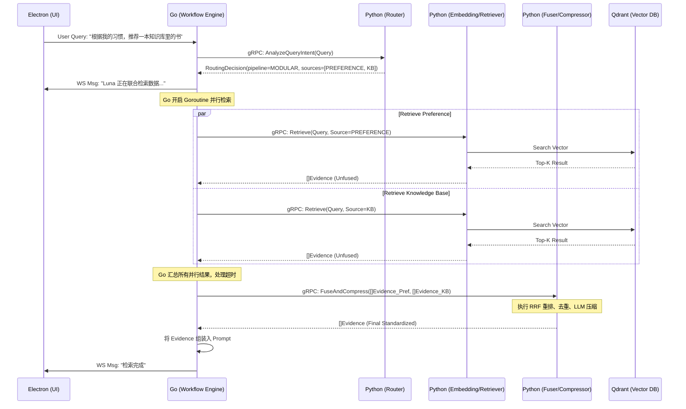

这是一份针对 Luna 项目中 **知识库检索增强生成方案 (Dynamic Multi-Pipeline RAG)** 的详细技术文档。严格遵守 Go 为调度核心、Python 为无状态智能服务的架构原则。

---

### 1. 章节目标

本设计文档旨在为 Luna 的知识库检索增强生成（RAG）系统提供标准化的工程落地指南。
目标是构建一套**基于查询复杂度的动态分层 RAG 检索流水线**。通过引入决策 Agent 和四种不同深度的检索路径（Search, Native, Modular, Agentic），在“系统响应延迟”与“检索质量”之间取得最佳平衡。同时，规范多源数据的输入与输出，为下游的“上下文组装”和“Prompt 构建”提供标准化的 `Evidence` 对象。

### 2. 设计背景与问题定义

**当前痛点与挑战：**

1. **一刀切的检索流程**：传统 RAG 通常对所有查询执行固定的“检索 -> 重排 -> 融合 -> 压缩”流程。对于“我猫叫什么”这样的简单事实查询，走全流程会极大增加系统延迟并浪费本地算力；而对于“根据我的日记总结我上周的情绪变化”，单一检索又无法提供足够的上下文。
2. **多源数据异构**：Luna 具有长期记忆（Memory）、本地文档（KB）、用户偏好（Preference）等多个数据源。各数据源格式不一，如果不做统一抽象，上层 Agent 组装 Prompt 时将面临极大的解析负担。
3. **本地算力受限**：Luna 作为本地优先的桌面助理，本地 VRAM/RAM 资源极其宝贵。不能无脑并发所有大模型推理任务，必须按需分配计算资源。

**问题定义：**
系统必须能够动态评估用户的 Query 复杂度，将其路由到开销和能力最匹配的检索流水线中，并最终收敛为统一的结构化证据集。

### 3. 核心设计思路

本方案采用 **4层动态路由架构**。所有外部触发的 Query 必须首先经过“意图与复杂度评估”，随后由 Golang 运行时调度到对应的流水线：

1. **Search 流水线（轻量精准，无模型开销）**
   
   - **适用场景**：明确的具体事实查找（如：特定实体定义、明确的记忆点）。
   - **执行路径**：直接走关键词 (BM25) 或向量检索 (HNSW) -> 取 Top-K -> 直接返回。
   - **特点**：无重排、无融合，延迟最低（<100ms）。

2. **Native 流水线（单源优化，局部重排）**
   
   - **适用场景**：明确指向单一数据源的查询（如：只查知识库，或只查对话记忆）。
   - **执行路径**：单源检索 -> 局部语义重排 (Cross-Encoder Reranker) -> Top-K 截断 -> 结构化输出。
   - **特点**：引入轻量级重排模型，提升单源召回准确率。

3. **Modular 流水线（多源并行，全局融合）**
   
   - **适用场景**：需要跨越多个数据源的复合查询（如：需要结合“长期记忆”与“外部文档”）。
   - **执行路径**：Go 协程并行发起多源检索 -> 各自局部重排 -> Python 执行跨源融合 (RRF 算法) -> 去重与上下文压缩 -> 统一证据集。
   - **特点**：高并发、解决多源信息冲突。

4. **Agentic 流水线（深度推理，多轮迭代）**
   
   - **适用场景**：复杂的分析、总结任务，需要“边想边查”的开放式问题。
   - **执行路径**：Go 激活 Agentic RAG 状态机 -> Python LangGraph 执行局部 Reasoning -> 动态决定查询词 -> 多次调用 Retriever -> 整合结果返回给 Go。
   - **特点**：算力开销最大，但能解决复杂逻辑关联问题。

**核心约束：** 所有流水线的终点必须是标准化的 `[]Evidence`。

### 4. 模块职责与边界

**Workflow Runtime Layer (Golang)**

- **职责**：
  - 维持 RAG 生命周期的状态机（Routing -> Executing -> Fusing -> Done）。
  - 控制 Modular 流水线的多协程并发检索，执行 WaitGroup 控制与超时中断 (Context Cancellation)。
  - 根据 Python 返回的路由决策，调用对应的下游 RPC 接口。
  - RAG 执行失败时的降级重试策略（如 Modular 超时，降级为已返回的单源数据）。
- **边界**：不参与文本 Embedding 计算、不参与重排算法逻辑、不参与 LLM 意图推断。

**AI Intelligence Layer (Python)**

- **职责**：
  - **路由决策服务**：提供大模型驱动的 Query 复杂度分析和意图分类。
  - **无状态检索引擎**：封装对 Qdrant / SQLite 的底层查询，提供 Search, Rerank, Fuse, Compress 的无状态 RPC 接口。
  - **Agentic 推理图**：使用 LangGraph 实现多轮检索决策图（仅限检索范围内的推理，不涉及外部工具如发邮件）。
- **边界**：不持有整个 Agent 会话的状态，无权阻断或挂起上层对话，一切受 Go 端的 Context 控制。

**Desktop Interaction Layer (Electron)**

- **职责**：通过 WebSocket 接收 Go 推送的 `RAG_STATE_CHANGE` 事件，向用户展示当前助理的状态（如 UI 显示 "Luna 正在查阅长期记忆..."）。

### 5. 核心数据结构

#### 5.1 Evidence 统一证据对象 (JSON & Go Struct)

无论哪条流水线，最终返回的必须是该对象的数组。

```go
// RAG 返回的统一证据模型
type Evidence struct {
    EvidenceID      string                 `json:"evidence_id"`       // 证据唯一标识
    SourceType      SourceType             `json:"source_type"`       // MEMORY, KNOWLEDGE_BASE, PREFERENCE, SYSTEM
    SourceID        string                 `json:"source_id"`         // 对应的原始文档或记忆片段ID
    Content         string                 `json:"content"`           // 提取出的文本内容
    Score           float64                `json:"score"`             // 综合相关度得分 (0.0 - 1.0)
    ConfidenceLevel string                 `json:"confidence_level"`  // HIGH, MEDIUM, LOW
    Metadata        map[string]interface{} `json:"metadata"`          // 扩展信息（如时间戳、作者、标签等）
}

type SourceType string
const (
    SourceMemory        SourceType = "MEMORY"
    SourceKnowledgeBase SourceType = "KNOWLEDGE_BASE"
    SourcePreference    SourceType = "PREFERENCE"
)
```

#### 5.2 路由决策对象 (RoutingDecision)

Python 意图分析模块返回给 Go 的决策依据。

```json
{
  "pipeline_type": "MODULAR",
  "reasoning": "用户询问了其个人的学习习惯与知识库中的Python教程关联，需要结合偏好记忆与知识库。",
  "target_sources": ["PREFERENCE", "KNOWLEDGE_BASE"],
  "extracted_keywords": ["学习习惯", "Python教程"],
  "needs_iteration": false,
  "confidence": 0.92
}
```

### 6. 核心流程 / 时序

以下是 Modular 流水线的典型执行时序（最复杂的常规路径）：



### 7. 接口设计

Go 与 Python 之间的 RAG 相关通信采用 gRPC（为了降低大规模文本传输的序列化开销及保持强类型约束）。

**protobuf 定义示例：**

```protobuf
syntax = "proto3";
package luna.rag.v1;

service RAGService {
  // 1. 路由评估
  rpc EvaluateIntent(EvaluateIntentRequest) returns (EvaluateIntentResponse);

  // 2. 单源/基础检索 (Search & Native)
  rpc Retrieve(RetrieveRequest) returns (RetrieveResponse);

  // 3. 多源融合压缩 (Modular 后处理)
  rpc FuseAndCompress(FuseRequest) returns (FuseResponse);

  // 4. Agentic 复杂推理检索 (Agentic)
  rpc AgenticRetrieve(AgenticRequest) returns (AgenticResponse);
}

message EvaluateIntentRequest {
  string query = 1;
  repeated string available_sources = 2;
  map<string, string> conversation_context = 3; // 最近N轮对话
}

message EvaluateIntentResponse {
  enum Pipeline {
    SEARCH = 0;
    NATIVE = 1;
    MODULAR = 2;
    AGENTIC = 3;
  }
  Pipeline pipeline = 1;
  repeated string target_sources = 2;
  repeated string sub_queries = 3; 
}
```

### 8. 状态管理机制

RAG 流程在 Go 的工作流引擎中被抽象为一个 **Sub-DAG (子图)** 或 **状态机**。
Go 运行时必须维护以下状态，以确保可观测和可恢复：

- `RAG_INIT`: 初始化查询上下文。
- `RAG_ROUTING`: 正在请求 Python 进行流水线判定。
- `RAG_EXECUTING`: 根据路由结果，进入实际检索。
  - 如果是 Modular：进入 `RAG_PARALLEL_WAIT` 状态，监听多个 Goroutine 的返回。
- `RAG_FUSING`: 多源数据融合中。
- `RAG_COMPLETED`: 成功生成最终 Evidence。
- `RAG_FAILED`: 捕获到不可逆错误。

**状态机存储：** RAG 的瞬时状态存储在 Go 内存中，但所属的父 Task 的 Snapshot 会异步落盘到 SQLite，如果系统在中途崩溃（如断电），重启后 Go Runtime 不会恢复 RAG 的中间状态，而是直接将该 RAG 节点标记为 `RETRY`，从 `RAG_INIT` 重新执行。

### 9. 异常处理与降级策略

面对本地算力瓶颈或组件故障，系统必须具备强大的降级能力，**绝不能因为检索失败导致整个对话卡死**。

| 异常情况                 | 现象                              | 兜底 / 降级策略 (Go 端执行)                                                           |
|:-------------------- |:------------------------------- |:---------------------------------------------------------------------------- |
| **路由大模型超时**          | Python EvaluateIntent 无响应超过 2s  | **默认降级为 Native 流水线**，只查最近的 Memory 源。跳过复杂路由。                                  |
| **Qdrant 向量库宕机**     | gRPC 返回 Connection Refused      | 立即停止 RAG 流程，Go 生成一条特殊的 System Evidence："当前知识库系统不可用"。LLM 据此向用户致歉并依靠纯参知识回答。    |
| **Modular 并行检索部分超时** | 设定 3s 超时，Memory 成功，KB 超时未返回     | **偏微分降级**：Go 记录 Warning 日志，丢弃超时的 KB 结果，直接将已拿到的 Memory 结果送去融合。确保用户体验不被长尾延迟拖垮。 |
| **Agentic 陷入死循环**    | Python LangGraph 推理超过最大步数(如 5步) | **强制截断**：Go Context 发出 Cancel 信号。利用目前收集到的中间 Evidence 强行终止，交由大模型生成最终回复。       |

### 10. 与其他模块的协作关系

- **Context Assembler (上下文组装器, Go层)**：RAG 流水线结束后，输出的 `[]Evidence` 将投递给组装器。组装器根据系统 Prompt 模板，将其渲染为 `<context>...</context>` 标签块。
- **Memory Manager (记忆管理器, Go层)**：RAG 提供读取能力；当 Agentic 检索发现长期记忆存在严重冲突或过期时，会产生事件投递给 Event Bus，触发后续的异步 Memory Update 工作流。
- **User Permission (用户权限界限)**：对于涉及到敏感目录（如用户本地私密文件夹接入的 KB），Go 层在发起 RetrieveRequest 时，必须携带当前会话的权限 Token，Python 层在 Qdrant 查询时追加 `filter: { access_level: ... }`。

### 11. 配置项与可调参数

以下参数应在 `config.yaml` 或 SQLite 配置表中开放，允许动态热加载：

```yaml
rag:
  routing:
    llm_model: "qwen-1.5-7b-chat-gguf" # 专门用于路由的轻量本地模型
    timeout_ms: 2000
  retrieval:
    top_k_default: 5
    similarity_threshold: 0.75         # 向量相似度底线
  modular:
    parallel_timeout_ms: 3000          # 并发检索的最大等待时间
    fusion_algorithm: "RRF"            # Reciprocal Rank Fusion
    rrf_k: 60                          # RRF 平滑常数
  agentic:
    max_iterations: 3                  # Agentic RAG 最大推理跳数
```

### 12. 可观测性与调试建议

1. **链路追踪 (Tracing)**：在 Go 中生成一个唯一的 `RagTraceID`，通过 gRPC Context 传递给 Python。Python 的所有检索、重排日志必须带上此 ID。
2. **决策审查**：在 Electron 的调试面板中（仅开发者模式），可以点击某条对话，展开查看其 **RAG Trace 树**：
   - `Selected Pipeline: MODULAR`
   - `Routing Latency: 450ms`
   - `Source[Memory] Hit: 3 docs (Max Score: 0.88)`
   - `Source[KB] Hit: 1 doc (Max Score: 0.72)`
   - `Fusion Latency: 200ms`
3. **Debug API**：提供本地 HTTP Endpoint `GET /api/v1/debug/rag/test?query=xxx`，允许开发者在不触发对话的情况下，直接模拟 RAG 流水线并查看输出的 Evidence 结构。

### 13. 安全性与治理建议

1. **Metadata 污染防护**：Python 层检索到的 Metadata 在传递给 Go 前，Go 层必须使用强类型 Struct 进行反序列化校验。丢弃未定义的危险字段，防止 prompt injection 通过脏数据攻击下游大模型。
2. **数据隔离 (Tenant/Profile Isolation)**：在本地多角色（Persona）场景下，检索时必须在 Payload 中携带 `persona_id`，底层 Qdrant 查询必须强制带上 `must: { key: "persona_id", match: { value: "xxx" } }` 约束。

### 14. 典型使用场景

- **场景 A（Search 命中）**：
  - *Query*：“我昨天设定的番茄钟是几分钟？”
  - *系统行为*：路由判定为明确的时间事实检索，直接走 Search -> Memory 源，匹配到“番茄钟=25分钟”，总耗时 150ms。
- **场景 B（Modular 命中）**：
  - *Query*：“根据我的编程习惯，解释一下这个代码片段。”
  - *系统行为*：路由判定需多源数据。并行检索 `KB(代码片段)` 和 `Preference(编程习惯)`，汇总后融合输出。
- **场景 C（Agentic 命中）**：
  - *Query*：“对比一下我上个月的周报和这个月的周报，我这周应该重点推进什么？”
  - *系统行为*：路由判定为复杂跨期分析。Agentic 首先查出上个月的重点，再推理出需要查这个月的重点，两次检索后，生成综合证据集。

### 15. 示例代码或伪代码

**Golang 核心编排代码 (Modular RAG 并行处理):**

```go
package rag

import (
    "context"
    "sync"
    "time"
)

// ExecuteModularPipeline 执行多源并发检索
func (e *Engine) ExecuteModularPipeline(ctx context.Context, query string, sources []SourceType) ([]Evidence, error) {
    // 建立超时控制的 context
    timeoutCtx, cancel := context.WithTimeout(ctx, e.config.Modular.ParallelTimeout)
    defer cancel()

    var wg sync.WaitGroup
    var mu sync.Mutex
    allEvidences := make([][]Evidence, 0)
    errors := make([]error, 0)

    // 1. 并发请求 Python RAG 检索接口
    for _, source := range sources {
        wg.Add(1)
        go func(src SourceType) {
            defer wg.Done()

            req := &pb.RetrieveRequest{
                Query:  query,
                Source: string(src),
                TopK:   e.config.Retrieval.TopKDefault,
            }

            // 调用 Python gRPC
            resp, err := e.pythonClient.Retrieve(timeoutCtx, req)

            mu.Lock()
            defer mu.Unlock()
            if err != nil {
                // 记录局部失败，但不阻断整体
                e.logger.Warn("Failed to retrieve from source", "source", src, "error", err)
                errors = append(errors, err)
                return
            }

            // 转换 pb 到 internal struct
            allEvidences = append(allEvidences, convertToInternalEvidences(resp.Evidences))
        }(source)
    }

    // 2. 等待并发完成或超时
    wg.Wait()

    // 判断是否全部失败
    if len(allEvidences) == 0 {
        return nil, ErrAllSourcesFailed
    }

    // 3. 将成功获取的证据集发送回 Python 进行 RRF 融合与压缩
    fusionReq := &pb.FuseRequest{
        Query: query,
        // flatten allEvidences for payload
        Evidences: flattenAndSerialize(allEvidences), 
    }

    fuseCtx, fuseCancel := context.WithTimeout(ctx, 2*time.Second) // 融合阶段单独超时
    defer fuseCancel()

    fuseResp, err := e.pythonClient.FuseAndCompress(fuseCtx, fusionReq)
    if err != nil {
        // 降级：如果融合失败，直接返回未融合的拼接集合（截断前N个）
        e.logger.Warn("Fusion failed, degrading to raw appended evidences", "error", err)
        return fallbackToRawAppend(allEvidences), nil
    }

    return convertToInternalEvidences(fuseResp.FusedEvidences), nil
}
```

**Python 路由服务 (FastAPI / 内部处理逻辑伪代码):**

```python
from pydantic import BaseModel
from typing import List

class RoutingDecision(BaseModel):
    pipeline: str
    target_sources: List[str]
    confidence: float

def evaluate_intent(query: str, available_sources: List[str]) -> RoutingDecision:
    """
    轻量级意图评估函数
    """
    # 假设：此处使用极小规模的分类模型或经过严格 Few-Shot 约束的本地轻量 LLM (如 Qwen-1.5-1.8B)
    prompt = f"""
    分析以下查询，决定最优的RAG检索策略（SEARCH, NATIVE, MODULAR, AGENTIC）。
    数据源: {available_sources}
    查询: "{query}"
    输出JSON格式，包含 pipeline, target_sources, confidence。
    """

    # 调用大模型 (要求强制 JSON 输出约束)
    try:
        response_json = llm_client.chat(prompt, response_format="json")
        decision = RoutingDecision.parse_raw(response_json)

        # 安全性兜底：置信度过低直接降级为 NATIVE 单源查记忆
        if decision.confidence < 0.6:
             return RoutingDecision(pipeline="NATIVE", target_sources=["MEMORY"], confidence=1.0)

        return decision
    except Exception as e:
        # Fallback 策略
        return RoutingDecision(pipeline="SEARCH", target_sources=["MEMORY"], confidence=0.0)
```

### 16. 常见坑与规避方式

1. **Python 长连接阻塞**：由于 RAG 可能耗时数秒，Go <-> Python 的 RPC/HTTP 连接数可能在并发时被打满。
   - *规避*：Python 层使用 `asyncio` (FastAPI/gRPC-Asyncio)，Go 层使用 Worker Pool 限制最大并发 RAG 任务数（如最大同时执行 5 个 RAG 任务）。
2. **Context 长度爆炸 (Over-retrieval)**：Modular 流水线合并了多个来源的证据，极易导致最终送给大模型的 Token 超出限制（如超出 8k/32k）。
   - *规避*：在 Python 的 `FuseAndCompress` 步骤，必须强制统计当前合并文本的总 Token 数。如果超限，必须执行强制截断或调用轻量模型进行 Summarization。
3. **向量维度不匹配**：本地升级 Embedding 模型后，新旧数据的向量维度冲突导致 Qdrant 报错。
   - *规避*：在 Evidence 的 Metadata 中必须记录 `embedding_model_version`。查询时根据配置动态决定是否需要重新向量化旧记忆（在另一个后台低优队列中处理，Go 端调度）。

### 17. 落地实施建议

对于本地化 AI 系统，落地过程建议分三个阶段进行，以控制工程风险：

- **Phase 1 (MVP)**：只实现 **Native 流水线**。所有查询均视为针对长期记忆的查询，走单一检索和重排。跑通 Go->Python 的 gRPC 通信和 Evidence 标准化流程。
- **Phase 2 (进阶)**：引入 **Search 流水线** 和 **Modular 流水线**。增加意图路由模型（可先用正则表达式和关键词匹配作为替代，再逐步切换为轻量 LLM 分类）。实现 Go 端的并发超时控制。
- **Phase 3 (终态)**：集成 **Agentic 流水线**。在 Python 层引入 LangGraph 解决复杂推理，完善极度耗时任务在 Electron 端的进度打点和 UI 反馈。验证系统的资源瓶颈。
