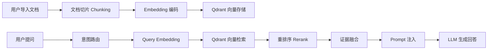

# Luna 知识库检索增强生成（RAG）方案

## 1. 章节目标

本文档定义 Luna 系统的知识库检索增强生成（RAG）架构。该架构使 Luna 能够基于用户导入的本地文档（PDF、TXT、Markdown 等），通过切片、Embedding、检索和融合，产生带有引用来源的答案。

## 2. 核心架构

Python Backend 统一负责 RAG 全链路：文档切片 -> Embedding -> 存储 -> 检索 -> 融合 -> Prompt 注入。



## 3. 模块职责

| 模块            | 职责                                                      |
|:--------------|:--------------------------------------------------------|
| Python Chunker | 文档切片：支持 Markdown 语义分块、固定长度分块、递归字符分块。                  |
| Python Embedder| 调用本地或云端 Embedding 模型将文本转为向量。                            |
| Python Retriever| 根据查询向量从 Qdrant 检索 Top-K 相关切片。                         |
| Python Reranker| 使用交叉编码器（Cross-Encoder）对检索结果重排序，过滤低相关度结果。               |
| Python Fusion  | 将检索结果、记忆上下文、工具结果按权重融合，注入到 LLM Prompt 中。               |

## 4. 检索增强流程

### 4.1 动态 RAG 路由

Python 根据查询类型动态选择检索策略：

- **Search RAG**：简单的关键词匹配 + 向量检索，适合事实性问答。
- **Modular RAG**：结合意图路由，分段检索不同知识库。
- **Agentic RAG**：将 RAG 作为工具，由 LLM 自主决定是否需要检索以及检索什么。

### 4.2 Prompt 注入格式

```python
system_prompt = f"""
你是一个基于知识库问答的 AI 助手。
请基于以下参考信息回答用户问题。

参考信息（按相关度排序）：
{format_evidence(retrieved_chunks)}

如果信息不足以回答问题，请明确说明，不要编造。
"""
```

## 5. 落地实施建议

1. **Phase 1**：实现基础文档切片 + Embedding + Qdrant 存储与检索。
2. **Phase 2**：接入 Reranker 重排序，提升检索质量。
3. **Phase 3**：实现动态 RAG 路由，支持多知识库的 Modular/Agentic RAG。
