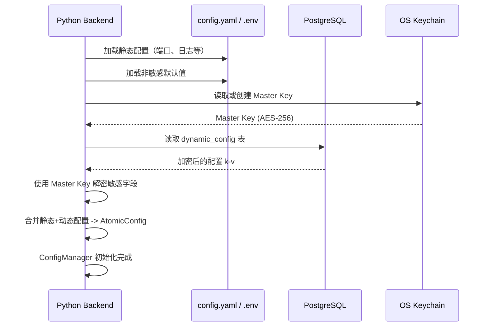
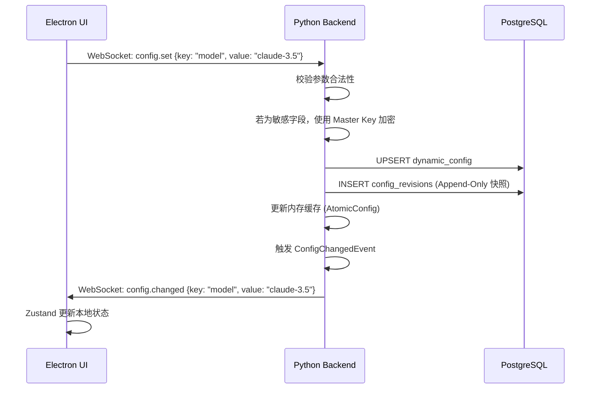

# Luna 平台技术文档：配置与环境管理方案

## 1. 章节目标

本文档旨在定义 Luna 平台的全局配置与环境管理方案。解决在"本地化 AI 桌面助理"场景下，如何安全地管理用户密钥、如何在多环境（开发/测试/生产）中隔离资源、如何实现配置的热更新而不需重启应用，以及如何通过配置版本化保障系统在异常情况下的可恢复性。

## 2. 设计背景与问题定义

Luna 作为一个涉及本地 UI 与 Python 智能服务的复杂桌面系统，其配置管理面临以下独特挑战：

1. **本地安全性**：系统需存储用户的第三方大模型 API Key（如 OpenAI、Anthropic）以及各类工具的授权 Token。在本地明文存储这些敏感信息存在极大的被盗取风险。
2. **前后端配置同步**：Electron 负责展示设置，Python 负责调度、存储和消费配置（如连接模型）。配置变更必须在前后端之间原子化、无缝地同步。
3. **高频热更新要求**：用户在 UI 上切换模型（如从 GPT-4o 切换到 Claude 3.5 Sonnet）或调整 Agent Prompt，系统必须立刻生效，不能要求用户重启客户端。
4. **配置损坏容灾**：本地环境复杂，意外断电或强杀进程可能导致配置文件损坏，系统必须具备 Fallback 和历史版本恢复能力。

## 3. 核心设计思路

本方案采用以下核心设计原则：

1. **单一事实来源（SSOT）与 Python 权威原则**：
   - Python Backend 是配置管理的**唯一权威和存储者**。
   - Electron 仅作为配置的展示和修改触发端（消费者）。
2. **动静分离与分级存储**：
   - **静态环境配置**（不可变/需重启生效，如端口号、服务路径、日志级别）：通过 `.env` 文件或 `config.yaml` 存储。
   - **动态用户配置**（高频修改/需热更新，如 API Keys、模型选择、Persona Prompt）：存储于 **PostgreSQL** 数据库中。
3. **本地密钥加密体系（OS-Native Security）**：
   - 绝不以明文形式在本地存储 API Key。
   - 采用 OS Keychain（macOS Keychain, Windows Credential Manager）生成并存储主密钥（Master Key）。
   - PostgreSQL 中存储的敏感配置字段使用 AES-256-GCM 算法和 Master Key 进行加密。
4. **基于 Event Bus 的热更新机制**：
   - Python 内部维护 `ConfigManager`。当通过 WebSocket 接收到前端配置修改请求时，Python 更新 PostgreSQL，更新内存中的配置缓存，然后通过内部 Event Bus 分发 `ConfigChangedEvent`。
   - 相关的 Python 模块（如 Scheduler, Router）监听事件并重载逻辑。
5. **基于 PostgreSQL 的配置版本控制**：
   - 动态配置采用 Append-Only（追加或版本记录）模式。每次修改配置，不仅更新当前值，同时在 `config_revisions` 表中记录快照，实现"时间机器"功能。

---

## 4. 模块职责与边界

### 4.1 Electron 层 (UI & TS)

- **职责**：渲染设置面板，接收用户输入（API Key, 模型偏好等）。
- **通信**：通过 WebSocket 向 Python 发送 `config.update` 请求，监听 `config.changed` 广播同步本地状态（Zustand）。
- **边界**：禁止直接读写本地配置文件或 PostgreSQL；禁止直接将配置透传给 LLM 调用层。

### 4.2 Python Backend 层 (Python Core)

- **职责**：
  - 加载和合并多环境配置（Env -> YAML -> PostgreSQL）。
  - 管理 OS Keychain 并维护加密密钥生命周期。
  - 本地配置的加密存储与解密提取。
  - 维护 `ConfigManager` 以广播配置变更事件。
  - 接受来自 Electron 的配置更新请求，执行合法性校验、加密写入 PostgreSQL。
- **边界**：拒绝未知或恶意配置参数（如将 `model` 设为不存在的 ID 或外部恶意 payload）。

### 4.3 配置存储层 (PostgreSQL)

- **职责**：持久化存储动态配置、API Key 等敏感信息（加密后的 ciphertext）。
- **边界**：避免直接暴露明文。

---

## 5. 核心数据结构

### 5.1 动态配置 (PostgreSQL)

```sql
CREATE TABLE dynamic_config (
    config_key VARCHAR(128) PRIMARY KEY,
    config_value TEXT NOT NULL,            -- 加密后的敏感值或明文非敏感值
    is_sensitive BOOLEAN DEFAULT FALSE,    -- 标记是否为敏感字段
    updated_at TIMESTAMP DEFAULT CURRENT_TIMESTAMP
);

-- 配置版本历史表 (Append-Only)
CREATE TABLE config_revisions (
    revision_id VARCHAR(64) PRIMARY KEY,   -- 雪花算法 ID
    config_key VARCHAR(128) NOT NULL,
    config_value TEXT NOT NULL,
    changed_by VARCHAR(64),                -- 修改来源 (user / system)
    created_at TIMESTAMP DEFAULT CURRENT_TIMESTAMP
);
```

### 5.2 Python 端配置类结构

```python
from pydantic import BaseModel, Field
from typing import Dict, Any, Optional

class StaticConfig(BaseModel):
    """静态环境配置，来自 .env / config.yaml"""
    log_level: str = Field("INFO", description="日志级别")
    host: str = Field("127.0.0.1", description="FastAPI 监听地址")
    port: int = Field(8765, description="FastAPI 监听端口")

class DynamicConfig(BaseModel):
    """动态运行时配置，来自 PostgreSQL"""
    llm_config: Dict[str, Any] = Field(default_factory=dict, description="大模型配置")
    system_prompt: Optional[str] = Field(None, description="系统提示词模板")
    api_keys: Dict[str, str] = Field(default_factory=dict, description="加密后的 API Key 映射")
```

---

## 6. 配置启动与热更新流程

### 6.1 配置启动加载流程



### 6.2 前端修改配置热更新流程



---

## 7. 接口设计

### 7.1 Python -> Electron WebSocket 配置消息

```json
// Electron -> Python: 修改配置请求
{
  "type": "config.set",
  "payload": {
    "key": "model",
    "value": "claude-3-sonnet-20240229"
  }
}

// Python -> Electron: 配置变更广播
{
  "type": "config.changed",
  "payload": {
    "key": "model",
    "value": "claude-3-sonnet-20240229",
    "requires_reload": false  // 是否需要用户重新加载
  }
}
```

---

## 8. 状态管理机制

`ConfigManager` 是 Python 端的一个全局单例，负责：

1. **原子性校验**：每次接收更新请求，先校验 `key` 是否在白名单内，`value` 是否符合 Schema（如模型 ID 必须在注册列表中）。
2. **内存屏障**：使用 `asyncio.Lock` 确保并发读写安全，更新后立刻替换 AtomicConfig 指针，不影响正在运行的请求。
3. **事件广播**：通过内部 Event Bus（基于 asyncio 事件循环或 `pyee`）触发 `ConfigChangedEvent`，各模块（LLM Client、Prompt Manager）同步重载。

---

## 9. 异常处理与降级策略

1. **加密密钥丢失或损坏**：
   - **策略**：尝试回退至本地备份密钥文件，若同样失效，引导用户在 Electron 端进行"重置密钥"操作（会清空所有加密的 API Key 并要求用户重新输入）。
2. **PostgreSQL 读取失败**：
   - **策略**：Python 降级为纯静态配置启动（仅使用 config.yaml 中的默认值并关闭需要动态配置的功能），在前端提示用户"配置存储异常"。
3. **非法配置注入**（如用户修改配置表中的 `system_prompt` 为恶意 SQL）：
   - **策略**：Python 端在进行参数校验时，拒绝所有非预定义的 `config_key`，并对 `system_prompt` 等 text 字段进行长度限制和正则规则过滤。

---

## 10. 配置项与可调参数

### 静态环境配置 (config.yaml 示例)

```yaml
server:
  host: "127.0.0.1"
  port: 8765
  log_level: "INFO"

storage:
  database_url: "postgresql://localhost:5432/luna"
  redis_url: "redis://localhost:6379/0"

encryption:
  # 密钥存储路径（相对于用户数据目录）
  master_key_path: ".luna/master.key"
```

### 动态配置（PostgreSQL 记录）

| config_key          | 说明                       | 示例值                                    |
|:-------------------|:--------------------------|:----------------------------------------|
| `llm.default_model` | 默认模型 ID                 | `gpt-4o`                                |
| `llm.temperature`   | 默认采样温度                 | `0.7`                                   |
| `system.persona`    | Luna 人格设定（Prompt 模板） | `你是 Luna，一名温柔体贴的 AI 桌面助理...` |
| `api.openai_key`    | OpenAI API Key（加密存储）   | `AES256_CIPHER_TEXT`                    |

---

## 11. 可观测性与调试建议

1. **配置变更审计日志**：每次配置修改实时记录 `config_revisions` 表，包含 `trace_id` 和 `changed_by`。

2. **调试命令**：开发环境下，Electron 可通过 WebSocket 发送 `config.get_all` 获取当前内存中完整配置（脱敏后），用于快速定位配置错误。

---

## 12. 安全性与治理建议

1. **数据加密保护**：所有存储在 PostgreSQL 中的敏感字段（如 API Key）必须加密后存储，密钥来源于系统 OS Keychain。
2. **配置项白名单机制**：Python 端在接收前端配置更新时，必须验证 `config_key` 是否属于预定义白名单，防止通过配置接口注入恶意参数。
3. **防篡改审计**：所有配置修改记录 `config_revisions`，支持配置时间点回滚。

---

## 13. 落地实施建议

1. **Phase 1**：实现纯 JSON/YAML 静态配置加载，敏感字段暂不加密，先跑通 Electron -> Python 的基础通信链路。
2. **Phase 2**：引入 PostgreSQL 动态配置表 + 加密存储，实现配置热更新。
3. **Phase 3**：引入 OS Keychain + 主密钥机制，完善审计配置历史，支持时间点回滚。
