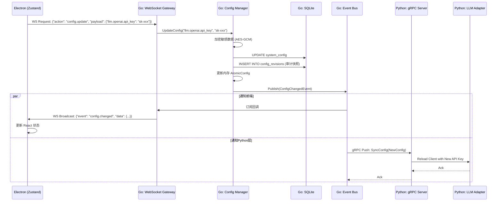

# Luna 平台技术文档：配置与环境管理方案

## 1. 章节目标

本文档旨在定义 Luna 平台的全局配置与环境管理方案。解决在“本地化 AI 桌面助理”场景下，如何安全地管理用户密钥、如何在多环境（开发/测试/生产）中隔离资源、如何实现配置的热更新而不需重启应用，以及如何通过配置版本化保障系统在异常情况下的可恢复性。

## 2. 设计背景与问题定义

Luna 作为一个涉及本地 UI、Go 调度核心与 Python 智能服务的复杂桌面系统，其配置管理面临以下独特挑战：

1. **本地安全性**：系统需存储用户的第三方大模型 API Key（如 OpenAI、Anthropic）以及各类工具的授权 Token。在本地明文存储这些敏感信息存在极大的被盗取风险。
2. **多层架构的配置同步**：Electron 负责展示设置，Go 负责调度和存储配置，Python 负责消费配置（如连接模型）。配置变更必须在三层之间原子化、无缝地同步。
3. **高频热更新要求**：用户在 UI 上切换模型（如从 GPT-4o 切换到 Claude 3.5 Sonnet）或调整 Agent Prompt，系统必须立刻生效，不能要求用户重启客户端。
4. **配置损坏容灾**：本地环境复杂，意外断电或强杀进程可能导致配置文件损坏，系统必须具备 Fallback 和历史版本恢复能力。

## 3. 核心设计思路

本方案采用以下核心设计原则：

1. **单一事实来源（SSOT）与 Go 权威原则**：
   - Go Runtime 是配置管理的**唯一权威和存储者**。
   - Electron 仅作为配置的展示和修改触发端（消费者）。
   - Python AI 层是无状态的，**不持久化任何配置**，仅在启动或配置变更时通过 gRPC 接收 Go 传递的最新配置。
2. **动静分离与分级存储**：
   - **静态环境配置**（不可变/需重启生效，如端口号、服务路径、日志级别）：通过 `.env` 文件或 `config.yaml` 存储。
   - **动态用户配置**（高频修改/需热更新，如 API Keys、模型选择、Persona Prompt）：存储于 **SQLite** 数据库中。
3. **本地密钥加密体系（OS-Native Security）**：
   - 绝不以明文形式在本地存储 API Key。
   - 采用 OS Keychain（macOS Keychain, Windows Credential Manager）生成并存储主密钥（Master Key）。
   - SQLite 中存储的敏感配置字段使用 AES-256-GCM 算法和 Master Key 进行加密。
4. **基于 Event Bus 的热更新机制**：
   - Go 内部维护 `ConfigManager`。当通过 WS 接收到前端配置修改请求时，Go 更新 SQLite，更新内存中的 `AtomicConfig`，然后通过内部 Event Bus 分发 `ConfigChangedEvent`。
   - 相关的 Go 模块（如 Scheduler, Router）监听事件并重载逻辑；同时通过 gRPC push 通知 Python 层重载配置。
5. **基于 SQLite 的配置版本控制**：
   - 动态配置采用 Append-Only（追加或版本记录）模式。每次修改配置，不仅更新当前值，同时在 `config_revisions` 表中记录快照，实现“时间机器”功能。

---

## 4. 模块职责与边界

### 4.1 Electron 层 (UI & TS)

- **职责**：渲染设置面板，接收用户输入（API Key, 模型偏好等）。
- **通信**：通过 WebSocket 向 Go 发送 `config.update` 请求，监听 `config.changed` 广播同步本地状态（Zustand）。
- **边界**：禁止直接读写本地配置文件或 SQLite；禁止直接将配置传给 Python。

### 4.2 Go Runtime 层 (Go Core)

- **职责**：
  - 加载和合并多环境配置（Env -> YAML -> SQLite）。
  - 对接 OS Keychain 生成/获取 Master Key，对敏感字段进行加解密。
  - 暴露配置 API（WS 和内部方法）。
  - 维护配置内存快照（保证并发读性能）。
  - 执行热更新路由和版本回滚逻辑。
- **边界**：不负责解析 Python 专属的深度模型参数逻辑，只负责透传键值对或 JSON 片段。

### 4.3 Python AI Service 层 (Python)

- **职责**：
  - 启动时通过 gRPC `GetConfig` 获取所需配置。
  - 运行时监听 gRPC Stream 或 Webhook 接收配置更新通知。
  - 根据新配置动态重新初始化 LLM Client 或调整 RAG Embedding 策略。
- **边界**：禁止写盘保存配置；禁止跨过 Go 直接读取用户环境变量中的敏感信息。

---

## 5. 核心数据结构

### 5.1 数据库结构 (SQLite)

假设使用 SQLite 作为动态配置存储。

**表1：`system_config` (当前生效配置)**
| 字段名 | 类型 | 描述 |
| :--- | :--- | :--- |
| `key` | VARCHAR (PK) | 配置项键名，如 `llm.openai.api_key`, `agent.default_model` |
| `value` | TEXT | 配置项值（JSON序列化） |
| `is_encrypted`| BOOLEAN | 是否加密（1表示 value 为 AES 密文） |
| `updated_at` | TIMESTAMP | 更新时间 |

**表2：`config_revisions` (配置版本审计表)**
| 字段名 | 类型 | 描述 |
| :--- | :--- | :--- |
| `id` | INTEGER (PK) | 自增版本号 |
| `config_snapshot`| TEXT | 整个配置的全量快照 (JSON，加密字段保持加密) |
| `trigger_source` | VARCHAR | 触发源 (如 `user_ui`, `system_migration`) |
| `created_at` | TIMESTAMP | 创建时间 |

### 5.2 内存数据结构 (Golang)

```go
// 统一的配置结构体
type AppConfig struct {
    Env       EnvironmentConfig `json:"env"`
    LLM       LLMConfig         `json:"llm"`
    Agent     AgentConfig       `json:"agent"`
    Memory    MemoryConfig      `json:"memory"`
}

type LLMConfig struct {
    ActiveProvider string            `json:"active_provider"` // openai, anthropic, ollama
    Providers      map[string]ProviderConfig `json:"providers"`
}

type ProviderConfig struct {
    APIKey  string `json:"api_key"`  // 内存中解密后的明文
    BaseURL string `json:"base_url"`
    Model   string `json:"model"`
}

// 并发安全的配置容器
type AtomicConfig struct {
    v atomic.Value
}

func (ac *AtomicConfig) Load() *AppConfig {
    return ac.v.Load().(*AppConfig)
}

func (ac *AtomicConfig) Store(cfg *AppConfig) {
    ac.v.Store(cfg)
}
```

---

## 6. 核心流程 / 时序

### 6.1 系统启动与多环境加载流程

系统启动时，Go 按照严格的优先级合并配置：
`默认硬编码配置` <- `config.yaml (多环境分发)` <- `.env (环境变量)` <- `SQLite (用户动态修改)`。

1. **判断运行环境**：通过 `LUNA_ENV` 环境变量判断（`dev`, `test`, `prod`）。
2. **加载基础配置**：读取 `config.{env}.yaml`，确定 Python 服务端口、SQLite 路径等静态参数。
3. **初始化安全模块**：请求 OS Keychain，若无 Master Key 则生成并存入 Keychain。
4. **加载动态配置**：从 SQLite 读取 `system_config` 表，使用 Master Key 解密 `is_encrypted=true` 的字段。
5. **组装**：将所有配置合并为 `AppConfig` 并存入 `AtomicConfig`。

### 6.2 配置热更新时序图

以下时序展示了用户在前端修改 API Key 后，系统如何无缝热更新并同步至 Python 层。



---

## 7. 接口设计

### 7.1 WebSocket 协议 (Electron <-> Go)

**请求：获取完整配置**

```json
{
  "request_id": "req_101",
  "action": "config.get",
  "payload": {}
}
```

*响应*：返回脱敏后的配置（API Key 需要 mask 处理，如 `sk-...1234`，前端不需要知道真实的 Key）。

**请求：更新配置**

```json
{
  "request_id": "req_102",
  "action": "config.update",
  "payload": {
    "keys": {
      "llm.openai.api_key": "sk-abcdefg123456789",
      "llm.active_provider": "openai"
    }
  }
}
```

### 7.2 gRPC 协议 (Go <-> Python)

Python 作为服务端，Go 作为客户端，通过 gRPC 通知 Python 配置更新。

```protobuf
syntax = "proto3";
package luna.config.v1;

service ConfigService {
  // Go 主动推送最新配置给 Python
  rpc SyncConfig(SyncConfigRequest) returns (SyncConfigResponse);
}

message SyncConfigRequest {
  string version_id = 1;     // 当前配置版本
  string llm_config_json = 2; // Python需要的LLM配置(JSON格式，包含明文API Key)
  string agent_config_json = 3;
}

message SyncConfigResponse {
  bool success = 1;
  string error_message = 2;
}
```

*说明：这里使用 JSON 序列化传递局部配置，以保证 Python 侧 Pydantic 模型可以灵活反序列化，避免 Proto 字段频繁变动。*

---

## 8. 状态管理机制

1. **Go 端读写隔离**：
   使用 `sync/atomic.Value` 管理 `AppConfig` 指针。
   
   - **读操作**：工作流和路由等模块通过 `cfg := configManager.GetConfig()` 获得当前配置的**只读快照**。极快，无锁。
   - **写操作**：`ConfigManager` 内部使用一把互斥锁（Mutex）保证同一时间只有一个修改操作。修改时，深拷贝旧配置，应用更改，然后整体替换 `atomic.Value` 中的指针。

2. **Python 端状态一致性**：
   Python 使用全局的依赖注入容器（如 `Dependency Injector` 或自定义 Singleton）。
   当 gRPC 收到 `SyncConfig` 后，触发 Python 内部事件，重新实例化相关的 Provider Client。如果当前有正在执行的 LLM 任务（长连接），该任务继续使用**旧的 Client 实例**完成，新任务获取**新的 Client 实例**。

---

## 9. 异常处理与降级策略

1. **OS Keychain 不可用或解密失败**：
   - *场景*：用户重装系统、迁移了数据库文件但没有迁移硬件，导致 Master Key 丢失，解密失败。
   - *策略*：系统启动时捕获解密异常。将失败的加密字段标记为“失效”，启动应用但挂起所有需要该密钥的 Agent 任务。通过 WebSocket 发送特殊事件给 Electron，弹出全局警告引导用户重新输入 API Key。
2. **配置热更新导致服务崩溃（毒药配置）**：
   - *场景*：用户填入了一个格式非法的自定义 BaseURL，导致 Python 服务初始化不断 Crash。
   - *策略*：Go 在调用 `SyncConfig` 通知 Python 时，若 Python 返回 Error 或 Python 进程 crash，Go 的 `ConfigManager` 捕获到该失败。触发**自动回滚（Rollback）**，从 SQLite `config_revisions` 取上一个正常版本，恢复内存状态，并通知 UI "配置应用失败，已回滚"。
3. **数据库文件损坏**：
   - *策略*：SQLite 启动检测到 file corrupted，自动将坏文件重命名为 `config.db.bak`，并利用基础 yaml 配置生成一份全新的空数据库启动。

---

## 10. 与其他模块的协作关系

- **Workflow Runtime (Scheduler)**：Scheduler 在每次执行 Node (如 LLM Node) 之前，从 ConfigManager 拉取最新配置。不缓存配置。
- **Agent Memory**：Memory 模块的持久化策略（存多长时间、是否开启向量搜索）受配置影响，热更新时需触发重载策略。
- **Logger**：日志级别随配置热更新，方便生产环境无需重启直接开启 Debug 日志。

---

## 11. 配置项与可调参数

以下为核心的可调参数规划：

| 命名空间         | 参数名               | 默认值                         | 允许热更新 | 描述              |
|:------------ |:----------------- |:--------------------------- |:----- |:--------------- |
| `env`        | `log_level`       | `info`                      | 是     | 日志级别            |
| `llm`        | `active_provider` | `ollama`                    | 是     | 当前选用的全局模型驱动     |
| `llm.openai` | `api_key`         | 空                           | 是     | 必须加密存储          |
| `llm.openai` | `base_url`        | `https://api.openai.com/v1` | 是     | 支持代理或兼容端点       |
| `agent`      | `max_retry_times` | `3`                         | 是     | 工作流单节点最大重试次数    |
| `system`     | `grpc_port`       | `50051`                     | 否     | Go与Python内部通信端口 |
| `system`     | `db_path`         | `~/.luna/data/`             | 否     | SQLite 数据库存储目录  |

---

## 12. 可观测性与调试建议

1. **审计日志**：对配置的每一次变更（谁、什么时间、修改了什么键）输出一条专门的 Audit Log，存入特定的日志文件 `luna-audit.log`。
2. **脱敏输出**：在任何日志（Info/Debug）中，禁止打印包含 `api_key`, `token`, `secret` 等字样的配置值，必须实现通用的 Masking 函数：`sk-abcd1234... -> sk-****...`
3. **调试 Endpoint**：在 Go Runtime 暴露一个仅限 `dev` 环境的 HTTP 接口 `/debug/config`，返回当前内存中的完整配置（明文），以便开发人员快速排查环境加载问题。

---

## 13. 安全性与治理建议

1. **加密主密钥（Master Key）生命周期**：
   - 依赖 OS 特性。假设用户环境不支持 OS Keychain（如某些精简版 Linux），则降级使用设备唯一硬件指纹（MAC 地址 + CPU ID 的哈希）作为加盐生成本地 Key。并在 UI 提醒用户当前环境不具备最高安全保障。
2. **内存防泄漏**：
   - 在 Go 中，明文 API Key 仅在反序列化组装给 Python 请求时短暂存在，不要将包含明文 Key 的结构体持久化在任何非安全堆栈中。
3. **文件权限治理**：
   - `config.db` 和 `config.yaml` 文件的 OS 权限强制设为 `0600`（仅当前用户可读写），Go 启动时检查，权限不正确则尝试修正或拒绝启动。

---

## 14. 典型使用场景

**场景：用户从使用本地模型（Ollama）切换为云端模型（OpenAI）**

1. 用户在 Luna 客户端设置页，填写 OpenAI API Key，并选择模型为 GPT-4o。
2. 前端触发 WS 请求。
3. Go 接收后，将 API Key 加密存入 SQLite，修改 `active_provider` 为 `openai`。
4. Go 更新内存配置，分发变更事件。
5. Go gRPC 通知 Python。
6. Python 接收配置，销毁之前的 Ollama 客户端实例，使用新 Key 实例化 OpenAI 客户端。
7. 用户紧接着发出的对话或工作流任务，立即路由至 OpenAI 执行。

---

## 15. 示例代码或伪代码

### 15.1 Go: 配置安全加密与热存储管理器 (伪代码)

```go
package config

import (
    "crypto/aes"
    "crypto/cipher"
    "crypto/rand"
    "encoding/json"
    "sync"
    "sync/atomic"
    "time"

    "github.com/zalando/go-keyring" // 假设使用此库获取 OS Keychain
)

type Manager struct {
    mu         sync.Mutex
    atomicConf atomic.Value
    db         Database // 封装的SQLite实例
    masterKey  []byte
    eventBus   EventBus
}

func NewManager(db Database, eb EventBus) *Manager {
    m := &Manager{
        db:       db,
        eventBus: eb,
    }
    m.initMasterKey()
    m.loadAndMerge()
    return m
}

// initMasterKey 获取或生成 OS 级别的密钥
func (m *Manager) initMasterKey() {
    service := "luna.ai.desktop"
    user := "local_user"
    key, err := keyring.Get(service, user)
    if err != nil {
        // 生成新的 AES-256 密钥
        newKey := make([]byte, 32)
        rand.Read(newKey)
        key = string(newKey)
        keyring.Set(service, user, key)
    }
    m.masterKey = []byte(key)
}

// UpdateConfig 接收前端请求更新配置
func (m *Manager) UpdateConfig(updates map[string]interface{}) error {
    m.mu.Lock()
    defer m.mu.Unlock()

    // 1. 获取当前配置并深拷贝
    current := m.atomicConf.Load().(*AppConfig)
    newConf := deepCopy(current)

    // 2. 应用更新 & 判断敏感字段
    for k, v := range updates {
        applyValue(newConf, k, v)

        // 3. 写入数据库
        isSensitive := isSensitiveKey(k)
        storeVal := v.(string)
        if isSensitive {
            storeVal = m.encrypt(storeVal)
        }
        m.db.Exec("INSERT OR REPLACE INTO system_config (key, value, is_encrypted, updated_at) VALUES (?, ?, ?, ?)", 
            k, storeVal, isSensitive, time.Now())
    }

    // 4. 记录审计快照
    snapshot, _ := json.Marshal(newConf) // 注意：这里需要确保持久化快照时也是加密的，此处为简化
    m.db.Exec("INSERT INTO config_revisions (config_snapshot, created_at) VALUES (?, ?)", string(snapshot), time.Now())

    // 5. 更新内存
    m.atomicConf.Store(newConf)

    // 6. 触发事件
    m.eventBus.Publish("ConfigChanged", newConf)

    return nil
}

// 简单的 AES-GCM 加密示例
func (m *Manager) encrypt(plaintext string) string {
    block, _ := aes.NewCipher(m.masterKey)
    aesGCM, _ := cipher.NewGCM(block)
    nonce := make([]byte, aesGCM.NonceSize())
    rand.Read(nonce)
    ciphertext := aesGCM.Seal(nonce, nonce, []byte(plaintext), nil)
    return encodeBase64(ciphertext)
}
```

### 15.2 Python: FastAPI / gRPC 接收配置并动态注入

```python
# config_manager.py
import asyncio
from pydantic import BaseModel
from typing import Optional
import json

class LLMConfig(BaseModel):
    active_provider: str
    openai_api_key: Optional[str] = None
    openai_base_url: Optional[str] = None

class GlobalConfigContainer:
    def __init__(self):
        self.llm_config: LLMConfig = None
        self._lock = asyncio.Lock()

    async def update_llm_config(self, config_json: str):
        async with self._lock:
            data = json.loads(config_json)
            self.llm_config = LLMConfig(**data)
            # 可以在这里触发大模型 Client 的重建逻辑
            print(f"LLM Config updated. Provider: {self.llm_config.active_provider}")

config_container = GlobalConfigContainer()

# grpc_server.py
from concurrent import futures
import grpc
import config_pb2
import config_pb2_grpc

class ConfigServiceServicer(config_pb2_grpc.ConfigServiceServicer):
    async def SyncConfig(self, request, context):
        try:
            await config_container.update_llm_config(request.llm_config_json)
            return config_pb2.SyncConfigResponse(success=True)
        except Exception as e:
            return config_pb2.SyncConfigResponse(success=False, error_message=str(e))
```

---

## 16. 常见坑与规避方式

1. **跨平台 Keychain 不一致**：
   - *坑*：Windows 的 Credential Manager 和 Linux 的 Secret Service 行为差异大，无头环境（如 ssh 远程调试 Linux）下可能无法访问 Keychain 导致启动卡死。
   - *规避*：封装一层 Fallback 机制。如果获取 Keychain 超时或报错，生成一个存在于本地用户目录的文件作为 Local Key，警告用户降低了安全性。
2. **并发修改导致的数据撕裂**：
   - *坑*：Go 端不用锁直接修改大结构体，导致读协程拿到了一半新一半旧的配置。
   - *规避*：严格遵守 `atomic.Value` 的 copy-on-write 模式（Copy 原对象 -> 修改 Copy -> Swap 指针）。
3. **WebSocket 的死循环**：
   - *坑*：Electron 发送更新 -> Go 更新并广播 `ConfigChanged` -> Electron 收到后再次触发状态变动发送请求。
   - *规避*：WS Payload 中必须携带 `request_id` 或 `source`。Electron 判断若是自己触发的修改，收到广播后仅需做 Ack，不重新触发 Effect。

---

## 17. 落地实施建议

1. **第一阶段 (MVP)**：
   - 优先实现 `.env` 和 yaml 解析，将动态存储简化为一个 JSON 文件（暂不加密）。打通 Electron -> Go -> Python 的配置同步链路。
2. **第二阶段 (安全性补齐)**：
   - 引入 SQLite 替换 JSON 持久化，加入 OS Keychain 接入和 AES-GCM 加密，实现真实环境落地。
3. **第三阶段 (健壮性增强)**：
   - 实现 `config_revisions` 版本表，支持在 Go 启动失败时自动回退到上一版本。增加 UI 层的“重置为默认设置”和“导出/导入配置”功能。
