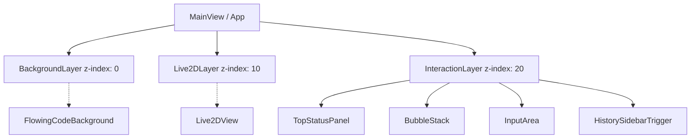
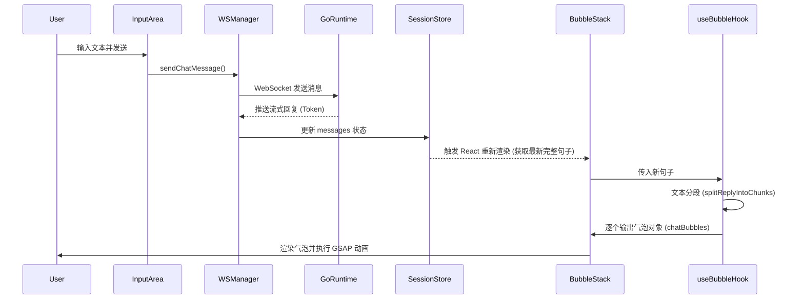

# 前端 UI 渲染与交互架构方案

## 一、 核心设计理念与业务需求提炼

基于《主页面设计方案》与《气泡文本输出功能技术分析文档》，Luna AI 的前端主界面并非传统的“聊天软件”，而是一个**“陪伴式数字空间”**。

### 1. 视觉与交互逻辑
*   **角色绝对优先**：Live2D 角色是视觉中心，占据主导地位。
*   **对话即空气残影**：摒弃传统的无限滚动消息列表。角色的回复以“气泡”形式在输入框上方浮现，随后平滑上移并逐渐淡出消散。
*   **安静的输入体验**：输入框固定在底部，文案呈现邀请式（如“和她说点什么”），弱化工具感。
*   **沉浸式背景**：采用绿色横向流动的代码流作为背景，低亮度、低存在感，随角色状态产生轻微呼吸变化。
*   **视觉流向**：角色（中心） -> 对话气泡（中下） -> 输入框（底部）。

### 2. 底层技术约束
*   **技术栈**：React 18 + TypeScript + Zustand + Electron。
*   **状态权威**：Go Runtime 是全局状态的唯一事实来源（SSOT），前端通过 WebSocket 接收状态推送，禁止前端直连大模型或自行维护核心业务状态。
*   **动画引擎**：引入 `gsap` 处理复杂的 FLIP（First, Last, Invert, Play）气泡位移动效，CSS 动画处理简单的淡入淡出。
*   **渲染引擎**：`pixi-live2d-display` 负责角色渲染。

---

## 二、 整体渲染架构视图与核心组件树

为了实现“空间感”并解耦不同渲染频率的模块，主界面采用**多层叠放（Z-Index Layering）**架构。

### 1. 渲染层级划分
frontend\docs\plans


### 2. 核心组件职责定义

*   **`BackgroundLayer`**: 负责渲染绿色横向流动代码。可使用 Canvas 或纯 CSS 动画实现，需监听 `systemStore` 中的角色情绪/状态以调整流动速度和亮度。
*   **`Live2DLayer`**: 承载 `Live2DView`，负责模型加载、动作触发与口型同步。
*   **`InteractionLayer`**: 纯 UI 交互层，背景透明。
    *   **`TopStatusPanel`**: 顶部极简状态栏，显示“有点困”、“在发呆”等自然状态文案。
    *   **`BubbleStack`**: 核心动态组件，负责渲染当前正在发生和刚刚发生的对话气泡。
    *   **`InputArea`**: 底部输入框，处理用户输入并发送至 WebSocket。

---

## 三、 状态流转与数据同步机制

前端状态管理严格遵循单向数据流，结合 Zustand 和 React Hooks。

### 1. 数据流向时序图



### 2. 状态分离策略
*   **全局业务状态 (Zustand)**：`sessionStore` 存储完整的对话历史（用于历史面板）和当前正在流式接收的完整消息。
*   **局部 UI 状态 (React State / Refs)**：`BubbleStack` 内部使用自定义 Hook `useBubble` 维护当前屏幕上可见的“气泡数组”。气泡的生命周期（创建、上移、销毁）属于纯 UI 表现，不应污染全局 Store。

---

## 四、 气泡文本动效与 UI 渲染核心算法

这是实现“空气残影”体验的关键。我们将 Vue 版本的逻辑迁移并优化为 React Hook (`useBubble.ts`)。

### 1. 文本分段算法
当接收到 Go Runtime 传来的完整句子或流式数据达到一个语义停顿（如标点符号）时，进行拆分：
```typescript
// 根据标点符号拆分长文本
function splitReplyIntoChunks(text: string): string[] {
  const sentenceRe = /[^。！？!?~～…]+[。！？!?~～…]?/g;
  const sentences = text.match(sentenceRe) || [text];
  const parts: string[] = [];
  const commaRe = /[^，,、；;]+[，,、；;]?/g;

  for (let s of sentences) {
    s = s.trim();
    if (!s) continue;
    const subs = s.match(commaRe) || [s];
    for (let sub of subs) {
      sub = sub.replace(/[，,、；;]$/u, "").trim();
      if (sub) parts.push(sub);
    }
  }
  return parts;
}
```

### 2. FLIP 动画核心逻辑 (结合 GSAP)
为了让新气泡出现时，旧气泡平滑上移，采用 FLIP 策略：

1.  **First**: 记录当前所有气泡 DOM 元素的 `getBoundingClientRect().top`。
2.  **Last**: 将新气泡加入状态数组，React 触发重新渲染。
3.  **Invert**: 在 `useLayoutEffect` 或 `requestAnimationFrame` 中，计算旧气泡的新旧位置差 (`dy`)，并使用 `transform: translateY(dy)` 将其瞬间移回原位。
4.  **Play**: 使用 GSAP 将 `translateY` 动画过渡到 `0`。

### 3. React `useBubble` Hook 结构示意

```typescript
import { useState, useRef, useCallback } from 'react';
import gsap from 'gsap';

interface Bubble {
  id: number;
  text: string;
  leaving: boolean;
}

export const useBubble = () => {
  const [bubbles, setBubbles] = useState<Bubble[]>([]);
  const bubbleElsRef = useRef<Map<number, HTMLDivElement>>(new Map());
  const bubbleIdCounter = useRef(0);

  const showBubble = useCallback(async (text: string, duration = 3000) => {
    const id = bubbleIdCounter.current++;
    
    // 1. 记录旧位置 (First)
    const prevPositions = new Map();
    bubbleElsRef.current.forEach((el, key) => {
      prevPositions.set(key, el.getBoundingClientRect().top);
    });

    // 2. 添加新气泡触发渲染 (Last)
    setBubbles(prev => [...prev, { id, text, leaving: false }]);

    // 3. 等待 DOM 更新后执行动画 (Invert & Play)
    requestAnimationFrame(() => {
      bubbleElsRef.current.forEach((el, key) => {
        if (prevPositions.has(key) && key !== id) {
          const dy = prevPositions.get(key) - el.getBoundingClientRect().top;
          if (Math.abs(dy) > 0.5) {
            gsap.fromTo(el, { y: dy }, { y: 0, duration: 0.3, ease: "power2.out" });
          }
        }
      });
    });

    // 4. 定时销毁
    setTimeout(() => {
      setBubbles(prev => prev.map(b => b.id === id ? { ...b, leaving: true } : b));
      setTimeout(() => {
        setBubbles(prev => prev.filter(b => b.id !== id));
        bubbleElsRef.current.delete(id);
      }, 300); // 等待 CSS 淡出动画完成
    }, duration);
  }, []);

  return { bubbles, showBubble, bubbleElsRef };
};
```

### 4. 性能瓶颈优化策略
*   **避免过度渲染**：气泡的位移动画完全交由 GSAP 操作 DOM 的 `transform` 属性，不触发 React 的 State 更新和 Re-render。
*   **DOM 节点回收**：气泡淡出后必须从 DOM 树中彻底移除，保持 `BubbleStack` 内的 DOM 节点数量极少（通常不超过 3-5 个）。
*   **流式节流**：对于高频的流式 Token 推送，前端应在 `SessionStore` 层面进行节流（Throttle）或按句缓冲，避免频繁触发分段和气泡生成逻辑。

---

## 六、 与现有项目源码的平滑集成路径

当前 `frontend/src/renderer/components/ChatView/ChatView.tsx` 采用的是传统的“消息列表”渲染模式（`messages-container` 配合 `map` 渲染所有历史消息）。集成新架构需按以下步骤进行：

### Phase 1: 引入依赖与基础组件搭建
1.  执行 `npm install gsap` 安装动画库。
2.  创建 `BackgroundLayer.tsx` 实现绿色代码流背景。
3.  创建 `useBubble.ts` Hook 实现气泡逻辑。

### Phase 2: 重构 ChatView 组件
1.  **移除传统列表**：删除 `ChatView.tsx` 中的 `messages-container` 及其相关的自动滚动逻辑。
2.  **引入分层结构**：将 `ChatView` 的结构重组为 `BackgroundLayer`、`Live2DView` 和 `InteractionLayer`。
3.  **集成 BubbleStack**：在 `InteractionLayer` 中引入 `BubbleStack` 组件，绑定 `useBubble` Hook。

### Phase 3: 状态对接与流式适配
1.  修改 `ChatView` 监听 `sessionStore` 的逻辑。不再直接渲染 `messages` 数组。
2.  监听最新一条 `assistant` 消息的更新。当检测到完整的句子生成时（通过标点符号判断或等待 `status` 变为 `completed`），调用 `showBubble(text)`。
3.  **历史记录迁移**：将原有的完整消息列表渲染逻辑迁移至独立的 `HistoryPanel` 组件中，通过侧边栏或顶部按钮触发显示。

### Phase 4: 视觉打磨
1.  调整输入框样式，去除边框，使其融入背景，修改 placeholder 文案。
2.  调整气泡的 CSS 样式（渐变背景、阴影、字体），确保符合设计文档中的“轻盈感”。
3.  联调 Live2D 角色位置与气泡锚点（Anchor）的相对关系，确保气泡始终从输入框上方自然浮现。