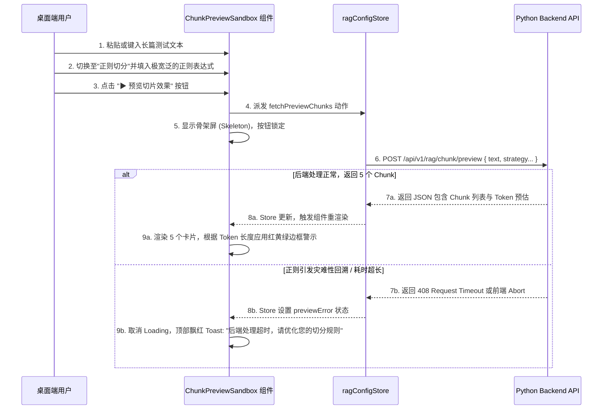

# Phase 7: RAG 知识检索增强 - 前端桌面端交互与实现方案

## 1. 架构定位与核心设计目标

基于 `agent.md` 的规范，Luna 作为一款本地优先的全栈 AI 桌面助理，前端桌面端 (Electron + React) 在 RAG（Retrieval-Augmented Generation）模块中的核心定位是：**不处理任何重度计算逻辑，完全作为系统配置的控制台与智能交互的可视化窗口**。前端所有的状态转换均由后端的 WebSocket/SSE 驱动，严格遵守数据层的单一真实来源原则（SSOT）。

针对 RAG 这个对用户相对复杂的概念，前端设计的核心目标包含以下五个关键维度：

1.  **极简的摄入体验 (Seamless Ingestion UX)**
    支持直观的文件拖拽上传与 URL 粘贴抓取。考虑到本地处理大文件可能存在的内存加载或向量化硬件延迟，必须提供极高颗粒度的异步处理状态指示（如：排队中 -> 文件解析中 -> 文本切分中 -> 向量化 (Embedding) 中 -> 完成入库）。
2.  **透明的策略沙盒 (Transparent Strategy Sandbox)**
    将原本只能在代码里调参的 Chunk 切片策略通过动态 UI 表单具象化，并提供“一键实时预览”的测试沙盒。让用户能在参数调整时获得即时反馈，防止配置失控（例如写错正则导致切出几十万字的单个 Chunk）引发后期的内存溢出或召回失效。
3.  **认知过程透明化 (Cognitive Process Transparency)**
    在常规的 LLM 对话中，用户只需等待打字机输出。但在 Agentic RAG 中，模型可能会经历“检索 -> 评估 -> 发现不对 -> 重新检索”的多跳思维过程。前端需在对话视图中解析并展示这些内部的图状态跃迁（Graph State Transitions），将其外显为生动的交互动画，增强用户对 AI 的信任感与陪伴感。
4.  **所见即所得的溯源 (WYSIWYG Citation)**
    在生成的回答中渲染溯源角标（如 `[1]`）。不仅要能点击，还必须允许用户悬浮或点击后直接在侧边栏或浮窗中查看**原始知识切片的完整上下文**，确保知识消费的严谨性，彻底打消对大模型“幻觉”的疑虑。
5.  **极致的错误边界与兜底 (Error Boundary & Fallback)**
    对于超大文件上传导致的超时、不合理正则表达式引发的后端灾难性回溯过载，前端需要提供友好的中断提示、防抖节流保护，以及网络断开时的自动降级方案。

---

## 2. 核心模块与组件架构规划

为了保持前端 React 代码的高内聚低耦合，我们将在 `frontend/src/renderer/components` 下扩展和新增一套专属的 RAG 管理目录结构。这里大量使用原子化组件，配合 Tailwind CSS 进行样式隔离。

```text
frontend/src/renderer/components/
├── KnowledgeBase/                     # 知识库管理主模块 (新增，作为 Settings 的一个 Tab)
│   ├── KnowledgeBasePanel.tsx         # 顶级容器容器，负责调度 Store 与子组件
│   ├── Ingestion/                     # 数据摄入区子组件群
│   │   ├── FileUploadDropzone.tsx     # 拖拽上传文件区组件 (集成 react-dropzone)
│   │   ├── UrlScrapeInput.tsx         # 网址抓取输入组件 (支持多行批量输入与正则格式校验)
│   │   └── IngestionProgress.tsx      # 全局异步上传任务进度条 (常驻底部展示后台状态)
│   ├── KnowledgeList/                 # 已入库知识列表视图
│   │   ├── KnowledgeTable.tsx         # 知识明细表格 (集成虚拟滚动以防条目过多卡顿)
│   │   ├── KnowledgeItemRow.tsx       # 单行组件，提供: 展开详情、删除向量、重新索引等 Action
│   │   └── KnowledgeFilter.tsx        # 顶部筛选控件 (按文件/网页、按上传状态、按日期等)
│   └── StrategyConfig/                # 核心切片策略配置区
│       ├── StrategySelector.tsx       # 策略下拉选择器 (四种核心切分策略切换)
│       ├── SlidingWindowForm.tsx      # [表单] 滑窗策略参数
│       ├── RegexStrategyForm.tsx      # [表单] 正则策略参数
│       ├── SemanticStrategyForm.tsx   # [表单] 语义级联策略参数
│       ├── StructuredStrategyForm.tsx # [表单] 结构化策略参数
│       └── ChunkPreviewSandbox.tsx    # ★ 实时预览沙盒与卡片流展示 (承载预览 API 交互的核心)
│
├── ChatView/                          # 对话交互增强 (在现有组件上修改)
│   ├── AgentThoughtProcess.tsx        # 渲染 RAG 推理链的动态折叠指示器组件
│   ├── CitationPopover.tsx            # 溯源角标气泡悬浮提示框 (基于 Floating UI 构建)
│   └── SourceTextModal.tsx            # 溯源内容全文展示弹窗 (展示高亮的原始文本片段)
```

---

## 3. 切分策略表单与沙盒预览详解 (Strategy Sandbox)

这是本次 RAG 前端开发的核心交互难点。普通用户对 LLM 的 Token 与分词概念往往缺乏认知，必须通过直观的预览和颜色告警（防呆设计）来辅助他们进行配置。

### 3.1 策略表单参数规范与 Props 接口

对于四种支持的策略，前端需根据用户选择动态挂载对应的 React Hook Form 表单组件，并做严格的本地校验。

```typescript
// 策略表单的基础 Props 接口定义
export interface StrategyFormProps<T> {
  defaultValues: T;
  onChange: (newParams: T) => void;
  disabled?: boolean;
}

// 1. 滑窗截取 (Sliding Window)
export interface SlidingWindowParams {
  chunkSize: number;    // 限制 [100, 2000]，步长 10
  chunkOverlap: number; // 限制 [0, chunkSize / 2]，需进行表单联动校验
}

// 2. 结构化切分 (Structured)
export interface StructuredParams {
  includeMetadata: boolean; // 是否提取 Markdown Header 作为上下文前缀
  keepTablesIntact: boolean;// 是否保护 Markdown Table 不被强行从中间截断
}

// 3. 语义与父子级联切分 (Semantic)
export interface SemanticParams {
  delimiters: string[];     // 供用户多选切分符：['\n\n', '\n', '.', '!', '?']
  enableParentChild: boolean; // 开启小到大 (Small-to-Big) 级联召回优化
}

// 4. 正则切分 (Regex)
export interface RegexParams {
  startRegex: string;       // 起始匹配正则 (前端需做 try-catch JS 语法预检)
  endRegex: string;         // 结束匹配正则
  maxTokenFallback: number; // 强制截断兜底阈值 (默认 1000)
}
```

### 3.2 预览沙盒的交互流程与组件渲染

沙盒旨在让用户提供一段测试文本，调用后端的内存级运算来验证切片策略的效果。该组件必须处理 Loading 状态、超时处理与结果的多色彩视觉回显。

**沙盒交互序列流：**



**预览卡片 (Preview Card) 设计规范**：
*   **卡片头部栏**：左侧显示 `Chunk #N`，右侧显示预估 Token 数。
    *   **动态颜色编码**：`< 512` 显示护眼绿色；`512 - 1000` 显示警告橙色；`> 1000` 显示危机红色并附加 `!` 图标。
*   **卡片主体区**：采用类似 IDE 的暗色或浅色主题容器，使用等宽代码字体 (`font-mono`) 渲染切片文本。设定最大高度 `max-h-64` 并启用内部滚动条，保证界面的整洁。
*   **卡片底部栏**：展示附带的层级元数据，如 `{"parent_id": "194...", "title_level": "H2"}`。

---

## 4. 对话视图的智能增强体验 (Chat View UX)

为了填补 Agentic 检索时长达数秒甚至十几秒的响应空白，并在生成结束后为回答提供坚实的背书，需要对现有的 Chat View 气泡组件进行深度改造。

### 4.1 动态思考过程指示器 (Thought Process Tracker)

监听 SSE 消息流中特殊的事件标识，将其转化为可视化状态流。这极大提升了桌面助理的“拟人化”陪伴感。

```typescript
// SSE 推送的思考流事件接口定义
export interface RagThoughtEvent {
  stage: 'router' | 'searching' | 'evaluating' | 'rewriting' | 'generating';
  description: string;   // 展示给用户的具体说明文案
  timestamp: number;
}
```

**UI 表现与流转动画**：
在用户气泡的下方，回复气泡的上方，挂载 `AgentThoughtProcess` 组件：
1.  **[启动态]**：渲染一行带有呼吸效果的占位栏：`🔍 意图分析中...`。
2.  **[跃迁态]**：当收到新阶段事件时，旧阶段打上绿色的 `✓`，并在下方滚动出新阶段，例如：
    *   `✓ 判断为多维事实问答，进入知识检索链路`
    *   `✓ 搜索 "Electron 本地化存储方案"`
    *   `✓ 评估发现第 1 次搜索结果相关度仅为 0.2`
    *   `🔄 触发重试反思，正在重构检索关键词...`
3.  **[终结态]**：当开始输出最终回答流时，整个思考链收缩为一个可点击展开的 `[+] 展开 4 步认知检索过程` 的小标签，让出屏幕空间。

### 4.2 可视化溯源与引用渲染 (Citation UX)

这部分需要在 Markdown 渲染层做底层拦截和自定义组件替换。

**文本拦截与组件替换逻辑**：
后端在返回 Markdown 流时，将引用标记注入。例如：
`Luna 架构强制要求使用 Python 作为统一控制层 <cite doc="1002" chunk="2048"/>。`

前端在 `react-markdown` 中编写自定义的 Plugin：
```tsx
import { Popover, Transition } from '@headlessui/react';
// ...
const CitationNode = ({ docId, chunkId, index }) => {
  // 利用 docId 和 chunkId 从 knowledgeStore 中实时拉取关联的名称和摘要
  const { docName, matchScore } = useCitationDetails(docId, chunkId);
  
  return (
    <Popover className="relative inline-block">
      <Popover.Button className="align-super text-xs text-blue-500 cursor-pointer hover:bg-blue-100 rounded px-1">
        [{index}]
      </Popover.Button>
      <Transition>
        <Popover.Panel className="absolute z-50 w-64 p-3 bg-white shadow-xl rounded-md border border-gray-200">
           <h4 className="font-bold text-sm">{docName}</h4>
           <p className="text-xs text-gray-500 mt-1">相关度得分: {matchScore}</p>
           {/* 点击打开全屏的 SourceTextModal 查阅源文 */}
           <button onClick={() => openModal(chunkId)}>查看原文段落</button>
        </Popover.Panel>
      </Transition>
    </Popover>
  );
};
```

---

## 5. 状态管理与数据流设计 (Zustand Stores)

前端的复杂逻辑收拢于 Zustand Store 中，保证 React 组件尽可能的无状态 (Stateless) 与纯粹。

### 5.1 `ragConfigStore.ts` (配置与沙盒状态)

负责持久化路由偏好、切换策略及处理沙盒 API 的响应缓存。采用 `persist` 中间件确保应用关闭后配置不丢失。

```typescript
import { create } from 'zustand';
import { persist } from 'zustand/middleware';

// 省略上述提过的接口细节...
export const useRagConfigStore = create<RagConfigState>()(
  persist(
    (set, get) => ({
      // 默认状态设定
      retrievalMode: 'auto_route',
      hybridAlpha: 0.5,
      activeChunkStrategy: 'sliding',
      slidingParams: { chunkSize: 512, chunkOverlap: 50 },
      // ... 其他参数默认值
      
      // 动作: 变更策略
      setActiveStrategy: (strategy) => set({ activeChunkStrategy: strategy }),
      
      // 异步动作: 请求预览沙盒
      fetchPreviewChunks: async (testText) => {
        set({ isPreviewLoading: true, previewError: null });
        try {
          const state = get();
          // 基于选中的策略构造参数字典
          const params = buildStrategyParams(state); 
          const response = await ragService.getChunkPreview({
             text: testText,
             strategy: state.activeChunkStrategy,
             params
          });
          set({ previewResults: response.chunks, isPreviewLoading: false });
        } catch (err: any) {
          set({ previewError: err.message, isPreviewLoading: false });
        }
      }
    }),
    { name: 'luna-rag-config-storage' }
  )
);
```

### 5.2 `knowledgeStore.ts` (摄入队列与视图同步)

专门处理知识库入库的排队、轮询监控和列表展示。

```typescript
interface KnowledgeDocument {
  id: string;          // 后端统一的 Snowflake 64位字符 ID
  filename: string;
  sourceType: 'local_file' | 'url';
  status: 'pending' | 'parsing' | 'embedding' | 'completed' | 'failed';
  chunkCount: number;
  errorMessage?: string;
}

interface KnowledgeStore {
  documents: KnowledgeDocument[];
  uploadQueue: File[];
  globalUploadProgress: number; // 0-100 的数值，用于进度条展示
  
  // 初始化拉取全局清单
  fetchKnowledgeList: () => Promise<void>;
  
  // 提交本地文件，将返回 task_id 并自动启动内部的轮询器
  submitLocalFile: (file: File, strategyConfig: any) => Promise<void>;
  
  // 轮询动作 (当状态为 pending/parsing 时通过 setInterval 定期触发)
  pollTaskStatus: (taskId: string) => Promise<void>;
  
  // 删除文档及其关联的所有知识块
  deleteKnowledge: (documentId: string) => Promise<void>;
}
```

---

## 6. 前后端交互契约与安全机制 (API Service Layer)

在 `frontend/src/renderer/services/ragService.ts` 下，封装所有的网络请求。使用 `axios` 或 `fetch`，并严格包裹在统一的错误拦截器内。

### 6.1 请求中止与防灾回溯设计 (Abort Controller)
当用户快速点击“预览”或更换策略时，为防止前置的巨型文本切分请求仍在后端堆积造成阻塞，前端在发起 `/api/v1/rag/chunk/preview` 时必须分配 `AbortController`。

```typescript
let previewAbortController: AbortController | null = null;

export const getChunkPreview = async (payload: PreviewPayload) => {
  if (previewAbortController) {
    previewAbortController.abort("USER_TRIGGERED_NEW_REQUEST");
  }
  previewAbortController = new AbortController();
  
  // 设定硬性 8 秒超时，以防由于恶劣正则引起后端无尽等待
  const timeoutId = setTimeout(() => previewAbortController?.abort("TIMEOUT"), 8000);
  
  try {
    const res = await fetch('/api/v1/rag/chunk/preview', {
      method: 'POST',
      body: JSON.stringify(payload),
      signal: previewAbortController.signal,
    });
    // ... 解析并返回结果
  } finally {
    clearTimeout(timeoutId);
  }
};
```

### 6.2 强类型 Snowflake 转换安全
由于后端的实体 ID 使用了雪花算法 (Snowflake) 生成的大整数（64-bit int），若直接反序列化为 JS 的 `Number`，极易发生精度丢失（超出 `Number.MAX_SAFE_INTEGER` 的末尾归零现象）。
**契约约束**：前端接收的所有请求 JSON，凡是涉及 `id`, `document_id`, `chunk_id` 等字段，其对应后端的数据契约必须强转为 `string` 格式输出。

---

## 7. 错误降级体验与边缘案例防护 (Edge Cases)

作为面向最终用户的本地环境客户端，稳定与友善是第一要务。

1.  **超大体积防护 (OOM Prevention)**：
    使用 Dropzone 拖拽上传时，增加属性 `maxSize={50 * 1024 * 1024}` (50MB)。一旦触碰阈值，立刻中断并 Toast 提示用户手动切割大文件，坚决不让此类请求进入本地带宽有限的 IPC 通道，导致应用假死。
2.  **网络与后端失联降级 (Offline Tolerance)**：
    若 Python 服务端崩溃重启，导致 WebSocket 熔断。此时 `knowledgeStore` 发出的任何轮询请求将得到 `ERR_CONNECTION_REFUSED`。
    *对策*：Store 需捕捉此错误，将受影响的解析中文件标记为灰色的 `[后台服务离线_挂起状态]`，并在标题栏提示恢复连接后重试，而绝不能令应用白屏。
3.  **UI 滑块频控 (Debouncing)**：
    配置表单中包含诸如 Chunk Size 的滑块。前端严禁监听 `onChange` 直接发送网络预览请求。必须使用如 `lodash.debounce` 设置至少 `800ms` 的防抖时间，或强制要求用户点击 `[执行预览]` 按钮。

---

## 8. 开发实施阶段与里程碑 (Roadmap)

为了能够稳步将上述体系融进项目主干，建立以下开发推进路径：

*   [ ] **Phase 7.1: UI 容器与路由脚手架**
    - 在现有的设置体系内开辟 `KnowledgeBasePanel` 及二级 Tab。
    - 构建全局的 `ragConfigStore` 及其初始化持久化机制。
*   [ ] **Phase 7.2: 四维策略表单与参数联动**
    - 实现四种 Strategy 的 React Hook Form 表单。
    - 落实前端级的正则格式 `try-catch` 校验与重叠参数逻辑关联校验。
*   [ ] **Phase 7.3: 预览沙盒的核心交互联调**
    - 利用 Tailwind 完成 Token 数量的红黄绿告警样式与预览卡片布局。
    - 封装 `ragService.ts` 中的 `/preview` 接口，落实超时打断机制 (AbortController)。
*   [ ] **Phase 7.4: 摄入组件与列表状态流转**
    - 搭建拖拽上传区与网页解析输入框。
    - 接通 `knowledgeStore` 定时轮询，完成知识列表表格的进度条渲染更新。
*   [ ] **Phase 7.5: 聊天气泡内嵌事件解析**
    - 拦截 SSE 消息层，过滤并组装自定义的 `Thought Event` 推流事件。
    - 实现浮动的气泡指示器，并集成 Floating UI 构建完善的 `CitationPopover`。
*   [ ] **Phase 7.6: 崩溃边界与压力验收**
    - 构造破坏性测试：发送畸形大文本、填写引发回溯的正则 `(.*)*`、断掉后台服务，确保上述异常降级体验全部生效。