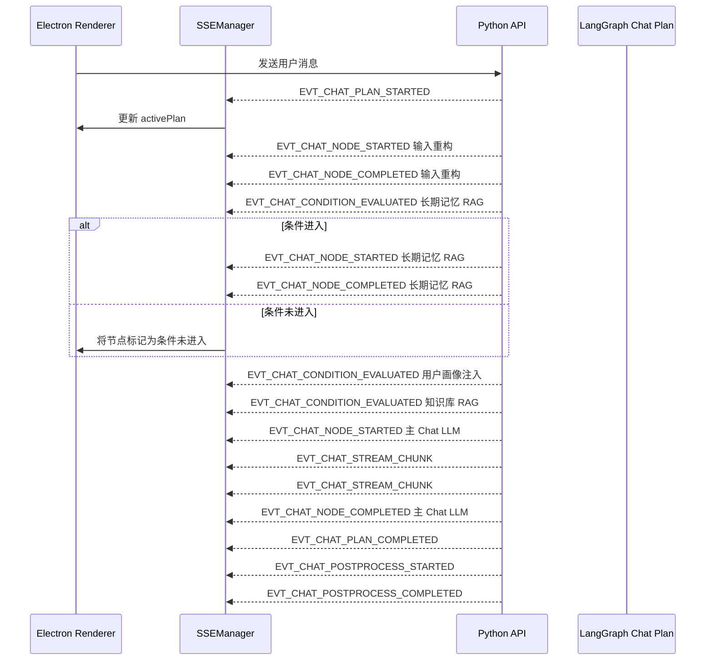

# Phase 8.5：Chat 主链路节点化与 Plan 化承接方案（前端）

## 1. 文档定位

本文档定义 Luna 前端在 Phase 8.5 中如何承接后端基于 LangGraph 的 chat 主链路节点化改造。Phase 8.5 的前端目标不是展示完整 DAG，也不是实现复杂任务编排 UI，而是在现有 Electron + React + TypeScript 架构下，以最小改造消费后端新的节点化 chat plan 事件。

前端必须继续保持瘦客户端定位：

- 不参与 LangGraph 调度。
- 不判断节点是否应该进入。
- 不执行记忆提交、知识库检索、用户画像注入。
- 不直接访问 PostgreSQL、Redis 或 Qdrant。
- 不绕过 Python 后端调用模型 API。

前端只消费后端投影出的 plan、node、condition、stream、postprocess、debug 事件，并将其映射为聊天界面、轻量节点状态条、调试抽屉和引用展示。

## 2. Phase 8.5 前端目标与边界

### 2.1 本阶段必须完成

1. 继续复用现有 SSE 通道，扩展 chat 工作流事件处理。
2. 在共享类型层定义 chat plan、节点状态、条件评估、调试信息等结构。
3. 在 Zustand 中新增或扩展 chat workflow 状态切片，承载当前单一日常闲聊 plan 的投影视图。
4. 在聊天 UI 中提供轻量“当前执行步骤”展示。
5. 在调试面板中展示节点时间线、条件节点进入判断、降级原因和错误信息。
6. 保持现有流式气泡渲染体验，避免因节点事件增加导致渲染卡顿。
7. 为 Phase 9 的完整 Plan 可视化预留数据结构和组件边界。

### 2.2 本阶段不做

1. 不展示完整复杂 DAG 图。
2. 不实现 ReactFlow 任务图可视化。
3. 不支持多 plan 并发视图。
4. 不支持复杂任务拆解的节点编辑、重试、局部重规划 UI。
5. 不在前端判断知识库 RAG、长期记忆检索、画像注入是否进入。
6. 不把节点状态混入消息正文文本。

### 2.3 关键语义修正

知识库 RAG、长期记忆检索、用户画像注入这三个节点不是前端“允许跳过”的可选步骤，而是后端 LangGraph 条件边控制的条件节点。

前端应展示的是：

- 条件已评估。
- 条件结果为进入或未进入。
- 未进入原因来自后端条件评估事件。
- 未进入状态属于正常 DAG 条件路由结果，不是错误，也不是用户手动跳过。

## 3. 当前前端现状

当前前端通信主要由 `SSEManager` 维护：

- EventSource 连接 `/sse/notifications`。
- 业务请求通过 HTTP fetch 发送。
- SSE 事件被转换为旧的 `WSMessage` 结构后进入统一处理。
- 当前已支持 `CHAT_STREAM`、`EVT_INIT_STATE`、心跳、连接状态、错误提示等事件。
- 共享类型层已有 `WSMessage`、`ChatStreamPayload`、`InitStatePayload` 等基础结构。
- 共享常量层已有 RAG、用户画像、压缩审计和错误码相关常量。

Phase 8.5 不推翻这些机制，而是在现有 SSE 与 shared types 之上扩展新的 chat workflow 事件。

## 4. 前端状态分层

Phase 8.5 后，前端状态需要拆分为五层，避免继续把所有状态堆入聊天消息。

### 4.1 会话态

会话态继续表示当前聊天窗口的核心数据：

- sessionId
- recentQA
- 当前用户消息 ID
- 当前 assistant 消息 ID
- 流式回复内容
- 消息完成状态

会话态仍由现有 session store 承载，但需要关联 interactionId 与 activeChatPlanId。

### 4.2 Plan 投影视图态

Phase 8.5 只有一个日常闲聊预设 plan，因此前端只需要保存当前活跃 chat plan 摘要。

推荐结构：

```typescript
export interface ChatPlanProjection {
  schemaVersion: typeof CHAT_WORKFLOW_SCHEMA_VERSION.CHAT_WORKFLOW_V1;
  planPresetId: typeof CHAT_PLAN_PRESET.DAILY_CHAT_DEFAULT;
  chatMode: typeof CHAT_MODE.DAILY_CHAT;
  traceId: string;
  interactionId: string;
  sessionId: string;
  status: ChatPlanStatus;
  startedAtMs: number;
  endedAtMs?: number;
  activeNodeType?: ChatWorkflowNodeType;
}
```

Plan 投影视图态不等于完整 DAG。它只告诉前端“本轮回复属于哪个预设 plan、当前执行到哪里”。

### 4.3 节点执行态

节点执行态保存后端推送的节点状态，不由前端推导。

```typescript
export interface ChatNodeProjection {
  nodeType: ChatWorkflowNodeType;
  status: ChatNodeStatus;
  startedAtMs?: number;
  endedAtMs?: number;
  latencyMs?: number;
  conditionEntered?: boolean;
  conditionReason?: string;
  degradedReason?: string;
  errorCode?: string;
}
```

其中 `conditionEntered` 只对条件节点有意义，包括：

- 长期记忆 RAG 条件节点
- 用户画像注入条件节点
- 知识库 RAG 条件节点

### 4.4 调试态

调试态用于开发者和高级用户查看完整执行轨迹。

```typescript
export interface ChatWorkflowDebugTimeline {
  traceId: string;
  interactionId: string;
  events: ChatWorkflowDebugEvent[];
}

export interface ChatWorkflowDebugEvent {
  eventId: string;
  eventType: ChatWorkflowEventType;
  nodeType?: ChatWorkflowNodeType;
  timestampMs: number;
  title: string;
  detail: string;
  payloadSummary: string;
}
```

调试态可以保存在专门 store 中，不应触发主聊天区域高频重渲染。

### 4.5 展示态

展示态用于控制 UI 是否展开：

- 是否展示当前步骤条。
- 是否展开节点详情。
- 是否展开条件判断原因。
- 是否打开调试抽屉。
- 是否展示 RAG 引用面板。

展示态完全属于前端 UI 状态，不参与后端逻辑。

## 5. 前端共享常量与类型建议

### 5.1 推荐新增常量

建议在 `frontend/src/shared/enum.ts` 中集中补充以下常量，禁止组件中直接写字符串。

```typescript
export const CHAT_WORKFLOW_SCHEMA_VERSION = {
  CHAT_WORKFLOW_V1: "chat.workflow.v1",
} as const;

export const CHAT_MODE = {
  DAILY_CHAT: "daily_chat",
} as const;

export const CHAT_PLAN_PRESET = {
  DAILY_CHAT_DEFAULT: "daily_chat.default.v1",
} as const;

export const CHAT_WORKFLOW_NODE_TYPE = {
  MESSAGE_INGRESS: "message_ingress",
  INPUT_RECONSTRUCTION: "input_reconstruction",
  SESSION_CONTEXT_LOAD: "session_context_load",
  LONG_TERM_MEMORY_RAG: "long_term_memory_rag",
  USER_PROFILE_INJECTION: "user_profile_injection",
  KNOWLEDGE_RAG: "knowledge_rag",
  CONTEXT_GOVERNANCE: "context_governance",
  PROMPT_ASSEMBLY: "prompt_assembly",
  MAIN_CHAT_LLM: "main_chat_llm",
  RESPONSE_PERSISTENCE: "response_persistence",
  LONG_TERM_MEMORY_COMPRESSION: "long_term_memory_compression",
  USER_PROFILE_EXTRACTION: "user_profile_extraction",
  POSTPROCESS_COMMIT: "postprocess_commit",
  ERROR_RECOVERY: "error_recovery",
  FINALIZE: "finalize",
} as const;

export const CHAT_NODE_STATUS = {
  PENDING: "pending",
  RUNNING: "running",
  SUCCEEDED: "succeeded",
  FAILED: "failed",
  DEGRADED: "degraded",
  NOT_ENTERED_BY_CONDITION: "not_entered_by_condition",
} as const;

export const CHAT_WORKFLOW_EVENT_TYPE = {
  EVT_CHAT_PLAN_STARTED: "EVT_CHAT_PLAN_STARTED",
  EVT_CHAT_NODE_STARTED: "EVT_CHAT_NODE_STARTED",
  EVT_CHAT_NODE_COMPLETED: "EVT_CHAT_NODE_COMPLETED",
  EVT_CHAT_NODE_FAILED: "EVT_CHAT_NODE_FAILED",
  EVT_CHAT_NODE_DEGRADED: "EVT_CHAT_NODE_DEGRADED",
  EVT_CHAT_CONDITION_EVALUATED: "EVT_CHAT_CONDITION_EVALUATED",
  EVT_CHAT_STREAM_CHUNK: "EVT_CHAT_STREAM_CHUNK",
  EVT_CHAT_POSTPROCESS_STARTED: "EVT_CHAT_POSTPROCESS_STARTED",
  EVT_CHAT_POSTPROCESS_COMPLETED: "EVT_CHAT_POSTPROCESS_COMPLETED",
  EVT_CHAT_PLAN_COMPLETED: "EVT_CHAT_PLAN_COMPLETED",
} as const;
```

### 5.2 推荐新增类型

建议在 `frontend/src/shared/types.ts` 或独立 `frontend/src/renderer/types/chatWorkflow.ts` 中定义以下类型。

```typescript
export type ChatWorkflowNodeType = typeof CHAT_WORKFLOW_NODE_TYPE[keyof typeof CHAT_WORKFLOW_NODE_TYPE];
export type ChatNodeStatus = typeof CHAT_NODE_STATUS[keyof typeof CHAT_NODE_STATUS];
export type ChatWorkflowEventType = typeof CHAT_WORKFLOW_EVENT_TYPE[keyof typeof CHAT_WORKFLOW_EVENT_TYPE];

export interface ChatWorkflowEventEnvelope<TPayload> {
  schemaVersion: typeof CHAT_WORKFLOW_SCHEMA_VERSION.CHAT_WORKFLOW_V1;
  eventType: ChatWorkflowEventType;
  traceId: string;
  interactionId: string;
  sessionId: string;
  planPresetId: typeof CHAT_PLAN_PRESET.DAILY_CHAT_DEFAULT;
  nodeType?: ChatWorkflowNodeType;
  timestampMs: number;
  payload: TPayload;
}

export interface ChatConditionEvaluatedPayload {
  sourceNodeType: ChatWorkflowNodeType;
  targetNodeType: ChatWorkflowNodeType;
  conditionEntered: boolean;
  routeName: string;
  reason: string;
}

export interface ChatNodeStatusPayload {
  nodeType: ChatWorkflowNodeType;
  status: ChatNodeStatus;
  startedAtMs?: number;
  endedAtMs?: number;
  latencyMs?: number;
  degradedReason?: string;
  errorCode?: string;
}
```

## 6. SSE 事件消费方案

### 6.1 继续复用现有 SSE 通道

Phase 8.5 不新增 WebSocket。现有 EventSource 仍然连接：

```text
/sse/notifications
```

后端新增的 chat workflow 事件继续通过 SSE 推送。前端在 `SSEManager` 中增加对以下事件的分发：

- `EVT_CHAT_PLAN_STARTED`
- `EVT_CHAT_NODE_STARTED`
- `EVT_CHAT_NODE_COMPLETED`
- `EVT_CHAT_NODE_FAILED`
- `EVT_CHAT_NODE_DEGRADED`
- `EVT_CHAT_CONDITION_EVALUATED`
- `EVT_CHAT_POSTPROCESS_STARTED`
- `EVT_CHAT_POSTPROCESS_COMPLETED`
- `EVT_CHAT_PLAN_COMPLETED`

现有 `CHAT_STREAM` 可以在过渡期保留。后续可逐步统一到 `EVT_CHAT_STREAM_CHUNK`。

### 6.2 消息处理原则

`SSEManager` 只做三件事：

1. 解析事件。
2. 校验基础字段。
3. 分发给对应 store。

`SSEManager` 不做：

- 不判断节点是否应该进入。
- 不补造节点成功事件。
- 不根据事件顺序猜测 plan 完成。
- 不把条件未进入当作错误。

### 6.3 条件评估事件处理

当前端收到 `EVT_CHAT_CONDITION_EVALUATED` 时：

1. 根据 `targetNodeType` 定位条件节点投影。
2. 写入 `conditionEntered` 与 `conditionReason`。
3. 如果 `conditionEntered` 为 false，将节点状态设为 `NOT_ENTERED_BY_CONDITION`。
4. 在调试时间线追加一条“条件判断”事件。
5. UI 使用中性色展示，不展示为失败或警告。

## 7. Zustand Store 设计

### 7.1 推荐新增 store

建议新增：

```text
frontend/src/renderer/stores/chatWorkflowStore.ts
```

职责：

- 保存当前 chat plan 投影视图。
- 保存当前 interaction 的节点状态表。
- 保存条件评估结果。
- 保存调试时间线。
- 提供事件驱动的状态更新方法。

### 7.2 Store 状态结构

```typescript
interface ChatWorkflowStoreState {
  activePlan: ChatPlanProjection | null;
  nodesByInteractionId: Record<string, ChatNodeProjection[]>;
  debugTimelineByTraceId: Record<string, ChatWorkflowDebugTimeline>;
  latestConditionResults: Record<string, ChatConditionEvaluatedPayload>;

  onPlanStarted: (event: ChatWorkflowEventEnvelope<ChatPlanStartedPayload>) => void;
  onNodeStatus: (event: ChatWorkflowEventEnvelope<ChatNodeStatusPayload>) => void;
  onConditionEvaluated: (event: ChatWorkflowEventEnvelope<ChatConditionEvaluatedPayload>) => void;
  onPostprocessStatus: (event: ChatWorkflowEventEnvelope<ChatPostprocessPayload>) => void;
  onPlanCompleted: (event: ChatWorkflowEventEnvelope<ChatPlanCompletedPayload>) => void;
  clearInteraction: (interactionId: string) => void;
}
```

说明：这里虽然使用 TypeScript 的对象索引存储不同 interaction 的投影数据，但 payload 和节点模型必须是强类型结构，组件层不得直接使用自由格式数据。

### 7.3 高频与低频分离

节点状态事件属于低频状态，可进入 Zustand。

流式 token 属于高频状态，应继续使用当前气泡流式渲染策略，避免每个 token 都驱动全局 store 重渲染。

调试事件可能较多，应采用以下策略：

- 每个 trace_id 最多保留最近固定数量事件。
- 调试抽屉关闭时不主动渲染详细事件列表。
- 日志类文本使用局部组件虚拟滚动或批量刷新。

## 8. UI 最小改造方案

### 8.1 当前执行步骤条

在聊天区靠近输入框或当前 assistant 气泡上方展示轻量步骤条。

展示内容：

- 当前节点中文名称。
- 当前节点状态。
- 是否处于后处理阶段。
- 是否存在降级。

示例文案：

- “正在理解你的输入”
- “正在整理会话上下文”
- “正在判断是否需要长期记忆”
- “正在读取相关长期记忆”
- “正在判断是否需要用户画像”
- “正在注入用户画像”
- “正在判断是否需要知识库资料”
- “正在检索知识库证据”
- “正在组织回复上下文”
- “正在生成回复”
- “正在保存本轮对话”
- “正在后台整理记忆”

### 8.2 条件节点展示

条件节点建议展示为三种状态：

| 后端状态 | 前端展示 | 颜色语义 |
|:---|:---|:---|
| `RUNNING` | 正在判断或执行 | 蓝色 |
| `SUCCEEDED` | 已进入并完成 | 绿色 |
| `NOT_ENTERED_BY_CONDITION` | 条件未进入 | 灰色 |
| `DEGRADED` | 已降级继续 | 橙色 |
| `FAILED` | 节点失败 | 红色 |

注意：`NOT_ENTERED_BY_CONDITION` 是正常路由结果，不得渲染为错误。

### 8.3 Assistant 气泡元数据

当前 assistant 气泡可以展示折叠元数据：

- 使用的 plan preset。
- 是否进入长期记忆 RAG。
- 是否进入用户画像注入。
- 是否进入知识库 RAG。
- 知识库引用数量。
- 是否发生降级。

默认折叠，只在用户点击或调试模式开启时展开。

### 8.4 调试抽屉

调试抽屉建议新增“本轮节点时间线”区域。

展示内容：

1. plan started
2. node started / completed / degraded / failed
3. condition evaluated
4. stream started
5. postprocess started / completed
6. plan completed

条件评估事件需要展示原因，例如：

- “进入长期记忆 RAG：用户提到‘你还记得我之前说过的偏好吗’。”
- “未进入知识库 RAG：本轮为情绪陪伴闲聊，无外部资料检索需求。”

这些文案必须来自后端 payload，前端只展示，不自行生成业务判断。

## 9. 与现有消息结构的协作

### 9.1 ChatStreamPayload 扩展建议

现有 `ChatStreamPayload` 已包含：

- type
- chunk
- is_finished
- node_id
- error

Phase 8.5 建议逐步扩展为：

```typescript
export interface ChatWorkflowStreamPayload {
  schemaVersion: typeof CHAT_WORKFLOW_SCHEMA_VERSION.CHAT_WORKFLOW_V1;
  interactionId: string;
  assistantMessageId: string;
  currentNodeType: typeof CHAT_WORKFLOW_NODE_TYPE.MAIN_CHAT_LLM;
  chunk: string;
  isFinalChunk: boolean;
  citations?: ChatCitationProjection[];
  error?: string;
}
```

过渡期可同时支持旧字段与新字段，但新代码应优先读取新字段。

### 9.2 消息与节点关系

每条 assistant 消息应关联：

- traceId
- interactionId
- assistantMessageId
- planPresetId
- nodeTimelineSummary
- citations

这些元数据不进入消息正文，避免污染 Markdown 渲染与复制内容。

## 10. 前后端协作流程

### 10.1 正常聊天流程



### 10.2 条件节点未进入流程

当后端条件边判断不进入某个条件节点时，前端只收到条件评估事件，不应等待该节点的 started/completed 事件。

前端处理：

1. 写入条件结果。
2. 在节点列表中创建或更新该节点投影。
3. 状态设置为 `NOT_ENTERED_BY_CONDITION`。
4. 展示灰色状态和原因。
5. 主流程继续等待后续节点事件。

## 11. 错误与降级展示

### 11.1 降级不是失败

以下情况应显示为降级，而不是失败：

- 长期记忆检索失败，但主回复继续。
- 用户画像注入失败，但主回复继续。
- 知识库 RAG 检索失败，但主回复继续。
- 上下文治理启用最小裁剪策略。
- 后处理记忆压缩失败。

### 11.2 失败展示

以下情况才应进入失败提示：

- 用户输入不合法。
- Prompt 装配失败且无法兜底。
- 主 Chat LLM 无法生成回复。
- SSE 连接中断导致无法接收关键终态。

### 11.3 后处理失败展示

后处理失败不应修改消息成功态。建议在调试抽屉或记忆面板显示：

- “本轮回复已完成，但后台记忆整理失败。”
- “画像提取未完成，已等待下次补偿。”

普通聊天界面不强打扰用户。

## 12. 组件边界建议

### 12.1 新增组件

```text
frontend/src/renderer/components/ChatWorkflow/
├── ChatWorkflowStepBar.tsx
├── ChatWorkflowNodeBadge.tsx
├── ChatWorkflowConditionItem.tsx
├── ChatWorkflowDebugDrawer.tsx
├── ChatWorkflowTimeline.tsx
└── ChatWorkflowMetadataPanel.tsx
```

职责：

- StepBar：展示当前节点与整体阶段。
- NodeBadge：展示单节点状态。
- ConditionItem：展示条件节点进入判断与原因。
- DebugDrawer：承载 trace_id 维度调试信息。
- Timeline：渲染节点时间线。
- MetadataPanel：挂在 assistant 气泡上，展示本轮 plan 元数据。

### 12.2 不建议改动的部分

Phase 8.5 不建议重构：

- Live2D 渲染链路。
- 现有气泡动画核心机制。
- 知识库管理面板。
- 用户画像管理面板。
- Prompt 设置面板。

这些模块只需要消费新增事件或元数据，不应被工作流改造牵连重写。

## 13. 安全与职责边界

前端禁止：

1. 根据用户输入自行决定是否进入知识库 RAG。
2. 根据本地缓存自行注入用户画像。
3. 根据 localStorage 或 Zustand 状态恢复长期记忆。
4. 修改后端传来的节点状态。
5. 在组件内硬编码事件名、节点类型、状态值。
6. 将调试 payload 中可能包含的敏感内容直接暴露在普通 UI。

前端必须：

1. 只展示后端投影状态。
2. 对调试信息做折叠和脱敏展示。
3. 保持 SSE 断线重连后的状态同步。
4. 使用 Snowflake 工具生成前端发起的消息 ID。
5. 将所有新增枚举集中到共享常量层。

## 14. Phase 9 承接预留

Phase 8.5 的前端数据结构要为 Phase 9 留出承接空间，但不提前实现复杂 UI。

### 14.1 单 plan 到多 plan

当前：

```typescript
activePlan: ChatPlanProjection | null
```

未来：

```typescript
activePlansByPlanId: Record<string, PlanProjection>
```

### 14.2 线性步骤条到 DAG 图

当前：

- StepBar
- Timeline
- NodeBadge

未来：

- ReactFlow PlanGraph
- 多活动节点高亮
- 节点重试与审批状态展示

### 14.3 单 interaction 到任务回放

当前：

- trace_id 维度调试时间线

未来：

- plan_id 维度全流程回放
- 节点输入输出审计
- 被重规划裁剪的子图展示

### 14.4 条件节点到通用条件边

当前只展示三类条件节点：

- 长期记忆 RAG
- 用户画像注入
- 知识库 RAG

未来可以扩展为任意条件边：

- 工具审批条件
- 情绪状态条件
- 主动行为静默期条件
- 多 Agent 资源冲突条件

## 15. 分阶段实施建议

### 15.1 第一阶段：共享常量与类型

交付：

- 新增 chat workflow 常量。
- 新增 plan、node、condition、event 类型。
- 单元测试覆盖枚举和类型守卫。

退出标准：

- 组件中不出现新增事件和节点魔法字符串。
- SSE payload 可被类型化解析。

### 15.2 第二阶段：SSEManager 事件分发

交付：

- 增加 chat workflow 事件监听。
- 将事件分发到 chatWorkflowStore。
- 保持旧 CHAT_STREAM 兼容。

退出标准：

- 接收到计划启动、节点状态、条件评估、计划完成事件后 store 正确更新。
- 条件未进入不会被标记为错误。

### 15.3 第三阶段：chatWorkflowStore

交付：

- activePlan 状态。
- nodesByInteractionId 状态。
- debugTimelineByTraceId 状态。
- condition result 状态。

退出标准：

- 任意一次 chat 可在 store 中看到完整节点投影。
- trace_id 可定位调试时间线。

### 15.4 第四阶段：最小 UI 展示

交付：

- ChatWorkflowStepBar。
- assistant 气泡元数据区域。
- 条件节点状态展示。
- 调试抽屉时间线。

退出标准：

- 用户能看到“正在理解输入 / 正在检索知识 / 正在生成回复”等状态。
- 开发者能看到条件节点为什么进入或未进入。

### 15.5 第五阶段：联调与降级体验

交付：

- SSE 断线恢复后重新同步当前状态。
- 降级状态展示。
- 后处理失败展示。
- 引用与节点元数据关联展示。

退出标准：

- RAG、记忆、画像任一节点降级时，主回复 UI 不崩溃。
- 后处理失败不改变已完成消息。
- 调试信息足以定位后端节点失败位置。

## 16. 验收标准

Phase 8.5 前端验收必须满足：

1. 前端可通过 SSE 消费新的 chat workflow 事件。
2. 前端可展示当前日常闲聊 chat plan 的执行状态。
3. 前端可展示节点 started、completed、failed、degraded 状态。
4. 前端可展示长期记忆 RAG、用户画像注入、知识库 RAG 三个条件节点的进入判断。
5. 条件未进入状态显示为正常 DAG 条件路由结果，不显示为失败。
6. 流式回复体验保持稳定，不因节点事件导致明显卡顿。
7. 调试抽屉可按 trace_id 展示本轮节点时间线。
8. assistant 气泡元数据不污染消息正文。
9. 前端不参与任何调度、检索、画像注入和记忆提交。
10. 当前数据结构可平滑承接 Phase 9 的多 plan 与 DAG 可视化。
