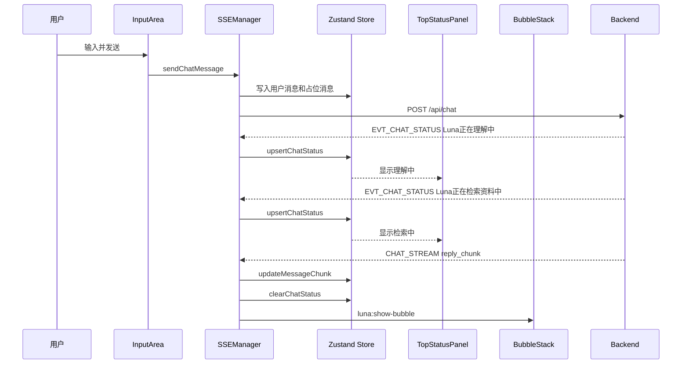
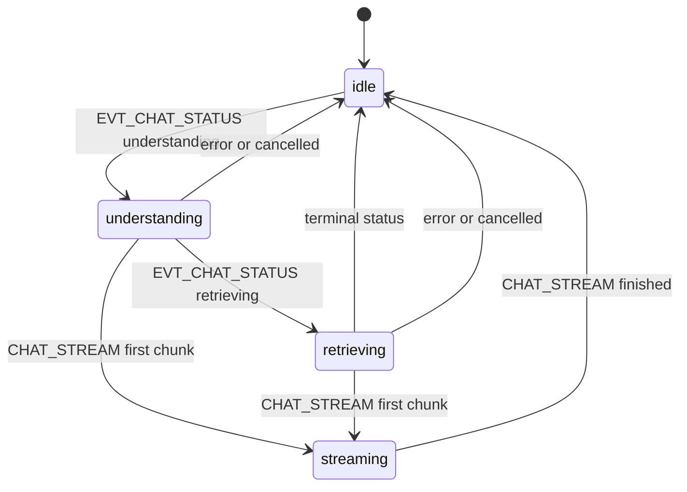

# Chat 主链路 SSE 状态通知前端方案

## 1. 现状分析

### 1.1 SSE 订阅现状

当前前端实时通信集中在 [`frontend/src/renderer/services/sseManager.ts`](frontend/src/renderer/services/sseManager.ts)。[`SSEManager.connect()`](frontend/src/renderer/services/sseManager.ts:105) 使用 [`new EventSource()`](frontend/src/renderer/services/sseManager.ts:115) 连接后端 [`/sse/notifications`](backend/ai-service/app/api/sse.py:164)。

当前已注册的命名事件包括：

- [`connected`](frontend/src/renderer/services/sseManager.ts:133)
- [`SERVER_READY`](frontend/src/renderer/services/sseManager.ts:155)
- [`heartbeat`](frontend/src/renderer/services/sseManager.ts:161)
- [`CHAT_STREAM`](frontend/src/renderer/services/sseManager.ts:166)
- [`EVT_INIT_STATE`](frontend/src/renderer/services/sseManager.ts:186)

当前 [`onmessage`](frontend/src/renderer/services/sseManager.ts:200) 只处理默认消息事件。由于后端 SSE 使用 [`event: <event_type>`](backend/ai-service/app/api/sse.py:142)，新增状态事件如果以 [`event: EVT_CHAT_STATUS`](backend/ai-service/app/api/sse.py:142) 发送，前端必须显式调用 [`addEventListener()`](frontend/src/renderer/services/sseManager.ts:166)，不能只依赖 [`onmessage`](frontend/src/renderer/services/sseManager.ts:200)。

### 1.2 Chat 请求与流式协同现状

用户输入由 [`InputArea`](frontend/src/renderer/components/InputArea/InputArea.tsx:17) 触发 [`sseManager.sendChatMessage()`](frontend/src/renderer/services/sseManager.ts:510)。发送流程：

1. [`sendChatMessage()`](frontend/src/renderer/services/sseManager.ts:510) 生成用户消息 ID 与 assistant 占位消息 ID。
2. 使用 [`sessionStore.appendMessage()`](frontend/src/renderer/stores/sessionStore.ts:106) 写入用户消息。
3. 再写入状态为 [`streaming`](frontend/src/renderer/stores/sessionStore.ts:20) 的 assistant 占位消息。
4. 通过 [`fetch()`](frontend/src/renderer/services/sseManager.ts:554) 调用后端 [`POST /api/chat`](backend/ai-service/app/api/http_api.py:298)。
5. 后端流式正文通过 [`CHAT_STREAM`](frontend/src/renderer/services/sseManager.ts:166) 到达，最终进入 [`handleChatStream()`](frontend/src/renderer/services/sseManager.ts:377)。
6. [`handleChatStream()`](frontend/src/renderer/services/sseManager.ts:377) 通过 [`sessionStore.updateMessageChunk()`](frontend/src/renderer/stores/sessionStore.ts:115) 拼接正文，并通过 [`luna:show-bubble`](frontend/src/renderer/services/sseManager.ts:401) 驱动 [`BubbleStack`](frontend/src/renderer/components/BubbleStack/BubbleStack.tsx:23)。

现有前端已经能在流式正文开始前保持等待状态，但等待文案只在 [`InputArea`](frontend/src/renderer/components/InputArea/InputArea.tsx:241) 显示固定 [`PROCESSING`](frontend/src/renderer/components/InputArea/InputArea.tsx:245)，顶部状态栏 [`TopStatusPanel`](frontend/src/renderer/components/TopStatusPanel/TopStatusPanel.tsx:5) 也只根据连接状态显示固定文案。

### 1.3 状态展示现状

系统级状态由 [`useSystemStore`](frontend/src/renderer/stores/systemStore.ts:153) 管理：

- [`connectionStatus`](frontend/src/renderer/stores/systemStore.ts:45) 记录 SSE 连接状态。
- [`globalMessage`](frontend/src/renderer/stores/systemStore.ts:63) 可显示临时全局提示。
- [`currentTraceID`](frontend/src/renderer/stores/systemStore.ts:77) 保存当前链路 ID。
- [`addSystemLog()`](frontend/src/renderer/stores/systemStore.ts:89) 写入诊断日志。

会话消息由 [`useSessionStore`](frontend/src/renderer/stores/sessionStore.ts:95) 管理：

- [`currentSessionId`](frontend/src/renderer/stores/sessionStore.ts:66) 表示当前会话。
- [`messages`](frontend/src/renderer/stores/sessionStore.ts:68) 保存每个会话的消息列表。
- [`updateMessageStatus()`](frontend/src/renderer/stores/sessionStore.ts:154) 更新消息状态。

缺口：当前没有专门的 chat 阶段状态结构，也没有按 [`messageId`](frontend/src/renderer/stores/sessionStore.ts:14) 维护的状态生命周期。

## 2. 目标设计

### 2.1 用户体验目标

当后端进入真实阶段时，前端展示即时状态：

- 收到 [`EVT_CHAT_STATUS`](backend/ai-service/app/types/constants.py) 且阶段为输入重构时，显示 `Luna正在理解中……`。
- 收到 [`EVT_CHAT_STATUS`](backend/ai-service/app/types/constants.py) 且阶段为 RAG 检索时，显示 `Luna正在检索资料中……`。
- 收到正文 [`CHAT_STREAM`](frontend/src/renderer/services/sseManager.ts:166) 首块或状态终止事件时，清理阶段提示，避免遮挡正文。

### 2.2 技术目标

1. 复用现有 [`SSEManager`](frontend/src/renderer/services/sseManager.ts:58)，不新增前端连接管理器。
2. 新增命名事件监听，不改变现有 [`CHAT_STREAM`](frontend/src/renderer/services/sseManager.ts:166) 处理。
3. 状态事件按 [`trace_id`](frontend/src/shared/types.ts:20)、[`session_id`](backend/ai-service/app/api/http_api.py:93)、[`message_id`](backend/ai-service/app/api/http_api.py:95) 过滤，避免多会话污染。
4. 状态生命周期由后端事件驱动，前端只做投影、过期清理和异常兜底。
5. 保持现有 [`InputArea`](frontend/src/renderer/components/InputArea/InputArea.tsx:17) 的等待锁机制不变。

## 3. 接口设计

### 3.1 前端常量

建议在 [`frontend/src/shared/enum.ts`](frontend/src/shared/enum.ts) 中新增：

```typescript
EVT_CHAT_STATUS: "EVT_CHAT_STATUS"
```

建议同时补充已有但未进入前端常量的 RAG 事件，便于后续统一处理：

```typescript
EVT_RAG_THOUGHT: "EVT_RAG_THOUGHT"
EVT_RAG_CITATION: "EVT_RAG_CITATION"
```

### 3.2 前端 Payload 类型

建议在 [`frontend/src/shared/types.ts`](frontend/src/shared/types.ts) 中新增：

```typescript
export type ChatStatusStage =
  | 'input_reconstruction'
  | 'rag_retrieval'
  | 'chat_prompt_assembly'
  | 'llm_streaming';

export type ChatStatusState =
  | 'started'
  | 'running'
  | 'completed'
  | 'skipped'
  | 'error'
  | 'cancelled';

export interface ChatStatusPayload {
  schema_version: string;
  session_id: string;
  message_id: string;
  stage: ChatStatusStage;
  state: ChatStatusState;
  display_text: string;
  is_visible: boolean;
  is_terminal: boolean;
  sequence: number;
  timestamp_ms: number;
  error?: string;
}
```

### 3.3 Store 状态结构

建议在 [`frontend/src/renderer/stores/systemStore.ts`](frontend/src/renderer/stores/systemStore.ts) 增加：

```typescript
export interface ChatRuntimeStatus {
  traceId: string;
  sessionId: string;
  messageId: string;
  stage: ChatStatusStage;
  state: ChatStatusState;
  displayText: string;
  sequence: number;
  updatedAt: number;
  isVisible: boolean;
}
```

建议新增 store 字段和 action：

```typescript
chatStatuses: Record<string, ChatRuntimeStatus>;
activeChatStatus: ChatRuntimeStatus | null;
upsertChatStatus: (status: ChatRuntimeStatus) => void;
clearChatStatus: (messageId: string) => void;
clearStaleChatStatuses: (maxAgeMs: number) => void;
```

说明：

- [`chatStatuses`](frontend/src/renderer/stores/systemStore.ts) 以 [`messageId`](frontend/src/renderer/stores/sessionStore.ts:14) 为 key。
- [`activeChatStatus`](frontend/src/renderer/stores/systemStore.ts) 只保存当前会话可见状态，供 [`TopStatusPanel`](frontend/src/renderer/components/TopStatusPanel/TopStatusPanel.tsx:5) 与 [`InputArea`](frontend/src/renderer/components/InputArea/InputArea.tsx:17) 直接订阅。
- [`sequence`](backend/ai-service/app/api/chat_status.py) 小于旧值的事件应丢弃，防止断线重连或队列延迟造成倒退。

## 4. 前端订阅设计

### 4.1 新增命名事件监听

在 [`setupEventHandlers()`](frontend/src/renderer/services/sseManager.ts:129) 中新增：

```typescript
this.eventSource.addEventListener('EVT_CHAT_STATUS', (event) => {
  try {
    const sseEvent: SSEEvent = JSON.parse(event.data);
    const msg: WSMessage = {
      type: sseEvent.type as WSMsgType,
      trace_id: sseEvent.trace_id,
      payload: sseEvent.payload,
    };
    this.handleMessage(msg);
  } catch (err) {
    this.handleSSEParseError('EVT_CHAT_STATUS', err);
  }
});
```

当前 [`SSEEvent`](frontend/src/renderer/services/sseManager.ts:48) 是文件内私有接口，结构已足够复用。

### 4.2 新增消息分支

在 [`handleMessage()`](frontend/src/renderer/services/sseManager.ts:233) 的 [`switch`](frontend/src/renderer/services/sseManager.ts:243) 中新增：

```typescript
case WS_MSG_TYPE.EVT_CHAT_STATUS: {
  this.handleChatStatus(msg.trace_id, msg.payload as ChatStatusPayload);
  break;
}
```

建议新增私有方法 [`handleChatStatus()`](frontend/src/renderer/services/sseManager.ts)：

```typescript
private handleChatStatus(traceId: string, payload: ChatStatusPayload): void {
  const sessionStore = useSessionStore.getState();
  const systemStore = useSystemStore.getState();

  if (payload.schema_version !== 'chat_status.v1') {
    systemStore.addSystemLog(`忽略未知 ChatStatus schema: ${payload.schema_version}`);
    return;
  }

  if (payload.is_terminal || !payload.is_visible) {
    systemStore.clearChatStatus(payload.message_id);
    return;
  }

  if (payload.session_id !== sessionStore.currentSessionId) {
    systemStore.addSystemLog(`收到非当前会话状态，已缓存或忽略: ${payload.session_id}`);
    return;
  }

  systemStore.upsertChatStatus({
    traceId,
    sessionId: payload.session_id,
    messageId: payload.message_id,
    stage: payload.stage,
    state: payload.state,
    displayText: payload.display_text,
    sequence: payload.sequence,
    updatedAt: payload.timestamp_ms,
    isVisible: payload.is_visible,
  });
}
```

## 5. 展示设计

### 5.1 顶部状态栏展示

当前 [`TopStatusPanel`](frontend/src/renderer/components/TopStatusPanel/TopStatusPanel.tsx:5) 只读取 [`connectionStatus`](frontend/src/renderer/stores/systemStore.ts:45)。建议改为同时读取 [`activeChatStatus`](frontend/src/renderer/stores/systemStore.ts)：

优先级：

1. [`connectionStatus`](frontend/src/renderer/stores/systemStore.ts:45) 为 [`connecting`](frontend/src/renderer/stores/systemStore.ts:17) 时显示 `正在醒来...`。
2. [`connectionStatus`](frontend/src/renderer/stores/systemStore.ts:45) 为 [`disconnected`](frontend/src/renderer/stores/systemStore.ts:17) 时显示 `睡着了`。
3. [`activeChatStatus.displayText`](frontend/src/renderer/stores/systemStore.ts) 非空时显示后端状态提示。
4. 否则显示当前默认值 `在等你说话`。

### 5.2 输入区域加载文案

当前 [`InputArea`](frontend/src/renderer/components/InputArea/InputArea.tsx:241) 中的加载文案固定为 [`PROCESSING`](frontend/src/renderer/components/InputArea/InputArea.tsx:245)。建议读取 [`activeChatStatus`](frontend/src/renderer/stores/systemStore.ts)，在 [`isWaiting`](frontend/src/renderer/components/InputArea/InputArea.tsx:56) 为 true 时显示：

- 有可见状态：显示 [`displayText`](frontend/src/renderer/stores/systemStore.ts)。
- 无可见状态：保留 [`PROCESSING`](frontend/src/renderer/components/InputArea/InputArea.tsx:245)。

这样顶部状态栏和输入区加载动画使用同一后端事件源。

### 5.3 是否使用全局 Toast

[`globalMessage`](frontend/src/renderer/stores/systemStore.ts:63) 适合保存、配置完成等短提示，不建议用于 chat 阶段状态。原因：

- [`showGlobalMessage()`](frontend/src/renderer/stores/systemStore.ts:94) 默认 3 秒自动消失，而 chat 阶段长度不固定。
- 状态提示需要按 [`message_id`](backend/ai-service/app/api/http_api.py:95) 生命周期清理。
- 全局 Toast 会与错误提示 [`ErrorToast`](frontend/src/renderer/components/ErrorToast/ErrorToast.tsx) 竞争注意力。

## 6. 关键流程



## 7. 与现有流式输出协同

### 7.1 正文首块清理状态

在 [`handleChatStream()`](frontend/src/renderer/services/sseManager.ts:377) 中，当 [`msgType`](frontend/src/renderer/services/sseManager.ts:381) 为 [`reply_chunk`](frontend/src/renderer/services/sseManager.ts:397) 且 [`payload.chunk`](frontend/src/renderer/services/sseManager.ts:399) 非空时，调用：

```typescript
systemStore.clearChatStatus(payload.node_id);
```

原因：当前后端 [`ChatStreamPayload.node_id`](backend/ai-service/app/api/http_api.py:74) 对应前端 assistant 占位消息 ID，也就是状态 payload 的 [`message_id`](backend/ai-service/app/api/http_api.py:95)。

### 7.2 流结束清理状态

在 [`payload.is_finished`](frontend/src/renderer/services/sseManager.ts:418) 分支中再次调用：

```typescript
systemStore.clearChatStatus(payload.node_id);
```

这样即使正文为空或发生错误，也不会残留 `Luna正在检索资料中……`。

### 7.3 保持消息等待锁不变

[`InputArea`](frontend/src/renderer/components/InputArea/InputArea.tsx:56) 的 [`isWaiting`](frontend/src/renderer/components/InputArea/InputArea.tsx:56) 仍由最后一条消息状态控制。状态事件只影响显示文案，不改变 [`sending`](frontend/src/renderer/stores/sessionStore.ts:20) 或 [`streaming`](frontend/src/renderer/stores/sessionStore.ts:20) 的业务状态。

## 8. 异常处理

### 8.1 解析失败

当前 [`CHAT_STREAM`](frontend/src/renderer/services/sseManager.ts:166) 解析失败会调用 [`createErrorToast()`](frontend/src/renderer/services/sseManager.ts:180) 与 [`reportError()`](frontend/src/renderer/services/sseManager.ts:181)。建议将解析错误处理抽为私有方法 [`handleSSEParseError()`](frontend/src/renderer/services/sseManager.ts)，复用到 [`EVT_CHAT_STATUS`](frontend/src/renderer/services/sseManager.ts)。

### 8.2 schema 不匹配

如果 [`payload.schema_version`](backend/ai-service/app/api/chat_status.py) 不是 [`chat_status.v1`](backend/ai-service/app/api/chat_status.py)，前端只写入 [`systemStore.addSystemLog()`](frontend/src/renderer/stores/systemStore.ts:89)，不展示，不抛异常。

### 8.3 状态事件丢失

由于现有后端 [`SSEManager`](backend/ai-service/app/api/sse.py:39) 不支持事件回放，状态事件是瞬态的。若丢失：

- [`InputArea`](frontend/src/renderer/components/InputArea/InputArea.tsx:241) 仍显示默认 [`PROCESSING`](frontend/src/renderer/components/InputArea/InputArea.tsx:245)。
- 收到 [`CHAT_STREAM`](frontend/src/renderer/services/sseManager.ts:166) 后仍正常渲染正文。
- 等待超时由 [`WAIT_TIMEOUT_MS`](frontend/src/renderer/components/InputArea/InputArea.tsx:81) 兜底释放。

### 8.4 后端阶段错误

如果 [`ChatStatusPayload.state`](frontend/src/shared/types.ts) 为 [`error`](frontend/src/shared/types.ts)，前端策略：

1. 写入 [`systemStore.addSystemLog()`](frontend/src/renderer/stores/systemStore.ts:89)。
2. 若 [`is_terminal`](frontend/src/shared/types.ts) 为 true，清理该消息状态。
3. 不主动把 assistant 消息置为 [`error`](frontend/src/renderer/stores/sessionStore.ts:20)，因为后端仍可能降级继续生成正文；最终消息状态仍以 [`CHAT_STREAM`](frontend/src/renderer/services/sseManager.ts:166) 的 [`is_finished`](frontend/src/shared/types.ts:90) 和 [`error`](frontend/src/shared/types.ts:92) 为准。

## 9. 断线重连

现有 [`EventSource`](frontend/src/renderer/services/sseManager.ts:115) 原生自动重连，错误回调 [`onerror`](frontend/src/renderer/services/sseManager.ts:223) 只设置连接状态为 [`disconnected`](frontend/src/renderer/stores/systemStore.ts:17)。建议增强：

1. [`onerror`](frontend/src/renderer/services/sseManager.ts:223) 只标记连接状态，不清理消息等待状态，避免短暂断线导致正在生成的消息直接失败。
2. [`onopen`](frontend/src/renderer/services/sseManager.ts:148) 恢复连接后调用 [`clearStaleChatStatuses()`](frontend/src/renderer/stores/systemStore.ts)，清理超过阈值的阶段状态。
3. 若重连后收到 [`CHAT_STREAM`](frontend/src/renderer/services/sseManager.ts:166)，以正文事件为准清理状态。

## 10. 请求取消

当前 [`sendChatMessage()`](frontend/src/renderer/services/sseManager.ts:510) 未使用 [`AbortController`](frontend/src/renderer/services/healthService.ts:31)，也没有调用后端取消接口。建议分两层实现：

### 10.1 MVP 前端取消

新增 [`pendingChatRequests`](frontend/src/renderer/services/sseManager.ts) 映射：

```typescript
private pendingChatRequests = new Map<string, AbortController>();
```

在 [`fetch()`](frontend/src/renderer/services/sseManager.ts:554) 时传入 [`signal`](frontend/src/renderer/services/healthService.ts:31)。这只能取消 HTTP 提交请求，不能取消已经启动的后端 LLM task。

### 10.2 完整后端取消

待后端新增 [`POST /api/chat/cancel`](backend/ai-service/app/api/http_api.py) 后，前端新增：

```typescript
public cancelChatMessage(messageId: string): void
```

行为：

1. 调用后端取消接口，传入 [`trace_id`](frontend/src/renderer/stores/systemStore.ts:77)、[`session_id`](frontend/src/renderer/stores/sessionStore.ts:66)、[`message_id`](frontend/src/renderer/stores/sessionStore.ts:14)。
2. 本地暂不乐观标记完成，等待后端 [`EVT_CHAT_STATUS`](backend/ai-service/app/types/constants.py) 的 [`cancelled`](frontend/src/shared/types.ts) 或 [`CHAT_STREAM`](frontend/src/renderer/services/sseManager.ts:166) 终止事件。
3. 超时后使用 [`updateMessageStatus()`](frontend/src/renderer/stores/sessionStore.ts:154) 兜底置为 [`error`](frontend/src/renderer/stores/sessionStore.ts:20)。

## 11. 多会话并发

当前 [`sendChatMessage()`](frontend/src/renderer/services/sseManager.ts:510) 通过单个 [`pendingUserMessage`](frontend/src/renderer/services/sseManager.ts:64) 与 [`pendingAssistantContent`](frontend/src/renderer/services/sseManager.ts:66) 维护进行中消息，实际更适合单会话串行输入。为了支持多会话并发或会话切换期间不串状态，建议：

1. 新增 [`pendingChats`](frontend/src/renderer/services/sseManager.ts) 映射，key 为 assistant [`messageId`](frontend/src/renderer/stores/sessionStore.ts:14)。
2. [`EVT_CHAT_STATUS`](backend/ai-service/app/types/constants.py) 使用 [`payload.session_id`](backend/ai-service/app/api/http_api.py:93) 和 [`payload.message_id`](backend/ai-service/app/api/http_api.py:95) 定位。
3. [`systemStore.upsertChatStatus()`](frontend/src/renderer/stores/systemStore.ts) 对非当前会话只缓存不展示，或直接忽略。
4. [`TopStatusPanel`](frontend/src/renderer/components/TopStatusPanel/TopStatusPanel.tsx:5) 只展示当前 [`currentSessionId`](frontend/src/renderer/stores/sessionStore.ts:66) 的最新可见状态。
5. 后续建议后端为 [`ChatStreamPayload`](backend/ai-service/app/api/http_api.py:69) 增加 [`session_id`](backend/ai-service/app/api/http_api.py:93)，否则当前 [`handleChatStream()`](frontend/src/renderer/services/sseManager.ts:377) 使用 [`currentSessionId`](frontend/src/renderer/services/sseManager.ts:380) 写正文，在会话切换时仍有潜在串写风险。

## 12. 状态生命周期



生命周期规则：

1. 收到 [`running`](frontend/src/shared/types.ts) 且 [`is_visible`](frontend/src/shared/types.ts) 为 true：展示或更新状态。
2. 收到 [`completed`](frontend/src/shared/types.ts)：可保留到下一个阶段到来，也可立即清理；推荐保留极短时间后由下一阶段覆盖。
3. 收到 [`is_terminal`](frontend/src/shared/types.ts) 为 true：立即清理。
4. 收到 [`CHAT_STREAM`](frontend/src/renderer/services/sseManager.ts:166) 首个非空正文：立即清理。
5. 收到 [`CHAT_STREAM`](frontend/src/renderer/services/sseManager.ts:166) 完成：再次清理。
6. 超过前端阈值未更新：调用 [`clearStaleChatStatuses()`](frontend/src/renderer/stores/systemStore.ts) 清理。

## 13. 兼容性考虑

1. 旧后端不发送 [`EVT_CHAT_STATUS`](backend/ai-service/app/types/constants.py) 时，前端继续显示固定 [`PROCESSING`](frontend/src/renderer/components/InputArea/InputArea.tsx:245)。
2. 旧前端未监听 [`EVT_CHAT_STATUS`](backend/ai-service/app/types/constants.py) 时，不影响 [`CHAT_STREAM`](frontend/src/renderer/services/sseManager.ts:166)。
3. 新状态 store 不改变 [`messages`](frontend/src/renderer/stores/sessionStore.ts:68) 数据结构，避免影响聊天记录展示。
4. 新展示逻辑优先接入 [`TopStatusPanel`](frontend/src/renderer/components/TopStatusPanel/TopStatusPanel.tsx:5) 和 [`InputArea`](frontend/src/renderer/components/InputArea/InputArea.tsx:17)，不影响 [`BubbleStack`](frontend/src/renderer/components/BubbleStack/BubbleStack.tsx:23) 的正文气泡生命周期。

## 14. 实施步骤

1. 在 [`frontend/src/shared/enum.ts`](frontend/src/shared/enum.ts) 增加 [`EVT_CHAT_STATUS`](frontend/src/shared/enum.ts) 常量。
2. 在 [`frontend/src/shared/types.ts`](frontend/src/shared/types.ts) 增加 [`ChatStatusPayload`](frontend/src/shared/types.ts)、[`ChatStatusStage`](frontend/src/shared/types.ts) 与 [`ChatStatusState`](frontend/src/shared/types.ts)。
3. 在 [`frontend/src/renderer/stores/systemStore.ts`](frontend/src/renderer/stores/systemStore.ts) 增加 chat 状态字段与 [`upsertChatStatus()`](frontend/src/renderer/stores/systemStore.ts)、[`clearChatStatus()`](frontend/src/renderer/stores/systemStore.ts)、[`clearStaleChatStatuses()`](frontend/src/renderer/stores/systemStore.ts)。
4. 在 [`setupEventHandlers()`](frontend/src/renderer/services/sseManager.ts:129) 增加 [`EVT_CHAT_STATUS`](backend/ai-service/app/types/constants.py) 监听。
5. 在 [`handleMessage()`](frontend/src/renderer/services/sseManager.ts:233) 增加 [`EVT_CHAT_STATUS`](backend/ai-service/app/types/constants.py) 分支。
6. 在 [`handleChatStream()`](frontend/src/renderer/services/sseManager.ts:377) 的首个正文与完成分支清理 chat 状态。
7. 改造 [`TopStatusPanel`](frontend/src/renderer/components/TopStatusPanel/TopStatusPanel.tsx:5)，优先展示后端状态。
8. 可选改造 [`InputArea`](frontend/src/renderer/components/InputArea/InputArea.tsx:17)，将 [`PROCESSING`](frontend/src/renderer/components/InputArea/InputArea.tsx:245) 替换为当前阶段文案。
9. 增加前端单元测试和手动联调用例。

## 15. 测试方案

### 15.1 Store 单元测试

在 [`tests/frontend/src`](tests/frontend/src) 下新增或扩展测试：

- [`upsertChatStatus()`](frontend/src/renderer/stores/systemStore.ts) 能新增状态。
- 同一 [`messageId`](frontend/src/renderer/stores/sessionStore.ts:14) 的低 [`sequence`](backend/ai-service/app/api/chat_status.py) 事件会被忽略。
- [`clearChatStatus()`](frontend/src/renderer/stores/systemStore.ts) 能清理指定消息。
- [`clearStaleChatStatuses()`](frontend/src/renderer/stores/systemStore.ts) 能清理过期状态。

### 15.2 SSEManager 单元测试

扩展 [`tests/frontend`](tests/frontend)：

1. Mock [`EventSource`](frontend/src/renderer/services/sseManager.ts:115) 并触发 [`EVT_CHAT_STATUS`](backend/ai-service/app/types/constants.py)。
2. 验证 [`handleMessage()`](frontend/src/renderer/services/sseManager.ts:233) 能调用 [`upsertChatStatus()`](frontend/src/renderer/stores/systemStore.ts)。
3. 发送非当前会话 [`session_id`](backend/ai-service/app/api/http_api.py:93)，验证不展示到 [`activeChatStatus`](frontend/src/renderer/stores/systemStore.ts)。
4. 发送 [`is_terminal`](frontend/src/shared/types.ts) 为 true 的 payload，验证状态被清理。

### 15.3 组件测试

- [`TopStatusPanel`](frontend/src/renderer/components/TopStatusPanel/TopStatusPanel.tsx:5) 在有 [`activeChatStatus`](frontend/src/renderer/stores/systemStore.ts) 时显示 `Luna正在理解中……`。
- [`TopStatusPanel`](frontend/src/renderer/components/TopStatusPanel/TopStatusPanel.tsx:5) 在状态清理后恢复 `在等你说话`。
- [`InputArea`](frontend/src/renderer/components/InputArea/InputArea.tsx:17) 在 [`isWaiting`](frontend/src/renderer/components/InputArea/InputArea.tsx:56) 且有状态时显示后端文案。

### 15.4 手动联调

1. 启动前后端，确保 [`SSEManager.connect()`](frontend/src/renderer/services/sseManager.ts:105) 已连接。
2. 发送普通聊天，观察顶部状态先显示 `Luna正在理解中……`。
3. 发送能触发 [`long_term_memory_trigger`](backend/ai-service/app/api/http_api.py:429) 的问题，观察状态变为 `Luna正在检索资料中……`。
4. 正文开始输出后，确认状态消失，气泡由 [`BubbleStack`](frontend/src/renderer/components/BubbleStack/BubbleStack.tsx:23) 正常展示。
5. 人为断开后端 SSE，确认前端不崩溃，重连后状态能自动清理或被新事件覆盖。
6. 人为制造 RAG 检索异常，确认前端不把最终消息立即置错，等待 [`CHAT_STREAM`](frontend/src/renderer/services/sseManager.ts:166) 最终结果。
