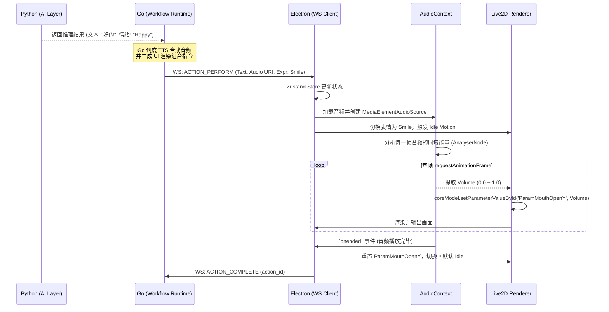

# 1. 章节目标

本章节详细阐述 Luna 桌面助理在 Desktop Interaction Layer（Electron + TypeScript）中关于 **Live2D 角色渲染与多模态表现** 的技术实现方案。
文档主要解决以下问题：如何基于 Electron 与 WebGL 技术栈，高效、稳定地渲染 Live2D 模型；如何实现 Go 运行时驱动的动作与表情切换；如何实现基于音频流的实时嘴型同步（Lip-sync）；以及如何处理模型缓存、性能优化与渲染降级等工程落地痛点。

# 2. 设计背景与问题定义

Luna 作为“陪伴式人格” AI，其表现力高度依赖于桌面端的虚拟形象（Avatar）。
在实际工程落地中，Live2D 渲染通常面临以下挑战：

1. **状态耦合严重**：前端经常越权去维护复杂的业务逻辑，导致与后端的认知状态脱节。
2. **性能与资源消耗**：Electron 本身占用较高，叠加 WebGL 渲染与持续的 Live2D 动画更新，容易导致 CPU/GPU 占用过高、发热以及内存泄漏。
3. **多模态对齐困难**：音频播放、嘴型开合、面部表情动作、文本流式展示往往难以严密对齐。
4. **资源加载与异常兜底**：本地模型文件（.moc3, .mtn 等）加载失败时，若无兜底策略会导致应用“白屏”或“隐形”。

# 3. 核心设计思路

严格遵守 Luna 的三层架构原则。

* **渲染端只做“愚蠢的执行者”**：前端内部维护的“渲染状态机”仅用于平滑过渡动画（如 Idle -> Speaking -> Thinking），其根本的**状态流转指令必须来自 Go Runtime**。前端绝不自己推断角色当前是否“生气”或“开心”。
* **Web Audio API 实时驱动嘴型**：为保证工程稳定性和降低延迟，Lip-sync 不依赖耗时的外部音素对齐算法，而是基于前端 `AudioContext` 实时分析音频流的 RMS（均方根音量），将其映射到 Live2D 的 `ParamMouthOpenY` 参数。
* **PIXI.js 作为渲染底座**：采用 `pixi.js` 结合 `pixi-live2d-display` 及 Cubism Web SDK 进行渲染，利用 WebGL 硬件加速，并统一管理资源生命周期。
* **资源预加载与 LRU 缓存**：针对多模型切换场景，在内存中维护最近使用的模型实例（避免频繁销毁重建导致的 WebGL Context 丢失），未命中时优先读取本地磁盘缓存。

# 4. 模块职责与边界

### Electron / React 前端（本方案核心实施地）

* **初始化渲染引擎**：管理 PIXI Application 和 Live2D 模型的挂载与卸载。
* **执行表现指令**：监听来自 Go Runtime 的 WebSocket 事件，播放指定组的 Motion 与 Expression。
* **音频管控与嘴型计算**：接收 Go 传来的音频 URL / Buffer，在前端播放，并抽取频域/时域数据驱动嘴型。
* **交互事件上报**：捕获用户的鼠标悬停、点击部位（Hit Tracking）事件，通过 WebSocket 上报给 Go Runtime。

### Go Runtime（表现指令下发与状态权威）

* **决策与编排**：依据大模型的输出内容、意图分析或主动行为触发，决定当前应处于什么表情（Expression）和动作（Motion）。
* **多模态组合发送**：将“TTS 语音流”、“展示文本”、“表情指令”打包在同一个逻辑生命周期中下发给前端。

### Python AI Layer（不直接参与）

* 仅输出结构化数据（包含回复文本、预估情绪标签），不感知 Live2D 的任何细节。

---

# 5. 核心数据结构

### 5.1 渲染表现状态机模型（Zustand Store 内部结构）

```typescript
// 假设：模型文件基于本地绝对路径或应用内置协议 lina:// 获取
interface Live2DState {
  currentModelId: string;
  modelConfigPath: string; // .model3.json 的路径

  // 当前渲染动作状态，严格受 Go 侧指令控制
  renderState: 'IDLE' | 'THINKING' | 'SPEAKING' | 'LISTENING' | 'ERROR';

  // 正在执行的具体表情和动作标签
  currentExpression: string | null;
  currentMotionGroup: string | null;

  // 性能与降级指标
  fps: number;
  isFallback: boolean; // 是否处于降级模式（静态图）
}
```

### 5.2 Go 侧下发的表现控制指令 (WebSocket Payload Schema)

```json
{
  "type": "ACTION_PERFORM",
  "payload": {
    "action_id": "act_1001",
    "timestamp": 1699999999,
    "multimodal_data": {
      "text": "好的，我已经帮你记下了这笔账。",
      "audio_uri": "local://cache/audio/tts_1001.wav",
      "visual": {
        "expression": "Smile",
        "motion_group": "TapBody",
        "motion_index": 0,
        "transition_duration": 300
      }
    }
  }
}
```

---

# 6. 核心流程 / 时序

### 6.1 音频、嘴型与动作同步播放时序 (Mermaid)



---

# 7. 接口设计

前端暴露给 Electron 渲染进程内部的控制器接口。
为了保持可测试性，封装一个 `Live2dController` 类。

```typescript
export interface ILive2dController {
  /**
   * 加载指定模型
   * @param modelPath 本地模型的 .model3.json 路径
   */
  loadModel(modelPath: string): Promise<void>;

  /**
   * 触发动作和表情
   * @param group 动作组名，例如 "TapBody"
   * @param index 动作序号
   * @param expression 表情名
   */
  playMotion(group: string, index?: number, expression?: string): void;

  /**
   * 绑定并播放音频流，自动触发嘴型同步
   * @param audioUrl 音频地址
   * @returns Promise<void> 在音频播放结束时 resolve
   */
  speak(audioUrl: string): Promise<void>;

  /**
   * 停止当前行为并恢复待机
   */
  stopAndIdle(): void;

  /**
   * 释放资源，处理多角色切换
   */
  destroy(): void;
}
```

---

# 8. 状态管理机制

### 8.1 “权威状态”与“渲染状态”分离

必须明确，真正的 Agent 认知状态机在 Go Runtime 中。前端的状态机只是为了**平滑 UI 过渡**。

* **Go 端状态 (Logical State)**: `Idle` -> `Processing(RAG)` -> `Reasoning(LLM)` -> `Executing(Tool/Output)`
* **前端渲染状态 (Render State)**:
  1. 收到 Go 状态 `Processing` -> 前端进入 `THINKING` 渲染态（加载闭眼思考 motion）。
  2. 收到 Go 状态 `Executing(Output)` -> 前端进入 `SPEAKING` 渲染态，执行 `speak()` 接口。
  3. 音频播完，前端**不主动**切换状态，而是等待 Go 确认整个交互生命周期结束，发送 `GOTO_IDLE` 命令，前端才切回 `IDLE`。

### 8.2 Live2D 参数劫持 (Parameter Override)

Live2D 模型自身的动作文件 (.mtn) 可能也会驱动嘴型 (`ParamMouthOpenY`)。
为了防止内置动作和音频计算算出的嘴型冲突，采用**优先级覆写策略**：

* 在 PIXI.js 的 `ticker` 循环中，**在 Live2D 自身的 `update()` 执行之后**，强制应用音频分析的音量计算值。

---

# 9. 异常处理与降级策略

面对桌面客户端的复杂环境，必须具备防御性设计：

### 9.1 模型加载失败 / 文件缺失兜底

* **策略**：尝试加载 `.model3.json`。若抛出异常（如文件损坏、路径不存在），捕获异常，将状态机置为 `ERROR_FALLBACK`。
* **表现**：销毁 PIXI 实例，渲染一张默认的静态本地图片（Avatar Default PNG），并在右下角提示“交互模型加载失败”。业务主流程（文字对话、音频）不受影响。

### 9.2 WebGL Context 丢失兜底

* **策略**：监听 canvas 的 `webglcontextlost` 事件。
* **表现**：一旦触发，立刻拦截。等待 `webglcontextrestored` 事件触发后，重新实例化 PIXI Application 并执行 `loadModel`。若 5 秒内未恢复，降级为静态图片。

### 9.3 嘴型同步音频解析失败

* **策略**：如果 `AudioContext` 被系统静音机制拦截或创建失败。
* **表现**：捕捉异常。退化为**随机张嘴动画**（基于 `Math.sin(Date.now())` 模拟参数波动），确保画面表现不穿帮。

---

# 10. 与其他模块的协作关系

### 10.1 与 Desktop Window 管理器（Electron Main Process）协作

* **窗口穿透与拖拽**：
  为了实现桌面宠物的效果，窗口需设置为透明 (`transparent: true`) 且无边框 (`frame: false`)。
  * 在 Live2D 模型未覆盖的区域，利用 CSS `-webkit-app-region: no-drag` 并动态调用 Electron 的 `win.setIgnoreMouseEvents(true, { forward: true })` 使得鼠标点击可以穿透到下方的桌面应用。
  * 在角色渲染区域（通过 hitTest 检测），移除透明穿透，设置 `-webkit-app-region: drag` 使其支持按住角色拖动。

### 10.2 Hit Area 触碰反馈

* 通过 Live2D SDK 的 Hit Area 定义。前端监听 PIXI 的 pointerdown 事件。
* **联动 Go Runtime**：点击角色的“头部”区域，前端不直接播反应，而是通过 WS 上发 `{ event: "TOUCH_HEAD" }`。由 Go 决定并下发：“播放害羞表情，并触发主动闲聊”。保证所有行为权限在 Go。

---

# 11. 配置项与可调参数

```yaml
# live2d_settings.yaml (本地配置，可被 Go 解析后传递给前端)
render:
  max_fps: 60                 # 限制最高帧率，省电
  resolution_multiplier: 1.0  # 渲染分辨率倍率（视网膜屏幕可调2.0，低配降至0.8）
  auto_blink: true            # 是否开启自动眨眼引擎
audio_sync:
  volume_threshold: 0.05      # 触发嘴型变动的最小音量阈值，过滤底噪
  mouth_open_multiplier: 1.5  # 嘴型开合增益系数（因模型而异）
  smoothing_factor: 0.6       # 平滑系数（用于音频频谱波动的低通滤波）
```

---

# 12. 可观测性与调试建议

* **帧率监控 (FPS)**：
  使用 PIXI 的 Ticker 监控 FPS，若连续 10 秒 FPS < 20，在日志打点警告 `WARN_LOW_FPS`，可提示用户关闭其他耗资源应用，或触发自动降级（降低分辨率乘数）。
* **Visual Debugger**：
  在 Electron 菜单栏提供开发者选项：`Show Hit Areas`（绘制可点击区域的红色边界），`Show WebGL Stats`（内存占用和 Draw Calls 显示）。
* **WS 指令审计**：
  所有接收自 Go 的表现指令必须打印在前端 Console 中，包含 `action_id`，以便在发生音画不同步时通过日志对齐排查。

---

# 13. 安全性与治理建议

* **路径安全检查 (Path Traversal 防范)**：
  Go 发送的音频路径与模型路径在 Electron 加载时，必须校验其处于合法的应用沙盒目录（如 `app.getPath('userData')` 下）。严禁直接加载 `file://../../../etc/passwd` 这种路径。
* **内存泄露治理**：
  切换多角色模型时，必须显式调用 `PIXI.Application.destroy(true, true)` 清理纹理缓存。不要仅仅把 Canvas 隐藏。JavaScript GC 对 WebGL 纹理清理不可靠。

---

# 14. 典型使用场景

* **常规对话互动**：用户提问 -> AI生成回复 -> Go 指挥角色展示文字、做对应动作、播放音频流并同步嘴型。
* **挂机陪伴 (Idle state)**：当系统空闲时，Go 内部维护一个定时器随机下发 `ACTION_PERFORM`，触发轻微活动（如“伸懒腰”动作）或看向鼠标光标的视线追踪机制（Eye Tracking）。
* **情绪骤变响应**：对话中识别到高强度情绪（如“悲伤”），强制打断当前正在播放的轻松动作，快速淡入（Transition Duration: 200ms）悲伤动作。

---

# 15. 示例代码或伪代码

### 15.1 嘴型同步核心逻辑 (Web Audio API 提取音量)

```typescript
// 假设：音频已加载到 HTMLAudioElement 并正在播放
export class LipSyncProcessor {
  private audioContext: AudioContext;
  private analyser: AnalyserNode;
  private dataArray: Uint8Array;
  private source: MediaElementAudioSourceNode | null = null;
  private isProcessing = false;

  constructor() {
    this.audioContext = new (window.AudioContext || (window as any).webkitAudioContext)();
    this.analyser = this.audioContext.createAnalyser();
    this.analyser.fftSize = 256; 
    this.dataArray = new Uint8Array(this.analyser.frequencyBinCount);
  }

  connect(audioElement: HTMLAudioElement) {
    if (this.source) this.source.disconnect();
    this.source = this.audioContext.createMediaElementSource(audioElement);
    this.source.connect(this.analyser);
    this.analyser.connect(this.audioContext.destination);
  }

  start(live2dModel: any, multiplier: number = 1.5, smoothing: number = 0.5) {
    this.isProcessing = true;
    let lastVolume = 0;

    const processFrame = () => {
      if (!this.isProcessing) return;

      this.analyser.getByteFrequencyData(this.dataArray);
      let sum = 0;
      // 提取前 50% 频段能量，避免受极高频噪音干扰
      for (let i = 0; i < this.dataArray.length / 2; i++) {
        sum += this.dataArray[i];
      }
      let average = sum / (this.dataArray.length / 2);
      let volume = average / 255.0; // 0.0 ~ 1.0

      // 低通滤波平滑处理
      volume = (lastVolume * smoothing) + (volume * (1 - smoothing));
      lastVolume = volume;

      let mouthOpen = Math.min(1.0, volume * multiplier);

      // 【关键】强制覆写模型张嘴参数
      live2dModel.internalModel.coreModel.setParameterValueById('ParamMouthOpenY', mouthOpen);

      requestAnimationFrame(processFrame);
    };

    processFrame();
  }

  stop() {
    this.isProcessing = false;
  }
}
```

### 15.2 WebSocket 指令接管机制 (Zustand & React)

```typescript
import { create } from 'zustand';

// 状态机定义
const useLive2DStore = create<Live2DState>((set) => ({
  currentModelId: 'default_luna',
  modelConfigPath: 'local://models/luna/luna.model3.json',
  renderState: 'IDLE',
  currentExpression: null,
  currentMotionGroup: null,
  fps: 60,
  isFallback: false,
}));

// WebSocket 消息总线监听
wsClient.on('ACTION_PERFORM', async (payload) => {
  const { text, audio_uri, visual } = payload.multimodal_data;

  // 1. 设置前端展示状态
  useLive2DStore.setState({ 
    renderState: 'SPEAKING',
    currentExpression: visual.expression,
    currentMotionGroup: visual.motion_group
  });

  // 2. 调度音频播放和 Lip Sync
  if (audio_uri) {
    const audioEl = document.getElementById('luna-audio') as HTMLAudioElement;
    audioEl.src = audio_uri;
    await audioEl.play();

    // 启动音频计算...
    lipSyncProcessor.connect(audioEl);
    lipSyncProcessor.start(globalLive2dModel);

    audioEl.onended = () => {
      lipSyncProcessor.stop();
      // 等待 Go 的下一步指令，而不是擅自切换 IDLE
      wsClient.send({ type: 'ACTION_COMPLETE', action_id: payload.action_id });
    };
  }
});
```

---

# 16. 常见坑与规避方式

1. **坑：音频自动播放策略被浏览器拦截（Autoplay Policy）**
   * *规避*：Electron 默认也遵守 Chromium 的声音拦截策略。在 Electron Main Process 中启动应用时，必须添加参数 `app.commandLine.appendSwitch('autoplay-policy', 'no-user-gesture-required')`。
2. **坑：`pixi-live2d-display` 中多重动作叠加导致人物扭曲**
   * *规避*：当 Go 端频繁下发 `Motion` 切换指令时，需要调用模型的 `motionManager.stopAllMotions()` 强行打断之前的动作池，再播放新动作，防止动画混合（Blend）导致关节变形。
3. **坑：Go 重启或崩溃后，前端一直卡在 `SPEAKING` 状态**
   * *规避*：前端需要有 Heartbeat 机制。当检测到与 Go Runtime 的 WebSocket 断开时，触发 `Fallback`，强制清理当前所有动画并切回 `IDLE` 或显示系统断线提示图。
4. **坑：CORS 读取本地文件报错**
   * *规避*：使用 Electron 的自定义协议（Custom Protocol）如 `luna://` 映射本地沙盒路径，不要直接使用 `file://`，避免跨域和安全警报导致 `.moc3` 文件 fetch 失败。

---

# 17. 落地实施建议

* **第一阶段（验证期）**：无需对接音频频谱，直接验证 Go 通过 WebSocket 调起前端 PIXI 渲染 Live2D 模型并播放自带预设动作（Motion）链路。确保窗口透明与穿透功能正常。
* **第二阶段（表现力爬坡）**：引入 Web Audio API 对齐 TTS 输出，调整 `mouth_open_multiplier` 到适配该模型的参数。调试嘴型反馈的流畅度。
* **第三阶段（稳定性建设）**：加入 WebGL 上下文监控与内存泄露检查。在 Electron 中反复切换 10 次不同的 Live2D 模型，观察 V8 Heap Profile 与 GPU 显存占用，确保资源规范回收机制生效。针对性压测系统低性能情况下的降级响应。
