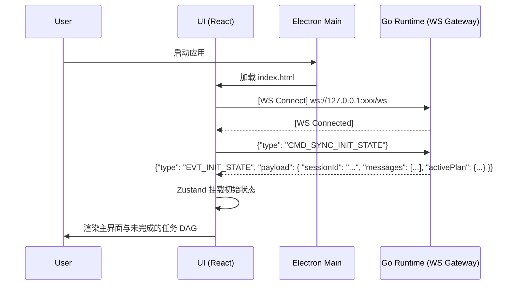
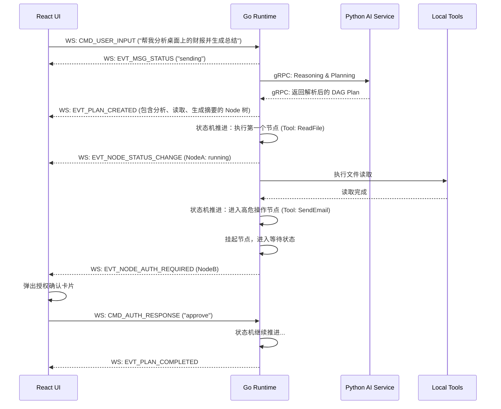

这是一份针对 **Luna 本地化 AI 桌面助理** 项目中 **桌面端交互与前端架构方案** 的详细技术文档。本文档严格遵循 Electron + TypeScript 的前端技术栈限制，并绝对恪守“Go Runtime 为唯一状态和调度权威”的架构原则。

---

# 1. 章节目标

本章节的核心目标是明确 Luna 桌面端（Layer 1: Desktop Interaction Layer）的工程架构设计与落地实施方案。具体旨在解决以下问题：

1. 确立主窗口、悬浮窗、通知层等多窗口协作的 Electron 架构。
2. 规范基于 WebSocket 的 前端与 Go Runtime 单向数据流与状态同步机制。
3. 提供复杂 UI（聊天、DAG 任务可视化、Live2D、长期记忆区）的渲染与状态管理方案。
4. 确保在极高频更新（如实时日志、Token 流、任务状态变更）下的前端渲染性能。
5. 制定前端视角的异常捕获、断线重连及状态恢复策略。

---

# 2. 设计背景与问题定义

在“陪伴式人格 + 长期记忆 + 主动行为”的全栈 Agent 架构中，前端面临的挑战与传统 CRUD 或简单 Chat 应用截然不同：

1. **状态一致性危机**：AI Agent 的任务流（Planning -> Action -> Reflection）是高度异步且可能中途中断/恢复的。如果前端自行维护任务状态机，必然会导致与 Go 控制面状态撕裂。
2. **高频渲染瓶颈**：当 Go Runtime 并发执行多 Agent 协作时，Event Bus 会向前端推送海量事件（如终端执行日志、LLM 思考过程、工具调用进度）。React 若不对状态更新进行节流（Throttling）或虚拟化（Virtualization），将导致主线程阻塞，Live2D 严重掉帧。
3. **多窗口状态共享**：主界面、桌面悬浮窗（Live2D 迷你看板）、独立设置面板之间需要共享底层核心状态，传统的跨窗口 IPC 开销大且极易产生竞态条件。
4. **复杂的本地交互**：桌面端需具备原生级别的体验（全局快捷键、本地通知、系统托盘、无边框拖拽），这要求对 Electron Main 进程与 Renderer 进程的职责进行严格划定。

---

# 3. 核心设计思路

### 3.1 架构范式：瘦客户端（Thin Client）与投影视图（Projected View）

前端完全剥离业务调度与逻辑推演能力，作为 Go Runtime 状态机的一个**“投影视图”**存在。

- **Action is Intent**：前端的所有用户操作（如点击“发送”、“终止任务”、“确认授权”）仅作为 Intent（意图）发送给 Go。
- **View is State**：前端界面的所有变更（包含“消息正在发送中”的 Loading 状态），必须等待 Go 通过 WebSocket 推送对应的 State Patch 后才进行渲染。禁止前端进行“乐观更新（Optimistic UI）”，以保证绝对的一致性。

### 3.2 进程与通信模型

- **Electron Main Process**：负责原生系统 API 整合（Tray, Notification, GlobalShortcut, Window Management）。
- **Electron Preload**：启用 `contextIsolation`，通过 `contextBridge` 暴露严格受限的 IPC 接口（如唤起文件选择框、窗口最小化）。
- **Electron Renderer (React)**：纯粹的 UI 渲染。
- **Go <-> Renderer**：放弃传统的 HTTP 轮询或单一 IPC，在 Renderer 进程中建立与 Go Runtime 的 WebSocket 长连接，承载所有双向业务数据流。多窗口共享同一后端的 WebSocket 广播。

### 3.3 性能优化策略：双层状态与渲染隔离

- **实时高频数据（如日志、Token 打印）**：绕过 Zustand 全局状态，通过 Ref 和底层 DOM 直接更新（或使用 React 局部隔离组件 + 节流渲染），避免触发顶层重渲染。
- **全局低频数据（如会话列表、配置）**：交由 Zustand 维护，利用不可变数据特性实现精准渲染。
- **长列表渲染**：对历史会话和庞大的任务执行日志使用 `react-virtuoso` 或 `react-window` 进行虚拟列表滚动。

---

# 4. 模块职责与边界

为了确保系统的高扩展性和稳定性，严格划定以下职责边界：

### 4.1 核心视图区划界

1. **主窗口 (Main Window)**
   - **聊天区 (Chat View)**：纯展示用户与 AI 的交互消息。
   - **任务区 (Task DAG View)**：订阅 Go 发送的 Plan / Phase / Node 状态树，使用 `ReactFlow` 渲染任务节点流转。
   - **记忆与工具区 (Memory & Tool View)**：展示当前 Persona 持有的记忆快照和可用 MCP 工具列表。不可直接修改，修改指令需发往 Go 进行 Commit。
   - **侧边栏 (Sidebar)**：基于日期的多会话管理（虚拟滚动分页）。
   - **日志与调试面板 (Log Panel)**：只读终端面板，实时 append Go 推送的执行日志。
2. **悬浮窗 (Floating Window)**
   - 透明无边框窗口，承载 Live2D 模型（PixiJS 渲染）和极简快捷交互框。
3. **桌面通知与反馈**
   - AI Agent 的“主动行为”（如定时提醒、后台任务完成）由 Go 发送事件，Main 进程调用系统 Notification。

### 4.2 职责禁区（Red Lines）

- 🚫 **禁止前端直接调用 Python FastAPI**：所有针对大模型、RAG、Embedding 的请求必须经过 Go 路由。
- 🚫 **禁止前端持有任务生命周期**：前端不得判断“当前处于哪个执行阶段”，必须完全依据 Go 返回的 `CurrentNodeId` 进行高亮。
- 🚫 **禁止前端本地存储核心记忆/会话**：所有持久化数据存储在 Go 层的 SQLite/PostgreSQL 中，前端在初始化或切换会话时向 Go 发起 RPC/WS 拉取。

---

# 5. 核心数据结构

前端 Zustand Store 的状态切片（Slices）需与 Go 层的事件结构严格对齐。

### 5.1 领域模型 (TypeScript Interfaces)

```typescript
// 基础消息结构
export interface ChatMessage {
  messageId: string;
  sessionId: string;
  role: 'user' | 'assistant' | 'system' | 'tool';
  contentType: 'text' | 'markdown' | 'audio' | 'mixed';
  content: string;
  timestamp: number;
  status: 'sending' | 'streaming' | 'completed' | 'error'; // 由 Go 控制
  metadata?: any;
}

// 任务节点状态（Go 调度的最小单元投影）
export interface TaskNodeState {
  nodeId: string;
  name: string;
  description: string;
  status: 'pending' | 'running' | 'waiting_user_auth' | 'completed' | 'failed' | 'retrying';
  progress: number;
  errorMsg?: string;
  toolCall?: {
    toolName: string;
    params: string;
  };
}

// 工作流计划快照
export interface PlanSnapshot {
  planId: string;
  goal: string;
  createdAt: number;
  nodes: TaskNodeState[];
  edges: { source: string; target: string }[];
  currentActiveNodeIds: string[]; // 支持并发执行时的多活动节点
}

// 记忆快照
export interface MemorySnapshot {
  persona: string[];       // 角色设定
  shortTerm: string[];     // 短期上下文摘要
  longTermFacts: string[]; // 长期记忆事实
}
```

### 5.2 Zustand State Slices 设计

```typescript
import { create } from 'zustand';

interface SessionState {
  currentSessionId: string | null;
  messages: Record<string, ChatMessage[]>; // Key 为 sessionId
  activePlan: PlanSnapshot | null;
  memory: MemorySnapshot | null;

  // Actions
  setSessionId: (id: string) => void;
  appendMessage: (sessionId: string, msg: ChatMessage) => void;
  updateMessageChunk: (sessionId: string, msgId: string, chunk: string) => void;
  updatePlan: (plan: PlanSnapshot) => void;
  updateNodeStatus: (nodeId: string, status: TaskNodeState['status'], progress?: number) => void;
}

export const useSessionStore = create<SessionState>((set) => ({
  currentSessionId: null,
  messages: {},
  activePlan: null,
  memory: null,

  setSessionId: (id) => set({ currentSessionId: id }),
  appendMessage: (sessionId, msg) => 
    set((state) => ({
      messages: {
        ...state.messages,
        [sessionId]: [...(state.messages[sessionId] || []), msg]
      }
    })),
  // ... (其他更新逻辑基于不可变数据结构)
}));
```

---

# 6. 核心流程 / 时序

### 6.1 前端启动与状态同步时序图

前端启动时必须先建立 WS 连接，然后请求恢复上次的上下文。这是一个典型的**可恢复执行**场景。



### 6.2 触发具备工作流的复杂交互（带用户确认）



---

# 7. 接口设计

所有的客户端-服务端通信统一在一个复用通道（WebSocket）上完成。定义一套严格的消息信封（Envelope）。

### 7.1 WebSocket Message Schema

**Base Envelope (JSON)**

```json
{
  "type": "string",          // 消息类型路由枚举
  "traceId": "string",       // 链路追踪ID，前端发起时生成，Go回复时透传
  "timestamp": "integer",    // 毫秒级时间戳
  "payload": "object"        // 具体载荷
}
```

**7.1.1 Command: 前端发往 Go 的指令 (CMD_*)**

- `CMD_USER_INPUT`: 用户发送聊天。
- `CMD_AUTH_RESPONSE`: 用户对工具调用的放行/拒绝。
- `CMD_CANCEL_TASK`: 用户主动终止当前 DAG 流。
- `CMD_SWITCH_SESSION`: 切换左侧会话，要求 Go 发送该会话快照。

*示例：*

```json
{
  "type": "CMD_AUTH_RESPONSE",
  "traceId": "tr-req-999123",
  "timestamp": 1715340000000,
  "payload": {
    "nodeId": "node-email-01",
    "action": "approve",
    "modifiedParams": null 
  }
}
```

**7.1.2 Event: Go 发往前端的状态推送 (EVT_*)**

- `EVT_CHAT_STREAM_CHUNK`: AI 消息 Token 流。
- `EVT_PLAN_SNAPSHOT`: 整体任务图结构更新。
- `EVT_NODE_STATUS_UPDATE`: 任务节点状态变更（驱动 ReactFlow 变色）。
- `EVT_DEBUG_LOG`: 底层详细执行日志推送（驱动调试面板）。
- `EVT_MEMORY_UPDATED`: Go 控制面上确认（Commit）了记忆更新后，通知前端刷新右侧栏。

*示例：*

```json
{
  "type": "EVT_NODE_STATUS_UPDATE",
  "traceId": "tr-req-999123",
  "timestamp": 1715340001000,
  "payload": {
    "nodeId": "node-email-01",
    "status": "running",
    "progress": 50,
    "log": "Calling MCP Tool: smtp_send..."
  }
}
```

---

# 8. 状态管理机制

为了解决“前端作为投影”以及“高频日志拖垮 React”的核心难题，状态管理必须分层。

### 8.1 业务状态层 (Zustand)

负责维护会话列表、当前计划快照、角色记忆、偏好设置。这些数据更新频率适中（< 5Hz），完全可以使用 Zustand 并通过 React 的 re-render 机制更新。

- **机制**：由底层的 WebSocket Singleton 类接收消息后，派发 (dispatch) 给 Zustand 的 action 函数。

### 8.2 高频渲染层 (Refs & Custom Events)

负责流式输出（Streaming Token）和调试面板日志。Go 每秒可能推送数十条 Token 或日志，如果每次都 `setState`，React 虚拟 DOM diff 会引起严重掉帧。

- **机制**：
  - 日志面板：使用底层 DOM API 操作 `div.innerText += chunk`，或者收集到队列中，利用 `requestAnimationFrame` 以 60fps 的频率批量更新到 React 状态中。
  - Token 流：在接收到 `EVT_CHAT_STREAM_CHUNK` 时，更新 useRef 绑定的值，并触发局部组件的强制刷新，避免影响上层的 `SessionList` 或 `TaskDAG` 组件。

---

# 9. 异常处理与降级策略

在本地 AI 助理场景下，前端面临的异常极其复杂。必须制定清晰的兜底与恢复机制。

### 9.1 WebSocket 断线与重连

- **触发场景**：Go 后端崩溃重启，或因操作系统休眠导致 Socket 断开。
- **降级表现**：UI 顶部显示“与核心引擎失去连接，正在重连...”，禁用输入框及所有操作按钮。Live2D 切换为“休眠/困惑”动画状态。
- **恢复策略**：前端内置指数退避（Exponential Backoff）重连策略（1s, 2s, 4s... 最高限制 10s）。重连成功后，强制发送 `CMD_SYNC_INIT_STATE` 拉取最新状态，覆盖本地状态，解决断线期间的状态漂移。

### 9.2 Live2D 崩溃 / WebGL Context 丢失

- **触发场景**：内存不足、GPU 驱动问题、渲染器崩溃（`webglcontextlost` 事件）。
- **降级表现**：捕获该事件后，隐藏 Canvas DOM，展示一张优雅的静态 Fallback Avatar 图片。
- **恢复策略**：提供“重新加载虚拟形象”的 UI 按钮，点击后销毁旧的 PixiJS Application 实例，重新初始化 WebGL Context。

### 9.3 任务执行失败 / 停滞

- **触发场景**：Go 的重试策略耗尽，向前端推送 `failed` 状态；或节点卡死。
- **降级表现**：任务卡片（DAG Node）变红。允许用户点击失败节点查看 Error Message。
- **交互策略**：提供【重试此节点】和【放弃整个计划】的按钮。前端将该操作包装为 Intent 发回给 Go。

---

# 10. 与其他模块的协作关系

**与 Go 层的严格协同要求：**
前端是极其被动的。假设有一个场景：“系统检测到用户长时间未操作，主动发起问候”。

- ❌ **前端错误做法**：前端设置一个 `setTimeout`，2小时没操作，前端自行在 Chat UI 追加一条消息。
- ✅ **正确做法**：前端 Main 进程或底层系统注册 Idle 监听，定时发送 Heartbeat 或 Idle 状态给 Go。Go 内部的 `Agent Cognitive Logic` 收到 Idle 信号，推断需要主动问候，生成 Prompt，调用 Python 生成文案，然后 Go 向前端发送 `EVT_CHAT_STREAM_CHUNK`。

**与 Electron Main 的协作：**

- 窗口拖拽调整大小、置顶（Always on Top）、穿透点击（Ignore Mouse Events，用于悬浮窗桌面精灵模式）等操作，通过 Preload 暴露的 IPC channel 告知 Main 进程。

---

# 11. 配置项与可调参数

**假设**：系统采用双重配置存储策略，UI 排版强相关的存本地（前端），业务策略存 Go。

| 配置项                       | 存储位置             | 作用与可调参数                               |
|:------------------------- |:---------------- |:------------------------------------- |
| **Window Bounds**         | `electron-store` | 记忆上次主窗口的位置 (x, y) 和大小 (width, height) |
| **Hardware Acceleration** | `electron-store` | 解决部分老旧核显渲染 Live2D 闪烁问题，提供重启开关         |
| **Theme / Avatar**        | Go DB / Store    | 深浅色模式，选择加载哪一套 Live2D 模型路径             |
| **Model Preference**      | Go DB            | 让前端可以渲染当前 AI 使用的模型底座（如 GPT-4, Llama3） |

---

# 12. 可观测性与调试建议

1. **内建全局调试面板**：
   - 快捷键 `Ctrl+Shift+D` 呼出前端底层的 Debug Console。该面板独立于用户 UI 存在，直接订阅所有进入 WebSocket Singleton 的 Raw Message。
   - 提供发送 Mock JSON 的输入框，无需唤起后端也可单独调试前端状态流转。
2. **React Profiler**：
   - 生产环境构建时剔除，开发阶段使用 React DevTools 严格检查 DAG 图更新时是否导致了整个页面重新渲染。
3. **Electron 日志隔离**：
   - 使用 `electron-log` 将前端和 Preload 产生的核心生命周期日志写入本地文件（如 `~/.luna/logs/renderer.log`），方便后续排查。

---

# 13. 安全性与治理建议

1. **Context Isolation (严格开启)**
   - 坚决将 `contextIsolation: true` 和 `nodeIntegration: false` 写死。前端 React 代码绝对不允许 `require('fs')` 或 `require('child_process')`。所有涉及文件系统的本地操作（如下载、读取配置）必须通过 Go 层提供的 MCP Tool 完成，而非 Node.js。
2. **Content Security Policy (CSP)**
   - 打包时配置严格的 CSP Meta 标签，限制向外部发出不受信任的 HTTP 请求，确保核心业务只与 `ws://127.0.0.1:[port]` 和 `http://127.0.0.1:[port]` 通信。

---

# 14. 典型使用场景

### 场景：多 Agent 冲突与用户治理可视化

**背景**：Luna 在后台启动了【Agent A: 邮件整理】和【Agent B: 播放音乐】。
**前端展示**：

- 前端任务区需支持多实例渲染。在 Zustand 中，`activePlan` 应该是一个数组或对象字典，键为 `agentId`。
- 如果 A 和 B 都要调用全局的声音设备。Go 层发现冲突，挂起 A 任务，发送 `EVT_NODE_AUTH_REQUIRED`。前端任务区中 Agent A 所在的图高亮黄色，右下角弹出 Toast 提示：“Agent A 申请打断当前音频以语音播报邮件”。
- 用户在 Toast 点击【拒绝】 -> Frontend WS -> Go -> Agent A 流产并记录到长期记忆。这展现了完全由 Go 驱动、前端只需无脑渲染的优势。

---

# 15. 示例代码或伪代码

### 15.1 Electron Preload 层代码 (暴露安全 IPC)

```typescript
// preload.ts
import { contextBridge, ipcRenderer } from 'electron';

contextBridge.exposeInMainWorld('electronAPI', {
  // 仅开放最基础的窗口控制
  minimize: () => ipcRenderer.send('window-minimize'),
  close: () => ipcRenderer.send('window-close'),

  // 监听后端进程启动的端口配置
  onGoPortReady: (callback: (port: number) => void) => {
    ipcRenderer.on('go-port-ready', (_event, port) => callback(port));
  }
});
```

### 15.2 WebSocket 管理器 (结合 Zustand)

```typescript
// wsManager.ts
import { useSessionStore } from './stores/sessionStore';
import { useSystemStore } from './stores/systemStore';

class WSManager {
  private ws: WebSocket | null = null;
  private reconnectTimer: any = null;

  public connect(port: number) {
    this.ws = new WebSocket(`ws://127.0.0.1:${port}/ws`);

    this.ws.onopen = () => {
      useSystemStore.getState().setConnectionStatus('connected');
      // 连接成功，拉取初始状态
      this.send({ type: 'CMD_SYNC_INIT_STATE', payload: {} });
    };

    this.ws.onmessage = (event) => {
      const msg = JSON.parse(event.data);
      this.handleMessage(msg);
    };

    this.ws.onclose = () => {
      useSystemStore.getState().setConnectionStatus('disconnected');
      this.scheduleReconnect(port);
    };
  }

  private handleMessage(msg: any) {
    const sessionStore = useSessionStore.getState();
    switch (msg.type) {
      case 'EVT_CHAT_STREAM_CHUNK':
        sessionStore.updateMessageChunk(msg.payload.sessionId, msg.payload.msgId, msg.payload.chunk);
        break;
      case 'EVT_NODE_STATUS_UPDATE':
        sessionStore.updateNodeStatus(msg.payload.nodeId, msg.payload.status, msg.payload.progress);
        break;
      //...
    }
  }

  public send(data: object) {
    if (this.ws?.readyState === WebSocket.OPEN) {
      this.ws.send(JSON.stringify({
        ...data,
        timestamp: Date.now(),
        traceId: `tr-${crypto.randomUUID()}`
      }));
    }
  }
}

export const wsManager = new WSManager();
```

---

# 16. 常见坑与规避方式

1. **Zustand Zombie Children (僵尸子组件问题)**
   - **坑**：在列表数据频繁删除和更新时，React 子组件由于闭包问题访问了已经被删除的状态，导致前端 Crash。
   - **规避**：使用局部选择器 `useStore(state => state.specificItem)`，并且在渲染列表项时加入防御性判空 `if (!item) return null;`。
2. **WebSocket 乱序导致状态撕裂**
   - **坑**：由于网络 jitter（即使在本地也有可能因 CPU 负载导致），先发出的状态变更后到前端。
   - **规避**：Go 发出的所有 Node State 和 Plan State 必须携带 `version` 或严格的时间戳。前端 Zustand 的 reducer 需要做版本判断，`if (msg.version < current.version) return state;`，丢弃旧的状态包。
3. **Live2D 内存泄露**
   - **坑**：反复切换模型或频繁重启 Application 时，WebGL 纹理未完全释放。
   - **规避**：必须在 `useEffect` 的 cleanup 函数中严格调用 `pixiApp.destroy(true, { children: true, texture: true, baseTexture: true })`。

---

# 17. 落地实施建议

1. **Phase 1 (联调打基建)**：先不接复杂的 Live2D 和 ReactFlow，用最简单的 HTML DOM 跑通前端 -> Go -> Python -> Go -> 前端 WS 的数据闭环，确保 Token 能流式打到屏幕上。
2. **Phase 2 (状态树映射)**：引入 `ReactFlow`，Go 层写 Mock 脚本发送假的状态流转事件，前端确保能正确展现排队、执行、暂停、报错高亮。
3. **Phase 3 (表现层完善)**：集成 Live2D 模型与音频管道，将 Go 推送的音频数据通过 HTML5 Audio API 排队播放，配合 Live2D 的唇形同步（LipSync）。
4. **Phase 4 (工程优化)**：加入虚拟滚动、DOM 渲染节流、应用异常监控机制与恢复交互兜底。
